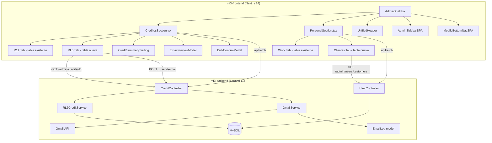
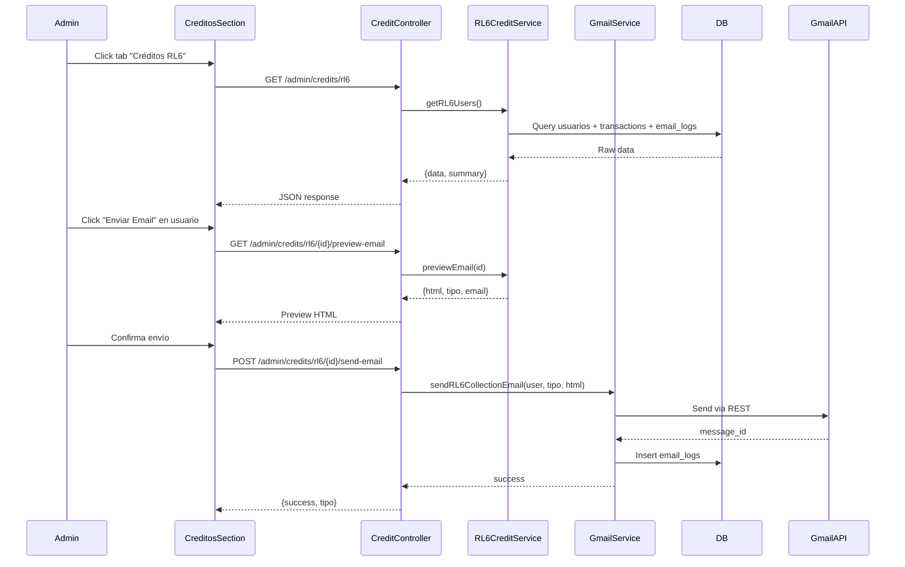

# Design Document: Admin Credits & Users Tabs

## Overview

Esta feature reorganiza dos secciones del panel admin de mi3-frontend: **Créditos** y **Usuarios**. Se implementa un sistema de tabs en ambas secciones usando el patrón existente de `SectionHeaderConfig` + `UnifiedHeader` de `AdminShell.tsx`, se agregan nuevos endpoints en el backend Laravel 11, y se integra el sistema de emails de cobranza RL6 existente en caja3.

### Cambios principales:
1. **Créditos**: Renombrar "Créditos R11" → "Créditos", agregar tabs R11/RL6, tabla de morosos RL6, envío de emails de cobranza, franja de métricas contextuales
2. **Usuarios**: Renombrar "Personal" → "Usuarios", agregar tabs Work/Clientes, tabla de clientes app3 con búsqueda

### Decisiones de diseño clave:
- **Reutilizar `onHeaderConfig`**: Ambas secciones ya reciben este callback de `AdminShell`. Se usará para registrar tabs, trailing content y accent color, igual que otras secciones con tabs (ej: ComprasSection).
- **Backend calcula moroso**: La lógica de morosidad se calcula en el servidor (no en frontend) para consistencia con caja3.
- **Replicar lógica de emails en mi3-backend**: mi3-backend replicará la lógica de `send_dynamic_email.php` y `preview_email_dynamic.php` de caja3 usando el `GmailService` existente, en vez de hacer proxy HTTP a caja3.
- **Summary en response**: Los totales RL6 se retornan como campo `summary` en el GET `/admin/credits/rl6` para evitar cálculos en frontend.
- **Data caching por tab**: Cada tab mantiene su data en state independiente para evitar refetches al cambiar tabs.

## Architecture

### Diagrama de componentes



### Flujo de datos - Email de cobranza



## Components and Interfaces

### Frontend Components

#### 1. CreditosSection.tsx (modificado)

```typescript
interface CreditosSectionProps {
  onHeaderConfig: (config: SectionHeaderConfig) => void;
}

interface CreditosSectionState {
  activeTab: 'r11' | 'rl6';
  r11Data: CreditUser[] | null;       // null = no cargado aún
  rl6Data: RL6CreditUser[] | null;
  rl6Summary: RL6Summary | null;
  r11Loading: boolean;
  rl6Loading: boolean;
}
```

Registra tabs via `onHeaderConfig`:
```typescript
onHeaderConfig({
  tabs: [
    { key: 'r11', label: 'Créditos R11' },
    { key: 'rl6', label: 'Créditos RL6' },
  ],
  activeTab,
  onTabChange: setActiveTab,
  trailing: <CreditSummaryTrailing ... />,
  accent: 'red',
});
```

#### 2. CreditSummaryTrailing.tsx (nuevo)

Componente que renderiza métricas financieras en el header. Recibe datos del tab activo y muestra métricas contextuales.

```typescript
interface CreditSummaryTrailingProps {
  activeTab: 'r11' | 'rl6';
  rl6Summary: RL6Summary | null;
  r11Data: CreditUser[] | null;
  loading: boolean;
}
```

- Desktop: fila horizontal de 4-5 métricas con labels y valores
- Mobile: versión condensada con 3 métricas
- Skeleton placeholders mientras carga
- Colores condicionales para Tasa de Cobro y Morosos

#### 3. PersonalSection.tsx (modificado)

```typescript
interface PersonalSectionProps {
  onHeaderConfig: (config: SectionHeaderConfig) => void;
}

interface PersonalSectionState {
  activeTab: 'work' | 'clientes';
  workData: Personal[] | null;
  clientesData: CustomerUser[] | null;
  workLoading: boolean;
  clientesLoading: boolean;
  searchQuery: string;
}
```

Registra tabs via `onHeaderConfig`:
```typescript
onHeaderConfig({
  tabs: [
    { key: 'work', label: 'Ruta 11 Work' },
    { key: 'clientes', label: 'Clientes' },
  ],
  activeTab,
  onTabChange: setActiveTab,
  accent: 'red',
});
```

#### 4. EmailPreviewModal.tsx (nuevo)

Modal para previsualizar y confirmar envío de email de cobranza.

```typescript
interface EmailPreviewModalProps {
  open: boolean;
  onClose: () => void;
  onConfirm: () => void;
  html: string;
  emailTipo: EmailEstado;
  recipientEmail: string;
  sending: boolean;
}
```

#### 5. AdminSidebarSPA.tsx (modificado)

Cambios en el array `links`:
- `{ key: 'creditos', label: 'Créditos', icon: CreditCard }` (antes: 'Créditos R11')
- `{ key: 'personal', label: 'Usuarios', icon: Users }` (antes: 'Personal')

#### 6. MobileBottomNavSPA.tsx (modificado)

Cambios en `primaryItems` y `secondaryItems`:
- `personal` label: 'Usuarios' (antes: 'Personal')
- `creditos` label: 'Créditos' (antes: 'Créditos R11')

#### 7. AdminShell.tsx (modificado)

Cambio en `SECTION_TITLES`:
- `creditos: 'Créditos'` (antes: 'Créditos R11')
- `personal: 'Usuarios'` (antes: 'Personal')

### Backend Components

#### 1. CreditController.php (extendido)

Nuevos métodos:
- `rl6Index()` → GET `/admin/credits/rl6`
- `rl6Approve(id)` → POST `/admin/credits/rl6/{id}/approve`
- `rl6Reject(id)` → POST `/admin/credits/rl6/{id}/reject`
- `rl6ManualPayment(id)` → POST `/admin/credits/rl6/{id}/manual-payment`
- `rl6PreviewEmail(id)` → GET `/admin/credits/rl6/{id}/preview-email`
- `rl6SendEmail(id)` → POST `/admin/credits/rl6/{id}/send-email`
- `rl6SendBulkEmails()` → POST `/admin/credits/rl6/send-bulk-emails`

#### 2. RL6CreditService.php (nuevo)

Service class que encapsula la lógica de negocio RL6:

```php
class RL6CreditService
{
    public function getRL6Users(): array;           // {data, summary}
    public function approveCredit(int $id, float $limite): void;
    public function rejectCredit(int $id): void;
    public function manualPayment(int $id, float $monto, ?string $desc): void;
    public function calculateMoroso(object $user, float $deudaCicloVencido): array;
    public function previewEmail(int $id): array;   // {html, tipo, email}
    public function buildEmailHtml(array $user, string $tipo): string;
    public function calculateEmailEstado(array $userData): string;
    public function getSummary(Collection $users): array;
}
```

#### 3. UserController.php (nuevo)

```php
class UserController extends Controller
{
    public function customers(Request $request): JsonResponse;  // GET /admin/users/customers
}
```

#### 4. GmailService.php (extendido)

Nuevo método público:
```php
public function sendRL6CollectionEmail(
    int $userId, string $email, string $html, 
    string $subject, string $emailType
): array;  // {success, gmail_message_id, error?}
```

Reutiliza la infraestructura existente de `getValidToken()` y `sendEmail()`.

### TypeScript Interfaces (Frontend)

```typescript
// RL6 Credit User (from GET /admin/credits/rl6)
interface RL6CreditUser {
  id: number;
  nombre: string;
  email: string;
  telefono: string;
  rut: string;
  grado_militar: string;
  unidad_trabajo: string;
  limite_credito: number;
  credito_usado: number;
  disponible: number;
  credito_aprobado: boolean;
  credito_bloqueado: boolean;
  fecha_ultimo_pago: string | null;
  es_moroso: boolean;
  dias_mora: number;
  deuda_ciclo_vencido: number;
  pagado_este_mes: number;
  ultimo_email_enviado: string | null;
  ultimo_email_tipo: string | null;
}

// RL6 Summary (from GET /admin/credits/rl6 → summary)
interface RL6Summary {
  total_usuarios: number;
  total_credito_otorgado: number;
  total_deuda_actual: number;
  total_morosos: number;
  total_deuda_morosos: number;
  pagos_del_mes_count: number;
  pagos_del_mes_monto: number;
  tasa_cobro: number;
}

// Customer User (from GET /admin/users/customers)
interface CustomerUser {
  id: number;
  nombre: string;
  email: string;
  telefono: string;
  fecha_registro: string;
  activo: boolean;
  total_orders: number;
  total_spent: number;
  last_order_date: string | null;
}

// Email Estado types
type EmailEstado = 'sin_deuda' | 'recordatorio' | 'urgente' | 'moroso';
```

### API Routes (nuevas)

```php
// En routes/api.php, dentro del grupo admin
// RL6 routes (static route MUST come before {id} routes)
Route::post('credits/rl6/send-bulk-emails', [CreditController::class, 'rl6SendBulkEmails']);
Route::get('credits/rl6', [CreditController::class, 'rl6Index']);
Route::post('credits/rl6/{id}/approve', [CreditController::class, 'rl6Approve']);
Route::post('credits/rl6/{id}/reject', [CreditController::class, 'rl6Reject']);
Route::post('credits/rl6/{id}/manual-payment', [CreditController::class, 'rl6ManualPayment']);
Route::get('credits/rl6/{id}/preview-email', [CreditController::class, 'rl6PreviewEmail']);
Route::post('credits/rl6/{id}/send-email', [CreditController::class, 'rl6SendEmail']);

// Users
Route::get('users/customers', [UserController::class, 'customers']);
```

## Data Models

### Tablas existentes utilizadas

#### `usuarios` (MySQL, compartida app3/caja3)

Campos RL6 relevantes:
| Campo | Tipo | Descripción |
|-------|------|-------------|
| es_militar_rl6 | tinyint | 1 si es militar RL6 |
| credito_aprobado | tinyint | 1 si tiene crédito aprobado |
| limite_credito | decimal(10,2) | Límite total de crédito |
| credito_usado | decimal(10,2) | Monto actualmente usado |
| credito_bloqueado | tinyint | 1 si está bloqueado |
| grado_militar | varchar | Grado del militar |
| unidad_trabajo | varchar | Unidad de trabajo |
| rut | varchar | RUT del usuario |
| fecha_ultimo_pago | date | Fecha del último pago |

Campos R11 relevantes:
| Campo | Tipo | Descripción |
|-------|------|-------------|
| es_credito_r11 | tinyint | 1 si tiene crédito R11 |
| credito_r11_aprobado | tinyint | 1 si aprobado |
| limite_credito_r11 | decimal(10,2) | Límite R11 |
| credito_r11_usado | decimal(10,2) | Usado R11 |
| credito_r11_bloqueado | tinyint | 1 si bloqueado |

Campos generales para Clientes:
| Campo | Tipo | Descripción |
|-------|------|-------------|
| id | int | PK |
| nombre | varchar | Nombre completo |
| email | varchar | Email |
| telefono | varchar | Teléfono |
| fecha_registro | timestamp | Fecha de registro |
| activo | tinyint | 1 si activo |

#### `rl6_credit_transactions`

| Campo | Tipo | Descripción |
|-------|------|-------------|
| id | int | PK auto-increment |
| user_id | int | FK → usuarios.id |
| amount | decimal(10,2) | Monto de la transacción |
| type | enum('credit','debit','refund') | Tipo |
| description | varchar(255) | Descripción |
| order_id | varchar(50) | ID de orden (nullable) |
| created_at | timestamp | Fecha de creación |

#### `email_logs`

| Campo | Tipo | Descripción |
|-------|------|-------------|
| id | int | PK |
| user_id | int | FK → usuarios.id |
| email_to | varchar | Destinatario |
| email_type | varchar | Tipo (sin_deuda, recordatorio, urgente, moroso) |
| subject | varchar | Asunto |
| amount | decimal | Monto (nullable) |
| gmail_message_id | varchar | ID de mensaje Gmail |
| gmail_thread_id | varchar | ID de thread Gmail |
| status | varchar | sent / failed |
| error_message | text | Mensaje de error (nullable) |
| sent_at | timestamp | Fecha de envío |

#### `tuu_orders` (para estadísticas de clientes)

| Campo | Tipo | Descripción |
|-------|------|-------------|
| id | int | PK |
| user_id | int | FK → usuarios.id |
| payment_status | varchar | Estado de pago |
| total | decimal | Total de la orden |
| created_at | timestamp | Fecha de creación |

### Modelo Eloquent: Usuario.php (modificaciones)

Se deben agregar los campos RL6 al `$fillable` del modelo `Usuario`:

```php
protected $fillable = [
    // ... campos existentes R11 ...
    // Nuevos campos RL6
    'es_militar_rl6', 'credito_aprobado', 'limite_credito',
    'credito_usado', 'credito_bloqueado', 'grado_militar',
    'unidad_trabajo', 'rut', 'fecha_ultimo_pago',
];
```

### Lógica de Morosidad (calculada en backend)

```
es_moroso = (hoy > día 21 del mes actual)
            AND (deuda_ciclo_vencido > 0)
            AND (fecha_ultimo_pago NO es del mes actual)

donde:
  ciclo_vencido = débitos en rl6_credit_transactions
                  entre día 22 mes anterior y día 21 mes actual (inclusive)

dias_mora = día_actual - 21  (solo si es_moroso, sino 0)
```

### Lógica de Email Estado (calculada en backend)

```
si credito_usado == 0                              → 'sin_deuda'
si pagó_este_mes OR solo_deuda_ciclo_nuevo         → 'recordatorio'
si día <= 20                                       → 'recordatorio'
si día == 21                                       → 'urgente'
si día > 21 AND no pagó AND deuda_ciclo_vencido>0  → 'moroso'
```

## Correctness Properties

*A property is a characteristic or behavior that should hold true across all valid executions of a system — essentially, a formal statement about what the system should do. Properties serve as the bridge between human-readable specifications and machine-verifiable correctness guarantees.*

### Property 1: RL6 Summary aggregation correctness

*For any* set of active RL6 credit users (es_militar_rl6=1, credito_aprobado=1) with varying limite_credito, credito_usado, and moroso states, the summary object returned by `getRL6Users()` SHALL satisfy:
- `total_usuarios` equals the count of users in the set
- `total_credito_otorgado` equals the sum of all `limite_credito` values
- `total_deuda_actual` equals the sum of all `credito_usado` values
- `total_morosos` equals the count of users where `es_moroso` is true
- `total_deuda_morosos` equals the sum of `credito_usado` for moroso users only
- `tasa_cobro` equals `(pagos_del_mes_count / count of users with credito_usado > 0) * 100` rounded to one decimal

**Validates: Requirements 3.2**

### Property 2: Manual payment arithmetic correctness

*For any* RL6 user with `credito_usado >= 0` and `credito_bloqueado` in {0, 1}, and *for any* valid payment amount `monto > 0`, after executing `manualPayment(id, monto)`:
- The new `credito_usado` SHALL equal `max(0, old_credito_usado - monto)`
- A `refund` transaction SHALL exist in `rl6_credit_transactions` with the given amount
- `fecha_ultimo_pago` SHALL be today's date
- IF `new_credito_usado == 0` AND `old_credito_bloqueado == 1`, THEN `credito_bloqueado` SHALL be 0

**Validates: Requirements 3.5, 3.6**

### Property 3: Moroso calculation correctness

*For any* date and *for any* RL6 user with a set of debit transactions and a `fecha_ultimo_pago`, the moroso calculation SHALL satisfy:
- IF today <= day 21 of current month, THEN `es_moroso` is false and `dias_mora` is 0
- IF today > day 21 AND deuda_ciclo_vencido == 0, THEN `es_moroso` is false and `dias_mora` is 0
- IF today > day 21 AND deuda_ciclo_vencido > 0 AND fecha_ultimo_pago is in current month, THEN `es_moroso` is false and `dias_mora` is 0
- IF today > day 21 AND deuda_ciclo_vencido > 0 AND fecha_ultimo_pago is NOT in current month (or null), THEN `es_moroso` is true and `dias_mora` equals `day_of_month - 21`

**Validates: Requirements 3.7, 3.8**

### Property 4: Email Estado classification correctness

*For any* RL6 user with `credito_usado >= 0`, a `fecha_ultimo_pago`, a `deuda_ciclo_vencido >= 0`, and *for any* day of the month, the `calculateEmailEstado()` function SHALL return:
- `'sin_deuda'` when `credito_usado == 0`
- `'recordatorio'` when `credito_usado > 0` AND (user paid this month OR only has new-cycle debt OR day <= 20)
- `'urgente'` when `credito_usado > 0` AND day == 21 AND has unpaid ciclo vencido debt
- `'moroso'` when `credito_usado > 0` AND day > 21 AND has unpaid ciclo vencido debt AND did not pay this month

**Validates: Requirements 9.2**

### Property 5: Customer search filtering and ordering

*For any* set of users in the `usuarios` table with associated `tuu_orders`, and *for any* search query string:
- All returned users SHALL have `nombre` or `email` containing the search string (case-insensitive LIKE match)
- `total_orders` SHALL equal the count of `tuu_orders` where `payment_status = 'paid'` for that user
- `total_spent` SHALL equal the sum of `total` from `tuu_orders` where `payment_status = 'paid'` for that user
- Results SHALL be ordered by `id` descending (each user's id >= the next user's id)

**Validates: Requirements 6.2, 6.3, 6.4**

### Property 6: R11 metric aggregation correctness

*For any* array of R11 credit users with varying `limite_credito_r11` and `credito_r11_usado`, the CreditSummaryTrailing R11 metrics SHALL satisfy:
- "Usuarios R11" equals the count of users in the array
- "Crédito Otorgado" equals the sum of all `limite_credito_r11` values
- "Deuda Actual" equals the sum of all `credito_r11_usado` values
- "Disponible" equals (total crédito otorgado - total deuda actual)

**Validates: Requirements 10.5**

### Property 7: CLP formatting correctness

*For any* non-negative integer or float value, `formatCLP(value)` SHALL produce a string that:
- Starts with "$"
- Contains the integer part of the value formatted with dot separators every 3 digits
- Correctly represents the numeric value (parsing the formatted string back yields the original integer part)

**Validates: Requirements 10.6**

## Error Handling

### Frontend Error Handling

| Scenario | Handling |
|----------|----------|
| API fetch fails (network error) | Show red error banner with message, allow retry |
| RL6 data load fails | Show error state in RL6 tab, R11 tab unaffected |
| Clientes data load fails | Show error state in Clientes tab, Work tab unaffected |
| Email preview API fails | Show toast notification with error, close modal |
| Email send fails (single) | Show toast with error, update "Último Email" column to show failure |
| Email send fails (bulk, partial) | Continue sending remaining, show summary with success/failure counts and failed user names |
| Gmail token expired | GmailService auto-refreshes token; if refresh fails, return 500 with descriptive error |
| User not found (404) | Show toast "Usuario no encontrado" |
| Unauthorized (401) | Existing `apiFetch` handles redirect to login |

### Backend Error Handling

| Scenario | HTTP Code | Response |
|----------|-----------|----------|
| User not found | 404 | `{ success: false, error: "Usuario no encontrado" }` |
| Invalid payment amount (<=0) | 422 | Validation error from Laravel |
| Gmail API error | 200 (partial) | Log in email_logs with status='failed', return error in response |
| Bulk email - partial failure | 200 | `{ success: true, total_sent: N, total_failed: M, failed: [...] }` |
| Database error | 500 | `{ success: false, error: "Error interno" }` |
| Missing Gmail token | 500 | `{ success: false, error: "No se pudo obtener token de Gmail" }` |

### Email Error Recovery

- Emails que fallan se registran en `email_logs` con `status='failed'` y `error_message`
- El admin puede reintentar el envío individual desde la UI
- El bulk action continúa enviando a los demás usuarios si uno falla
- El frontend muestra un resumen final con nombres de usuarios fallidos

## Testing Strategy

### Unit Tests (example-based)

Cubren los criterios clasificados como EXAMPLE y EDGE_CASE:

**Frontend (vitest + React Testing Library):**
- Label changes: sidebar, mobile nav, section titles (Req 1, 4)
- Tab registration and default tab (Req 2.1, 2.7, 5.1, 5.4)
- Column rendering per tab (Req 2.2, 2.3, 5.2, 5.3)
- Badge rendering: Moroso (red), Con deuda (orange), Al día (green) (Req 2.4-2.6)
- Data preservation on tab switch (Req 2.8, 5.5)
- Search input presence and debounce (Req 7.1-7.4)
- Email button visibility, preview modal, bulk action flow (Req 8.1-8.8)
- CreditSummaryTrailing: metric counts per tab, skeleton, mobile condensed (Req 10.1-10.4, 10.7-10.10)

**Backend (PHPUnit):**
- API endpoint response structure (Req 3.1, 6.1)
- Approve/reject state changes (Req 3.3, 3.4)
- Email log creation on send success/failure (Req 9.3, 9.6, 9.7)
- Bulk email summary response (Req 9.4, 9.8)
- Ultimo email data from email_logs (Req 3.9)

### Property-Based Tests (fast-check / PHPUnit with data providers)

Cubren los criterios clasificados como PROPERTY. Cada test ejecuta mínimo 100 iteraciones.

**Frontend (vitest + fast-check):**
- Property 6: R11 metric aggregation — Tag: `Feature: admin-credits-users-tabs, Property 6: R11 metric aggregation correctness`
- Property 7: CLP formatting — Tag: `Feature: admin-credits-users-tabs, Property 7: CLP formatting correctness`

**Backend (PHPUnit con data providers o generadores):**
- Property 1: RL6 Summary aggregation — Tag: `Feature: admin-credits-users-tabs, Property 1: RL6 Summary aggregation correctness`
- Property 2: Manual payment arithmetic — Tag: `Feature: admin-credits-users-tabs, Property 2: Manual payment arithmetic correctness`
- Property 3: Moroso calculation — Tag: `Feature: admin-credits-users-tabs, Property 3: Moroso calculation correctness`
- Property 4: Email Estado classification — Tag: `Feature: admin-credits-users-tabs, Property 4: Email Estado classification correctness`
- Property 5: Customer search filtering and ordering — Tag: `Feature: admin-credits-users-tabs, Property 5: Customer search filtering and ordering`

### Integration Tests

- Full API flow: GET `/admin/credits/rl6` with seeded data → verify response structure and moroso flags
- Email flow: preview → send → verify email_logs entry
- Customer endpoint: seed usuarios + tuu_orders → verify aggregated stats
- Bulk email: send to multiple users → verify sequential processing and summary

### Test Configuration

- **Property test library (frontend):** fast-check con vitest
- **Property test library (backend):** PHPUnit data providers con generación aleatoria (o Faker)
- **Minimum iterations:** 100 per property test
- **Tag format:** `Feature: admin-credits-users-tabs, Property {N}: {title}`
