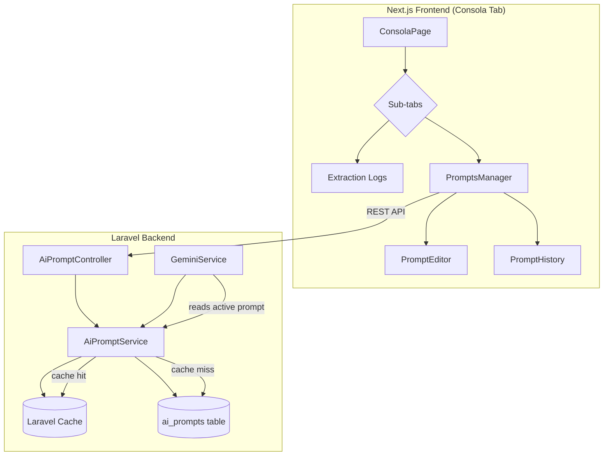
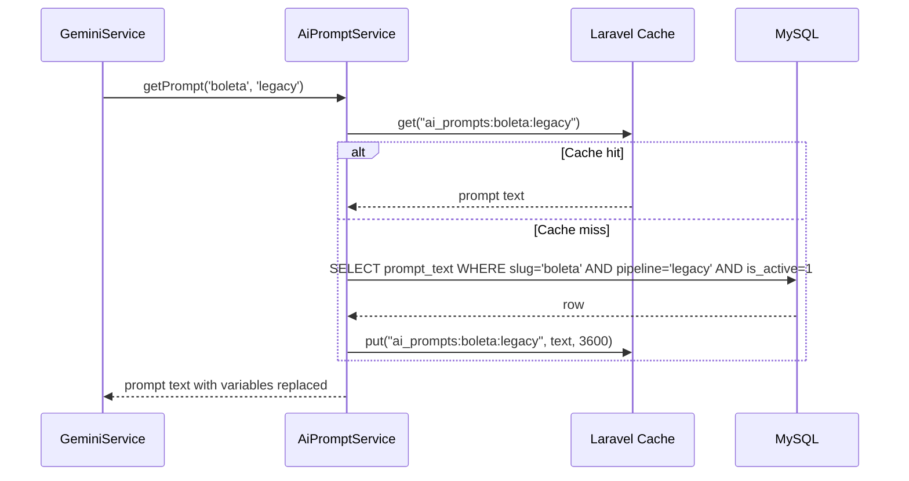
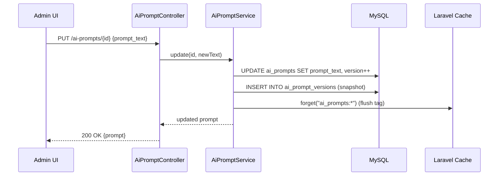

# Design Document: AI Prompts Management

## Overview

This feature migrates the 16 AI prompts currently hardcoded in `GeminiService.php` to a database-backed system with versioning, caching, and a CRUD admin UI. The prompts span three pipelines: legacy single-call (7 prompts), multi-agent text rules (6 prompts), and multi-agent phase prompts (4 prompts — vision, text analysis, validation, reconciliation). One prompt (`buildClassificationPrompt`) is shared across both pipelines.

The admin UI lives inside the existing Compras → Consola tab as a sub-tab, allowing the business owner to edit, version, and activate prompts without code deployments. GeminiService reads prompts from DB with a cache layer (tagged cache, 1-hour TTL) so there's zero per-extraction query overhead. A seed migration populates the table with the current hardcoded prompts as version 1.

The design follows the exact same pattern already established by `checklist_ai_prompts` (table structure, model, seed migration), adapted for the Compras/Gemini domain with the addition of a `pipeline` column to group prompts by their pipeline context and a `variables` JSON column to document which dynamic placeholders each prompt accepts.

## Architecture



## Sequence Diagrams

### Prompt Read (during extraction)



### Prompt Edit (admin UI)




## Components and Interfaces

### Component 1: AiPromptService (Backend)

**Purpose**: Central service for reading/writing prompts. Handles caching, versioning, and variable interpolation.

```php
class AiPromptService
{
    public function getPrompt(string $slug, string $pipeline, array $variables = []): string;
    public function getAllByPipeline(string $pipeline): Collection;
    public function getAll(): Collection;
    public function update(int $id, string $promptText, ?string $description = null): AiPrompt;
    public function getHistory(int $id): Collection;
    public function revertToVersion(int $id, int $versionId): AiPrompt;
    public function flushCache(): void;
}
```

**Responsibilities**:
- Read active prompt by slug+pipeline with cache-through pattern
- Interpolate `{variable}` placeholders into prompt text at read time
- On update: bump `prompt_version`, snapshot to `ai_prompt_versions`, flush cache
- Provide version history for a given prompt

### Component 2: AiPromptController (Backend)

**Purpose**: REST API for admin CRUD operations on prompts.

```php
class AiPromptController extends Controller
{
    public function index(Request $request): JsonResponse;       // GET  — list all prompts
    public function show(int $id): JsonResponse;                 // GET  — single prompt + history
    public function update(Request $request, int $id): JsonResponse; // PUT  — edit prompt text
    public function revert(int $id, int $versionId): JsonResponse;   // POST — revert to version
}
```

**Responsibilities**:
- Validate admin auth (existing `auth:sanctum` + `admin` middleware)
- Validate request payloads
- Delegate to AiPromptService
- Return JSON responses

### Component 3: PromptsManager (Frontend)

**Purpose**: React component inside Consola tab that lists all prompts grouped by pipeline, with inline editing.

```typescript
interface PromptsManagerProps {}

// Sub-components:
// - PromptCard: displays one prompt with expand/collapse, edit button
// - PromptEditor: textarea + save/cancel + diff preview
// - PromptHistory: version list with revert button
```

**Responsibilities**:
- Fetch prompts from API on mount
- Group by pipeline (legacy, multi-agent-rules, multi-agent-phases)
- Inline edit with textarea (monospace, auto-resize)
- Show version history with revert capability
- Optimistic UI with error rollback

## Data Models

### Model 1: ai_prompts (main table)

```sql
CREATE TABLE ai_prompts (
    id INT AUTO_INCREMENT PRIMARY KEY,
    slug VARCHAR(80) NOT NULL,
    pipeline VARCHAR(40) NOT NULL,
    label VARCHAR(120) NOT NULL,
    description TEXT NULL,
    prompt_text MEDIUMTEXT NOT NULL,
    variables JSON NULL,
    prompt_version INT NOT NULL DEFAULT 1,
    is_active TINYINT(1) NOT NULL DEFAULT 1,
    created_at TIMESTAMP DEFAULT CURRENT_TIMESTAMP,
    updated_at TIMESTAMP DEFAULT CURRENT_TIMESTAMP ON UPDATE CURRENT_TIMESTAMP,
    UNIQUE INDEX idx_slug_pipeline (slug, pipeline),
    INDEX idx_pipeline_active (pipeline, is_active)
) ENGINE=InnoDB DEFAULT CHARSET=utf8mb4;
```

**Fields**:
- `slug`: machine identifier matching the method name (e.g., `boleta`, `factura`, `vision`, `text-analysis`)
- `pipeline`: one of `legacy`, `multi-agent-rules`, `multi-agent-phases`
- `label`: human-readable name shown in admin UI (e.g., "Boleta — Legacy Pipeline")
- `description`: optional notes about what this prompt does
- `prompt_text`: the full prompt template with `{variable}` placeholders
- `variables`: JSON array documenting available placeholders, e.g., `["suppliers", "products", "rutMap", "patterns"]`
- `prompt_version`: auto-incremented on each edit
- `is_active`: soft-disable flag (always 1 for now, future-proofing)

**Validation Rules**:
- `slug` + `pipeline` must be unique
- `prompt_text` cannot be empty
- `pipeline` must be one of: `legacy`, `multi-agent-rules`, `multi-agent-phases`

### Model 2: ai_prompt_versions (history table)

```sql
CREATE TABLE ai_prompt_versions (
    id INT AUTO_INCREMENT PRIMARY KEY,
    ai_prompt_id INT NOT NULL,
    prompt_text MEDIUMTEXT NOT NULL,
    prompt_version INT NOT NULL,
    created_at TIMESTAMP DEFAULT CURRENT_TIMESTAMP,
    INDEX idx_prompt_id (ai_prompt_id),
    CONSTRAINT fk_ai_prompt_versions_prompt FOREIGN KEY (ai_prompt_id) REFERENCES ai_prompts(id) ON DELETE CASCADE
) ENGINE=InnoDB DEFAULT CHARSET=utf8mb4;
```

**Purpose**: Every edit creates a snapshot here before the update, enabling full history and revert.

## Prompt Slug Mapping

The 17 prompts map to these slugs:

| # | Method in GeminiService | slug | pipeline |
|---|------------------------|------|----------|
| 1 | buildClassificationPrompt | `classification` | `legacy` |
| 2 | promptBoleta | `boleta` | `legacy` |
| 3 | promptFactura | `factura` | `legacy` |
| 4 | promptProducto | `producto` | `legacy` |
| 5 | promptBascula | `bascula` | `legacy` |
| 6 | promptTransferencia | `transferencia` | `legacy` |
| 7 | promptGeneral | `general` | `legacy` |
| 8 | textRulesBoleta | `boleta` | `multi-agent-rules` |
| 9 | textRulesFactura | `factura` | `multi-agent-rules` |
| 10 | textRulesProducto | `producto` | `multi-agent-rules` |
| 11 | textRulesBascula | `bascula` | `multi-agent-rules` |
| 12 | textRulesTransferencia | `transferencia` | `multi-agent-rules` |
| 13 | textRulesGeneral | `general` | `multi-agent-rules` |
| 14 | buildVisionPrompt | `vision` | `multi-agent-phases` |
| 15 | buildTextAnalysisPrompt | `text-analysis` | `multi-agent-phases` |
| 16 | buildValidationPrompt | `validation` | `multi-agent-phases` |
| 17 | buildReconciliationPrompt | `reconciliation` | `multi-agent-phases` |

> Note: 17 rows because `classification` is counted separately from the 6 type-specific legacy prompts. The original count of "16 prompts" groups classification with the legacy pipeline, but the table has 17 distinct slug+pipeline combinations.

## Key Functions with Formal Specifications

### Function 1: AiPromptService::getPrompt()

```php
public function getPrompt(string $slug, string $pipeline, array $variables = []): string
```

**Preconditions:**
- `$slug` is a non-empty string matching a known prompt slug
- `$pipeline` is one of: `legacy`, `multi-agent-rules`, `multi-agent-phases`
- `$variables` is an associative array where keys match `{placeholder}` names in the prompt

**Postconditions:**
- Returns a non-empty string with all `{placeholder}` tokens replaced by corresponding `$variables` values
- If cache contains the prompt, no DB query is executed
- If prompt not found in DB, throws `RuntimeException` (never returns empty — fail-fast)
- Cache entry is created/refreshed on cache miss

**Cache Key Pattern:** `ai_prompts:{slug}:{pipeline}`

### Function 2: AiPromptService::update()

```php
public function update(int $id, string $promptText, ?string $description = null): AiPrompt
```

**Preconditions:**
- `$id` references an existing `ai_prompts` row
- `$promptText` is a non-empty string

**Postconditions:**
- A new row is inserted into `ai_prompt_versions` with the OLD prompt text and OLD version number
- The `ai_prompts` row is updated with new text and `prompt_version` incremented by 1
- All cache entries with tag `ai_prompts` are flushed
- Returns the updated `AiPrompt` model instance
- Operation is wrapped in a DB transaction (both version snapshot + update are atomic)

### Function 3: GeminiService prompt methods (refactored)

```php
// Before (hardcoded):
private function promptBoleta(array $contexto): string { /* 40 lines of heredoc */ }

// After (DB-backed):
private function promptBoleta(array $contexto): string
{
    return $this->promptService->getPrompt('boleta', 'legacy', [
        'suppliers' => $this->formatSuppliers($contexto),
        'products'  => $this->formatProducts($contexto),
        'rutMap'    => $this->formatRutMap($contexto),
        'patterns'  => implode("\n", array_slice($contexto['patterns'] ?? [], 0, 10)),
        'jsonFormat' => $this->jsonFormat(),
    ]);
}
```

**Preconditions:**
- `AiPromptService` is injected via constructor
- The prompt exists in DB (seeded by migration)

**Postconditions:**
- Returns the same prompt text as before, but sourced from DB
- All `{variable}` placeholders are replaced with formatted context values
- Fallback: if DB prompt not found, logs error and returns hardcoded fallback (graceful degradation during migration)

## Algorithmic Pseudocode

### Cache-Through Read Algorithm

```php
// AiPromptService::getPrompt()
function getPrompt(string $slug, string $pipeline, array $variables): string
{
    $cacheKey = "ai_prompts:{$slug}:{$pipeline}";

    // Step 1: Try cache
    $text = Cache::tags(['ai_prompts'])->get($cacheKey);

    // Step 2: Cache miss → query DB
    if ($text === null) {
        $prompt = AiPrompt::where('slug', $slug)
            ->where('pipeline', $pipeline)
            ->where('is_active', true)
            ->first();

        if ($prompt === null) {
            throw new RuntimeException("AI prompt not found: {$slug}/{$pipeline}");
        }

        $text = $prompt->prompt_text;
        Cache::tags(['ai_prompts'])->put($cacheKey, $text, 3600);
    }

    // Step 3: Interpolate variables
    foreach ($variables as $key => $value) {
        $text = str_replace("{{$key}}", (string) $value, $text);
    }

    return $text;
}
```

### Versioned Update Algorithm

```php
// AiPromptService::update()
function update(int $id, string $promptText, ?string $description): AiPrompt
{
    return DB::transaction(function () use ($id, $promptText, $description) {
        $prompt = AiPrompt::findOrFail($id);

        // Step 1: Snapshot current version
        AiPromptVersion::create([
            'ai_prompt_id'   => $prompt->id,
            'prompt_text'    => $prompt->prompt_text,
            'prompt_version' => $prompt->prompt_version,
        ]);

        // Step 2: Update prompt
        $prompt->update([
            'prompt_text'    => $promptText,
            'description'    => $description ?? $prompt->description,
            'prompt_version' => $prompt->prompt_version + 1,
        ]);

        // Step 3: Flush all prompt caches
        Cache::tags(['ai_prompts'])->flush();

        return $prompt->fresh();
    });
}
```

## Example Usage

### Backend: GeminiService reading a prompt

```php
// In GeminiService constructor (dependency injection)
public function __construct(
    private readonly AiPromptService $promptService,
) {
    $this->apiKey = (string) env('GOOGLE_API_KEY', env('google_api_key', ''));
    $this->model = (string) env('GEMINI_MODEL', 'gemini-2.5-flash-lite');
}

// In buildClassificationPrompt (now reads from DB)
private function buildClassificationPrompt(): string
{
    return $this->promptService->getPrompt('classification', 'legacy');
}

// In promptBoleta (with variable interpolation)
private function promptBoleta(array $contexto): string
{
    return $this->promptService->getPrompt('boleta', 'legacy', [
        'suppliers' => $this->formatSuppliers($contexto),
        'products'  => $this->formatProducts($contexto),
        'rutMap'    => $this->formatRutMap($contexto),
        'patterns'  => implode("\n", array_slice($contexto['patterns'] ?? [], 0, 10)),
        'jsonFormat' => $this->jsonFormat(),
    ]);
}
```

### Frontend: API calls from PromptsManager

```typescript
// Fetch all prompts
const res = await comprasApi.get<{ success: boolean; data: AiPrompt[] }>('/compras/ai-prompts');

// Update a prompt
const updated = await comprasApi.patch<{ success: boolean; data: AiPrompt }>(
  `/compras/ai-prompts/${prompt.id}`,
  { prompt_text: newText }
);

// Revert to a previous version
const reverted = await comprasApi.post<{ success: boolean; data: AiPrompt }>(
  `/compras/ai-prompts/${prompt.id}/revert/${versionId}`,
  {}
);
```

## Error Handling

### Error Scenario 1: Prompt not found in DB

**Condition**: GeminiService requests a prompt slug+pipeline that doesn't exist in DB (e.g., migration not run)
**Response**: `AiPromptService::getPrompt()` throws `RuntimeException`
**Recovery**: GeminiService catches the exception, logs it, and falls back to the hardcoded prompt (kept as a private constant during transition period). After confirming all prompts are seeded, the fallback can be removed.

### Error Scenario 2: Cache driver unavailable

**Condition**: Redis/file cache is down
**Response**: Laravel's cache `get()` returns null, triggering a DB query on every call
**Recovery**: System continues working (just slower). The cache miss path is the normal DB read. No user-facing error.

### Error Scenario 3: Concurrent edits

**Condition**: Two admins edit the same prompt simultaneously
**Response**: Both updates succeed sequentially (DB transaction with row-level lock). The second update creates a version snapshot of the first update's text.
**Recovery**: Version history preserves both edits. Admin can see the history and revert if needed.

### Error Scenario 4: Empty prompt text submitted

**Condition**: Admin submits an empty prompt_text via the API
**Response**: Laravel validation rejects with 422 Unprocessable Entity
**Recovery**: Frontend shows validation error, prompt remains unchanged.

## Testing Strategy

### Unit Testing Approach

- Test `AiPromptService::getPrompt()` with mocked cache and DB
- Test variable interpolation with various placeholder patterns
- Test `update()` creates version snapshot and increments version
- Test cache is flushed after update
- Test `revertToVersion()` restores correct text

### Integration Testing Approach

- Test full API endpoints with seeded prompts
- Test GeminiService reads from DB instead of hardcoded values
- Test that extraction results are identical before/after migration (regression)

## Performance Considerations

- Cache TTL of 1 hour means at most 1 DB query per prompt per hour per server instance
- Tagged cache (`ai_prompts`) allows flushing all prompt caches at once on any edit
- MEDIUMTEXT for `prompt_text` supports prompts up to 16MB (current largest is ~2KB)
- The `variables` JSON column is read-only metadata (not queried), so no index needed
- Version history table grows linearly with edits (expected: <100 versions total, negligible)

## Security Considerations

- All API endpoints are behind `auth:sanctum` + `admin` middleware (same as existing compras routes)
- Prompt text is treated as trusted content (only admin can edit, and it's sent to Gemini API, not rendered as HTML)
- No user-supplied content is interpolated into prompts — only server-side context variables
- SQL injection is prevented by Eloquent ORM (parameterized queries)

## Dependencies

- Laravel Cache (already configured — file or Redis driver)
- Existing `comprasApi` frontend helper (no new dependencies)
- Existing `auth:sanctum` + `admin` middleware stack
- MySQL 8.0+ (for JSON column support — already in use)

## Correctness Properties

1. **Prompt Integrity**: For all prompts P in the database, if P is active and has slug S and pipeline L, then `getPrompt(S, L)` returns P.prompt_text with all `{var}` placeholders replaced by the corresponding variable values.

2. **Version Monotonicity**: For all prompts P, after any update operation, `P.prompt_version` is strictly greater than the previous value, and a corresponding row exists in `ai_prompt_versions` with the previous text and version.

3. **Cache Consistency**: After any `update()` or `revertToVersion()` call, all cached prompt entries are invalidated. The next `getPrompt()` call reads fresh data from DB.

4. **Seed Completeness**: After running the seed migration, every prompt method in GeminiService has a corresponding row in `ai_prompts` with matching slug+pipeline. The count of seeded rows equals 17.

5. **Backward Compatibility**: For all extraction operations, the output of GeminiService after migration is identical to before migration when using the seeded (original) prompt texts. No extraction behavior changes unless an admin explicitly edits a prompt.

6. **Atomic Updates**: For all update operations, either both the version snapshot AND the prompt update succeed, or neither does (DB transaction). There is no state where a prompt is updated without a version history entry.
