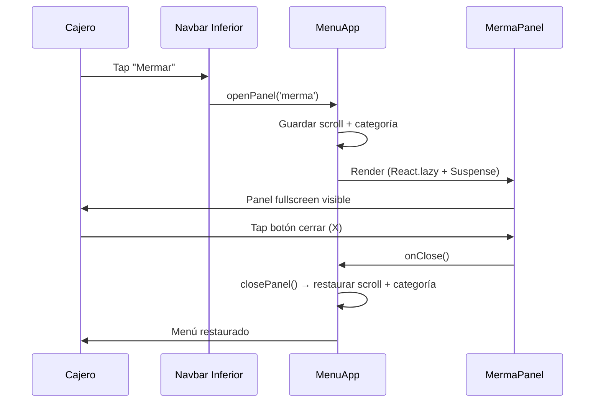
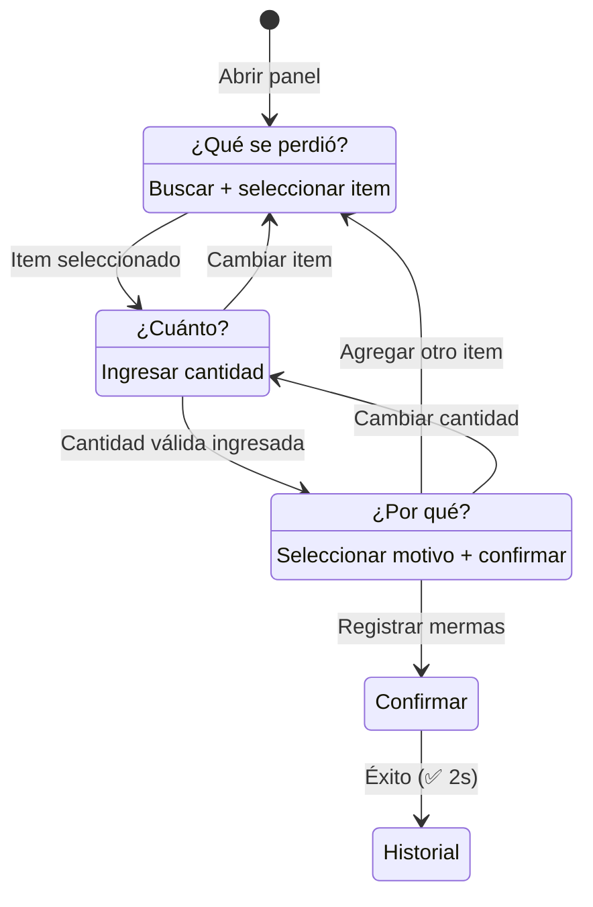

# Documento de Diseño — Merma y Arqueo Inline en caja3

## Resumen

Este diseño convierte las páginas separadas de Merma (`/mermas`) y Arqueo (`/arqueo`) en paneles inline que se renderizan dentro de `MenuApp.jsx` como overlays de pantalla completa. El panel de Arqueo (`ArqueoPanel.jsx`) ya existe y funciona correctamente con `SaldoCajaModal` integrado directamente. El trabajo principal es crear `MermaPanel.jsx` — un componente mobile-first rediseñado con UX simplificada para cajeras, flujo de 3 pasos, motivos con emojis, indicadores de stock por color, y datos enriquecidos de ingredientes (categoría, stock mínimo).

La integración con `MenuApp` ya está implementada: lazy-loading con `React.lazy`, estado `activePanel`, y funciones `openPanel`/`closePanel` que preservan scroll y categoría activa.

## Arquitectura

### Diagrama de Componentes

```mermaid
graph TD
    MA[MenuApp.jsx] -->|activePanel === 'merma'| MP[MermaPanel.jsx]
    MA -->|activePanel === 'arqueo'| AP[ArqueoPanel.jsx]
    
    MP -->|fetch| API1[/api/get_ingredientes.php]
    MP -->|fetch| API2[/api/get_productos.php]
    MP -->|fetch| API3[/api/registrar_merma.php]
    MP -->|fetch| API4[/api/get_mermas.php]
    
    AP -->|fetch| API5[/api/get_sales_summary.php]
    AP -->|fetch| API6[/api/get_saldo_caja.php]
    AP -->|integra| SCM[SaldoCajaModal]
    
    MA -->|openPanel/closePanel| STATE[Estado: activePanel, savedScroll, savedCategory]
```

### Flujo de Navegación



### Decisiones de Diseño

1. **ArqueoPanel ya existe y funciona** — No requiere rediseño. Ya integra `SaldoCajaModal` directamente sin `window.dispatchEvent`. Solo se documenta su arquitectura.

2. **MermaPanel como componente nuevo** — Se crea desde cero en vez de adaptar `MermasApp.jsx` porque el UX es fundamentalmente diferente (flujo de 3 pasos vs formulario único, motivos con emoji vs dropdown, indicadores de stock por color).

3. **Lazy loading ya implementado** — `MenuApp` ya tiene `React.lazy(() => import('./MermaPanel.jsx'))` y `React.lazy(() => import('./ArqueoPanel.jsx'))`. Solo falta crear el archivo `MermaPanel.jsx`.

4. **Sin dependencia de API mi3** — Los datos de ingredientes (nombre, categoría, stock, costo, unidad, min_stock_level) ya están disponibles en la tabla `ingredients` de caja3 vía `/api/get_ingredientes.php`. No se necesita llamar a `api-mi3.laruta11.cl`.

5. **Overlay fullscreen con position:fixed** — Mismo patrón que `ArqueoPanel`: `position: fixed; inset: 0; z-index: 50`. Esto oculta completamente el menú sin desmontarlo, preservando su estado.

## Componentes e Interfaces

### MermaPanel (nuevo)

```typescript
// Props
interface MermaPanelProps {
  onClose: () => void;  // Callback para cerrar el panel
}

// Estado interno
interface MermaPanelState {
  step: 1 | 2 | 3;                    // Paso actual del flujo
  ingredientes: Ingrediente[];          // Lista cargada de ingredientes activos
  productos: Producto[];                // Lista cargada de productos activos
  itemType: 'ingredient' | 'product';   // Toggle ingredientes/productos
  searchTerm: string;                   // Texto de búsqueda
  selectedItem: SelectedItem | null;    // Item seleccionado
  cantidad: string;                     // Cantidad ingresada
  reason: string;                       // Motivo seleccionado
  mermaItems: MermaItem[];             // Items acumulados para registrar
  activeTab: 'mermar' | 'historial';   // Tab activa
  mermasHistorial: MermaHistorial[];   // Historial cargado
  loading: boolean;                     // Estado de envío
  showSuccess: boolean;                 // Animación de confirmación
  criticalCount: number;               // Conteo de ingredientes en estado crítico
}
```

### Flujo de 3 Pasos del MermaPanel



### ArqueoPanel (existente)

```typescript
// Props — ya implementado
interface ArqueoPanelProps {
  onClose: () => void;
}
// Integra SaldoCajaModal directamente como componente hijo
// Polling de saldo cada 15s
// Navegación temporal (días anteriores)
```

### Integración en MenuApp (ya implementada)

```javascript
// Estado existente en MenuApp
const [activePanel, setActivePanel] = useState(null); // null | 'merma' | 'arqueo'
const savedScrollRef = useRef(0);
const savedCategoryRef = useRef(null);

// Funciones existentes
const openPanel = (panel) => { /* guarda scroll, setActivePanel */ };
const closePanel = () => { /* setActivePanel(null), restaura scroll */ };

// Render existente — retorna panel si activePanel !== null
if (activePanel) {
  return (
    <React.Suspense fallback={<Spinner />}>
      {activePanel === 'merma' && <MermaPanel onClose={closePanel} />}
      {activePanel === 'arqueo' && <ArqueoPanel onClose={closePanel} />}
    </React.Suspense>
  );
}
```

## Modelos de Datos

### Ingrediente (desde `/api/get_ingredientes.php`)

```typescript
interface Ingrediente {
  id: number;
  name: string;
  unit: string;              // 'kg', 'litro', 'unidad', 'gramo'
  cost_per_unit: string;     // decimal como string desde MySQL
  current_stock: string;     // decimal como string
  min_stock_level: string;   // decimal como string
  supplier: string | null;
  category: string | null;   // 'Carnes', 'Vegetales', 'Lácteos', etc.
  is_active: boolean;
}
```

### Producto (desde `/api/get_productos.php`)

```typescript
interface Producto {
  id: number;
  name: string;
  cost_price: string;
  stock_quantity: number;
  is_active: boolean;
}
```

### MermaItem (estado local del panel)

```typescript
interface MermaItem {
  item_id: number;
  item_type: 'ingredient' | 'product';
  nombre_item: string;
  cantidad: number;
  unidad: string;
  costo_unitario: number;
  subtotal: number;          // cantidad * costo_unitario
}
```

### Payload de registro (`POST /api/registrar_merma.php`)

```typescript
interface RegistrarMermaPayload {
  item_type: 'ingredient' | 'product';
  item_id: number;
  quantity: number;
  reason: string;
}
```

### Motivos de Merma (constante en MermaPanel)

```typescript
const MERMA_REASONS = [
  { value: 'Prueba/Producto nuevo', emoji: '🧪', label: 'Prueba' },
  { value: 'Podrido',              emoji: '🤮', label: 'Podrido' },
  { value: 'Vencido',              emoji: '⏰', label: 'Vencido' },
  { value: 'Quemado',              emoji: '🔥', label: 'Quemado' },
  { value: 'Dañado',               emoji: '💥', label: 'Dañado' },
  { value: 'Caído/Derramado',      emoji: '🫗', label: 'Caído' },
  { value: 'Mal estado',           emoji: '🤢', label: 'Mal estado' },
  { value: 'Contaminado',          emoji: '🐛', label: 'Contaminado' },
  { value: 'Mal refrigerado',      emoji: '❄️', label: 'Mal refri' },
  { value: 'Devolución cliente',   emoji: '🔄', label: 'Devolución' },
  { value: 'Capacitación',         emoji: '🎓', label: 'Capacitación' },
  { value: 'Otro',                 emoji: '❓', label: 'Otro' },
];
```

### Indicadores de Stock (lógica de color)

```typescript
function getStockLevel(currentStock: number, minStockLevel: number): 'green' | 'yellow' | 'red' {
  if (currentStock > minStockLevel * 2) return 'green';
  if (currentStock >= minStockLevel) return 'yellow';
  return 'red';
}
```

### Fuzzy Match (reutilizado de MermasApp)

```typescript
function fuzzyMatch(str: string, pattern: string): number {
  // Mismo algoritmo existente en MermasApp.jsx
  // Retorna score > 0 si hay match, 0 si no
}
```


## Propiedades de Correctitud

*Una propiedad es una característica o comportamiento que debe mantenerse verdadero en todas las ejecuciones válidas de un sistema — esencialmente, una declaración formal sobre lo que el sistema debe hacer. Las propiedades sirven como puente entre especificaciones legibles por humanos y garantías de correctitud verificables por máquina.*

### Propiedad 1: Round-trip de estado del menú al abrir/cerrar panel

*Para cualquier* estado del menú (categoría activa, posición de scroll, items en carrito, query de búsqueda), abrir un panel inline y luego cerrarlo debe restaurar todos los valores al estado previo exacto.

**Valida: Requisitos 1.5, 7.1, 7.2, 7.4**

### Propiedad 2: Indicador de stock por color

*Para cualquier* ingrediente con `current_stock` y `min_stock_level` ≥ 0, `getStockLevel` debe retornar `'green'` cuando stock > 2×mínimo, `'yellow'` cuando mínimo ≤ stock ≤ 2×mínimo, y `'red'` cuando stock < mínimo.

**Valida: Requisito 3b.1**

### Propiedad 3: Cálculo de subtotal de merma

*Para cualquier* cantidad ≥ 0 y costo por unidad ≥ 0, el subtotal calculado debe ser exactamente `cantidad × costo_unitario`, y el costo total de la lista debe ser la suma de todos los subtotales.

**Valida: Requisitos 2.6, 4.1, 4.2**

### Propiedad 4: Búsqueda fuzzy acotada y ordenada

*Para cualquier* lista de ingredientes/productos y cualquier término de búsqueda, los resultados filtrados deben tener longitud ≤ 10 y estar ordenados por score de fuzzy match descendente.

**Valida: Requisito 3.3**

### Propiedad 5: Agrupación por categoría

*Para cualquier* lista de ingredientes con categorías asignadas, la función de agrupación debe producir grupos donde cada ingrediente dentro de un grupo tiene la categoría correspondiente al grupo, y la unión de todos los grupos contiene todos los ingredientes.

**Valida: Requisito 3.2**

### Propiedad 6: Bloqueo por exceso de stock

*Para cualquier* ingrediente con stock actual S y cualquier cantidad Q > S, el sistema debe bloquear el registro y mostrar advertencia. Para cualquier Q ≤ S, el registro debe ser permitido.

**Valida: Requisito 3.6**

### Propiedad 7: Alerta de stock crítico post-merma

*Para cualquier* ingrediente con stock S y nivel mínimo M, y cualquier cantidad Q donde (S - Q) < M y Q ≤ S, el sistema debe mostrar una alerta indicando que el ingrediente quedará en estado crítico.

**Valida: Requisito 3b.3**

### Propiedad 8: Validación de motivo obligatorio

*Para cualquier* lista no vacía de items de merma y motivo vacío (reason === ''), el sistema debe bloquear el envío. Para cualquier motivo no vacío del conjunto de 12 motivos válidos, el envío debe ser permitido.

**Valida: Requisito 4.6**

### Propiedad 9: Completitud de campos en historial

*Para cualquier* registro de merma con todos los campos (nombre, cantidad, unidad, costo, motivo, fecha), la entrada renderizada en el historial debe contener todos estos campos, y la fecha debe estar en formato chileno (dd/mm/yyyy).

**Valida: Requisito 5.2**

### Propiedad 10: Resumen diario de mermas

*Para cualquier* lista de registros de merma con fechas variadas, el resumen del costo total del día debe ser igual a la suma de costos de las mermas cuya fecha coincide con hoy.

**Valida: Requisito 5.3**

## Manejo de Errores

| Escenario | Comportamiento |
|---|---|
| Fallo al cargar ingredientes (`/api/get_ingredientes.php`) | Mostrar mensaje "Error al cargar ingredientes" con botón reintentar. Lista queda vacía. |
| Fallo al cargar productos (`/api/get_productos.php`) | Mostrar mensaje de error. Toggle a productos deshabilitado. |
| Fallo al registrar merma (`/api/registrar_merma.php`) | Mostrar alerta "❌ Error al registrar merma". Mantener datos del formulario para reintentar. No limpiar items. |
| Fallo al cargar historial (`/api/get_mermas.php`) | Mostrar "No se pudo cargar el historial" con botón reintentar. |
| Cantidad ingresada > stock actual | Bloquear botón "Agregar". Mostrar advertencia con stock disponible. |
| Cantidad ingresada ≤ 0 o vacía | Bloquear botón "Agregar". |
| Sin motivo seleccionado al confirmar | Bloquear botón "Registrar Mermas". |
| Fallo parcial (algunos items registrados, otros no) | Mostrar error indicando cuáles fallaron. Mantener items fallidos en la lista. |
| Timeout de red (>30s) | Mostrar error de timeout con opción de reintentar. |

## Estrategia de Testing

### Tests Unitarios (ejemplo)

- Renderizado de MermaPanel: verificar que se monta correctamente con prop `onClose`
- Toggle ingredientes/productos: verificar cambio de lista
- Selección de motivo: verificar que los 12 botones con emoji se renderizan
- Flujo de 3 pasos: verificar navegación entre pasos
- Confirmación exitosa: verificar animación ✅ y limpieza de formulario después de 2s
- Error de API: verificar que datos se preservan y mensaje de error aparece
- ArqueoPanel (ya existente): verificar que SaldoCajaModal se abre sin window.dispatchEvent

### Tests de Propiedad (Property-Based Testing)

- Librería: `fast-check` (ya disponible o fácil de agregar al proyecto)
- Mínimo 100 iteraciones por propiedad
- Cada test referencia su propiedad del documento de diseño
- Tag format: `Feature: caja3-inline-merma-arqueo, Property {N}: {título}`

Propiedades a implementar como PBT:
1. **Propiedad 2**: getStockLevel — función pura, fácil de generar inputs (dos números ≥ 0)
2. **Propiedad 3**: Cálculo de subtotal y total — función pura aritmética
3. **Propiedad 4**: Fuzzy search acotada — generar listas de ingredientes y términos de búsqueda
4. **Propiedad 5**: Agrupación por categoría — generar listas con categorías aleatorias
5. **Propiedad 6**: Bloqueo por exceso de stock — generar pares (stock, cantidad)
6. **Propiedad 8**: Validación de motivo — generar combinaciones de items y motivos

Las propiedades 1, 7, 9, 10 son más adecuadas para tests unitarios con ejemplos concretos debido a su dependencia de DOM/rendering o estado complejo de React.

### Tests de Integración

- Verificar que `openPanel('merma')` en MenuApp renderiza MermaPanel
- Verificar que `openPanel('arqueo')` en MenuApp renderiza ArqueoPanel
- Verificar flujo completo: buscar → seleccionar → cantidad → motivo → registrar → historial
- Verificar que ArqueoPanel polling se detiene al desmontar
