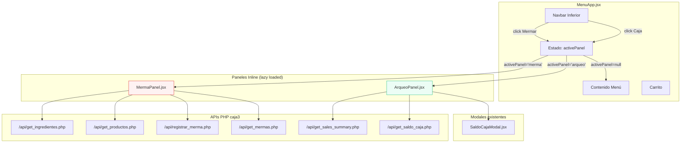
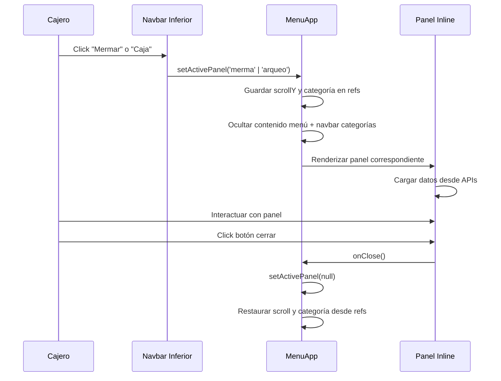

# Diseño Técnico — Merma y Arqueo Inline en caja3

## Resumen

Este diseño convierte las páginas separadas de Merma (`/mermas`) y Arqueo (`/arqueo`) en paneles inline que se renderizan dentro de `MenuApp.jsx`, eliminando la navegación con `window.location.href`. Se rediseña el panel de Merma con UX mobile-first, datos enriquecidos de ingredientes (categorías, stock, costos), indicadores visuales de stock, y un flujo de 3 pasos optimizado para cajeras. El panel de Arqueo se adapta directamente desde `ArqueoApp.jsx` con integración directa del `SaldoCajaModal`.

### Decisiones de Diseño Clave

1. **Paneles como componentes React separados** en vez de embeber lógica en MenuApp: Se crean `MermaPanel.jsx` y `ArqueoPanel.jsx` como componentes independientes que MenuApp renderiza condicionalmente. Esto evita inflar más el ya extenso MenuApp (~4200 líneas).

2. **Estado de panel en MenuApp con lazy loading**: MenuApp mantiene solo un estado `activePanel` (`null | 'merma' | 'arqueo'`). Los paneles se importan con `React.lazy()` para no impactar el bundle inicial.

3. **Preservación de estado via refs**: Se usa `useRef` para guardar scroll position y categoría activa antes de abrir un panel, restaurándolos al cerrar.

4. **SaldoCajaModal integrado directamente**: El panel de Arqueo importa y controla `SaldoCajaModal` con props `isOpen/onClose` en vez del patrón actual de `window.dispatchEvent`.

5. **Reutilización de APIs existentes**: Se usan las mismas APIs PHP de caja3 (`get_ingredientes.php`, `registrar_merma.php`, etc.) sin cambios en el backend.

## Arquitectura

### Diagrama de Componentes



### Flujo de Navegación



## Componentes e Interfaces

### 1. Cambios en MenuApp.jsx

Se agregan estados y lógica mínima para gestionar los paneles inline.

```jsx
// Nuevos estados en MenuApp
const [activePanel, setActivePanel] = useState(null); // null | 'merma' | 'arqueo'
const savedScrollRef = useRef(0);
const savedCategoryRef = useRef(null);

// Lazy imports
const MermaPanel = React.lazy(() => import('./MermaPanel.jsx'));
const ArqueoPanel = React.lazy(() => import('./ArqueoPanel.jsx'));

// Funciones de apertura/cierre
const openPanel = (panel) => {
  savedScrollRef.current = window.scrollY;
  savedCategoryRef.current = activeCategory;
  setActivePanel(panel);
  window.scrollTo(0, 0);
};

const closePanel = () => {
  setActivePanel(null);
  requestAnimationFrame(() => {
    window.scrollTo(0, savedScrollRef.current);
    if (savedCategoryRef.current) {
      setActiveCategory(savedCategoryRef.current);
    }
  });
};
```

**Renderizado condicional en el return de MenuApp:**
- Cuando `activePanel !== null`: renderizar solo el panel activo (fullscreen overlay)
- Cuando `activePanel === null`: renderizar el menú normal

**Cambios en Navbar Inferior:**
- Reemplazar `window.location.href = '/mermas'` → `openPanel('merma')`
- Reemplazar `window.location.href = '/arqueo'` → `openPanel('arqueo')`

### 2. MermaPanel.jsx — Panel Inline de Merma

Componente nuevo que reemplaza `MermasApp.jsx` con UX mejorada.

```typescript
// Props interface
interface MermaPanelProps {
  onClose: () => void;
}
```

**Estructura interna:**
- **Estado del flujo**: `step` (1: buscar/seleccionar, 2: cantidad/motivo, 3: confirmar)
- **Tabs**: "Mermar" | "Historial"
- **Datos**: ingredientes, productos, mermaItems (lista acumulada), historial
- **Búsqueda**: fuzzy match reutilizado de MermasApp actual

**Sub-componentes internos (dentro del mismo archivo):**
- `StepIndicator` — Indicador visual de 3 pasos
- `SearchResults` — Tarjetas de resultados con badges de categoría e indicadores de stock
- `ItemDetail` — Detalle del item seleccionado con info de stock y costo
- `MermaItemsList` — Lista de items agregados con subtotales
- `ReasonSelector` — Grid de botones con emojis para motivos
- `HistorialView` — Vista de historial con resumen diario

### 3. ArqueoPanel.jsx — Panel Inline de Arqueo

Adaptación directa de `ArqueoApp.jsx` como componente inline.

```typescript
// Props interface
interface ArqueoPanelProps {
  onClose: () => void;
}
```

**Cambios respecto a ArqueoApp.jsx:**
- Eliminar botón "Volver a Caja" (`window.location.href`) → usar `onClose` prop
- Importar `SaldoCajaModal` directamente con estado local `showSaldoModal`
- Eliminar `window.dispatchEvent(new CustomEvent('openSaldoCajaModal'))` → usar `setShowSaldoModal(true)`
- Mantener toda la lógica de ventas, polling, y navegación temporal
- Agregar header con botón de cierre (X)

### 4. Interfaces de Datos

```typescript
// Ingrediente desde /api/get_ingredientes.php
interface Ingrediente {
  id: number;
  name: string;
  category: string; // enum: Carnes, Vegetales, Salsas, etc.
  unit: string; // kg, unidad, litro, gramo
  current_stock: number;
  cost_per_unit: number;
  min_stock_level: number;
  is_active: boolean;
  is_composite: boolean;
}

// Producto desde /api/get_productos.php
interface Producto {
  id: number;
  name: string;
  cost_price: number;
  stock_quantity: number;
  is_active: boolean;
}

// Item de merma (acumulado en el panel antes de enviar)
interface MermaItem {
  item_id: number;
  item_type: 'ingredient' | 'product';
  nombre_item: string;
  cantidad: number;
  unidad: string;
  stock_actual: number;
  costo_unitario: number;
  subtotal: number; // cantidad * costo_unitario
}

// Motivos de merma con emoji
const MERMA_REASONS = [
  { value: 'Prueba/Producto nuevo', emoji: '🧪', label: 'Prueba/Producto nuevo' },
  { value: 'Podrido', emoji: '🤮', label: 'Podrido' },
  { value: 'Vencido', emoji: '⏰', label: 'Vencido' },
  { value: 'Quemado', emoji: '🔥', label: 'Quemado' },
  { value: 'Dañado', emoji: '💥', label: 'Dañado' },
  { value: 'Caído/Derramado', emoji: '🫗', label: 'Caído/Derramado' },
  { value: 'Mal estado', emoji: '🤢', label: 'Mal estado' },
  { value: 'Contaminado', emoji: '🐛', label: 'Contaminado' },
  { value: 'Mal refrigerado', emoji: '❄️', label: 'Mal refrigerado' },
  { value: 'Devolución cliente', emoji: '🔄', label: 'Devolución cliente' },
  { value: 'Capacitación', emoji: '🎓', label: 'Capacitación' },
  { value: 'Otro', emoji: '❓', label: 'Otro' },
];

// Payload a /api/registrar_merma.php
interface RegistrarMermaPayload {
  item_type: 'ingredient' | 'product';
  item_id: number;
  quantity: number;
  reason: string;
}
```

## Modelos de Datos

No se requieren cambios en la base de datos. Se reutilizan las tablas existentes:

- **`ingredients`**: id, name, category, unit, current_stock, cost_per_unit, min_stock_level, is_active, is_composite
- **`products`**: id, name, cost_price, stock_quantity, is_active
- **`mermas`**: id, ingredient_id, product_id, item_type, item_name, quantity, unit, cost, reason, user_id, created_at

### Lógica de Indicadores de Stock

```
stock_ratio = current_stock / min_stock_level

Si min_stock_level == 0 o null → Verde (sin mínimo definido)
Si stock_ratio > 2.0 → Verde (stock saludable)
Si stock_ratio >= 1.0 y <= 2.0 → Amarillo (stock moderado)
Si stock_ratio < 1.0 → Rojo (stock crítico)
```

### Cálculo de Costo de Merma

```
subtotal_item = cantidad_merma × costo_por_unidad
total_merma = Σ subtotal_item (para todos los items en la lista)
```

### Fuzzy Match (reutilizado de MermasApp)

Se reutiliza el algoritmo existente de `MermasApp.jsx` que asigna puntaje basado en coincidencia secuencial de caracteres, con bonus para coincidencias al inicio de palabra. Resultados limitados a 10 items ordenados por score descendente.


## Propiedades de Correctitud

*Una propiedad es una característica o comportamiento que debe mantenerse verdadero en todas las ejecuciones válidas de un sistema — esencialmente, una declaración formal sobre lo que el sistema debe hacer. Las propiedades sirven como puente entre especificaciones legibles por humanos y garantías de correctitud verificables por máquina.*

### Propiedad 1: Round-trip de estado del menú al abrir/cerrar panel

*Para cualquier* estado del menú (categoría activa, posición de scroll, contenido del carrito, query de búsqueda), abrir un panel inline y luego cerrarlo debe restaurar exactamente el mismo estado previo del menú.

**Valida: Requisitos 1.5, 7.1, 7.2, 7.4**

### Propiedad 2: Completitud de información de ingredientes en búsqueda y detalle

*Para cualquier* ingrediente activo, tanto la tarjeta de resultado de búsqueda como la vista de detalle deben contener: nombre, categoría, stock actual, unidad, y costo por unidad.

**Valida: Requisitos 2.3, 3.4**

### Propiedad 3: Agrupación correcta por categoría

*Para cualquier* lista de ingredientes con categorías asignadas, la función de agrupación debe producir grupos donde cada ingrediente aparece exactamente en el grupo de su categoría, y la unión de todos los grupos contiene todos los ingredientes de la lista original.

**Valida: Requisito 3.2**

### Propiedad 4: Restricciones del fuzzy match

*Para cualquier* término de búsqueda y lista de items, los resultados del fuzzy match deben: (a) contener como máximo 10 items, (b) estar ordenados por score descendente, y (c) cada resultado debe tener un score de coincidencia positivo.

**Valida: Requisito 3.3**

### Propiedad 5: Validación de cantidad de merma contra niveles de stock

*Para cualquier* ingrediente con stock actual S y nivel mínimo M, y cualquier cantidad de merma Q: si Q > S, el registro debe ser bloqueado; si (S - Q) < M, debe mostrarse una alerta de stock crítico.

**Valida: Requisitos 3.6, 3b.3**

### Propiedad 6: Indicador de color de stock

*Para cualquier* ingrediente con stock actual S y nivel mínimo M: si M es 0 o null, el color es verde; si S > 2*M, el color es verde; si M ≤ S ≤ 2*M, el color es amarillo; si S < M, el color es rojo.

**Valida: Requisito 3b.1**

### Propiedad 7: Conteo de ingredientes críticos

*Para cualquier* lista de ingredientes, el conteo de ingredientes en estado crítico debe ser igual al número de ingredientes donde current_stock < min_stock_level (excluyendo aquellos con min_stock_level = 0 o null).

**Valida: Requisito 3b.2**

### Propiedad 8: Cálculo de costo de merma

*Para cualquier* lista de items de merma, el subtotal de cada item debe ser igual a cantidad × costo_por_unidad, y el total acumulado debe ser igual a la suma de todos los subtotales.

**Valida: Requisitos 4.1, 4.2**

### Propiedad 9: Motivo requerido para envío de merma

*Para cualquier* lista no vacía de items de merma, si el motivo no está seleccionado (vacío), el envío debe ser bloqueado.

**Valida: Requisito 4.6**

### Propiedad 10: Completitud del historial de mermas

*Para cualquier* registro de merma, la vista de historial debe mostrar: nombre del item, cantidad con unidad, costo, motivo, y fecha formateada en formato chileno (dd/mm/yyyy).

**Valida: Requisito 5.2**

### Propiedad 11: Total diario de mermas

*Para cualquier* lista de mermas con fechas variadas, el resumen del costo total del día actual debe ser igual a la suma de costos de las mermas cuya fecha de creación corresponde al día actual.

**Valida: Requisito 5.3**

### Propiedad 12: Tabla de ventas por método de pago

*Para cualquier* datos de resumen de ventas, la tabla renderizada debe contener una fila por cada método de pago (Tarjetas, Transferencia, Efectivo, Webpay, PedidosYA Online, PedidosYA Efectivo, Crédito RL6, Crédito R11, Delivery) con su conteo de pedidos y total correspondiente.

**Valida: Requisito 6.2**

## Manejo de Errores

### Panel de Merma

| Escenario | Comportamiento |
|---|---|
| Fallo al cargar ingredientes/productos | Mostrar mensaje "Error al cargar datos. Toca para reintentar" con botón de retry. No bloquear el panel. |
| Fallo al registrar merma (API error) | Mostrar toast de error descriptivo. Mantener todos los datos ingresados (items, motivo) para reintentar. |
| Cantidad excede stock | Mostrar advertencia inline con stock disponible. Bloquear botón "Agregar" hasta corregir cantidad. |
| Merma dejaría stock bajo mínimo | Mostrar alerta amarilla informativa (no bloqueante) indicando que el ingrediente quedará en estado crítico. |
| Búsqueda sin resultados | Mostrar mensaje "No se encontraron items para '{término}'" con sugerencia de verificar ortografía. |
| Fallo al cargar historial | Mostrar mensaje de error con botón de retry en la pestaña de historial. |

### Panel de Arqueo

| Escenario | Comportamiento |
|---|---|
| Fallo al cargar datos de ventas | Mostrar skeleton loading por 3 segundos, luego mensaje de error con retry. |
| Fallo en polling de saldo | Silencioso — mantener último saldo conocido. Reintentar en el siguiente ciclo de 15s. |
| Timeout en API (>30s) | Usar `AbortSignal.timeout(30000)` como en ArqueoApp actual. Mostrar error si falla. |

### General

| Escenario | Comportamiento |
|---|---|
| Error al abrir panel (lazy load falla) | `React.Suspense` con fallback de loading spinner. Si falla el chunk, mostrar error con botón "Reintentar". |
| Panel abierto + pérdida de conexión | Los paneles muestran datos ya cargados. Operaciones de escritura muestran error de red. |

## Estrategia de Testing

### Enfoque Dual

Este feature se beneficia de property-based testing para la lógica pura (cálculos, validaciones, transformaciones de datos) combinado con tests unitarios de ejemplo para interacciones UI específicas.

### Property-Based Tests

Se usa **fast-check** como librería de PBT para JavaScript/React.

Cada property test debe:
- Ejecutar mínimo 100 iteraciones
- Referenciar la propiedad del documento de diseño
- Usar el formato de tag: **Feature: caja3-inline-merma-arqueo, Property {N}: {título}**

**Tests de propiedades a implementar:**

1. **Propiedad 1** — Round-trip estado menú: Generar estados aleatorios, simular open/close, verificar restauración.
2. **Propiedad 3** — Agrupación por categoría: Generar listas de ingredientes con categorías aleatorias, verificar agrupación.
3. **Propiedad 4** — Fuzzy match: Generar listas de items y términos de búsqueda, verificar restricciones.
4. **Propiedad 5** — Validación de stock: Generar ingredientes con stocks y cantidades aleatorias, verificar bloqueo/alerta.
5. **Propiedad 6** — Color de stock: Generar pares (stock, min_level) aleatorios, verificar color correcto.
6. **Propiedad 7** — Conteo crítico: Generar listas de ingredientes, verificar conteo.
7. **Propiedad 8** — Cálculo de costo: Generar items con costos y cantidades aleatorias, verificar aritmética.
8. **Propiedad 9** — Motivo requerido: Generar listas de items sin motivo, verificar bloqueo.
9. **Propiedad 11** — Total diario: Generar mermas con fechas aleatorias, verificar suma del día.

### Unit Tests (ejemplo)

- Navegación inline: click Mermar → panel merma visible, click Caja → panel arqueo visible
- Cierre de panel: click X → menú restaurado
- Toggle ingredientes/productos en merma
- Confirmación visual post-registro (✅ animado, 2s delay)
- Error handling: API falla → datos preservados
- SaldoCajaModal abre via props (no window events)
- Polling de saldo cada 15s en arqueo
- Navegación temporal (ayer/hoy) en arqueo

### Integration Tests

- Flujo completo de registro de merma: buscar → seleccionar → cantidad → motivo → confirmar → historial
- Flujo de arqueo: abrir → ver ventas → cambiar día → ver saldo → cerrar
- Verificar que no existen llamadas a `window.location.href` para `/mermas` o `/arqueo` en el código
