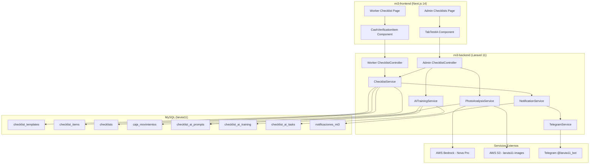
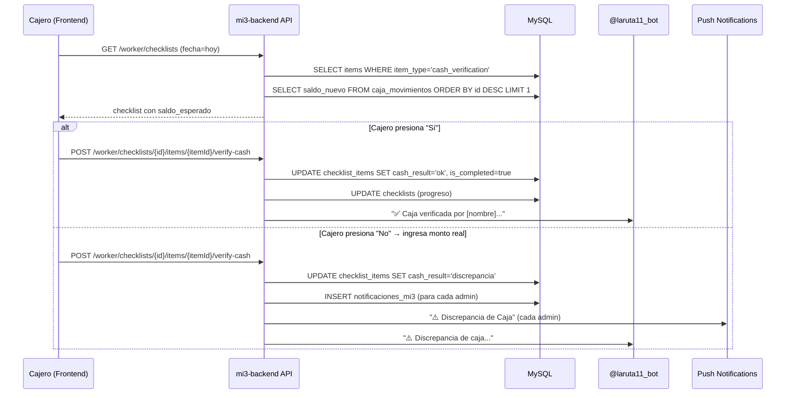

# Diseño Técnico — Verificación de Efectivo en Checklist + Test IA + Training

## Visión General

Este diseño cubre tres subsistemas interconectados dentro del ecosistema mi3/caja3:

1. **Verificación de Caja Interactiva**: Nuevo tipo de ítem `cash_verification` en checklists que consulta `caja_movimientos.saldo_nuevo`, presenta UI interactiva al cajero, y notifica vía `@laruta11_bot` + push notifications.
2. **Tab "Test IA"**: Nueva pestaña en `/admin/checklists` para revisar evaluaciones de fotos, dar feedback, probar prompts con fotos reales/legacy, y ver resumen de tareas IA.
3. **Sistema de Training + Prompts Dinámicos**: Feedback loop donde correcciones del admin se inyectan en prompts, prompts se almacenan en BD (no hardcodeados), y se auto-generan candidatos mejorados.

### Decisiones de Diseño Clave

- **Misma BD MySQL `laruta11`**: Las 3 tablas nuevas (`checklist_ai_prompts`, `checklist_ai_training`, `checklist_ai_tasks`) viven en la misma BD compartida entre mi3 y caja3.
- **TelegramService refactorizado**: Se extiende para soportar múltiples bots (SuperKiro + laruta11_bot) vía config, sin romper el servicio existente.
- **PhotoAnalysisService refactorizado**: Se cambia de constante `PROMPTS` hardcodeada a lectura desde `checklist_ai_prompts` con fallback a constante.
- **Campos nuevos en tablas existentes**: `item_type` en `checklist_templates` y `checklist_items`, campos `cash_*` en `checklist_items`.
- **Frontend**: Componente `CashVerificationItem` en React para la UI interactiva del cajero, nueva tab `TabTestIA` en la página admin.

---

## Arquitectura



### Flujo de Verificación de Caja



---

## Componentes e Interfaces

### 1. Nuevas Rutas API (Backend)

#### Worker Routes (autenticado)
```
POST /api/v1/worker/checklists/{id}/items/{itemId}/verify-cash
  Body: { confirmed: bool, actual_amount?: number }
  Response: { success: true, data: { item, checklist } }
```

#### Admin Routes (admin)
```
GET  /api/v1/admin/checklists/ai-photos
  Query: contexto?, page?, per_page?
  Response: { data: [...photos], meta: { total, per_page } }

POST /api/v1/admin/checklists/ai-feedback
  Body: { training_id: int, feedback: 'correct'|'incorrect', admin_notes?: string, admin_score?: int }

POST /api/v1/admin/checklists/ai-test
  Body: FormData { photo?: File, photo_url?: string, contexto: string }
  Response: { score, observations, prompt_used }

GET  /api/v1/admin/checklists/ai-prompts
  Response: { data: [...prompts con stats] }

PUT  /api/v1/admin/checklists/ai-prompts/{id}
  Body: { prompt_base: string }

POST /api/v1/admin/checklists/ai-prompts/{id}/activate
POST /api/v1/admin/checklists/ai-prompts/{id}/generate-candidate

GET  /api/v1/admin/checklists/ai-tasks
  Query: contexto?, status?
  Response: { data: [...tasks], summary: { activos, mejorados, escalados } }
```

### 2. Servicios Backend

#### TelegramService (refactorizado)

```php
class TelegramService
{
    // Nuevo: soporte multi-bot
    public function send(string $message, string $bot = 'default'): bool;
    public function sendToLaruta11(string $message): bool; // shortcut
}
```

Config en `config/services.php`:
```php
'telegram' => [
    'token' => env('TELEGRAM_TOKEN', ''),           // SuperKiro_bot
    'chat_id' => env('TELEGRAM_CHAT_ID', ''),
    'laruta11_token' => env('TELEGRAM_LARUTA11_TOKEN', ''),  // @laruta11_bot
    'laruta11_chat_id' => env('TELEGRAM_LARUTA11_CHAT_ID', ''), // Grupo Pedidos 11
],
```

#### AITrainingService (nuevo)

```php
class AITrainingService
{
    public function registrarEvaluacion(ChecklistItem $item, string $contexto, string $promptUsed): ChecklistAiTraining;
    public function registrarFeedback(int $trainingId, string $feedback, ?string $notes, ?int $adminScore): void;
    public function getCorreccionesPrevias(string $contexto, int $limit = 5): Collection;
    public function calcularPrecision(string $contexto): float;
    public function generarPromptCandidato(string $contexto): ChecklistAiPrompt;
    public function getResumenTareas(string $contexto = null): array;
}
```

#### PhotoAnalysisService (refactorizado)

```php
class PhotoAnalysisService
{
    // Cambia de PROMPTS constante a lectura desde BD
    public function getPromptForContext(string $contexto): string;
    // Nuevo: inyecta correcciones previas y tareas pendientes al prompt
    public function buildEnhancedPrompt(string $contexto): string;
    // Nuevo: registra tarea si score < 70
    public function registrarTareasSiNecesario(ChecklistItem $item, int $score, string $observations, string $contexto): void;
}
```

### 3. Componentes Frontend

#### CashVerificationItem (Worker)
- Muestra tarjeta con "¿En caja hay $X?"
- Botones "Sí" / "No"
- Al presionar "No": input numérico + cálculo de discrepancia en tiempo real
- Botón "Confirmar" que llama a `verify-cash`

#### TabTestIA (Admin)
- Lista de fotos con thumbnails, scores, feedback buttons
- Selector de contexto (dropdown)
- Sección "Probar prompt" con upload + selector de foto existente
- Panel de prompts por contexto con stats (versión, precisión, correcciones)
- Resumen de tareas IA (activos/mejorados/escalados)

---

## Modelos de Datos

### Cambios en Tablas Existentes

#### `checklist_templates` — agregar columna
```sql
ALTER TABLE checklist_templates
ADD COLUMN item_type ENUM('standard', 'cash_verification') NOT NULL DEFAULT 'standard' AFTER description;
```

#### `checklist_items` — agregar columnas
```sql
ALTER TABLE checklist_items
ADD COLUMN item_type ENUM('standard', 'cash_verification') NOT NULL DEFAULT 'standard' AFTER description,
ADD COLUMN cash_expected DECIMAL(10,2) NULL AFTER item_type,
ADD COLUMN cash_actual DECIMAL(10,2) NULL AFTER cash_expected,
ADD COLUMN cash_difference DECIMAL(10,2) NULL AFTER cash_actual,
ADD COLUMN cash_result ENUM('ok', 'discrepancia') NULL AFTER cash_difference;
```

### Tablas Nuevas

#### `checklist_ai_prompts`
```sql
CREATE TABLE checklist_ai_prompts (
    id INT AUTO_INCREMENT PRIMARY KEY,
    contexto VARCHAR(100) NOT NULL,
    prompt_base TEXT NOT NULL,
    prompt_version INT NOT NULL DEFAULT 1,
    is_active TINYINT(1) NOT NULL DEFAULT 1,
    created_at TIMESTAMP DEFAULT CURRENT_TIMESTAMP,
    updated_at TIMESTAMP DEFAULT CURRENT_TIMESTAMP ON UPDATE CURRENT_TIMESTAMP,
    INDEX idx_contexto_active (contexto, is_active)
) ENGINE=InnoDB DEFAULT CHARSET=utf8mb4;
```

#### `checklist_ai_training`
```sql
CREATE TABLE checklist_ai_training (
    id INT AUTO_INCREMENT PRIMARY KEY,
    checklist_item_id INT NULL,
    photo_url VARCHAR(500) NOT NULL,
    contexto VARCHAR(100) NOT NULL,
    ai_score INT NULL,
    ai_observations TEXT NULL,
    admin_feedback ENUM('correct', 'incorrect') NULL,
    admin_notes TEXT NULL,
    admin_score INT NULL,
    prompt_used TEXT NULL,
    created_at TIMESTAMP DEFAULT CURRENT_TIMESTAMP,
    INDEX idx_contexto (contexto),
    INDEX idx_feedback (admin_feedback),
    INDEX idx_contexto_feedback (contexto, admin_feedback)
) ENGINE=InnoDB DEFAULT CHARSET=utf8mb4;
```

#### `checklist_ai_tasks`
```sql
CREATE TABLE checklist_ai_tasks (
    id INT AUTO_INCREMENT PRIMARY KEY,
    contexto VARCHAR(100) NOT NULL,
    problema_detectado TEXT NOT NULL,
    foto_url_origen VARCHAR(500) NOT NULL,
    checklist_item_id_origen INT NOT NULL,
    foto_url_mejora VARCHAR(500) NULL,
    status ENUM('pendiente', 'mejorado', 'no_mejorado', 'escalado') NOT NULL DEFAULT 'pendiente',
    veces_detectado INT NOT NULL DEFAULT 1,
    created_at TIMESTAMP DEFAULT CURRENT_TIMESTAMP,
    updated_at TIMESTAMP DEFAULT CURRENT_TIMESTAMP ON UPDATE CURRENT_TIMESTAMP,
    INDEX idx_contexto_status (contexto, status)
) ENGINE=InnoDB DEFAULT CHARSET=utf8mb4;
```

### Modelos Eloquent Nuevos

```php
// ChecklistAiPrompt
class ChecklistAiPrompt extends Model {
    protected $table = 'checklist_ai_prompts';
    protected $fillable = ['contexto', 'prompt_base', 'prompt_version', 'is_active'];
    protected $casts = ['is_active' => 'boolean'];
}

// ChecklistAiTraining
class ChecklistAiTraining extends Model {
    protected $table = 'checklist_ai_training';
    const UPDATED_AT = null;
    protected $fillable = [
        'checklist_item_id', 'photo_url', 'contexto',
        'ai_score', 'ai_observations', 'admin_feedback',
        'admin_notes', 'admin_score', 'prompt_used',
    ];
}

// ChecklistAiTask
class ChecklistAiTask extends Model {
    protected $table = 'checklist_ai_tasks';
    protected $fillable = [
        'contexto', 'problema_detectado', 'foto_url_origen',
        'checklist_item_id_origen', 'foto_url_mejora',
        'status', 'veces_detectado',
    ];
}
```

### Cambios en Modelos Existentes

```php
// ChecklistTemplate — agregar item_type a fillable y casts
'item_type' // agregar a $fillable

// ChecklistItem — agregar campos cash_* a fillable y casts
'item_type', 'cash_expected', 'cash_actual', 'cash_difference', 'cash_result'
// agregar a $fillable

// Checklist — sin cambios estructurales
```


---

## Propiedades de Correctitud

*Una propiedad es una característica o comportamiento que debe mantenerse verdadero en todas las ejecuciones válidas de un sistema — esencialmente, una declaración formal sobre lo que el sistema debe hacer. Las propiedades sirven como puente entre especificaciones legibles por humanos y garantías de correctitud verificables por máquina.*

### Propiedad 1: Herencia de item_type desde plantilla a ítem

*Para cualquier* plantilla de checklist con `item_type` definido (standard o cash_verification), cuando se crea un checklist diario, el ítem resultante en `checklist_items` debe tener el mismo valor de `item_type` que la plantilla origen.

**Valida: Requisito 1.2**

### Propiedad 2: Persistencia correcta de verificación de caja

*Para cualquier* verificación de caja completada (ya sea confirmación "ok" o reporte de discrepancia), el sistema debe: (a) establecer `is_completed = true` y `completed_at` con timestamp válido, (b) si resultado es "ok": `cash_actual` debe ser igual a `cash_expected` y `cash_result = 'ok'`, (c) si resultado es "discrepancia": `cash_difference` debe ser igual a `cash_actual - cash_expected` y `cash_result = 'discrepancia'`.

**Valida: Requisitos 4.1, 4.3, 5.1, 5.2**

### Propiedad 3: Cálculo correcto de discrepancia

*Para cualquier* par de montos (esperado, real) donde ambos son números no negativos, la discrepancia calculada debe ser `real - esperado`, y la clasificación debe ser "sobrante" si la diferencia es positiva, "faltante" si es negativa, y "ok" si es cero.

**Valida: Requisito 3.4**

### Propiedad 4: Formato de mensaje Telegram según resultado

*Para cualquier* verificación de caja con datos válidos (nombre cajero, saldo esperado, monto real, tipo checklist, fecha), el mensaje Telegram generado debe: (a) para resultado "ok": contener "✅ Caja verificada por [nombre]", el saldo formateado, el tipo de checklist y la fecha, (b) para resultado "discrepancia": contener "⚠️ Discrepancia de caja", nombre, esperado, real, diferencia con clasificación sobrante/faltante, tipo y fecha.

**Valida: Requisitos 4.2, 5.5**

### Propiedad 5: Cálculo de progreso del checklist

*Para cualquier* checklist con N ítems totales donde M están completados, `completion_percentage` debe ser igual a `round((M / N) * 100, 2)` y `completed_items` debe ser igual a M.

**Valida: Requisito 7.1**

### Propiedad 6: Ítem cash_verification obligatorio bloquea completar checklist

*Para cualquier* checklist que contenga un ítem de tipo `cash_verification` no completado, intentar marcar el checklist como completado debe ser rechazado.

**Valida: Requisito 7.3**

### Propiedad 7: Inyección de correcciones previas en prompt

*Para cualquier* contexto con N correcciones del admin (N > 0), el prompt mejorado debe contener un bloque "ANTECEDENTES DE CORRECCIONES PREVIAS" con exactamente `min(N, 5)` correcciones, cada una incluyendo la observación original de la IA y la corrección del admin.

**Valida: Requisito 9.3**

### Propiedad 8: Cálculo de precisión por contexto

*Para cualquier* conjunto de evaluaciones con feedback para un contexto dado, la precisión debe ser `(correctas / total_con_feedback) * 100`, y el contexto debe marcarse como "necesita revisión" si y solo si la precisión es menor a 70%.

**Valida: Requisito 9.4**

### Propiedad 9: Creación de tarea IA en detección de problemas

*Para cualquier* resultado de análisis de foto, si el score es menor a 70 O las observaciones contienen "⚠️" o "🚨", debe crearse una tarea en `checklist_ai_tasks` con status "pendiente". Si el score es >= 70 y no hay emojis de alerta, no debe crearse tarea.

**Valida: Requisito 10.1**

### Propiedad 10: Inyección de tareas pendientes en prompt de seguimiento

*Para cualquier* contexto con tareas pendientes (status = 'pendiente' o 'no_mejorado'), el prompt para la siguiente evaluación del mismo contexto debe contener la lista de problemas detectados previamente con instrucción de verificar si fueron corregidos.

**Valida: Requisito 10.2**

### Propiedad 11: Escalamiento por problema recurrente

*Para cualquier* tarea IA con `veces_detectado`, cuando `veces_detectado` alcanza 3 o más, el status debe cambiar a "escalado" y deben generarse notificaciones (push + Telegram). Si `veces_detectado < 3`, no debe escalarse.

**Valida: Requisito 10.4**

### Propiedad 12: Versionamiento de prompts

*Para cualquier* edición de prompt en un contexto dado, debe crearse una nueva versión con `prompt_version` incrementado en 1, la versión anterior debe tener `is_active = false`, y la nueva versión debe tener `is_active = true`. En todo momento, debe existir exactamente una versión activa por contexto.

**Valida: Requisito 11.4**

### Propiedad 13: Generación automática de prompt candidato

*Para cualquier* contexto con N correcciones acumuladas (feedback = 'incorrect'), cuando N alcanza 10 o más, debe generarse un prompt candidato con `is_active = false`. Si N < 10, no debe generarse candidato automáticamente.

**Valida: Requisito 11.6**

---

## Manejo de Errores

| Escenario | Comportamiento |
|---|---|
| `caja_movimientos` vacía | Retornar saldo_esperado = 0 (Req 2.2) |
| Telegram falla al enviar | Log warning, no bloquear la operación (best-effort) |
| Push notification falla | Log warning, no bloquear (best-effort, patrón existente) |
| AWS Bedrock timeout/error | Log error, marcar ai_observations como "pendiente" (patrón existente en PhotoAnalysisService) |
| Prompt no encontrado en BD | Fallback a constante PROMPTS hardcodeada (backward compatibility) |
| Foto legacy no accesible en S3 | Retornar error 502 con mensaje descriptivo |
| Admin intenta activar prompt candidato inexistente | Retornar 404 |
| Doble confirmación de verificación de caja | Idempotente: si ya está completado, retornar estado actual sin modificar |
| Monto real negativo o no numérico | Validación en request: `actual_amount` debe ser `numeric|min:0` |

---

## Estrategia de Testing

### Tests Unitarios (PHPUnit)

- **ChecklistService**: Verificar que `crearChecklistsDiarios` copia `item_type` correctamente.
- **CashVerificationService**: Verificar flujo completo de confirmación y discrepancia.
- **AITrainingService**: Verificar cálculo de precisión, generación de candidatos, inyección de correcciones.
- **PhotoAnalysisService**: Verificar `buildEnhancedPrompt` con correcciones y tareas pendientes.
- **TelegramService**: Verificar formato de mensajes para ambos escenarios (ok/discrepancia).
- **Prompt versioning**: Verificar que editar prompt crea nueva versión y desactiva anterior.

### Tests de Propiedades (PBT)

Se usará **PHPUnit** con generación de datos aleatorios (custom generators con `Faker`) para las 13 propiedades definidas. Cada test ejecutará mínimo 100 iteraciones.

Configuración:
- Librería: PHPUnit + Faker para generación de inputs
- Mínimo 100 iteraciones por propiedad
- Tag format: `Feature: checklist-cash-verification, Property {N}: {título}`

Propiedades prioritarias para PBT:
- Propiedad 2 (persistencia de verificación) — genera pares (expected, actual) aleatorios
- Propiedad 3 (cálculo de discrepancia) — función pura, ideal para PBT
- Propiedad 5 (progreso de checklist) — genera checklists con N ítems aleatorios
- Propiedad 8 (precisión por contexto) — genera conjuntos de feedback aleatorios
- Propiedad 9 (creación de tareas) — genera scores y observaciones aleatorios
- Propiedad 12 (versionamiento) — genera secuencias de ediciones aleatorias

### Tests de Integración

- API endpoint `verify-cash`: flujo completo con BD real
- API endpoint `ai-photos`: listado con fotos legacy y actuales
- API endpoint `ai-test`: análisis con Bedrock mockeado
- Migración de prompts: verificar que todos los contextos de `PROMPTS` se insertan en BD
- Notificaciones: verificar que se crean en `notificaciones_mi3` y se envían push

### Tests Frontend (Jest/React Testing Library)

- `CashVerificationItem`: renderizado correcto, interacción Sí/No, input numérico, cálculo de discrepancia
- `TabTestIA`: renderizado de tabs, filtro por contexto, feedback buttons
