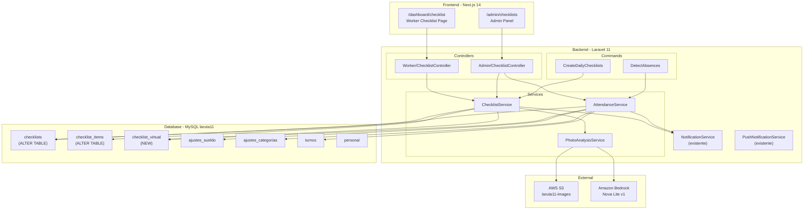
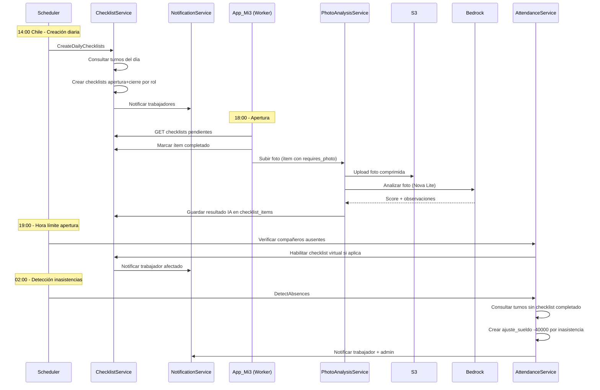
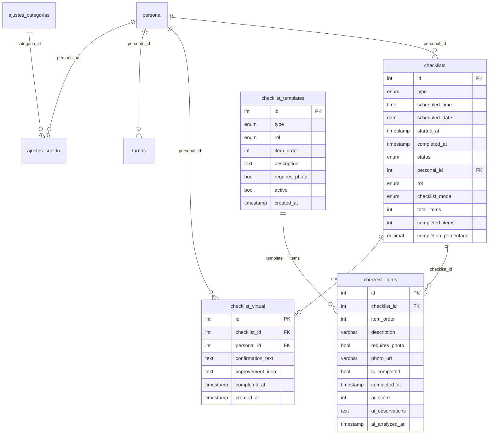

# Documento de Diseño — Checklist v2 + Asistencia

## Resumen

Este diseño describe la migración y rediseño del sistema de checklists operacionales desde caja3 (PHP plano) hacia mi3 (Laravel 11 + Next.js 14). El sistema actual tiene 22 ítems genéricos sin separación por rol; el nuevo sistema reduce a 11 ítems, separa por rol (cajero/planchero), incorpora análisis de fotos con IA (Amazon Nova Lite vía Bedrock), vincula la asistencia al completado de checklists, y automatiza descuentos por inasistencia ($40.000 CLP). Se introduce un checklist virtual para trabajadores cuyo compañero de turno no asistió.

### Decisiones clave de diseño

1. **Reutilizar tablas existentes** (`checklists`, `checklist_items`) con ALTER TABLE en vez de recrear, preservando datos históricos.
2. **Templates administrables desde el admin de mi3** — los ítems de checklist se almacenan en una tabla `checklist_templates` que el admin puede gestionar desde `/admin/checklists`. Se pre-cargan con los 11 ítems iniciales via seed.
3. **Análisis de IA asíncrono-tolerante** — si Bedrock no responde en 15s, el checklist continúa y el análisis queda como "pendiente".
4. **Asistencia derivada** — no hay tabla de asistencia separada; se determina consultando checklists completados + checklist virtual.
5. **Checklist virtual como tabla separada** (`checklist_virtual`) para mantener la idea de mejora y la confirmación del trabajador.

---

## Arquitectura

### Diagrama de componentes



### Flujo de datos principal



---

## Componentes e Interfaces

### 1. ChecklistService

Servicio central que gestiona la creación, consulta y completado de checklists.

```php
namespace App\Services\Checklist;

class ChecklistService
{
    /**
     * Templates are loaded from the `checklist_templates` table, managed by admin via /admin/checklists.
     * The admin can add, edit, reorder, and toggle active/inactive templates per role and type.
     */
    public function getTemplates(string $type, string $rol): Collection;  // From checklist_templates table
    public function crearChecklistsDiarios(string $fecha): array;
    public function getChecklistsPendientes(int $personalId, string $fecha): Collection;
    public function marcarItemCompletado(int $itemId, int $personalId): array;
    public function completarChecklist(int $checklistId, int $personalId): Checklist;
    public function habilitarChecklistVirtual(int $personalId, int $checklistId): ChecklistVirtual;
    public function completarChecklistVirtual(int $virtualId, int $personalId, string $ideaMejora): ChecklistVirtual;
    public function getChecklistsAdmin(string $fecha, ?string $status): Collection;
    public function getDetalleChecklist(int $checklistId): array;

    // Template management (admin)
    public function getTemplatesAdmin(): Collection;
    public function crearTemplate(array $data): ChecklistTemplate;
    public function actualizarTemplate(int $id, array $data): ChecklistTemplate;
    public function eliminarTemplate(int $id): void;
    public function reordenarTemplates(array $ids): void;
}
```

### 2. AttendanceService

Servicio que determina asistencia basándose en checklists completados.

```php
namespace App\Services\Checklist;

class AttendanceService
{
    public function detectarAusencias(string $fecha): array;
    public function detectarCompaneroAusente(string $fecha): array;
    public function getResumenAsistenciaMensual(int $personalId, string $mes): array;
    public function getResumenAsistenciaAdmin(string $mes): Collection;
    public function tieneAsistencia(int $personalId, string $fecha): bool;
}
```

### 3. PhotoAnalysisService

Servicio que sube fotos a S3 y las envía a Bedrock para análisis.

```php
namespace App\Services\Checklist;

class PhotoAnalysisService
{
    public function subirYAnalizar(UploadedFile $foto, int $itemId, string $contexto): array;
    public function subirFotoS3(UploadedFile $foto): string;
    public function analizarConIA(string $s3Url, string $contexto): array;
    // contexto: 'interior_apertura', 'exterior_apertura', 'interior_cierre', 'exterior_cierre'
}
```

### 4. Worker/ChecklistController

```
GET    /api/v1/worker/checklists              → Checklists pendientes del día
POST   /api/v1/worker/checklists/{id}/items/{itemId}/complete  → Marcar ítem
POST   /api/v1/worker/checklists/{id}/items/{itemId}/photo     → Subir foto
POST   /api/v1/worker/checklists/{id}/complete                 → Completar checklist
GET    /api/v1/worker/checklists/virtual                       → Checklist virtual disponible
POST   /api/v1/worker/checklists/virtual/{id}/complete         → Completar virtual
```

### 5. Admin/ChecklistController

```
GET    /api/v1/admin/checklists                → Lista checklists (filtro fecha, status)
GET    /api/v1/admin/checklists/{id}           → Detalle checklist + ítems + IA
GET    /api/v1/admin/checklists/attendance      → Resumen asistencia mensual
GET    /api/v1/admin/checklists/ideas           → Ideas de mejora de virtuales

# Template management
GET    /api/v1/admin/checklists/templates       → Lista templates por tipo y rol
POST   /api/v1/admin/checklists/templates       → Crear template
PUT    /api/v1/admin/checklists/templates/{id}  → Editar template
DELETE /api/v1/admin/checklists/templates/{id}  → Eliminar template (soft: active=0)
PUT    /api/v1/admin/checklists/templates/reorder → Reordenar templates
```

### 6. Artisan Commands

```
mi3:create-daily-checklists   → Crea checklists diarios (14:00 Chile)
mi3:detect-absences           → Detecta inasistencias y aplica descuentos (02:00 Chile)
mi3:check-companion-absence   → Detecta compañero ausente y habilita virtual (19:00 Chile)
```

### 7. Frontend Pages

| Ruta | Componente | Descripción |
|------|-----------|-------------|
| `/dashboard/checklist` | `WorkerChecklistPage` | Vista del trabajador con checklists pendientes, progreso, subida de fotos |
| `/admin/checklists` | `AdminChecklistPage` | Panel admin con lista de checklists, detalle con IA, asistencia mensual, ideas de mejora |

---

## Modelos de Datos

### Tabla `checklists` (ALTER TABLE — columnas nuevas)

```sql
ALTER TABLE checklists
  ADD COLUMN personal_id INT UNSIGNED NULL AFTER user_name,
  ADD COLUMN rol ENUM('cajero', 'planchero') NULL AFTER personal_id,
  ADD COLUMN checklist_mode ENUM('presencial', 'virtual') DEFAULT 'presencial' AFTER rol,
  ADD INDEX idx_personal_date (personal_id, scheduled_date),
  ADD INDEX idx_rol_date (rol, scheduled_date),
  ADD CONSTRAINT fk_checklists_personal FOREIGN KEY (personal_id) REFERENCES personal(id);
```

Esquema completo resultante:

| Columna | Tipo | Descripción |
|---------|------|-------------|
| id | INT PK AUTO | — |
| type | ENUM('apertura','cierre') | Tipo de checklist |
| scheduled_time | TIME | Hora programada |
| scheduled_date | DATE | Fecha programada |
| started_at | TIMESTAMP NULL | Hora de inicio |
| completed_at | TIMESTAMP NULL | Hora de completado |
| status | ENUM('pending','active','completed','missed') | Estado |
| user_id | INT NULL | (legacy, de caja3) |
| user_name | VARCHAR NULL | (legacy, de caja3) |
| **personal_id** | INT UNSIGNED NULL | FK → personal.id (nuevo) |
| **rol** | ENUM('cajero','planchero') NULL | Rol del trabajador (nuevo) |
| **checklist_mode** | ENUM('presencial','virtual') | Modo (nuevo, default 'presencial') |
| total_items | INT | Total de ítems |
| completed_items | INT | Ítems completados |
| completion_percentage | DECIMAL | Porcentaje completado |
| notes | TEXT NULL | Notas |
| created_at | TIMESTAMP | — |
| updated_at | TIMESTAMP | — |

### Tabla `checklist_items` (ALTER TABLE — columnas nuevas)

```sql
ALTER TABLE checklist_items
  ADD COLUMN ai_score INT NULL AFTER notes,
  ADD COLUMN ai_observations TEXT NULL AFTER ai_score,
  ADD COLUMN ai_analyzed_at TIMESTAMP NULL AFTER ai_observations;
```

Esquema completo resultante:

| Columna | Tipo | Descripción |
|---------|------|-------------|
| id | INT PK AUTO | — |
| checklist_id | INT FK | FK → checklists.id |
| item_order | INT | Orden del ítem |
| description | VARCHAR | Descripción del ítem |
| requires_photo | TINYINT(1) | ¿Requiere foto? |
| photo_url | VARCHAR NULL | URL de la foto en S3 |
| is_completed | TINYINT(1) | ¿Completado? |
| completed_at | TIMESTAMP NULL | Hora de completado |
| notes | TEXT NULL | Notas del ítem |
| **ai_score** | INT NULL | Puntaje IA 0-100 (nuevo) |
| **ai_observations** | TEXT NULL | Observaciones IA (nuevo) |
| **ai_analyzed_at** | TIMESTAMP NULL | Timestamp análisis IA (nuevo) |

### Tabla `checklist_virtual` (NUEVA)

```sql
CREATE TABLE checklist_virtual (
    id INT UNSIGNED AUTO_INCREMENT PRIMARY KEY,
    checklist_id INT UNSIGNED NOT NULL,
    personal_id INT UNSIGNED NOT NULL,
    confirmation_text TEXT NULL,
    improvement_idea TEXT NOT NULL,
    completed_at TIMESTAMP NULL,
    created_at TIMESTAMP DEFAULT CURRENT_TIMESTAMP,
    INDEX idx_personal_date (personal_id),
    INDEX idx_checklist (checklist_id),
    CONSTRAINT fk_cv_checklist FOREIGN KEY (checklist_id) REFERENCES checklists(id),
    CONSTRAINT fk_cv_personal FOREIGN KEY (personal_id) REFERENCES personal(id)
);
```

| Columna | Tipo | Descripción |
|---------|------|-------------|
| id | INT PK AUTO | — |
| checklist_id | INT FK | FK → checklists.id (checklist del compañero ausente) |
| personal_id | INT FK | FK → personal.id (trabajador que completa el virtual) |
| confirmation_text | TEXT NULL | Texto de confirmación mostrado |
| improvement_idea | TEXT NOT NULL | Idea de mejora (mín. 20 caracteres) |
| completed_at | TIMESTAMP NULL | Hora de completado |
| created_at | TIMESTAMP | — |

### Modelos Eloquent nuevos

```php
// App\Models\Checklist (nuevo modelo, tabla existente)
class Checklist extends Model {
    protected $table = 'checklists';
    // relaciones: items(), personal(), virtual()
}

// App\Models\ChecklistItem (nuevo modelo, tabla existente)
class ChecklistItem extends Model {
    protected $table = 'checklist_items';
    public $timestamps = false;
    // relaciones: checklist()
}

// App\Models\ChecklistVirtual (nuevo modelo, tabla nueva)
class ChecklistVirtual extends Model {
    protected $table = 'checklist_virtual';
    public $timestamps = false;
    // relaciones: checklist(), personal()
}
```

### Tabla `checklist_templates` (EXISTENTE — ALTER TABLE para agregar rol)

La tabla ya existe en BD con los 22 ítems actuales. Se agrega columna `rol` para separar por cajero/planchero.

```sql
ALTER TABLE checklist_templates
  ADD COLUMN rol ENUM('cajero', 'planchero') NULL AFTER type,
  ADD INDEX idx_type_rol (type, rol);
```

Esquema resultante:

| Columna | Tipo | Descripción |
|---------|------|-------------|
| id | INT PK AUTO | — |
| type | ENUM('apertura','cierre') | Tipo de checklist |
| **rol** | ENUM('cajero','planchero') NULL | Rol asignado (nuevo) |
| item_order | INT | Orden del ítem |
| description | TEXT | Descripción del ítem |
| requires_photo | TINYINT(1) | ¿Requiere foto? |
| active | TINYINT(1) | ¿Activo? |
| created_at | TIMESTAMP | — |

El admin gestiona estos templates desde `/admin/checklists` en mi3. Al crear checklists diarios, se leen los templates activos filtrados por tipo y rol.

### Categoría de ajuste nueva

```sql
INSERT INTO ajustes_categorias (nombre, slug, icono, signo_defecto)
VALUES ('Inasistencia', 'inasistencia', '❌', '-');
```

### Diagrama ER




---

## Propiedades de Correctitud

*Una propiedad es una característica o comportamiento que debe mantenerse verdadero en todas las ejecuciones válidas de un sistema — esencialmente, una declaración formal sobre lo que el sistema debe hacer. Las propiedades sirven como puente entre especificaciones legibles por humanos y garantías de correctitud verificables por máquina.*

### Propiedad 1: Creación de checklists corresponde a turnos asignados

*Para cualquier* conjunto de trabajadores y fecha dada, el sistema debe crear checklists (apertura + cierre) si y solo si el trabajador tiene un turno asignado en esa fecha. Cada checklist creado debe tener el rol correcto (cajero/planchero) y el personal_id correspondiente.

**Valida: Requerimientos 1.1, 1.7**

### Propiedad 2: Creación idempotente de checklists

*Para cualquier* fecha y configuración de turnos, ejecutar la creación diaria de checklists dos veces debe producir exactamente el mismo resultado que ejecutarla una vez — sin duplicados y sin errores.

**Valida: Requerimiento 1.6**

### Propiedad 3: Filtrado de checklists por rol del trabajador

*Para cualquier* trabajador con un rol dado y cualquier conjunto de checklists existentes, la consulta de checklists pendientes debe retornar únicamente checklists cuyo rol coincida con el del trabajador.

**Valida: Requerimiento 2.1**

### Propiedad 4: Progreso y completado de checklist

*Para cualquier* checklist con N ítems donde K ítems están completados, el porcentaje de completado debe ser exactamente (K/N)*100, y el estado debe ser 'completed' si y solo si K = N.

**Valida: Requerimientos 2.2, 2.3**

### Propiedad 5: Validación de foto obligatoria

*Para cualquier* ítem de checklist donde requires_photo es true, el sistema debe rechazar el marcado como completado si photo_url es null. Si photo_url tiene un valor válido, el marcado debe ser aceptado.

**Valida: Requerimiento 2.6**

### Propiedad 6: Selección de prompt IA según contexto

*Para cualquier* combinación de tipo de foto (interior/exterior) y tipo de checklist (apertura/cierre), el servicio de análisis debe seleccionar el prompt correcto correspondiente a ese contexto.

**Valida: Requerimiento 3.2**

### Propiedad 7: Determinación de asistencia por completado de checklist

*Para cualquier* trabajador con turno asignado (titular o reemplazante) en una fecha dada: si completó al menos el checklist de apertura (presencial o virtual), debe ser considerado presente sin descuento. Si no completó ningún checklist (ni presencial ni virtual), debe ser marcado como ausente con un ajuste de -40.000 en categoría "inasistencia".

**Valida: Requerimientos 4.1, 4.2, 4.3, 4.4, 4.5, 5.5**

### Propiedad 8: Detección de compañero ausente y habilitación de checklist virtual

*Para cualquier* par de turno (1 cajero + 1 planchero en la misma fecha), si exactamente uno de los dos no inició su checklist de apertura antes de la hora límite, el sistema debe habilitar un checklist virtual para el compañero presente. Si ambos están ausentes, no se debe habilitar checklist virtual para ninguno.

**Valida: Requerimientos 5.1, 6.2, 6.4**

### Propiedad 9: Validación de idea de mejora en checklist virtual

*Para cualquier* string de idea de mejora, el sistema debe rechazar la completación del checklist virtual si el string tiene menos de 20 caracteres, y aceptarla si tiene 20 o más caracteres.

**Valida: Requerimiento 5.3**

### Propiedad 10: Correctitud del resumen mensual de asistencia

*Para cualquier* trabajador y mes dado, el resumen de asistencia debe cumplir: días_trabajados + inasistencias = total_turnos_asignados, y monto_total_descuentos = inasistencias × 40.000.

**Valida: Requerimiento 7.3**

### Propiedad 11: Filtrado por fecha retorna solo checklists correspondientes

*Para cualquier* fecha de filtro y conjunto de checklists existentes en múltiples fechas, la consulta filtrada debe retornar únicamente checklists cuya scheduled_date coincida con la fecha solicitada.

**Valida: Requerimiento 7.4**

### Propiedad 12: Ideas de mejora ordenadas por fecha descendente

*Para cualquier* conjunto de checklists virtuales completados, la consulta de ideas de mejora debe retornarlas ordenadas por fecha de completado en orden descendente.

**Valida: Requerimiento 7.5**

---

## Manejo de Errores

| Escenario | Comportamiento | Código HTTP |
|-----------|---------------|-------------|
| Bedrock timeout (>15s) | Registrar timeout, marcar análisis como pendiente, permitir continuar | 200 (parcial) |
| S3 upload falla | Retornar error, permitir reintento | 502 |
| Trabajador sin turno intenta acceder a checklist | Retornar lista vacía con mensaje | 200 |
| Ítem con foto requerida sin foto | Rechazar completado | 422 |
| Idea de mejora < 20 caracteres | Rechazar completado virtual | 422 |
| Checklist ya completado, intento de re-completar | Ignorar, retornar estado actual | 200 |
| Creación duplicada de checklist (mismo rol/tipo/fecha) | Omitir sin error | 200 |
| Worker intenta completar checklist de otro worker | Rechazar | 403 |
| Turno sin par (solo cajero o solo planchero) | No habilitar virtual, procesar normalmente | — |
| Error al crear ajuste_sueldo | Log error, continuar con siguiente trabajador | — |

### Estrategia de reintentos

- **S3 upload**: El frontend permite reintento manual (botón "Reintentar").
- **Bedrock análisis**: No se reintenta automáticamente. El admin puede ver ítems con análisis pendiente en el panel.
- **Notificaciones push**: Best-effort (patrón existente en NotificationService). Si falla, no bloquea el flujo.
- **Detección de inasistencias**: Cada trabajador se procesa en su propia transacción (patrón de LoanService). Si uno falla, los demás continúan.

---

## Estrategia de Testing

### Tests unitarios (PHPUnit)

Tests de ejemplo y edge cases para verificar comportamientos específicos:

- Templates de checklist: verificar que cada combinación (tipo, rol) produce los ítems correctos con las descripciones exactas (Req 1.2-1.5)
- Texto de confirmación del checklist virtual (Req 5.2)
- Definición de par de turno (Req 6.1)
- Creación de categoría "inasistencia" en migración (Req 8.4)
- Navegación incluye ítems correctos (Req 9.1, 9.3)
- Integración con NotificationService (mock) durante creación diaria, habilitación virtual, y detección de inasistencias (Req 10.1-10.4)
- Edge cases: timeout de Bedrock, fallo de S3, turno sin par

### Tests de propiedad (PHPUnit + custom generators)

Cada propiedad del documento de diseño se implementa como un test de propiedad con mínimo 100 iteraciones:

- **Librería**: PHPUnit con generadores custom (no existe fast-check nativo en PHP, se implementan generators simples con `random_int`, `Faker`, y loops)
- **Configuración**: Mínimo 100 iteraciones por propiedad
- **Tag**: Cada test incluye un comentario `// Feature: checklist-v2-asistencia, Property N: {título}`

Propiedades a implementar:
1. Creación corresponde a turnos (P1)
2. Idempotencia de creación (P2)
3. Filtrado por rol (P3)
4. Progreso y completado (P4)
5. Validación de foto (P5)
6. Selección de prompt IA (P6)
7. Determinación de asistencia (P7)
8. Detección de compañero ausente (P8)
9. Validación de idea de mejora (P9)
10. Resumen mensual (P10)
11. Filtrado por fecha (P11)
12. Ordenamiento de ideas (P12)

### Tests de integración

- Upload a S3 (mock del SDK)
- Llamada a Bedrock (mock del SDK)
- Endpoints de API completos (worker y admin)
- Scheduler ejecuta comandos correctamente

### Tests de frontend (Jest/Testing Library)

- Renderizado de checklist con progreso
- Subida de foto y manejo de errores
- Formulario de checklist virtual con validación
- Panel admin con filtros y detalle
- Badge de navegación con checklists pendientes
