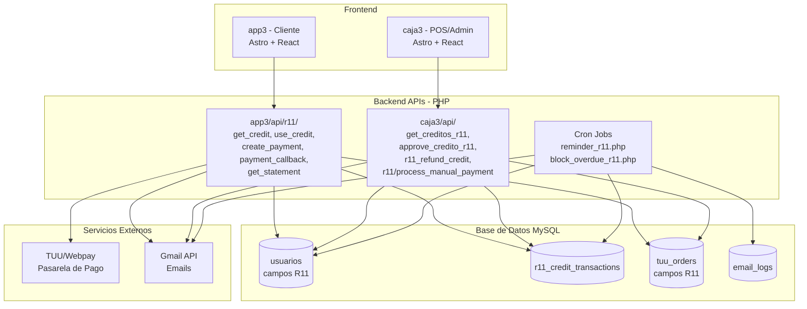
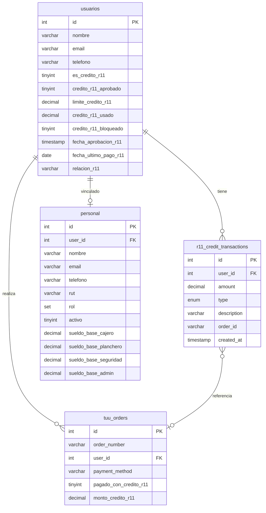
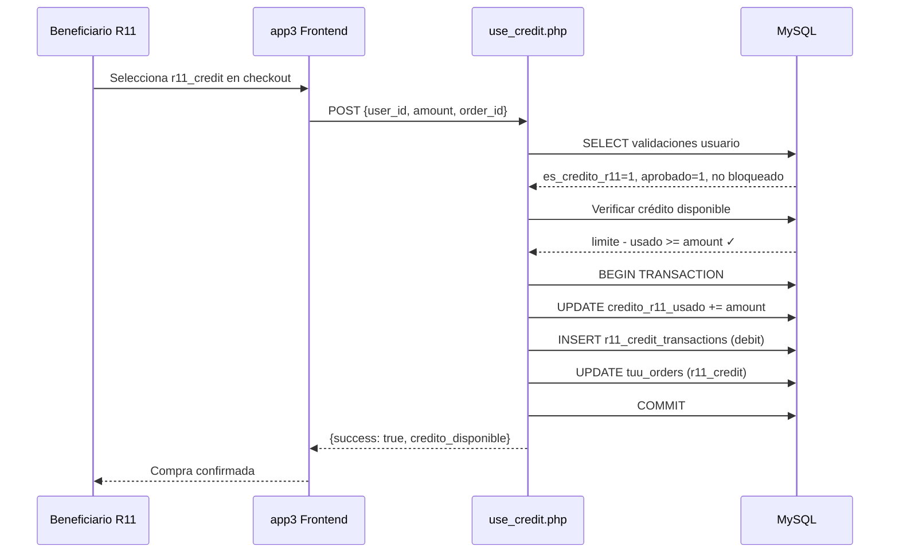
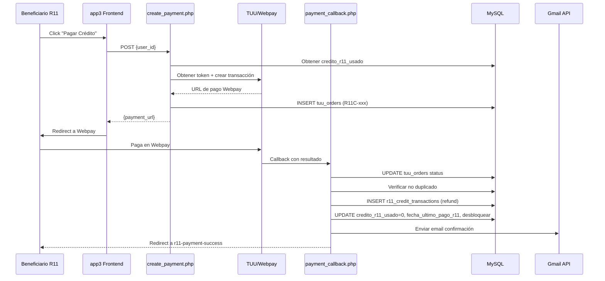
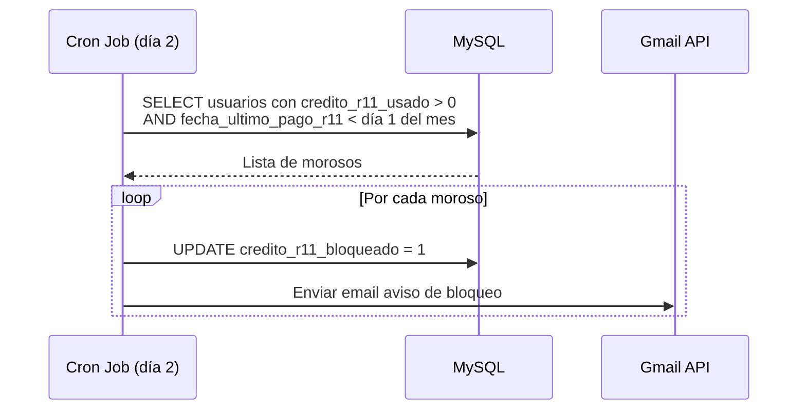

# Diseño — Crédito R11

## Resumen

El sistema de Crédito R11 replica la arquitectura del sistema RL6 existente (crédito para militares) adaptándolo para trabajadores de La Ruta 11 y personas de confianza. La implementación sigue un enfoque de "copiar y adaptar" sobre los archivos PHP existentes, manteniendo la misma estructura de base de datos, flujos de pago TUU/Webpay, y patrones de API.

Las diferencias clave con RL6 son:
- Público objetivo: trabajadores, familiares y personas de confianza (no militares)
- Registro directo por admin (sin formulario público)
- Cobro mensual el día 1 (vs día 21 en RL6)
- Bloqueo automático el día 2 (vs día 22 en RL6)
- Prefijo de orden `R11C-` (vs `RL6-`)
- Campo de relación (`relacion_r11`) en lugar de grado militar

## Arquitectura

El sistema se integra en la arquitectura existente de tres capas:



### Decisiones de Diseño

1. **Replicar estructura RL6**: Se copian los archivos PHP de RL6 y se adaptan los nombres de campos/tablas. Esto minimiza riesgo y tiempo de desarrollo ya que la lógica está probada en producción.

2. **Campos separados en `usuarios`**: Se usan campos independientes (`es_credito_r11`, `credito_r11_usado`, etc.) en lugar de un sistema genérico de créditos. Esto mantiene la independencia total entre RL6 y R11, evitando regresiones.

3. **Tabla de transacciones separada**: `r11_credit_transactions` es independiente de `rl6_credit_transactions` para mantener aislamiento de datos y simplificar consultas.

4. **Reutilización de `tuu_orders`**: Los pagos R11 se registran en la misma tabla `tuu_orders` con campos adicionales (`pagado_con_credito_r11`, `monto_credito_r11`), igual que RL6. Esto permite que el ArqueoApp y reportes existentes funcionen con mínimas modificaciones.

5. **Registro público simplificado**: A diferencia de RL6 (que pide carnet frontal + trasero + selfie + datos militares), R11 solo pide selfie + foto carnet trasero (para escanear RUT vía QR) + selector de rol. El registro también crea/vincula al usuario en la tabla `personal` para mi3 (RRHH). El admin sigue pudiendo registrar directamente desde caja3.

## Componentes e Interfaces

### APIs app3 (Cliente)

| Endpoint | Método | Descripción | Origen RL6 |
|----------|--------|-------------|------------|
| `app3/api/r11/get_credit.php` | GET | Consultar crédito R11 del usuario | `app3/api/rl6/get_credit.php` |
| `app3/api/r11/use_credit.php` | POST | Usar crédito R11 en compra | `app3/api/rl6/use_credit.php` |
| `app3/api/r11/get_statement.php` | GET | Estado de cuenta detallado | `app3/api/rl6/get_statement.php` |
| `app3/api/r11/create_payment.php` | POST | Crear pago TUU/Webpay | `app3/api/rl6/create_payment.php` |
| `app3/api/r11/payment_callback.php` | GET | Callback de pago TUU | `app3/api/rl6/payment_callback.php` |
| `app3/api/r11/register.php` | POST | Registro público de trabajador R11 | `app3/api/rl6/register_militar.php` (simplificado) |

#### `GET /api/r11/get_credit.php`

**Parámetros:** `user_id` (query)

**Respuesta exitosa:**
```json
{
  "success": true,
  "credit": {
    "limite_credito": 50000,
    "credito_usado": 15000,
    "credito_disponible": 35000,
    "relacion_r11": "trabajador",
    "fecha_aprobacion": "2025-04-01 10:00:00"
  },
  "transactions": [
    {
      "id": 1,
      "amount": 5000,
      "type": "debit",
      "description": "Compra orden #ORD-1234",
      "order_id": "ORD-1234",
      "created_at": "2025-04-05 12:30:00"
    }
  ]
}
```

**Validaciones:** `es_credito_r11 = 1` AND `credito_r11_aprobado = 1`

#### `POST /api/r11/use_credit.php`

**Body:**
```json
{
  "user_id": 123,
  "amount": 5000,
  "order_id": "ORD-1234"
}
```

**Flujo:**
1. Validar `es_credito_r11 = 1`, `credito_r11_aprobado = 1`, `credito_r11_bloqueado = 0`
2. Validar `credito_r11_usado + amount <= limite_credito_r11`
3. BEGIN TRANSACTION
4. UPDATE `credito_r11_usado += amount`
5. INSERT `r11_credit_transactions` (type: 'debit')
6. UPDATE `tuu_orders` (pagado_con_credito_r11 = 1, monto_credito_r11, payment_method = 'r11_credit')
7. COMMIT

#### `POST /api/r11/create_payment.php`

**Flujo:** Idéntico a RL6 pero con:
- Prefijo de orden: `R11C-{timestamp}-{random}`
- Descripción: `Pago Crédito R11 - {relacion_r11}`
- URLs de callback/redirect apuntando a rutas R11
- `x_url_callback`: `https://app.laruta11.cl/api/r11/payment_callback.php`
- `x_url_complete`: `https://app.laruta11.cl/r11-payment-pending`
- `x_url_cancel`: `https://app.laruta11.cl/pagar-credito-r11?cancelled=1`

#### `GET /api/r11/payment_callback.php`

**Flujo:** Idéntico a RL6 pero con:
- Validación de prefijo `R11C-`
- Tabla `r11_credit_transactions` para refund
- Campos `credito_r11_usado = 0`, `fecha_ultimo_pago_r11`, `credito_r11_bloqueado = 0`
- Redirect a `r11-payment-success` o `pagar-credito-r11?error=1`

#### `POST /api/r11/register.php` (Registro público)

**Tipo:** multipart/form-data (por upload de selfie)

**Campos del formulario:**
- `user_id` (int, requerido) — ID del usuario logueado en La Ruta 11
- `rut` (string, requerido) — RUT extraído del QR del carnet (ej: `17638433-6`)
- `selfie` (file, requerido) — Foto de rostro
- `rol` (string, requerido) — Selector: 'Planchero/a', 'Cajero/a', 'Rider', 'Otro'

**Nota:** El RUT se extrae en el frontend mediante un lector de QR que escanea el código del carnet chileno. El QR contiene una URL del tipo `https://portal.sidiv.registrocivil.cl/docstatus?RUN=17638433-6&type=CEDULA&serial=...&mrz=...`. El frontend parsea el parámetro `RUN` de esa URL y lo envía como `rut`. No se sube foto del carnet — solo la selfie.

**Flujo:**
1. Validar que el usuario existe en `usuarios` (debe tener cuenta en La Ruta 11)
2. Rate limiting: máximo 5 intentos por IP en 10 minutos
3. Validar formato de RUT chileno
4. Subir selfie a AWS S3 (`carnets-trabajadores/{user_id}_selfie_{timestamp}`)
5. UPDATE `usuarios` SET `es_credito_r11 = 1`, `rut`, `selfie_url`, `relacion_r11 = rol`
6. INSERT o UPDATE en tabla `personal` con datos del usuario (nombre, teléfono, email, rut, rol) para vincular con mi3
7. Enviar notificación Telegram al admin con datos + selfie + RUT + botones de aprobación rápida ($20k, $30k, $50k, Rechazar)

**Respuesta exitosa:**
```json
{
  "success": true,
  "message": "Solicitud enviada. Te contactaremos en 24 horas.",
  "data": {
    "user_id": 123,
    "rut": "17638433-6",
    "selfie_url": "https://...",
    "rol": "Planchero/a"
  }
}
```

**Lector QR en frontend (librería):** `jsQR` v1.4 — decodificación por canvas + `requestAnimationFrame` loop (mismo patrón probado en otro proyecto).

**Implementación del lector QR del carnet chileno:**
```
QRCarnetScanner (componente React en r11.astro)
├── getUserMedia({ facingMode: "environment" })  → cámara trasera
├── requestAnimationFrame loop
│   ├── canvas.drawImage(video)
│   ├── ctx.getImageData()
│   └── jsQR(imageData) → detecta QR
├── Si detecta código:
│   ├── parseCarnetQR(qrText) → extrae RUT
│   ├── Si RUT válido:
│   │   ├── stopCamera()
│   │   ├── Feedback: beep (WebAudio API) + vibración
│   │   ├── Mostrar RUT extraído con ✅
│   │   └── Habilitar siguiente paso del formulario
│   └── Si QR inválido:
│       └── Mostrar error "QR no es de carnet chileno" (seguir escaneando)
├── Botón "Reintentar" para reabrir cámara
└── Fallback: input manual de RUT si cámara no disponible
```

**Parseo del QR del carnet chileno:**
```javascript
// El QR del carnet chileno contiene una URL como:
// https://portal.sidiv.registrocivil.cl/docstatus?RUN=17638433-6&type=CEDULA&serial=536159271&mrz=...
function parseCarnetQR(qrText) {
  try {
    const url = new URL(qrText);
    if (!url.hostname.includes('registrocivil.cl')) return null;
    const rut = url.searchParams.get('RUN');
    if (!rut) return null;
    return { rut, serial: url.searchParams.get('serial'), valid: true };
  } catch {
    return null;
  }
}
```

**UX del scanner:**
- Visor de cámara con overlay de guía (rectángulo punteado "Apunta al QR del carnet")
- Feedback inmediato al detectar: beep via WebAudio API + `navigator.vibrate(200)`
- Si la cámara no está disponible (permisos denegados, desktop): mostrar input manual de RUT como fallback
- El scanner se cierra automáticamente al detectar un QR válido

### APIs caja3 (Admin/POS)

| Endpoint | Método | Descripción | Origen RL6 |
|----------|--------|-------------|------------|
| `caja3/api/get_creditos_r11.php` | GET | Listar beneficiarios R11 | `caja3/api/get_militares_rl6.php` |
| `caja3/api/approve_credito_r11.php` | POST | Aprobar/rechazar crédito | `caja3/api/approve_militar_rl6.php` |
| `caja3/api/r11_refund_credit.php` | POST | Reintegrar crédito por anulación | `caja3/api/rl6_refund_credit.php` |
| `caja3/api/r11/process_manual_payment.php` | POST | Pago manual (efectivo/transferencia) | `caja3/api/rl6/process_manual_payment.php` |
| `caja3/api/register_credito_r11.php` | POST | Registrar nuevo beneficiario | Nuevo (sin equivalente RL6) |

#### `POST /api/register_credito_r11.php` (Nuevo)

**Body:**
```json
{
  "user_id": 123,
  "relacion_r11": "trabajador",
  "limite_credito_r11": 50000,
  "auto_approve": true
}
```

**Flujo alternativo (usuario nuevo):**
```json
{
  "nombre": "Juan Pérez",
  "telefono": "+56912345678",
  "email": "juan@example.com",
  "relacion_r11": "familiar",
  "limite_credito_r11": 30000,
  "auto_approve": true
}
```

Si `user_id` no se provee, se crea el usuario en `usuarios` con los datos básicos y se marca `es_credito_r11 = 1`. Si `auto_approve = true`, se aprueba el crédito en el mismo paso.

### Cron Jobs

| Script | Frecuencia | Descripción |
|--------|-----------|-------------|
| `app3/api/r11/send_reminder.php` | Día 28 de cada mes | Envía recordatorio a deudores R11 + resumen a admin |
| `app3/api/r11/block_overdue.php` | Día 2 de cada mes | Bloquea usuarios con deuda no pagada |

### Páginas Frontend

| Página | App | Descripción |
|--------|-----|-------------|
| `app3/src/pages/r11.astro` | app3 | Registro R11 (selfie + carnet trasero + rol) + Estado de cuenta si ya aprobado |
| `app3/src/pages/pagar-credito-r11.astro` | app3 | Flujo de pago Webpay |
| `app3/src/pages/r11-payment-success.astro` | app3 | Confirmación de pago exitoso |
| `app3/src/pages/r11-payment-pending.astro` | app3 | Pago pendiente de confirmación |
| Vista "Créditos R11" en admin | caja3 | Gestión de beneficiarios R11 |


## Modelos de Datos

### Campos nuevos en tabla `usuarios`

```sql
ALTER TABLE usuarios ADD COLUMN es_credito_r11 TINYINT(1) DEFAULT 0;
ALTER TABLE usuarios ADD COLUMN credito_r11_aprobado TINYINT(1) DEFAULT 0;
ALTER TABLE usuarios ADD COLUMN limite_credito_r11 DECIMAL(10,2) DEFAULT 0.00;
ALTER TABLE usuarios ADD COLUMN credito_r11_usado DECIMAL(10,2) DEFAULT 0.00;
ALTER TABLE usuarios ADD COLUMN credito_r11_bloqueado TINYINT(1) DEFAULT 0;
ALTER TABLE usuarios ADD COLUMN fecha_aprobacion_r11 TIMESTAMP NULL;
ALTER TABLE usuarios ADD COLUMN fecha_ultimo_pago_r11 DATE NULL;
ALTER TABLE usuarios ADD COLUMN relacion_r11 VARCHAR(100) NULL;

-- Índices para performance
ALTER TABLE usuarios ADD INDEX idx_es_credito_r11 (es_credito_r11);
ALTER TABLE usuarios ADD INDEX idx_credito_r11_bloqueado (credito_r11_bloqueado);
```

### Tabla `r11_credit_transactions`

```sql
CREATE TABLE r11_credit_transactions (
    id INT AUTO_INCREMENT PRIMARY KEY,
    user_id INT NOT NULL,
    amount DECIMAL(10,2) NOT NULL,
    type ENUM('credit','debit','refund') NOT NULL,
    description VARCHAR(255),
    order_id VARCHAR(50),
    created_at TIMESTAMP DEFAULT CURRENT_TIMESTAMP,
    INDEX idx_user_id (user_id),
    INDEX idx_created_at (created_at),
    FOREIGN KEY (user_id) REFERENCES usuarios(id)
) ENGINE=InnoDB DEFAULT CHARSET=utf8mb4;
```

**Tipos de transacción:**
- `debit`: Compra con crédito (incrementa `credito_r11_usado`)
- `refund`: Pago recibido o reintegro por anulación (decrementa `credito_r11_usado`)
- `credit`: Ajuste manual de crédito (reservado para uso futuro)

### Campos nuevos en tabla `tuu_orders`

```sql
ALTER TABLE tuu_orders ADD COLUMN pagado_con_credito_r11 TINYINT(1) DEFAULT 0;
ALTER TABLE tuu_orders ADD COLUMN monto_credito_r11 DECIMAL(10,2) DEFAULT 0.00;

-- Agregar r11_credit al ENUM de payment_method
ALTER TABLE tuu_orders MODIFY COLUMN payment_method 
    ENUM('webpay','transfer','card','cash','pedidosya','rl6_credit','r11_credit') DEFAULT 'webpay';

ALTER TABLE tuu_orders ADD INDEX idx_pagado_credito_r11 (pagado_con_credito_r11);
```

### Diagrama Entidad-Relación (campos R11)



### Migración tabla `personal` (existente)

La tabla `personal` ya existe con 10 registros (datos hardcodeados). Se necesitan agregar campos para vincular con `usuarios` y el sistema R11:

```sql
-- Agregar campos de vinculación
ALTER TABLE personal ADD COLUMN user_id INT NULL;
ALTER TABLE personal ADD COLUMN rut VARCHAR(12) NULL;
ALTER TABLE personal ADD COLUMN telefono VARCHAR(20) NULL;

-- Agregar 'rider' al SET de roles
ALTER TABLE personal MODIFY COLUMN rol SET('administrador','cajero','planchero','delivery','seguridad','dueño','rider') NOT NULL DEFAULT 'cajero';

-- Índice para búsqueda por user_id
ALTER TABLE personal ADD INDEX idx_user_id (user_id);
```

Cuando un trabajador se registra vía `/r11`, el sistema crea/actualiza su registro en `personal` con `user_id` vinculado a su cuenta de `usuarios`. Los registros existentes (Camila, Neit, etc.) se vincularán manualmente o cuando cada uno haga el registro R11.

### Flujo de Datos: Compra con Crédito R11



### Flujo de Datos: Pago Mensual vía Webpay



### Flujo de Datos: Bloqueo Automático



## Propiedades de Correctitud

*Una propiedad es una característica o comportamiento que debe mantenerse verdadero en todas las ejecuciones válidas de un sistema — esencialmente, una declaración formal sobre lo que el sistema debe hacer. Las propiedades sirven como puente entre especificaciones legibles por humanos y garantías de correctitud verificables por máquinas.*

### Propiedad 1: Cálculo de crédito disponible

*Para cualquier* usuario con `limite_credito_r11` y `credito_r11_usado` donde `usado <= limite`, el crédito disponible retornado por la API SHALL ser exactamente `limite_credito_r11 - credito_r11_usado`.

**Valida: Requerimientos 2.1**

### Propiedad 2: Validación de acceso al crédito (tres flags)

*Para cualquier* combinación de los flags `(es_credito_r11, credito_r11_aprobado, credito_r11_bloqueado)`, el sistema SHALL permitir el uso de crédito R11 si y solo si `es_credito_r11 = 1` AND `credito_r11_aprobado = 1` AND `credito_r11_bloqueado = 0`. Cualquier otra combinación SHALL resultar en rechazo.

**Valida: Requerimientos 2.3, 3.1, 3.8**

### Propiedad 3: Enforcement del límite de crédito

*Para cualquier* tripleta `(limite_credito_r11, credito_r11_usado, monto_compra)` donde todos son >= 0, el sistema SHALL aprobar la compra si y solo si `credito_r11_usado + monto_compra <= limite_credito_r11`. Si la compra es rechazada, la respuesta SHALL incluir el crédito disponible actual y el monto solicitado.

**Valida: Requerimientos 3.2, 3.3**

### Propiedad 4: Round-trip compra y anulación restaura crédito

*Para cualquier* beneficiario R11 con crédito válido y cualquier monto de compra válido, si se realiza una compra con crédito R11 y luego se anula el pedido, el `credito_r11_usado` SHALL volver a su valor original, SHALL existir un registro 'debit' y un registro 'refund' en `r11_credit_transactions` con el mismo monto, y la orden SHALL quedar marcada como `cancelled`/`unpaid`.

**Valida: Requerimientos 3.4, 3.5, 3.6, 6.1, 6.2, 6.3**

### Propiedad 5: Idempotencia del callback de pago

*Para cualquier* orden de pago R11 con prefijo `R11C-`, si el callback de pago exitoso se procesa múltiples veces para la misma orden, SHALL existir exactamente un registro de tipo 'refund' en `r11_credit_transactions` para esa orden. El `credito_r11_usado` SHALL ser 0 independientemente del número de callbacks procesados.

**Valida: Requerimientos 5.4**

### Propiedad 6: Pago exitoso resetea crédito a cero

*Para cualquier* beneficiario R11 con cualquier valor de `credito_r11_usado > 0`, después de un pago exitoso (callback con `payment_status = 'paid'`), el sistema SHALL actualizar `credito_r11_usado = 0`, `fecha_ultimo_pago_r11 = fecha_actual` y `credito_r11_bloqueado = 0`.

**Valida: Requerimientos 5.3**

### Propiedad 7: Pago manual con piso en cero

*Para cualquier* par `(credito_r11_usado, monto_pago)` donde `monto_pago > 0`, después de procesar un pago manual, el `credito_r11_usado` resultante SHALL ser `max(0, credito_r11_usado - monto_pago)`. El resultado nunca SHALL ser negativo.

**Valida: Requerimientos 8.2**

### Propiedad 8: Correctitud de filtros de beneficiarios

*Para cualquier* conjunto de usuarios con combinaciones variadas de `(es_credito_r11, credito_r11_aprobado)`, el filtro 'pending' SHALL retornar exactamente los usuarios con `es_credito_r11 = 1 AND credito_r11_aprobado = 0`, y el filtro 'approved' SHALL retornar exactamente los usuarios con `es_credito_r11 = 1 AND credito_r11_aprobado = 1`.

**Valida: Requerimientos 7.4, 7.5**

### Propiedad 9: Lógica de bloqueo automático R11

*Para cualquier* beneficiario R11 evaluado el día 2 del mes, el sistema SHALL bloquear (`credito_r11_bloqueado = 1`) si y solo si `credito_r11_usado > 0` AND `fecha_ultimo_pago_r11` es anterior al día 1 del mes actual (o NULL). Usuarios con `credito_r11_usado = 0` o con pago reciente SHALL permanecer desbloqueados.

**Valida: Requerimientos 9.4**

### Propiedad 10: Lógica de bloqueo automático RL6

*Para cualquier* usuario militar evaluado el día 22 del mes, el sistema SHALL bloquear (`credito_bloqueado = 1`) si y solo si `credito_usado > 0` AND `fecha_ultimo_pago` es anterior al día 21 del mes actual (o NULL).

**Valida: Requerimientos 10.1**

### Propiedad 11: Agregación de ventas R11 en ArqueoApp

*Para cualquier* conjunto de órdenes con métodos de pago mixtos, el total de ventas con crédito R11 mostrado en el ArqueoApp SHALL ser igual a la suma de `installment_amount` de todas las órdenes con `payment_method = 'r11_credit'` y `payment_status = 'paid'`.

**Valida: Requerimientos 12.4**

## Manejo de Errores

### Errores de Validación (HTTP 200, success: false)

| Escenario | Mensaje | Código |
|-----------|---------|--------|
| Usuario no es R11 o no aprobado | "Usuario no tiene crédito R11 aprobado" | - |
| Crédito bloqueado | "Tu crédito está bloqueado por falta de pago. Por favor paga tu saldo pendiente." | - |
| Crédito insuficiente | "Crédito insuficiente" + credito_disponible + monto_solicitado | - |
| Datos incompletos | "Datos incompletos" / "user_id requerido" | - |
| Sin saldo pendiente | "No hay saldo pendiente de pago" | - |
| Orden no encontrada | "Pedido no encontrado o no pagado con crédito R11" | - |

### Errores de Integración

| Escenario | Manejo |
|-----------|--------|
| Error obteniendo token TUU | Log error, retornar "Error obteniendo token TUU - HTTP {code}" |
| Token JWT inválido | Log error, retornar "Token JWT inválido" |
| Error creando pago TUU | Log error, retornar "Error creando pago TUU - HTTP {code}" |
| URL de pago inválida | Log error, retornar "URL de pago inválida recibida de TUU" |
| Error enviando email Gmail | Log error, continuar flujo (no bloquear pago por fallo de email) |
| Error de conexión MySQL | Retornar "Error de conexión" |

### Transaccionalidad

- Todas las operaciones de crédito (compra, anulación, pago manual) usan transacciones de base de datos (`BEGIN TRANSACTION` / `COMMIT` / `ROLLBACK`)
- Si cualquier paso falla dentro de la transacción, se hace rollback completo
- El callback de pago verifica duplicados antes de procesar para garantizar idempotencia

### Consistencia de Datos

- `credito_r11_usado` nunca debe ser negativo (se usa `GREATEST(0, credito_r11_usado - monto)` en pagos manuales)
- `credito_r11_usado` nunca debe exceder `limite_credito_r11` (validado antes de cada compra)
- Las transacciones en `r11_credit_transactions` son append-only (nunca se modifican ni eliminan)

## Estrategia de Testing

### Enfoque Dual

El sistema requiere tanto tests unitarios como tests basados en propiedades:

- **Tests unitarios**: Para ejemplos específicos, edge cases, integraciones con servicios externos (TUU, Gmail), y verificación de UI
- **Tests de propiedades**: Para validar las propiedades universales de la lógica de negocio (cálculos de crédito, validaciones, bloqueos)

### Property-Based Testing

**Librería**: [fast-check](https://github.com/dubzzz/fast-check) (JavaScript/TypeScript)

Dado que el backend es PHP y el frontend es Astro/React, los tests de propiedades se implementarán en JavaScript/TypeScript usando fast-check, testeando la lógica de negocio extraída en funciones puras:

- Funciones de validación de crédito (cálculo de disponible, validación de flags, enforcement de límite)
- Lógica de bloqueo automático (evaluación de condiciones de bloqueo)
- Lógica de filtrado de beneficiarios
- Cálculos de agregación para ArqueoApp

**Configuración:**
- Mínimo 100 iteraciones por test de propiedad
- Cada test debe referenciar su propiedad del documento de diseño
- Formato de tag: **Feature: credito-r11, Property {número}: {texto}**

### Tests Unitarios (Ejemplos)

| Área | Tests |
|------|-------|
| Registro de beneficiario | Crear usuario nuevo, registrar existente, registro con auto-approve |
| Aprobación/rechazo | Aprobar con límite, rechazar, verificar campos actualizados |
| Estado de cuenta | Verificar campos retornados, transacciones del mes actual |
| UI app3 | Visibilidad sección R11, botón pagar, banner bloqueado, opción checkout |
| UI caja3 | Vista separada de RL6, tabla de beneficiarios, acciones admin |
| Anulación | Orden cancelada, inventario restaurado |

### Tests de Integración

| Área | Tests |
|------|-------|
| Flujo de compra completo | Compra → debit → orden marcada → inventario descontado |
| Flujo de pago Webpay | create_payment → callback → refund → crédito reseteado |
| Pago manual | Proceso → refund → orden R11C-MANUAL → email enviado |
| Cron de bloqueo | Ejecutar → usuarios morosos bloqueados → emails enviados |
| Cron de recordatorio | Ejecutar → emails a deudores → resumen a admin |

### Tests de Humo (Smoke)

| Área | Tests |
|------|-------|
| Schema BD | Campos R11 existen en usuarios, tabla r11_credit_transactions existe, ENUM actualizado |
| Páginas | r11.astro existe, pagar-credito-r11.astro existe |
| Vista admin | Vista "Créditos R11" existe y es separada de "Militares RL6" |
