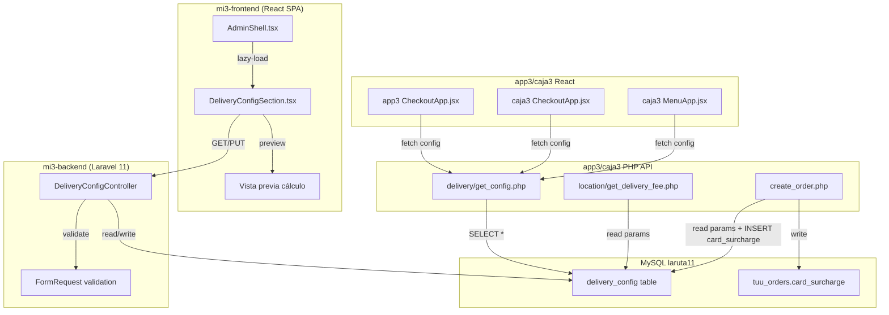

# Documento de Diseño — Centralización de Configuración de Delivery

## Overview

Este feature centraliza los 6 parámetros de pricing de delivery que hoy están dispersos y hardcodeados en múltiples archivos (PHP backends, React frontends de app3 y caja3) en una única tabla `delivery_config` en MySQL. Además, agrega trazabilidad del recargo por tarjeta con una columna dedicada `card_surcharge` en `tuu_orders`.

El sistema tiene cuatro capas:

1. **Tabla `delivery_config`** — fuente única de verdad para los 6 parámetros: `tarifa_base`, `card_surcharge`, `distance_threshold_km`, `surcharge_per_bracket`, `bracket_size_km`, `rl6_discount_factor`.
2. **API CRUD en mi3-backend (Laravel 11)** — endpoints `GET/PUT /api/v1/admin/delivery-config` protegidos por auth Sanctum, para lectura y actualización de parámetros.
3. **Sección admin en mi3-frontend** — nueva sección `delivery-config` en AdminShell con formulario editable, validación inline, y vista previa de cálculo en tiempo real.
4. **Endpoint PHP público + migración de frontends** — archivo `delivery/get_config.php` en app3/caja3 que lee la config desde BD, y migración de CheckoutApp/MenuApp para consumir estos valores dinámicamente en lugar de constantes hardcodeadas.

El flujo es: admin edita parámetros en mi3-frontend → API Laravel valida y persiste en `delivery_config` → app3/caja3 leen config via endpoint PHP → frontends calculan fees con valores de BD → `create_order.php` almacena `card_surcharge` en columna separada de `tuu_orders`.

## Architecture



### Decisiones de Arquitectura

1. **Tabla key-value en lugar de columnas fijas**: Se usa un diseño de pares `config_key`/`config_value` (varchar) en lugar de una tabla con una columna por parámetro. Esto permite agregar nuevos parámetros sin migraciones de esquema. El casting a tipos numéricos se hace en la capa de aplicación.

2. **Endpoint PHP separado en app3/caja3 (no API mi3)**: Los frontends de app3/caja3 consumen un endpoint PHP local (`/api/delivery/get_config.php`) que lee directamente de la BD, en lugar de llamar a `api-mi3.laruta11.cl`. Esto evita dependencia cross-service y latencia adicional. Ambas apps comparten la misma BD `laruta11`.

3. **Fallback a valores por defecto**: Todos los consumidores (PHP y React) tienen valores por defecto hardcodeados como fallback. Si la tabla no existe o la consulta falla, el sistema sigue funcionando con los valores actuales de producción.

4. **Columna `card_surcharge` separada en `tuu_orders`**: En lugar de seguir sumando el recargo tarjeta al campo `delivery_fee`, se almacena en una columna dedicada. Esto permite reportes precisos sin ambigüedad.

5. **Fórmula RL6 unificada**: Se almacena un único `rl6_discount_factor` (0.2857 = 28.57% de descuento). app3 calcula `descuento = fee × factor`, caja3 calcula `fee_final = fee × (1 - factor)`. Ambos producen el mismo resultado neto.

6. **Sección en AdminShell siguiendo patrón existente**: La nueva sección `delivery-config` se registra como `SectionKey` en AdminShell.tsx con lazy-loading, siguiendo el mismo patrón de las 16 secciones existentes (inicio, personal, turnos, etc.).

## Components and Interfaces

### 1. Migración SQL — `delivery_config` table + `tuu_orders.card_surcharge`

```sql
-- Migración Laravel: create_delivery_config_table
CREATE TABLE delivery_config (
  id INT AUTO_INCREMENT PRIMARY KEY,
  config_key VARCHAR(50) NOT NULL UNIQUE,
  config_value VARCHAR(255) NOT NULL,
  description VARCHAR(255) DEFAULT NULL,
  updated_by VARCHAR(100) DEFAULT NULL,
  updated_at TIMESTAMP DEFAULT CURRENT_TIMESTAMP ON UPDATE CURRENT_TIMESTAMP,
  created_at TIMESTAMP DEFAULT CURRENT_TIMESTAMP
) ENGINE=InnoDB DEFAULT CHARSET=utf8mb4;

-- Seed inicial con valores de producción
INSERT INTO delivery_config (config_key, config_value, description) VALUES
  ('tarifa_base', '3500', 'Tarifa base de delivery en pesos'),
  ('card_surcharge', '500', 'Recargo por pago con tarjeta en delivery'),
  ('distance_threshold_km', '6', 'Distancia en km sin recargo adicional'),
  ('surcharge_per_bracket', '1000', 'Recargo por cada tramo adicional de distancia'),
  ('bracket_size_km', '2', 'Tamaño en km de cada tramo de distancia'),
  ('rl6_discount_factor', '0.2857', 'Factor de descuento RL6 (0.2857 = 28.57%)');

-- Migración Laravel: add_card_surcharge_to_tuu_orders
ALTER TABLE tuu_orders
  ADD COLUMN card_surcharge DECIMAL(10,2) NOT NULL DEFAULT 0.00 AFTER delivery_fee;
```

### 2. DeliveryConfigController (mi3-backend Laravel)

```php
// app/Http/Controllers/Admin/DeliveryConfigController.php

class DeliveryConfigController extends Controller
{
    // GET /api/v1/admin/delivery-config
    public function index(): JsonResponse
    // Retorna todos los registros de delivery_config

    // PUT /api/v1/admin/delivery-config
    public function update(UpdateDeliveryConfigRequest $request): JsonResponse
    // Recibe array de {config_key, config_value}, valida, actualiza, retorna actualizados
}
```

**Rutas** (en `routes/api.php`, dentro del grupo admin):
```php
Route::get('delivery-config', [DeliveryConfigController::class, 'index']);
Route::put('delivery-config', [DeliveryConfigController::class, 'update']);
```

### 3. UpdateDeliveryConfigRequest (FormRequest)

```php
// app/Http/Requests/UpdateDeliveryConfigRequest.php

class UpdateDeliveryConfigRequest extends FormRequest
{
    public function rules(): array
    {
        return [
            'items' => 'required|array|min:1',
            'items.*.config_key' => 'required|string|in:tarifa_base,card_surcharge,distance_threshold_km,surcharge_per_bracket,bracket_size_km,rl6_discount_factor',
            'items.*.config_value' => 'required|string',
        ];
    }

    // Validación custom: numéricos para montos/distancias, rango 0-1 para rl6_discount_factor
}
```

### 4. DeliveryConfig Model (Laravel Eloquent)

```php
// app/Models/DeliveryConfig.php

class DeliveryConfig extends Model
{
    protected $table = 'delivery_config';
    protected $fillable = ['config_key', 'config_value', 'description', 'updated_by'];

    // Helper estático para obtener config como array asociativo
    public static function getAllAsMap(): array
    // Retorna ['tarifa_base' => '3500', 'card_surcharge' => '500', ...]
}
```

### 5. DeliveryConfigSection.tsx (mi3-frontend)

```typescript
// components/admin/sections/DeliveryConfigSection.tsx

interface DeliveryConfigItem {
  config_key: string;
  config_value: string;
  description: string;
  updated_by: string | null;
  updated_at: string | null;
}

// Sección lazy-loaded en AdminShell
// - Fetch GET /api/v1/admin/delivery-config al montar
// - Formulario con campos editables por parámetro
// - Validación inline (numéricos, rango rl6)
// - Vista previa de cálculo en tiempo real
// - Botón Guardar → PUT /api/v1/admin/delivery-config
// - Muestra última modificación por parámetro
```

**Registro en AdminShell.tsx**:
- Agregar `'delivery-config'` al type `SectionKey`
- Agregar entrada en `SECTION_TITLES`: `'delivery-config': 'Config Delivery'`
- Agregar lazy import en `sectionImports`
- Agregar entrada en sidebar

### 6. Endpoint PHP — `delivery/get_config.php`

```php
// app3/api/delivery/get_config.php (y caja3/api/delivery/get_config.php)

// Defaults hardcodeados como fallback
$defaults = [
    'tarifa_base' => 3500,
    'card_surcharge' => 500,
    'distance_threshold_km' => 6,
    'surcharge_per_bracket' => 1000,
    'bracket_size_km' => 2,
    'rl6_discount_factor' => 0.2857,
];

// Intenta leer de delivery_config, fallback a defaults
// Retorna JSON con valores numéricos parseados + campo loaded_from
```

### 7. Función helper PHP — `get_delivery_config()`

```php
// app3/api/delivery/delivery_config_helper.php (y caja3 equivalente)

function get_delivery_config(PDO $pdo): array
// Lee delivery_config de BD, retorna array con valores tipados
// Usado por get_config.php, get_delivery_fee.php, y create_order.php
```

### 8. Modificaciones a archivos existentes

| Archivo | Cambio |
|---------|--------|
| `app3/api/location/get_delivery_fee.php` | Leer `distance_threshold_km`, `surcharge_per_bracket`, `bracket_size_km` desde BD via helper |
| `app3/api/create_order.php` | Leer params de BD, almacenar `card_surcharge` en columna separada, no sumar a `delivery_fee` |
| `app3/src/components/CheckoutApp.jsx` | Fetch config al montar, usar valores dinámicos para `cardDeliverySurcharge` y `rl6_discount_factor`, enviar `card_surcharge` separado |
| `caja3/src/components/CheckoutApp.jsx` | Fetch config al montar, usar valores dinámicos, enviar `card_surcharge` separado |
| `caja3/src/components/MenuApp.jsx` | Fetch config al montar, reemplazar `CARD_DELIVERY_SURCHARGE = 500` y `0.7143` con valores de BD |
| `caja3/api/create_order.php` | Mismo cambio que app3: leer params de BD, almacenar `card_surcharge` separado |

## Data Models

### Tabla `delivery_config` (MySQL)

| Campo | Tipo | Restricción | Descripción |
|-------|------|-------------|-------------|
| `id` | INT | AUTO_INCREMENT PK | ID interno |
| `config_key` | VARCHAR(50) | UNIQUE, NOT NULL | Clave del parámetro |
| `config_value` | VARCHAR(255) | NOT NULL | Valor como string |
| `description` | VARCHAR(255) | NULL | Descripción legible |
| `updated_by` | VARCHAR(100) | NULL | Usuario que modificó |
| `updated_at` | TIMESTAMP | ON UPDATE CURRENT_TIMESTAMP | Fecha de modificación |
| `created_at` | TIMESTAMP | DEFAULT CURRENT_TIMESTAMP | Fecha de creación |

### Registros iniciales

| config_key | config_value | description |
|------------|-------------|-------------|
| `tarifa_base` | `3500` | Tarifa base de delivery en pesos |
| `card_surcharge` | `500` | Recargo por pago con tarjeta en delivery |
| `distance_threshold_km` | `6` | Distancia en km sin recargo adicional |
| `surcharge_per_bracket` | `1000` | Recargo por cada tramo adicional de distancia |
| `bracket_size_km` | `2` | Tamaño en km de cada tramo de distancia |
| `rl6_discount_factor` | `0.2857` | Factor de descuento RL6 (0.2857 = 28.57%) |

### Columna nueva en `tuu_orders`

| Campo | Tipo | Default | Descripción |
|-------|------|---------|-------------|
| `card_surcharge` | DECIMAL(10,2) | 0.00 | Recargo tarjeta almacenado separado de delivery_fee |

### Respuesta API GET `/api/v1/admin/delivery-config`

```json
{
  "success": true,
  "items": [
    {
      "config_key": "tarifa_base",
      "config_value": "3500",
      "description": "Tarifa base de delivery en pesos",
      "updated_by": "Ricardo",
      "updated_at": "2025-01-15T10:30:00Z"
    }
  ]
}
```

### Payload PUT `/api/v1/admin/delivery-config`

```json
{
  "items": [
    { "config_key": "tarifa_base", "config_value": "4000" },
    { "config_key": "card_surcharge", "config_value": "600" }
  ]
}
```

### Respuesta endpoint PHP `delivery/get_config.php`

```json
{
  "success": true,
  "loaded_from": "database",
  "tarifa_base": 3500,
  "card_surcharge": 500,
  "distance_threshold_km": 6,
  "surcharge_per_bracket": 1000,
  "bracket_size_km": 2,
  "rl6_discount_factor": 0.2857
}
```

### Valores por defecto (fallback)

```javascript
const DELIVERY_CONFIG_DEFAULTS = {
  tarifa_base: 3500,
  card_surcharge: 500,
  distance_threshold_km: 6,
  surcharge_per_bracket: 1000,
  bracket_size_km: 2,
  rl6_discount_factor: 0.2857,
};
```


## Correctness Properties

*Una propiedad es una característica o comportamiento que debe mantenerse verdadero en todas las ejecuciones válidas de un sistema — esencialmente, una declaración formal sobre lo que el sistema debe hacer. Las propiedades sirven como puente entre especificaciones legibles por humanos y garantías de correctitud verificables por máquina.*

### Property 1: Fallback a valores por defecto para config faltante

*Para cualquier* `config_key` que no exista en la tabla `delivery_config` (o cuando la consulta a BD falla), la función `get_delivery_config()` SHALL retornar el valor por defecto hardcodeado correspondiente a esa clave, y el objeto resultante SHALL contener exactamente las 6 claves esperadas con valores numéricos válidos.

**Validates: Requirements 1.4, 5.3, 6.4, 7.6, 8.4**

### Property 2: Separación de card_surcharge y delivery_fee en órdenes

*Para cualquier* orden de tipo delivery con método de pago tarjeta y cualquier valor válido de `card_surcharge` configurado, el campo `delivery_fee` almacenado en `tuu_orders` SHALL contener únicamente la tarifa base + recargo por distancia, y el campo `card_surcharge` SHALL contener el recargo por tarjeta como valor separado. La suma `delivery_fee + card_surcharge` SHALL ser igual al total que antes se almacenaba en `delivery_fee`.

**Validates: Requirements 2.2, 2.3, 6.5, 7.5, 8.5**

### Property 3: Cálculo de delivery fee con parámetros dinámicos

*Para cualquier* combinación válida de `tarifa_base` ≥ 0, `distance_threshold_km` > 0, `surcharge_per_bracket` ≥ 0, `bracket_size_km` > 0, `card_surcharge` ≥ 0, y distancia ≥ 0, la función de cálculo de delivery fee SHALL producir: `tarifa_base + ceil(max(0, distancia - distance_threshold_km) / bracket_size_km) × surcharge_per_bracket`. Para distancias ≤ threshold, el surcharge SHALL ser 0.

**Validates: Requirements 4.3, 8.1, 8.2**

### Property 4: Validación de API rechaza valores inválidos

*Para cualquier* string no numérico enviado como `config_value` para las claves `tarifa_base`, `card_surcharge`, `distance_threshold_km`, `surcharge_per_bracket`, o `bracket_size_km`, el endpoint PUT SHALL retornar HTTP 422. *Para cualquier* valor numérico fuera del rango [0.0, 1.0] enviado para `rl6_discount_factor`, el endpoint PUT SHALL retornar HTTP 422.

**Validates: Requirements 3.3, 3.4, 4.5**

### Property 5: Tipado numérico en respuesta del endpoint público

*Para cualquier* conjunto de valores almacenados como strings en `delivery_config`, el endpoint `get_config.php` SHALL retornar `tarifa_base`, `card_surcharge`, `distance_threshold_km`, `surcharge_per_bracket`, y `bracket_size_km` como integers, y `rl6_discount_factor` como float. El campo `loaded_from` SHALL ser `"database"` cuando la lectura de BD es exitosa, y `"defaults"` cuando falla.

**Validates: Requirements 5.2, 5.4**

### Property 6: Consistencia de descuento RL6 entre app3 y caja3

*Para cualquier* `fee_bruto` ≥ 0 y `rl6_discount_factor` en [0.0, 1.0], el fee final calculado por app3 como `fee_bruto - (fee_bruto × rl6_discount_factor)` SHALL ser igual al fee final calculado por caja3 como `fee_bruto × (1 - rl6_discount_factor)`. Ambas fórmulas son algebraicamente equivalentes y deben producir el mismo resultado con aritmética de enteros (Math.round).

**Validates: Requirements 9.2, 9.3, 9.4**

### Property 7: Round-trip de configuración via API

*Para cualquier* conjunto válido de valores de configuración (numéricos positivos para montos/distancias, float en [0,1] para rl6_discount_factor), enviar un PUT con esos valores y luego un GET SHALL retornar exactamente los mismos valores almacenados, con `updated_by` reflejando el usuario autenticado.

**Validates: Requirements 3.2, 3.6**

## Error Handling

### mi3-backend (Laravel)

| Escenario | Comportamiento |
|-----------|---------------|
| PUT con config_key inexistente | Rechazar con 422 — solo se aceptan las 6 claves conocidas |
| PUT con valor no numérico para clave numérica | Rechazar con 422 y mensaje descriptivo |
| PUT con rl6_discount_factor fuera de [0, 1] | Rechazar con 422 y mensaje descriptivo |
| GET sin registros en tabla | Retornar array vacío (el frontend maneja defaults) |
| Error de BD en GET/PUT | Retornar 500 con mensaje genérico, loguear detalle |
| Request sin autenticación | Retornar 401 (middleware Sanctum) |

### Endpoint PHP (get_config.php)

| Escenario | Comportamiento |
|-----------|---------------|
| Tabla `delivery_config` no existe | Retornar valores por defecto con `loaded_from: "defaults"` |
| Error de conexión a BD | Retornar valores por defecto con `loaded_from: "defaults"` |
| Registro faltante en tabla | Usar valor por defecto para esa clave específica |
| Valor no parseable como número | Usar valor por defecto para esa clave |

### Scripts PHP (get_delivery_fee.php, create_order.php)

| Escenario | Comportamiento |
|-----------|---------------|
| Fallo al leer delivery_config | Usar defaults: threshold=6, bracket=2, surcharge=1000 |
| `card_surcharge` no viene en payload de orden | Almacenar 0.00 en columna card_surcharge |
| `card_surcharge` del payload no coincide con config BD | Loguear warning, usar valor de BD como fuente de verdad |

### Frontends React (app3/caja3)

| Escenario | Comportamiento |
|-----------|---------------|
| Fetch a get_config.php falla (red, timeout) | Usar `DELIVERY_CONFIG_DEFAULTS` hardcodeados, no interrumpir flujo |
| Respuesta JSON inválida | Usar defaults, loguear error en console |
| Valor de config es 0 o negativo | Usar el valor tal cual (admin puede configurar tarifa_base=0 para delivery gratis) |

### mi3-frontend (DeliveryConfigSection)

| Escenario | Comportamiento |
|-----------|---------------|
| Fetch GET falla | Mostrar mensaje de error con botón reintentar |
| PUT falla (422) | Mostrar errores de validación inline por campo |
| PUT falla (500/red) | Mostrar toast de error genérico, mantener valores editados |
| Campo vacío | Validación inline: "Este campo es requerido" |
| Texto en campo numérico | Validación inline: "Debe ser un número" |
| rl6_discount_factor > 1 o < 0 | Validación inline: "Debe estar entre 0 y 1" |

## Testing Strategy

### Property-Based Tests (fast-check)

Se usará `fast-check` como librería de property-based testing para JavaScript/TypeScript.

Cada property test debe:
- Ejecutar mínimo 100 iteraciones
- Referenciar la property del diseño con tag: `Feature: delivery-config-centralized, Property N: [título]`

**Tests a implementar:**

1. **Property 1 (Fallback):** Generar objetos de config parciales (con claves faltantes aleatorias), pasarlos a la función de merge con defaults, verificar que el resultado siempre tiene las 6 claves con valores numéricos válidos.

2. **Property 3 (Cálculo delivery fee):** Generar combinaciones aleatorias de `tarifa_base`, `distance_threshold_km`, `surcharge_per_bracket`, `bracket_size_km`, y `distancia`, verificar que el resultado es `tarifa_base + ceil(max(0, dist - threshold) / bracket) × surcharge`. Para distancias ≤ threshold, surcharge debe ser 0.

3. **Property 4 (Validación API):** Generar strings no numéricos aleatorios para claves numéricas y floats fuera de [0,1] para rl6_discount_factor, verificar que la función de validación los rechaza.

4. **Property 5 (Tipado numérico):** Generar strings numéricos aleatorios (enteros y decimales), pasarlos por la función de parsing del endpoint, verificar que retorna tipos correctos (int para montos, float para factor).

5. **Property 6 (Consistencia RL6):** Generar pares aleatorios de `fee_bruto` (entero 0-100000) y `rl6_discount_factor` (float 0-1), verificar que `Math.round(fee - fee * factor)` === `Math.round(fee * (1 - factor))`.

6. **Property 7 (Round-trip config):** Generar valores válidos aleatorios para los 6 parámetros, simular PUT + GET, verificar que los valores retornados son idénticos a los enviados.

### Unit Tests (ejemplo)

- DeliveryConfigController: GET retorna los 6 registros con campos correctos
- DeliveryConfigController: PUT actualiza valores y retorna registros actualizados
- DeliveryConfigController: PUT sin auth retorna 401
- get_config.php: retorna JSON con 6 claves y loaded_from="database"
- get_config.php: retorna defaults cuando BD falla
- get_delivery_fee.php: calcula surcharge correcto para 8km (1 tramo = $1000)
- get_delivery_fee.php: no cobra surcharge para 5km (dentro de threshold)
- create_order.php: almacena card_surcharge en columna separada
- create_order.php: delivery_fee no incluye card_surcharge
- DeliveryConfigSection: renderiza formulario con los 6 parámetros
- DeliveryConfigSection: muestra vista previa de cálculo actualizada al editar
- DeliveryConfigSection: muestra fecha y usuario de última modificación
- CheckoutApp (app3): usa card_surcharge dinámico en lugar de 500
- CheckoutApp (caja3): usa (1 - factor) para descuento RL6
- MenuApp (caja3): usa card_surcharge dinámico en lugar de CARD_DELIVERY_SURCHARGE

### Integration Tests

- Flujo completo admin: editar config en mi3 → verificar que get_config.php retorna nuevos valores
- Flujo completo orden: crear orden delivery con tarjeta → verificar card_surcharge en columna separada en BD
- Backward compatibility: órdenes pickup no tienen card_surcharge (queda en 0.00)
- Backward compatibility: órdenes delivery con efectivo no tienen card_surcharge
- Migración: verificar que tabla delivery_config existe con 6 registros y tuu_orders tiene columna card_surcharge
