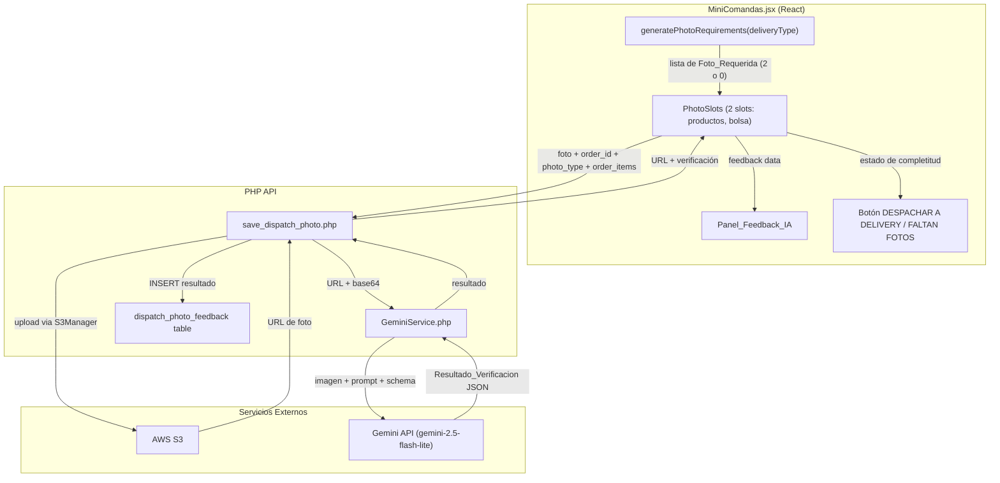

# Diseño — Verificación de Fotos de Despacho con IA

## Overview

Este feature transforma la sección de fotos de despacho en MiniComandas para pedidos delivery en un sistema estructurado de 2 slots etiquetados con verificación IA y panel de feedback visible. Para pedidos locales (pickup/cuartel), la sección de fotos se oculta completamente y el flujo de entrega permanece sin cambios.

El sistema tiene cuatro capas principales:

1. **Generador de requisitos de fotos** — función pura JS que analiza el tipo de delivery y retorna las 2 fotos requeridas (o array vacío para local)
2. **UI de slots etiquetados + Panel de Feedback IA** — 2 slots con estados (vacío, subiendo, verificando, aprobado, warning) y un panel debajo con el texto completo del análisis IA
3. **Verificador IA backend** — GeminiService PHP que analiza cada foto contra el contexto del pedido vía Gemini API
4. **Tabla dispatch_photo_feedback** — almacenamiento de resultados de verificación y datos de re-toma para aprendizaje continuo

El flujo delivery es: cajero ve 2 slots requeridos → toma foto → se sube a S3 → se envía a Gemini para verificación → feedback visible en panel IA → cuando ambas fotos están subidas, botón cambia a "📦 DESPACHAR A DELIVERY" (verde). Si una foto sale mal, el cajero puede eliminarla y re-subir; la IA re-analiza y el sistema registra la corrección con `user_retook = true`.

La verificación IA es informativa (no bloqueante): el bloqueo solo depende de que las fotos estén subidas, no de que estén aprobadas por IA.

## Architecture



### Decisiones de Arquitectura

1. **Función pura para generación de requisitos**: `generatePhotoRequirements` es una función pura sin side effects que vive en un archivo separado (`photoRequirements.js`). Recibe solo `deliveryType` (ya no necesita items, porque siempre son 2 fotos fijas para delivery). Retorna array vacío para local.

2. **2 fotos fijas para delivery**: Se eliminó la foto "sellado" separada. La foto "bolsa sellada" combina ambos conceptos. Esto simplifica el flujo para el cajero.

3. **Panel de Feedback IA visible**: En lugar de badges pequeños en cada slot, se muestra un panel debajo de los slots con el texto completo del análisis. Los slots mantienen un badge pequeño (✅/⚠️) pero el detalle está en el panel.

4. **Tabla dispatch_photo_feedback**: Nueva tabla para persistir resultados de verificación y datos de re-toma. Sigue el patrón de `extraction_feedback` en mi3. Permite análisis posterior y mejora del sistema.

5. **Verificación asíncrona no bloqueante**: La verificación IA ocurre después de la subida exitosa a S3. Si falla, se retorna un resultado por defecto con `aprobado: true` para no bloquear el flujo.

6. **Delete + re-upload**: El cajero puede eliminar una foto y subir una nueva. La re-subida dispara re-análisis IA y se registra con `user_retook = true` en la tabla de feedback.

7. **Sin fotos para local**: Pedidos pickup/cuartel no muestran sección de fotos. El botón ENTREGAR funciona exactamente como hoy.

## Components and Interfaces

### 1. `generatePhotoRequirements(deliveryType)` — Función Pura JS

```typescript
// Ubicación: caja3/src/utils/photoRequirements.js

interface PhotoRequirement {
  id: string;               // 'productos' | 'bolsa'
  label: string;            // Etiqueta con emoji en español
  required: boolean;        // siempre true
}

function generatePhotoRequirements(
  deliveryType: string      // 'delivery' | 'pickup' | 'cuartel'
): PhotoRequirement[]
```

**Reglas de generación:**
- Si `deliveryType === 'delivery'`: retorna `[{id: 'productos', label: '📸 Foto de productos', required: true}, {id: 'bolsa', label: '🛍️ Foto en bolsa sellada', required: true}]`
- Si `deliveryType` es `'pickup'` o `'cuartel'` o cualquier otro valor: retorna `[]`
- Orden fijo: productos → bolsa

### 2. Componente de Slots de Fotos (inline en MiniComandas.jsx)

La sección de fotos se muestra SOLO para pedidos delivery. Para local se oculta completamente.

Cada slot tiene estados:

| Estado | Visual |
|--------|--------|
| Vacío | Borde punteado, ícono cámara, etiqueta |
| Subiendo | Spinner, "Subiendo..." |
| Verificando | Miniatura + spinner pequeño, "Verificando..." |
| Aprobado | Miniatura + badge ✅ |
| Warning | Miniatura + badge ⚠️ + botón eliminar prominente |

**Interacciones en cada slot:**
- Click en slot vacío → abre selector de archivo/cámara
- Click en miniatura de foto → abre visor fullscreen existente (`setViewingOrderPhotos`)
- Click en botón eliminar (×) → elimina la foto del slot, limpia feedback, vuelve a vacío

**Indicador de progreso:** Texto "N/2 fotos" sobre la sección.

### 3. Panel de Feedback IA (debajo de los slots)

```jsx
// Dentro de renderOrderCard, debajo de los slots de fotos
{hasAnyFeedback && (
  <div className="bg-gray-50 rounded-lg p-3 mt-2 space-y-2">
    {photoSlots.map(slot => slot.verification && (
      <div key={slot.requirementId} className="flex items-start gap-2">
        <span>{slot.verification.aprobado ? '✅' : '⚠️'}</span>
        <div>
          <span className="font-medium text-xs">{slot.label}:</span>
          <span className="text-xs ml-1">{slot.verification.feedback}</span>
        </div>
      </div>
    ))}
  </div>
)}
```

El panel muestra:
- Cada foto analizada con su etiqueta y feedback completo
- Indicador visual verde (✅) o amarillo (⚠️)
- "Verificando..." con spinner mientras se analiza
- Se actualiza cuando se elimina y re-sube una foto

### 4. Botón de Despacho — Lógica de Estados

```javascript
// Dentro de renderOrderCard
const isDelivery = order.delivery_type === 'delivery';
const photoReqs = generatePhotoRequirements(order.delivery_type);
const uploadedPhotos = getUploadedPhotosForOrder(order);
const allPhotosUploaded = photoReqs.every(req => uploadedPhotos[req.id]);

// Botón para delivery
if (isDelivery) {
  <button
    disabled={!allPhotosUploaded}
    className={allPhotosUploaded ? 'bg-green-600 text-white' : 'bg-gray-400 text-gray-200'}
    onClick={allPhotosUploaded ? handleDespacharDelivery : handleFaltanFotos}
  >
    {allPhotosUploaded ? '📦 DESPACHAR A DELIVERY' : '📷 FALTAN FOTOS'}
  </button>
}

// Botón para local (sin cambios al flujo actual)
if (!isDelivery) {
  <button className="bg-green-600 text-white" onClick={handleEntregar}>
    ✅ ENTREGAR
  </button>
}
```

Cuando el cajero toca el botón deshabilitado, se muestra un alert: "Faltan N de 2 fotos".

### 5. `GeminiService.php` — Servicio PHP

```php
// Ubicación: caja3/api/GeminiService.php

class GeminiService {
    private string $apiKey;
    private string $model = 'gemini-2.5-flash-lite';
    private string $baseUrl = 'https://generativelanguage.googleapis.com/v1beta/models';

    public function __construct() {
        $this->apiKey = $_ENV['GEMINI_API_KEY'] ?? getenv('GEMINI_API_KEY') ?: '';
    }

    public function verificarFotoDespacho(
        string $imageBase64,
        array $itemsPedido,
        string $tipoFoto        // 'productos' | 'bolsa'
    ): array

    private function callGemini(
        string $prompt,
        string $imageBase64,
        array $schema,
        int $timeout = 8
    ): ?array

    private function buildVerificationPrompt(
        array $itemsPedido,
        string $tipoFoto        // 'productos' | 'bolsa'
    ): string

    private function buildVerificationSchema(): array
}
```

**Patrón cURL** (siguiendo mi3):
- `CURLOPT_TIMEOUT => 8` (máximo 8 segundos)
- `CURLOPT_CONNECTTIMEOUT => 5`
- `responseMimeType => 'application/json'`
- `responseSchema` para forzar JSON estructurado
- `temperature => 0.1` para respuestas consistentes
- Errores logueados con `error_log()`

**Prompt por tipo de foto:**
- `'productos'`: Verificar presencia de items, cantidades, orientación correcta (no volcados/de lado), estado visible
- `'bolsa'`: Verificar que la bolsa esté sellada, que se vea lista para despacho

### 6. `save_dispatch_photo.php` — Modificaciones

Nuevos parámetros POST:
- `photo_type` (string): tipo de foto requerida (`'productos'` o `'bolsa'`)
- `order_items` (JSON string): lista de items del pedido
- `user_retook` (string): `'true'` si es una re-subida después de eliminar

Flujo modificado:
1. Subir foto a S3 (sin cambios)
2. Guardar URL en DB (sin cambios al formato JSON array existente)
3. **Nuevo:** Si `photo_type` está presente, leer imagen desde S3 URL, convertir a base64
4. **Nuevo:** Llamar `GeminiService::verificarFotoDespacho()`
5. **Nuevo:** Insertar resultado en `dispatch_photo_feedback`
6. Retornar `{success, url, all_photos, verification: {aprobado, puntaje, feedback}}`

Si la verificación falla, retorna `verification: {aprobado: true, puntaje: 0, feedback: "⏳ Verificación no disponible"}` y aún inserta en `dispatch_photo_feedback`.

Si no hay `photo_type` (pedido local), funciona exactamente como antes sin verificación.

## Data Models

### PhotoRequirement (Frontend)

```javascript
{
  id: string,        // 'productos' | 'bolsa'
  label: string,     // '📸 Foto de productos' | '🛍️ Foto en bolsa sellada'
  required: boolean  // siempre true
}
```

### PhotoSlotState (Frontend)

```javascript
{
  requirementId: string,     // matches PhotoRequirement.id
  label: string,             // matches PhotoRequirement.label
  status: string,            // 'empty' | 'uploading' | 'verifying' | 'approved' | 'warning'
  photoUrl: string | null,   // URL de S3
  verification: {
    aprobado: boolean,
    puntaje: number,         // 0-100
    feedback: string         // texto descriptivo en español con emoji
  } | null
}
```

### Resultado_Verificacion (Backend → Frontend)

```json
{
  "aprobado": true,
  "puntaje": 85,
  "feedback": "✅ Productos visibles y bien empacados. Completo en posición correcta."
}
```

### Tabla dispatch_photo_feedback (MySQL)

```sql
CREATE TABLE dispatch_photo_feedback (
  id INT AUTO_INCREMENT PRIMARY KEY,
  order_id INT NOT NULL,
  photo_type ENUM('productos', 'bolsa') NOT NULL,
  photo_url TEXT NOT NULL,
  ai_aprobado TINYINT(1) NOT NULL DEFAULT 1,
  ai_puntaje INT NOT NULL DEFAULT 0,
  ai_feedback TEXT,
  user_retook TINYINT(1) NOT NULL DEFAULT 0,
  created_at TIMESTAMP DEFAULT CURRENT_TIMESTAMP,
  INDEX idx_order_id (order_id),
  INDEX idx_photo_type (photo_type),
  FOREIGN KEY (order_id) REFERENCES tuu_orders(id) ON DELETE CASCADE
) ENGINE=InnoDB DEFAULT CHARSET=utf8mb4;
```

### dispatch_photo_url (DB — sin cambios al schema)

El campo `tuu_orders.dispatch_photo_url` sigue almacenando un JSON array de URLs. No se modifica el schema de la tabla `tuu_orders`.

### Respuesta API save_dispatch_photo.php (modificada)

```json
{
  "success": true,
  "url": "https://laruta11-images.s3.amazonaws.com/despacho/pedido_123_1234567890.jpg",
  "all_photos": ["url1", "url2"],
  "verification": {
    "aprobado": true,
    "puntaje": 85,
    "feedback": "✅ Productos visibles y bien empacados"
  }
}
```

## Correctness Properties

*A property is a characteristic or behavior that should hold true across all valid executions of a system — essentially, a formal statement about what the system should do.*

### Property 1: Delivery retorna exactamente 2 fotos, local retorna vacío

*For any* `deliveryType` string, `generatePhotoRequirements` SHALL retornar un array de exactamente 2 elementos con ids `'productos'` y `'bolsa'` (en ese orden) si `deliveryType === 'delivery'`, y un array vacío para cualquier otro valor (`'pickup'`, `'cuartel'`, o cualquier string arbitrario).

**Validates: Requirements 1.1, 1.2**

### Property 2: Generador de requisitos es determinístico (idempotencia)

*For any* `deliveryType` string, llamar a `generatePhotoRequirements` dos veces con el mismo argumento SHALL producir resultados idénticos (deep equal).

**Validates: Requirements 1.5, 1.6**

### Property 3: Estado del botón refleja completitud de fotos, no verificación IA

*For any* conjunto de 2 fotos requeridas y cualquier subconjunto de fotos subidas con cualquier combinación de resultados de verificación IA (aprobado/no aprobado), el Boton_Despacho SHALL estar habilitado con texto "📦 DESPACHAR A DELIVERY" si y solo si ambas fotos están subidas. El estado de verificación IA (aprobado, puntaje, feedback) no afecta el estado del botón.

**Validates: Requirements 2.1, 2.2, 2.5**

### Property 4: Indicador de progreso formatea correctamente N/2

*For any* número de fotos subidas N (donde 0 ≤ N ≤ 2), el indicador de progreso SHALL mostrar exactamente el string `"N/2 fotos"`.

**Validates: Requirements 2.4**

### Property 5: Prompt de verificación contiene todos los items del pedido

*For any* lista de items de pedido (con nombres y cantidades) y tipo de foto (`'productos'` o `'bolsa'`), el prompt construido por `buildVerificationPrompt` SHALL contener el nombre y la cantidad de cada item de la lista.

**Validates: Requirements 6.1, 6.2**

### Property 6: Feedback del panel identifica cada foto por su etiqueta

*For any* foto analizada con un `requirementId` y `label` conocidos, el Panel_Feedback_IA SHALL mostrar el feedback prefijado con la etiqueta correspondiente (ej: "📸 Foto de productos: ..." o "🛍️ Foto en bolsa sellada: ...").

**Validates: Requirements 5.5**

## Error Handling

### Frontend

| Escenario | Comportamiento |
|-----------|---------------|
| Error al subir foto a S3 | Mostrar alert con mensaje de error, slot vuelve a estado vacío |
| Error de red durante verificación | Foto se marca como subida (no bloquea), verificación queda como "no disponible" en panel |
| Respuesta API sin campo `verification` | Tratar como verificación no disponible, foto cuenta como subida |
| Pedido local | No mostrar sección de fotos, botón ENTREGAR habilitado directamente |
| Eliminar foto | Slot vuelve a vacío, feedback se limpia del panel, botón vuelve a "FALTAN FOTOS" si queda < 2 |

### Backend (save_dispatch_photo.php)

| Escenario | Comportamiento |
|-----------|---------------|
| Falta `photo_type` en POST | No invocar verificación IA, funcionar como antes (pedido local) |
| Falta `order_items` en POST | Verificación se ejecuta sin contexto de items, no bloquea subida |
| GeminiService lanza excepción | Capturar, loguear con `error_log`, insertar fallback en `dispatch_photo_feedback`, retornar verificación por defecto |
| Gemini API timeout (>8s) | cURL timeout, insertar fallback en `dispatch_photo_feedback`, retornar `{aprobado: true, puntaje: 0, feedback: "⏳ Verificación no disponible"}` |
| Gemini API HTTP error | Loguear código HTTP y respuesta, insertar fallback, retornar verificación por defecto |
| Gemini responde JSON inválido | Loguear error de parsing, insertar fallback, retornar verificación por defecto |
| No se puede leer imagen desde S3 URL | Loguear error, insertar fallback, retornar verificación por defecto |
| `GEMINI_API_KEY` no configurada | Loguear warning, insertar fallback, retornar verificación por defecto |
| Error al insertar en `dispatch_photo_feedback` | Loguear error, no bloquear respuesta al frontend |

### Principio general

La verificación IA y el registro en `dispatch_photo_feedback` nunca bloquean el flujo de despacho. Cualquier fallo en la cadena de verificación resulta en un fallback silencioso con `aprobado: true`.

## Testing Strategy

### Property-Based Tests (fast-check)

Se usará `fast-check` como librería de property-based testing para JavaScript.

Cada property test debe:
- Ejecutar mínimo 100 iteraciones
- Referenciar la property del diseño con tag: `Feature: dispatch-photo-verification, Property N: [título]`

**Tests a implementar:**

1. **Property 1:** Generar strings aleatorios como deliveryType. Verificar que `'delivery'` retorna exactamente 2 fotos con ids correctos, y cualquier otro string retorna array vacío.
2. **Property 2:** Generar deliveryTypes aleatorios, llamar la función dos veces, verificar igualdad.
3. **Property 3:** Generar conjuntos aleatorios de fotos subidas (0, 1, o 2) con verificaciones IA aleatorias (aprobado/no aprobado, puntajes variados), verificar que el estado del botón depende solo de la completitud de fotos.
4. **Property 4:** Generar pares (N, 2) con N ∈ {0, 1, 2}, verificar formato del string.
5. **Property 5:** Generar listas de items con nombres y cantidades aleatorios, y tipos de foto, verificar que el prompt contiene todos los nombres y cantidades.
6. **Property 6:** Generar slots con labels y feedback aleatorios, verificar que el panel prefija con la etiqueta correcta.

### Unit Tests (ejemplo-based)

- Slot vacío renderiza con borde punteado y etiqueta correcta
- Slot con foto muestra miniatura con badge según estado de verificación
- Click en miniatura abre visor fullscreen
- Click en eliminar remueve la foto del slot y limpia feedback del panel
- Botón deshabilitado muestra mensaje de fotos faltantes al hacer click
- Panel de feedback muestra texto completo con etiqueta e indicador visual
- Panel se actualiza al re-subir foto
- Pedido local no muestra sección de fotos
- Pedido local muestra botón ENTREGAR habilitado
- `GeminiService::verificarFotoDespacho` retorna estructura correcta con mock de Gemini
- `save_dispatch_photo.php` retorna verificación por defecto cuando Gemini falla
- `save_dispatch_photo.php` inserta en `dispatch_photo_feedback` con `user_retook = true` en re-subida
- `save_dispatch_photo.php` no invoca verificación cuando falta `photo_type`

### Integration Tests

- Flujo completo delivery: subir foto → S3 → verificación IA → insert en dispatch_photo_feedback → respuesta con URL y resultado
- Flujo completo local: subir foto → S3 → sin verificación → respuesta sin campo verification
- Delete + re-upload: eliminar foto → subir nueva → verificación con `user_retook = true`
- Backward compatibility: subir foto sin `photo_type` ni `order_items` funciona como antes
- `GeminiService` maneja correctamente timeouts y errores HTTP de Gemini API
