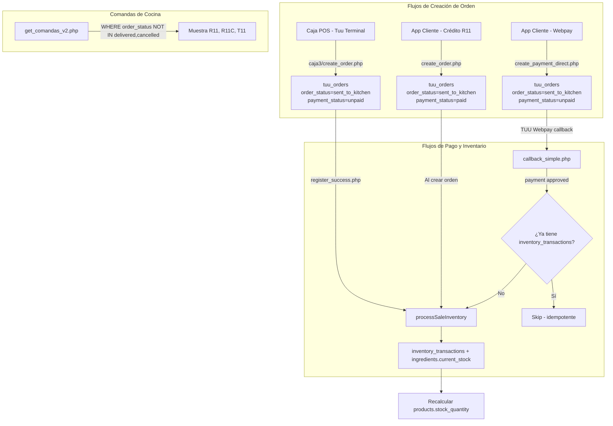
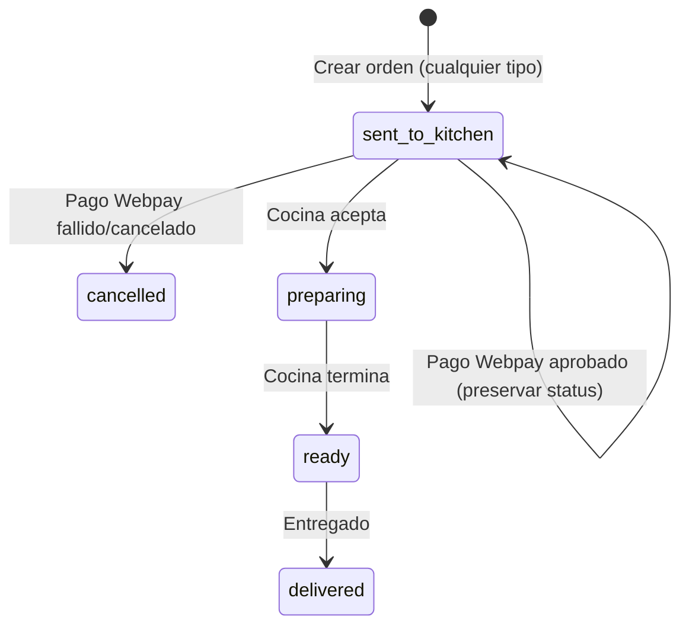

# Design Document: Fix Inventario, Ventas y Comandas

## Overview

Este diseño corrige cinco bugs críticos en producción donde las órdenes Webpay (R11-*) y Crédito R11 (R11C-*) no descuentan inventario, no aparecen correctamente en comandas, y registran delivery_fee/subtotal incorrectos. El enfoque es quirúrgico: modificar los archivos PHP existentes sin cambiar la arquitectura, reutilizando `processSaleInventory()` como función centralizada de descuento.

### Bugs identificados (código fuente real)

| Bug | Archivo raíz | Problema exacto en código |
|-----|--------------|--------------------------|
| Inventario R11 no descuenta | `callback_simple.php` | Sí llama `processSaleInventory()` pero falta guard de duplicados; `callback.php` también lo llama → posible doble descuento |
| R11 no aparece en comandas | `create_payment_direct.php` | `order_status='pending'` → al pagar, `callback.php` lo cambia a `'delivered'` → desaparece de comandas |
| callback.php rompe comandas | `callback.php` línea ~50 | `$order_status = match('completed') => 'delivered'` → orden sale de comandas al pagar |
| callback_simple.php cambia status | `callback_simple.php` línea ~35 | `order_status = 'pending'` en UPDATE → debería preservar `sent_to_kitchen` |
| delivery_fee sin validación | `create_order.php` y `create_payment_direct.php` | `$delivery_fee = $input['delivery_fee'] ?? 0` → confía en el cliente |
| subtotal=0 en Webpay | `create_payment_direct.php` | `$input['subtotal'] ?? 0` → confía en el cliente, que envía 0 |
| Backfill solo R11 | `backfill_r11_inventory.php` | `WHERE o.order_number LIKE 'R11-%'` → ignora R11C y T11 sin inventario |

## Architecture

### High-Level Design



### Low-Level Design: Cambios por archivo


#### 1. `app3/api/tuu/create_payment_direct.php`

**Estado actual:** Crea orden R11 con `order_status='pending'`, `payment_status='unpaid'`, `subtotal=$input['subtotal'] ?? 0`, `delivery_fee=$input['delivery_fee']`.

**Cambios:**
- Cambiar `order_status` de `'pending'` a `'sent_to_kitchen'` en el INSERT
- Calcular `subtotal` server-side: `SUM(product_price * quantity) + SUM(customization_price * customization_qty)` validando precios contra tabla `products`
- Recalcular `delivery_fee` server-side para delivery orders usando lógica de `get_delivery_fee.php` (base fee + surcharge por distancia)
- Para pickup: forzar `delivery_fee = 0`
- Recalcular `total = subtotal + delivery_fee + delivery_extras - discount_amount - delivery_discount - cashback_used`

```php
// ANTES (línea ~67):
// ... 'pending', 'unpaid', 'pending', ...
// DESPUÉS:
// ... 'pending', 'unpaid', 'sent_to_kitchen', ...

// ANTES (subtotal):
// $input['subtotal'] ?? 0
// DESPUÉS:
// $calculated_subtotal = calcularSubtotalServerSide($pdo, $cart_items);
```

#### 2. `app3/api/tuu/callback_simple.php`

**Estado actual:** Actualiza `order_status='pending'` en el UPDATE. Llama `processSaleInventory()` sin guard de duplicados.

**Cambios:**
- Cambiar UPDATE para NO modificar `order_status` cuando pago es aprobado (preservar `sent_to_kitchen`)
- Agregar guard de duplicados ANTES de llamar `processSaleInventory()`
- Para pagos fallidos: SET `order_status = 'cancelled'`

```php
// ANTES:
// UPDATE tuu_orders SET status='completed', payment_status=?, order_status='pending' ...

// DESPUÉS (pago aprobado - NO toca order_status):
// UPDATE tuu_orders SET status='completed', payment_status='paid', updated_at=NOW() WHERE order_number=?

// DESPUÉS (pago fallido/cancelado):
// UPDATE tuu_orders SET status=?, payment_status='unpaid', order_status='cancelled', updated_at=NOW() WHERE order_number=?
```

#### 3. `app3/api/tuu/callback.php`

**Estado actual:** Mapea `completed → order_status='delivered'`. Llama `processSaleInventory()` sin guard de duplicados.

**Cambios:**
- Para `completed`: NO modificar `order_status` (preservar `sent_to_kitchen`), solo actualizar `payment_status='paid'`
- Para `failed`/`cancelled`: SET `order_status = 'cancelled'`
- Agregar guard de duplicados antes de inventario

```php
// ANTES:
// $order_status = match($result) { 'completed' => 'delivered', ... };
// UPDATE ... SET order_status = ? ...

// DESPUÉS: Separar lógica de UPDATE según resultado
// completed → UPDATE SET status='completed', payment_status='paid' (sin tocar order_status)
// failed/cancelled → UPDATE SET status=?, payment_status='unpaid', order_status='cancelled'
```

#### 4. `app3/api/create_order.php`

**Estado actual:** Para `r11_credit`, descuenta inventario inline (código duplicado ~80 líneas, no usa `processSaleInventory()`). Confía en `delivery_fee` y `subtotal` del cliente.

**Cambios:**
- Reemplazar bloque inline de inventario (~líneas 130-210) por llamada a `processSaleInventory()`
- Recalcular `delivery_fee` server-side para delivery orders
- Para pickup: forzar `delivery_fee = 0`
- Calcular `subtotal` server-side
- Recalcular `total`

```php
// ANTES (~80 líneas de código duplicado):
// if (in_array($payment_method, ['rl6_credit', 'r11_credit'])) {
//     foreach ($cart_items as $item) { ... recipe_stmt ... update ingredients ... }
// }

// DESPUÉS (~15 líneas):
// if (in_array($payment_method, ['rl6_credit', 'r11_credit'])) {
//     require_once __DIR__ . '/process_sale_inventory_fn.php';
//     $inventory_items = buildInventoryItems($cart_items, $order_item_ids);
//     $inv_result = processSaleInventory($pdo, $inventory_items, $order_id);
// }
```

#### 5. `app3/api/process_sale_inventory_fn.php`

**Estado actual:** Funciona correctamente. Tiene guard de producto inexistente. NO tiene guard de orden ya procesada.

**Cambios:**
- Agregar guard de idempotencia al inicio de `processSaleInventory()`:

```php
// Agregar al inicio de processSaleInventory():
$check = $pdo->prepare("SELECT COUNT(*) FROM inventory_transactions WHERE order_reference = ?");
$check->execute([$order_reference]);
if ($check->fetchColumn() > 0) {
    return ['success' => true, 'skipped' => true];
}
```

#### 6. `app3/api/backfill_r11_inventory.php`

**Estado actual:** Solo busca `order_number LIKE 'R11-%'`.

**Cambios:**
- Expandir query WHERE clause para cubrir todos los prefijos

```php
// ANTES:
// WHERE o.order_number LIKE 'R11-%'

// DESPUÉS:
// WHERE (o.order_number LIKE 'R11-%' OR o.order_number LIKE 'R11C-%' OR o.order_number LIKE 'T11-%')
```

#### 7. `caja3/api/tuu/get_comandas_v2.php`

**Sin cambios necesarios.** El filtro actual `WHERE order_status NOT IN ('delivered', 'cancelled') AND order_number NOT LIKE 'RL6-%'` ya permite R11, R11C y T11. El bug era que `callback.php` cambiaba `order_status` a `'delivered'`, no un problema en comandas.

## Components and Interfaces

### Componentes modificados

| Componente | Archivo | Responsabilidad |
|-----------|---------|-----------------|
| Webpay_Payment_Creator | `app3/api/tuu/create_payment_direct.php` | Crear orden R11 con status correcto, subtotal/delivery_fee server-side |
| Payment_Callback_Simple | `app3/api/tuu/callback_simple.php` | Confirmar pago Webpay, preservar order_status, trigger inventario idempotente |
| Payment_Callback | `app3/api/tuu/callback.php` | Confirmar pago Webpay (ruta alternativa), mismos fixes |
| Order_Creator | `app3/api/create_order.php` | Crear órdenes R11C/T11, usar processSaleInventory centralizado, validar fees |
| Inventory_Processor | `app3/api/process_sale_inventory_fn.php` | Guard de idempotencia para prevenir doble descuento |
| Backfill_Script | `app3/api/backfill_r11_inventory.php` | Cubrir todos los prefijos de orden |
| Comandas_API | `caja3/api/tuu/get_comandas_v2.php` | Sin cambios (ya funciona correctamente) |

### Interfaz de `processSaleInventory()`

```php
/**
 * Descuenta inventario para una orden completa.
 * IDEMPOTENTE: si ya existen inventory_transactions para el order_reference, retorna sin hacer nada.
 *
 * @param PDO $pdo - Conexión a BD (puede estar en transacción externa)
 * @param array $items - Array de items:
 *   Producto normal: ['id'=>int, 'name'=>string, 'cantidad'=>int, 'order_item_id'=>int, 'customizations'=>[...]]
 *   Combo: ['id'=>int, 'name'=>string, 'cantidad'=>int, 'is_combo'=>true, 'combo_id'=>int, 'fixed_items'=>[...], 'selections'=>[...]]
 * @param string $order_reference - Número de orden (R11-xxx, R11C-xxx, T11-xxx)
 * @return array ['success'=>bool, 'error'=>string|null, 'skipped'=>bool]
 */
function processSaleInventory(PDO $pdo, array $items, string $order_reference): array
```

### Helper: Cálculo server-side

```php
/**
 * Calcula subtotal validando precios contra BD.
 * subtotal = SUM(db_price * quantity) + SUM(customization_db_price * custom_qty)
 */
function calcularSubtotalServerSide(PDO $pdo, array $cart_items): int

/**
 * Calcula delivery_fee server-side.
 * pickup → 0
 * delivery → base_fee (food_trucks.tarifa_delivery) + surcharge ($1000/2km beyond 6km)
 * Usa Google Directions API, fallback Haversine
 */
function calcularDeliveryFeeServerSide(PDO $pdo, array $config, string $delivery_type, ?string $delivery_address, float $client_fee): array
```

## Data Models

### Tablas afectadas (sin cambios de schema)

**`tuu_orders`** - Solo cambian los valores escritos:
- `order_status`: ahora siempre `'sent_to_kitchen'` al crear (R11, R11C, T11) y se preserva en callbacks
- `payment_status`: `'unpaid'` para Webpay al crear, `'paid'` para R11C al crear, `'paid'` después de callback exitoso
- `subtotal`: calculado server-side en vez de confiar en cliente
- `delivery_fee`: recalculado server-side
- `product_price` (total): recalculado como `subtotal + delivery_fee + extras - descuentos`

**`inventory_transactions`** - Sin cambios de schema, solo se escriben más registros (R11 y R11C que antes no se escribían)

**`ingredients`** - `current_stock` se actualiza correctamente para R11/R11C (antes solo T11)

**`products`** - `stock_quantity` se recalcula correctamente para R11/R11C (antes solo T11)

### Flujo de estados de orden



## Correctness Properties

*A property is a characteristic or behavior that should hold true across all valid executions of a system — essentially, a formal statement about what the system should do. Properties serve as the bridge between human-readable specifications and machine-verifiable correctness guarantees.*

### Property 1: Inventory expansion completeness (combos + customizations)

*For any* order containing products, combos (with fixed_items and selections), and customizations, calling `processSaleInventory()` SHALL create `inventory_transactions` records for every component product (base products, combo fixed items, combo selections, and customization products).

**Validates: Requirements 1.2, 1.3**

### Property 2: Gram-to-kilogram conversion

*For any* product with a recipe containing ingredients measured in grams (`unit = 'g'`), the quantity deducted from `ingredients.current_stock` SHALL equal `(recipe_quantity / 1000) * quantity_sold`.

**Validates: Requirements 1.5**

### Property 3: Idempotent inventory processing

*For any* order reference, calling `processSaleInventory()` twice with the same order_reference SHALL produce the same `inventory_transactions` count and `ingredients.current_stock` values as calling it once.

**Validates: Requirements 1.7**

### Property 4: Stock quantity recalculation

*For any* product with an active recipe, after inventory deduction, `products.stock_quantity` SHALL equal `FLOOR(MIN(current_stock / recipe_quantity))` across all active ingredients in the recipe (with gram conversion applied where `unit = 'g'`).

**Validates: Requirements 1.8**

### Property 5: Total amount consistency

*For any* order, the stored `product_price` (total) SHALL equal `subtotal + delivery_fee + delivery_extras - discount_amount - delivery_discount - cashback_used`, where `subtotal` is the server-calculated sum of item prices.

**Validates: Requirements 3.3, 4.1, 4.2**

### Property 6: Server-side subtotal accuracy

*For any* set of cart items, the server-calculated subtotal SHALL equal `SUM(db_product_price * quantity) + SUM(db_customization_price * customization_quantity)` where `db_product_price` and `db_customization_price` come from the `products` table, not from client input.

**Validates: Requirements 4.1, 4.3, 4.4**

## Error Handling

| Escenario | Comportamiento |
|-----------|---------------|
| `product_id` no existe en `products` | `processProductInventory()` hace skip + `error_log()` warning (ya implementado) |
| Orden ya tiene `inventory_transactions` | `processSaleInventory()` retorna `['success'=>true, 'skipped'=>true]` (nuevo guard) |
| Google Directions API falla | Fallback a Haversine para calcular distancia (ya implementado en `get_delivery_fee.php`) |
| Geocoding falla | Usar `delivery_fee` del cliente como fallback (degradación graceful) |
| Stock negativo después de descuento | Warning en log, NO bloquear la venta (ya implementado) |
| `combo_data` JSON inválido | `json_decode` retorna null, se trata como producto sin combos/customizations |
| Transacción de BD falla en backfill | Cada orden tiene su propia transacción, fallo no afecta otras órdenes |
| Callback duplicado de TUU | Guard de idempotencia previene doble descuento |

## Testing Strategy

### Enfoque dual: Tests manuales en SSH + Property-based tests

Dado que este es un sistema PHP en producción sin framework de testing configurado, la estrategia combina:

1. **Verificación SSH en producción** (obligatorio para cada task): Queries SQL directas para verificar que los cambios funcionan correctamente con datos reales.

2. **Property-based tests** (para lógica pura): Usando PHPUnit + `eris/eris` para las propiedades de correctness definidas arriba. Mínimo 100 iteraciones por propiedad.

3. **Tests de integración manuales**: Crear órdenes de prueba por cada flujo (Webpay, R11C, T11) y verificar inventario, comandas, y montos.

### Tests SSH obligatorios por cada cambio

```sql
-- Verificar inventario después de orden R11
SELECT it.* FROM inventory_transactions it 
WHERE it.order_reference = 'R11-XXXXX' ORDER BY it.id;

-- Verificar orden visible en comandas
SELECT order_number, order_status, payment_status 
FROM tuu_orders 
WHERE order_status NOT IN ('delivered','cancelled') 
AND order_number NOT LIKE 'RL6-%' 
ORDER BY created_at DESC LIMIT 10;

-- Verificar subtotal y delivery_fee correctos
SELECT order_number, subtotal, delivery_fee, product_price, 
  (subtotal + delivery_fee + delivery_extras - discount_amount - delivery_discount - cashback_used) as expected_total
FROM tuu_orders WHERE order_number = 'R11-XXXXX';

-- Verificar no hay doble descuento
SELECT order_reference, COUNT(*) as tx_count 
FROM inventory_transactions 
GROUP BY order_reference 
HAVING tx_count > (SELECT COUNT(*) * 3 FROM tuu_order_items WHERE order_reference = inventory_transactions.order_reference);
```

### Property-based test tags

Cada test debe incluir un comentario con el tag:
- `Feature: fix-inventario-ventas-comandas, Property 1: Inventory expansion completeness`
- `Feature: fix-inventario-ventas-comandas, Property 2: Gram-to-kilogram conversion`
- `Feature: fix-inventario-ventas-comandas, Property 3: Idempotent inventory processing`
- `Feature: fix-inventario-ventas-comandas, Property 4: Stock quantity recalculation`
- `Feature: fix-inventario-ventas-comandas, Property 5: Total amount consistency`
- `Feature: fix-inventario-ventas-comandas, Property 6: Server-side subtotal accuracy`
