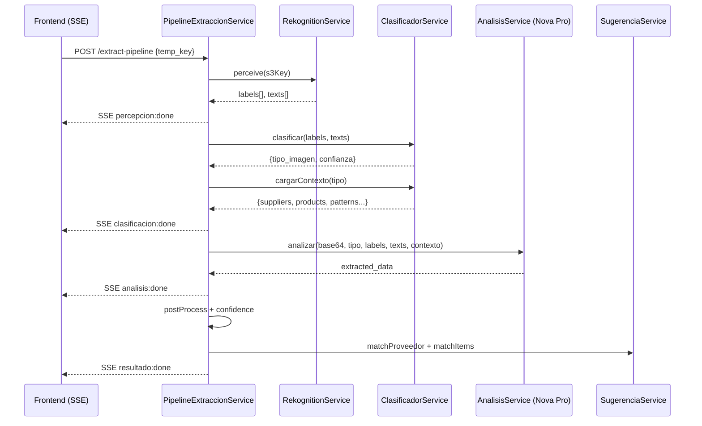
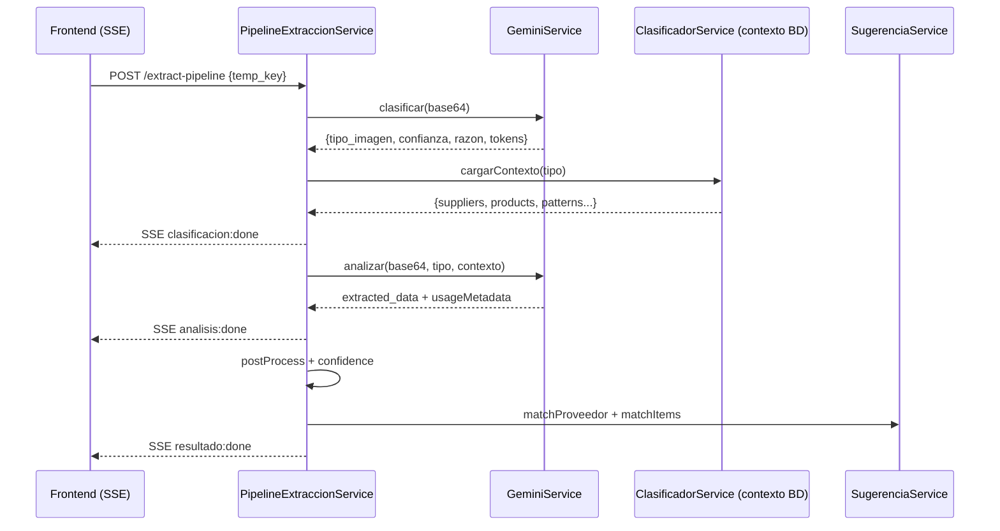
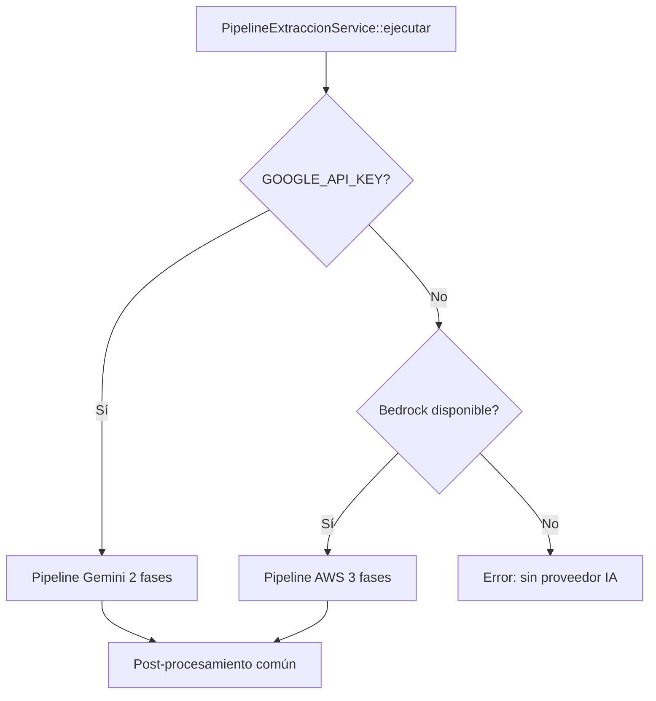

# Documento de Diseño — Migración Pipeline Compras a Google Gemini

## Resumen

Este diseño describe la migración del pipeline de extracción de compras desde AWS (Rekognition + Nova Micro + Nova Pro) hacia Google Gemini API (`gemini-2.5-flash-lite`). La arquitectura se simplifica de 3 fases a 2 fases aprovechando la capacidad multimodal nativa de Gemini, y se utiliza Structured Outputs (`responseJsonSchema`) para garantizar respuestas JSON válidas sin parseo de texto libre.

El cambio principal es reemplazar 3 servicios AWS por un único `GeminiService` que hace 2 llamadas secuenciales: clasificación → análisis. Toda la lógica de post-procesamiento, sugerencias y matching existente se preserva intacta.

## Arquitectura

### Pipeline Actual (AWS — 3 fases)



### Pipeline Nuevo (Gemini — 2 fases)



### Decisión de Routing



## Componentes e Interfaces

### 1. GeminiService (NUEVO)

Ubicación: `mi3/backend/app/Services/Compra/GeminiService.php`

Responsabilidades:
- Encapsular llamadas HTTP (curl) a la API REST de Gemini
- Gestionar prompts específicos por tipo (reutilizando lógica de AnalisisService)
- Parsear respuestas con Structured Outputs
- Extraer métricas de tokens (usageMetadata)

```php
class GeminiService
{
    private string $model;      // env('GEMINI_MODEL', 'gemini-2.5-flash-lite')
    private string $apiKey;     // env('GOOGLE_API_KEY')
    private string $baseUrl = 'https://generativelanguage.googleapis.com/v1beta/models';

    public function clasificar(string $imageBase64): ?array;
    // Retorna: {tipo_imagen, confianza, razon, tokens: {prompt, candidates, total}}

    public function analizar(string $imageBase64, string $tipo, array $contexto): ?array;
    // Retorna: {data: [...extracted], tokens: {prompt, candidates, total}}

    private function callGemini(string $prompt, string $imageBase64, array $schema, int $timeout): ?array;
    // Ejecuta POST con curl, retorna respuesta parseada + usageMetadata

    private function buildClassificationSchema(): array;
    private function buildExtractionSchema(): array;
    private function parseResponse(array $response): ?array;
    private function normalizeAmounts(array $data): array;
    // Misma lógica que AnalisisService::normalizeAmounts()
}
```

### 2. PipelineExtraccionService (MODIFICADO)

Cambios:
- Nuevo método `ejecutarGemini()` para el flujo de 2 fases
- Método `ejecutar()` detecta proveedor disponible y delega
- Emite eventos SSE con identificador de motor (`engine: gemini|bedrock`)
- Calcula y almacena costo estimado de tokens

```php
// Nuevo flujo dentro de ejecutar():
if ($this->isGeminiAvailable()) {
    return $this->ejecutarGemini($imageUrl, $onEvent);
}
// else: flujo AWS existente sin cambios
```

### 3. ExtractionPipeline.tsx (MODIFICADO)

Cambios:
- Detecta motor desde primer evento SSE (campo `engine`)
- Renderiza 2 o 3 fases según motor
- Labels de fases adaptados: "Clasificando imagen (Gemini)" / "Analizando con IA (Gemini)"

### 4. ComprasSection.tsx (MODIFICADO)

Cambio mínimo: versión `v1.6` → `v1.7`

## Modelos de Datos

### Request a Gemini API (Clasificación)

```json
{
  "contents": [{
    "parts": [
      {"inline_data": {"mime_type": "image/jpeg", "data": "<base64>"}},
      {"text": "<prompt_clasificacion>"}
    ]
  }],
  "generationConfig": {
    "temperature": 0.1,
    "maxOutputTokens": 256,
    "responseMimeType": "application/json",
    "responseSchema": {
      "type": "object",
      "properties": {
        "tipo_imagen": {"type": "string", "enum": ["boleta", "factura", "producto", "bascula", "transferencia", "desconocido"]},
        "confianza": {"type": "number"},
        "razon": {"type": "string"}
      },
      "required": ["tipo_imagen", "confianza", "razon"]
    }
  }
}
```

### Request a Gemini API (Análisis)

```json
{
  "contents": [{
    "parts": [
      {"inline_data": {"mime_type": "image/jpeg", "data": "<base64>"}},
      {"text": "<prompt_especifico_por_tipo + contexto BD>"}
    ]
  }],
  "generationConfig": {
    "temperature": 0.1,
    "maxOutputTokens": 2048,
    "responseMimeType": "application/json",
    "responseSchema": {
      "type": "object",
      "properties": {
        "tipo_imagen": {"type": "string"},
        "proveedor": {"type": "string"},
        "rut_proveedor": {"type": "string"},
        "fecha": {"type": "string"},
        "metodo_pago": {"type": "string", "enum": ["cash", "transfer", "card", "credit"]},
        "tipo_compra": {"type": "string", "enum": ["ingredientes", "insumos", "equipamiento", "otros"]},
        "items": {
          "type": "array",
          "items": {
            "type": "object",
            "properties": {
              "nombre": {"type": "string"},
              "cantidad": {"type": "number"},
              "unidad": {"type": "string"},
              "precio_unitario": {"type": "integer"},
              "subtotal": {"type": "integer"},
              "descuento": {"type": "integer"},
              "empaque_detalle": {"type": "string"}
            },
            "required": ["nombre", "cantidad", "unidad", "precio_unitario", "subtotal"]
          }
        },
        "monto_neto": {"type": "integer"},
        "iva": {"type": "integer"},
        "monto_total": {"type": "integer"},
        "peso_bascula": {"type": "number"},
        "unidad_bascula": {"type": "string"},
        "notas_ia": {"type": "string"}
      },
      "required": ["tipo_imagen", "items", "monto_total"]
    }
  }
}
```

### Respuesta de Gemini API

```json
{
  "candidates": [{
    "content": {
      "parts": [{"text": "{...JSON garantizado por schema...}"}],
      "role": "model"
    },
    "finishReason": "STOP"
  }],
  "usageMetadata": {
    "promptTokenCount": 1523,
    "candidatesTokenCount": 245,
    "totalTokenCount": 1768
  }
}
```

### AiExtractionLog (campo raw_response con Gemini)

```json
{
  "pipeline_phases": {
    "clasificacion": {"elapsed_ms": 1200, "tipo": "boleta", "confianza": 0.95},
    "analisis": {"elapsed_ms": 3400, "success": true, "model_id": "gemini-2.5-flash-lite"}
  },
  "tokens": {
    "clasificacion": {"prompt": 800, "candidates": 50, "total": 850},
    "analisis": {"prompt": 2100, "candidates": 400, "total": 2500},
    "total": {"prompt": 2900, "candidates": 450, "total": 3350}
  },
  "estimated_cost_usd": 0.00047,
  "engine": "gemini"
}
```

### Evento SSE (formato actualizado)

```json
{"fase": "clasificacion", "status": "done", "engine": "gemini", "data": {"tipo_imagen": "boleta", "confianza": 0.95, "tokens": 850}, "elapsed_ms": 1200}
```

## Propiedades de Correctitud

*Una propiedad es una característica o comportamiento que debe mantenerse verdadero en todas las ejecuciones válidas de un sistema — esencialmente, una declaración formal sobre lo que el sistema debe hacer. Las propiedades sirven como puente entre especificaciones legibles por humanos y garantías de correctitud verificables por máquina.*

### Propiedad 1: Parseo robusto de respuesta Gemini

*Para cualquier* string JSON válido, ya sea directo o envuelto en bloques markdown (` ```json...``` `), el método `parseResponse` de GeminiService debe extraer y decodificar el JSON correctamente, produciendo un array PHP equivalente al JSON original.

**Validates: Requirements 1.5, 1.6**

### Propiedad 2: Selección correcta de prompt por tipo

*Para cualquier* tipo de imagen válido (`boleta`, `factura`, `producto`, `bascula`, `transferencia`, `desconocido`), GeminiService debe seleccionar el prompt específico correspondiente a ese tipo, y el prompt generado debe contener las instrucciones y reglas particulares de ese tipo de documento.

**Validates: Requirements 1.3**

### Propiedad 3: Normalización de montos a enteros CLP

*Para cualquier* conjunto de datos extraídos con montos numéricos (incluyendo notación abreviada de básculas donde valores < 200 representan miles), `normalizeAmounts` debe producir enteros en pesos chilenos, y aplicar descuentos recalculando `precio_unitario = subtotal / cantidad`.

**Validates: Requirements 4.3**

### Propiedad 4: Normalización de tipo_imagen inválido

*Para cualquier* string retornado como `tipo_imagen` por Gemini, si no pertenece al conjunto válido (`boleta`, `factura`, `producto`, `bascula`, `transferencia`, `desconocido`), debe normalizarse a `desconocido`.

**Validates: Requirements 8.3**

### Propiedad 5: Cálculo correcto de métricas de tokens y costo

*Para cualquier* par de respuestas Gemini con `usageMetadata`, el total de tokens debe ser la suma de ambas llamadas (clasificación + análisis), y el costo estimado debe calcularse como `(promptTokens × $0.10 + candidatesTokens × $0.40) / 1_000_000`.

**Validates: Requirements 5.3, 5.4, 1.8**

### Propiedad 6: Resiliencia ante excepciones

*Para cualquier* excepción no controlada durante la ejecución del pipeline, el sistema debe capturarla y retornar un resultado con `success: false`, el mensaje de error, y `fallback: manual`, sin interrumpir el flujo SSE.

**Validates: Requirements 8.5**

### Propiedad 7: Estructura invariante del resultado exitoso

*Para cualquier* extracción exitosa del pipeline (independientemente del motor usado), el resultado debe contener todos los campos requeridos: `success`, `extraction_log_id`, `data`, `confianza`, `overall_confidence`, `processing_time_ms`, `pipeline_phases`, `sugerencias`.

**Validates: Requirements 4.4**

## Manejo de Errores

| Escenario | Acción | Resultado |
|-----------|--------|-----------|
| `GOOGLE_API_KEY` no configurada + Bedrock no disponible | Retornar error descriptivo | `{success: false, error: "No hay proveedor IA disponible"}` |
| Timeout en clasificación Gemini (>8s) | Usar `fallbackClassification` de ClasificadorService | Pipeline continúa con tipo `desconocido` + prompt general |
| Timeout en análisis Gemini (>20s) | Abortar, registrar en log | `{success: false, fallback: "manual"}` |
| Respuesta Gemini sin JSON válido | Intentar extraer de bloques markdown; si falla → null | Pipeline retorna fallback manual |
| Gemini retorna tipo_imagen inválido | Normalizar a `desconocido` | Pipeline continúa con prompt general |
| Error HTTP de Gemini (4xx/5xx) | Log del error, retornar null | Pipeline retorna fallback manual |
| Excepción no controlada en pipeline | Capturar, emitir SSE error, registrar en AiExtractionLog | `{success: false, error: mensaje}` |
| Imagen no disponible en S3 | Emitir SSE error | `{success: false, error: "No se pudo obtener la imagen"}` |

## Estrategia de Testing

### Tests Unitarios (PHPUnit)

- **GeminiService::parseResponse** — Verificar parseo de JSON directo y desde bloques markdown
- **GeminiService::normalizeAmounts** — Verificar normalización de montos con casos edge (básculas, descuentos)
- **GeminiService::buildClassificationSchema** — Verificar estructura del schema
- **GeminiService::buildExtractionSchema** — Verificar estructura del schema
- **Selección de prompt por tipo** — Verificar que cada tipo mapee al prompt correcto
- **Normalización de tipo_imagen** — Verificar que tipos inválidos se normalicen a "desconocido"
- **Cálculo de costo** — Verificar fórmula con valores conocidos
- **Detección de proveedor disponible** — Verificar lógica con/sin GOOGLE_API_KEY

### Tests de Propiedad (PBT)

Se usará un enfoque de property-based testing con generadores de datos aleatorios para validar las propiedades de correctitud. Librería: custom generators con PHPUnit (o `spatie/phpunit-snapshot-assertions` para schemas). Cada test ejecutará mínimo 100 iteraciones.

- **Property 1**: Generar JSON aleatorio, envolver en formatos variados (directo, ` ```json...``` `), verificar round-trip de parseo
- **Property 2**: Generar tipos aleatorios del enum, verificar que el prompt contenga keywords específicas del tipo
- **Property 3**: Generar montos aleatorios (incluyendo notación abreviada), verificar que salida sea enteros CLP válidos
- **Property 4**: Generar strings aleatorios como tipo_imagen, verificar normalización correcta
- **Property 5**: Generar pares de usageMetadata aleatorios, verificar suma y cálculo de costo
- **Property 6**: Simular excepciones aleatorias, verificar estructura de resultado fallido
- **Property 7**: Generar datos de extracción aleatorios, verificar presencia de todos los campos requeridos

Tag format: `Feature: gemini-compras-pipeline, Property {N}: {título}`

Configuración: mínimo 100 iteraciones por propiedad.

### Tests de Integración

- **Llamada real a Gemini** (con imagen de prueba) — Verificar formato de request/response
- **Pipeline completo con mock de Gemini** — Verificar flujo SSE de 2 fases
- **Fallback cuando Gemini no disponible** — Verificar que se active clasificación por reglas

### Tests Frontend (Vitest + React Testing Library)

- **ExtractionPipeline con motor gemini** — Verificar renderizado de 2 fases
- **ExtractionPipeline con motor bedrock** — Verificar renderizado de 3 fases
- **ComprasSection** — Verificar versión v1.7
