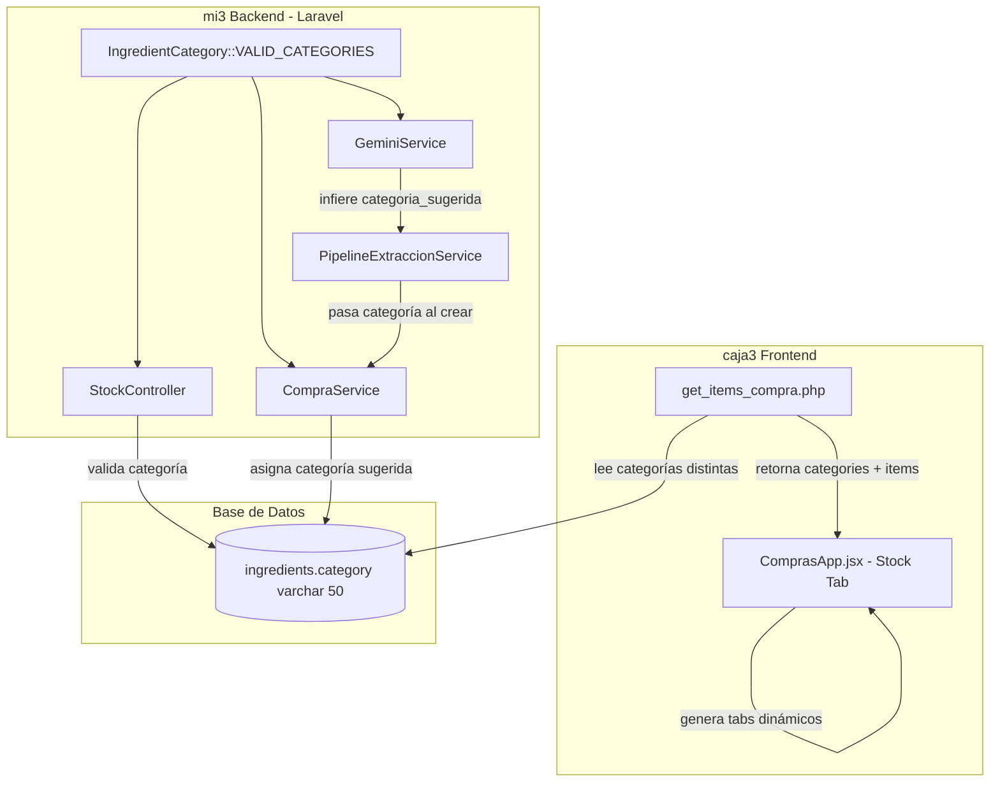

# Documento de Diseño: Mejora del Sistema de Categorías de Ingredientes

## Resumen

Este diseño aborda la mejora del sistema de categorías de ingredientes en La Ruta 11, cubriendo: corrección de datos corruptos (encoding), limpieza de categorías legacy, implementación de tabs dinámicos en el frontend de Stock (caja3), exposición de categorías vía API, inferencia de categoría por IA (GeminiService), y validación de categorías al crear/editar ingredientes.

La decisión arquitectónica clave es **NO crear una tabla separada de categorías**. En su lugar, se usa una constante `VALID_CATEGORIES` definida en el backend de mi3 como fuente de verdad, expuesta vía API para que los frontends la consuman dinámicamente.

## Arquitectura



### Flujo de datos

1. **Constante centralizada**: `IngredientCategory::VALID_CATEGORIES` en mi3 define las 13 categorías válidas
2. **API expone categorías**: `get_items_compra.php` retorna un campo `categories` con las categorías únicas + conteo
3. **Frontend dinámico**: ComprasApp.jsx genera tabs a partir de `categories` en la respuesta API
4. **IA infiere categoría**: GeminiService incluye `categoria_sugerida` en el schema de extracción
5. **Validación en escritura**: StockController valida contra la constante antes de guardar

## Componentes e Interfaces

### 1. Constante de Categorías Válidas (mi3)

**Archivo**: `mi3/backend/app/Enums/IngredientCategory.php`

```php
<?php
namespace App\Enums;

class IngredientCategory
{
    public const VALID_CATEGORIES = [
        'Carnes',
        'Vegetales',
        'Salsas',
        'Condimentos',
        'Panes',
        'Embutidos',
        'Pre-elaborados',
        'Lácteos',
        'Bebidas',
        'Gas',
        'Servicios',
        'Packaging',
        'Limpieza',
    ];

    public static function isValid(?string $category): bool
    {
        return $category !== null && in_array($category, self::VALID_CATEGORIES, true);
    }

    public static function all(): array
    {
        return self::VALID_CATEGORIES;
    }
}
```

### 2. StockController - Validación (mi3)

El método `update()` valida que `category` sea una categoría válida:

```php
use Illuminate\Validation\Rule;
use App\Enums\IngredientCategory;

$data = $request->validate([
    'category' => ['nullable', 'string', Rule::in(IngredientCategory::VALID_CATEGORIES)],
    // ... otros campos
]);
```

### 3. CompraService - Asignación de categoría (mi3)

`crearIngrediente()` acepta y aplica `category` desde la sugerencia de IA o input del usuario:

```php
public function crearIngrediente(array $data): Ingredient
{
    $category = $data['category'] ?? null;
    if ($category && !IngredientCategory::isValid($category)) {
        $category = null;
    }

    return Ingredient::create([
        'name' => $data['name'],
        'category' => $category,
        // ...
    ]);
}
```

### 4. GeminiService - Schema con categoria_sugerida (mi3)

Se agrega `categoria_sugerida` al schema de items en `buildExtractionSchema()`:

```php
'categoria_sugerida' => [
    'type' => 'string',
    'enum' => array_merge(IngredientCategory::VALID_CATEGORIES, ['Sin categoría']),
],
```

Los prompts se actualizan para instruir a Gemini a inferir la categoría basándose en el nombre del ítem y la lista de categorías válidas.

### 5. API get_items_compra.php - Respuesta con categorías (caja3)

La respuesta cambia de un array plano a un objeto estructurado:

```json
{
  "items": [...],
  "categories": [
    {"name": "Carnes", "count": 12},
    {"name": "Vegetales", "count": 8}
  ],
  "valid_categories": ["Carnes", "Vegetales", "Salsas", ...]
}
```

Se calcula con un `SELECT DISTINCT category, COUNT(*) FROM ingredients WHERE is_active = 1 AND category IS NOT NULL GROUP BY category`.

### 6. ComprasApp.jsx - Tabs dinámicos (caja3)

Reemplaza los 2 tabs hardcodeados ("Ingredientes", "Bebidas") por:
- Tab "Todos" (siempre primero, sin filtro)
- Tab "Bebidas" (mantiene lógica existente de subcategory_id [10,11,27,28])
- Tabs dinámicos por cada categoría retornada por la API
- Contenedor con `overflow-x: auto` para scroll horizontal

## Modelos de Datos

### Tabla `ingredients` (sin cambios de schema)

| Campo | Tipo | Descripción |
|-------|------|-------------|
| category | varchar(50) | Categoría del ingrediente. Valores válidos definidos por constante. |

**Migración SQL de datos:**
```sql
-- Fix encoding corrupto
UPDATE ingredients SET category = 'Lácteos' WHERE category = 'Lácteos';

-- Eliminar categoría legacy vacía
UPDATE ingredients SET category = NULL WHERE category = 'Ingredientes';
```

### Constante VALID_CATEGORIES (13 valores)

```
Carnes, Vegetales, Salsas, Condimentos, Panes, Embutidos, 
Pre-elaborados, Lácteos, Bebidas, Gas, Servicios, Packaging, Limpieza
```

### Schema de extracción GeminiService (campo nuevo)

```typescript
interface ExtractedItem {
  nombre: string;
  cantidad: number;
  unidad: string;
  precio_unitario: number;
  subtotal: number;
  descuento?: number;
  empaque_detalle?: string;
  categoria_sugerida?: string; // NUEVO - una de VALID_CATEGORIES o "Sin categoría"
}
```

## Propiedades de Correctitud

*Una propiedad es una característica o comportamiento que debe mantenerse verdadero en todas las ejecuciones válidas de un sistema — esencialmente, una declaración formal sobre lo que el sistema debe hacer. Las propiedades sirven como puente entre especificaciones legibles por humanos y garantías de correctitud verificables por máquina.*

### Propiedad 1: Generación dinámica de tabs por categorías

*Para cualquier* conjunto de ítems retornados por la API con N categorías distintas no vacías, el Frontend_Stock SHALL renderizar exactamente N tabs de categoría (más los tabs fijos "Todos" y "Bebidas").

**Valida: Requisitos 3.1, 3.5**

### Propiedad 2: Filtrado correcto por categoría seleccionada

*Para cualquier* lista de ítems y cualquier categoría seleccionada, todos los ítems mostrados SHALL tener su campo `category` igual a la categoría del tab seleccionado, y ningún ítem con categoría diferente SHALL aparecer en la lista filtrada.

**Valida: Requisitos 3.2**

### Propiedad 3: Extracción correcta de categorías desde ingredientes activos

*Para cualquier* conjunto de ingredientes activos en la base de datos, la API SHALL retornar exactamente las categorías distintas que tienen al menos un ingrediente activo, cada una con el conteo correcto de ingredientes asociados.

**Valida: Requisitos 4.1, 4.2, 4.3**

### Propiedad 4: Aplicación de categoría sugerida al crear ingrediente

*Para cualquier* categoría válida proporcionada como `categoria_sugerida`, cuando el CompraService crea un ingrediente nuevo, el ingrediente resultante SHALL tener esa categoría asignada.

**Valida: Requisitos 5.3, 5.5**

### Propiedad 5: Validación de categorías rechaza valores inválidos

*Para cualquier* string que NO esté en la lista de VALID_CATEGORIES, el StockController SHALL rechazar la operación de crear/actualizar con un error de validación, y *para cualquier* string que SÍ esté en VALID_CATEGORIES, la operación SHALL ser aceptada.

**Valida: Requisitos 6.1, 6.2**

## Manejo de Errores

| Escenario | Comportamiento |
|-----------|---------------|
| Categoría inválida en StockController | HTTP 422 con mensaje descriptivo listando categorías válidas |
| GeminiService no puede inferir categoría | Retorna `categoria_sugerida: "Sin categoría"` |
| API retorna 0 categorías (BD vacía) | Frontend muestra solo tabs "Todos" y "Bebidas" |
| Encoding corrupto persiste post-migración | Log warning, ingrediente se muestra con category = null |
| CompraService recibe categoría inválida de IA | Ignora la sugerencia, guarda con category = null |
| Frontend recibe respuesta en formato antiguo (array plano) | Fallback: detecta si es array y usa lógica legacy |

## Estrategia de Testing

### Tests Unitarios (ejemplo-based)

- **Migración SQL**: Verificar 0 registros con "Lácteos" y 0 con "Ingredientes"
- **Tab "Todos"**: Muestra todos los ítems sin filtro
- **Tab "Bebidas"**: Filtra por subcategory_id [10, 11, 27, 28]
- **Scroll horizontal**: CSS overflow-x aplicado al contenedor de tabs
- **API valid_categories**: Retorna las 13 categorías definidas
- **GeminiService schema**: Incluye `categoria_sugerida` con enum correcto
- **Fallback formato antiguo**: Frontend maneja respuesta legacy sin crash

### Tests de Propiedad (property-based)

- **Librería**: fast-check (JavaScript) para lógica de filtrado frontend, PHPUnit con generadores para backend
- **Configuración**: Mínimo 100 iteraciones por propiedad
- **Tag format**: `Feature: ingredient-categories-improvement, Property {N}: {texto}`

Cada propiedad de correctitud se implementa como un test individual:

| Propiedad | Generador | Verificación |
|-----------|-----------|--------------|
| 1. Tabs dinámicos | Arrays de ítems con categorías aleatorias | Contar tabs === categorías únicas + 2 fijos |
| 2. Filtrado | Ítems + categoría seleccionada aleatoria | Todos los ítems visibles tienen la categoría correcta |
| 3. Categorías API | Conjuntos de ingredientes con is_active y categorías mixtas | Categorías retornadas === DISTINCT de activos con count correcto |
| 4. Categoría sugerida | Categoría válida aleatoria como input | Ingrediente creado tiene esa categoría |
| 5. Validación | Strings aleatorios (válidos e inválidos) | Válidos aceptados, inválidos rechazados con 422 |

### Tests de Integración

- Pipeline completo: imagen → extracción → verificar `categoria_sugerida` presente en resultado
- Crear ingrediente vía API con categoría válida → verificar persistencia en BD
- Frontend carga datos reales → verificar tabs generados correctamente
