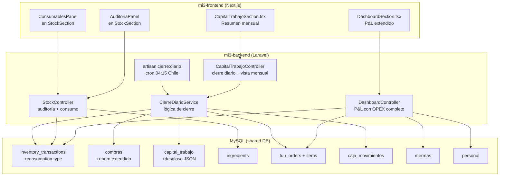

# Design Document — Inventario Financiero Real

## Overview

Este diseño corrige el sistema financiero de La Ruta 11 para reflejar la realidad operativa. Los problemas actuales son:

1. **Inventario inflado**: consumibles (gas, limpieza) se compran pero nunca se consumen → stock fantasma
2. **Capital de trabajo roto**: `capital_trabajo` tiene `saldo_inicial=0` e `ingresos_ventas=0` en todos los registros
3. **P&L incompleto**: solo considera CMV + nómina, falta gas, limpieza, mermas, packaging
4. **Categorías de compra insuficientes**: solo `ingredientes/insumos/equipamiento/otros`, no distingue gas de limpieza

La solución es incremental sobre la arquitectura existente: extender enums en MySQL, agregar un servicio de cierre diario en Laravel, extender el `DashboardController` existente, y agregar componentes React en mi3-frontend.

### Decisiones de diseño clave

- **No crear tablas nuevas**: reutilizar `inventory_transactions` (nuevo tipo `consumption`), `capital_trabajo` (agregar columna JSON para desglose), y `compras` (extender enum).
- **Cierre diario como Artisan command**: ejecutado por cron a las 04:15 Chile (07:15 UTC), reutilizando la infraestructura de scheduled tasks existente en mi3-backend.
- **P&L calculado en tiempo real**: el `DashboardController` ya hace queries a caja3 APIs. Extenderlo para incluir consumos y mermas directamente desde la BD compartida (misma MySQL).
- **Auditoría como endpoint batch**: un POST con array de `{ingredient_id, physical_count}` que aplica todo en una transacción.

## Architecture



### Flujo de datos

1. **Compra registrada** (ya existe en `CompraController`): se extiende para auto-clasificar `tipo_compra` según categoría del ingrediente.
2. **Consumo registrado** (modificado): `StockController::consumir` se modifica para usar tipo `consumption` en vez de `adjustment`, y validar stock >= 0.
3. **Cierre diario** (nuevo): `CierreDiarioCommand` ejecuta `CierreDiarioService::cerrar($fecha)` que agrega ventas, compras, consumos y retiros.
4. **P&L** (extendido): `DashboardController::index` agrega líneas OPEX consultando `inventory_transactions` tipo `consumption` y `mermas`.

## Components and Interfaces

### Backend Services

#### CierreDiarioService

Servicio central que calcula y persiste el cierre diario.

```php
class CierreDiarioService
{
    public function cerrar(string $fecha): array;
    // Calcula y guarda/actualiza capital_trabajo para $fecha
    // Returns: ['success' => bool, 'data' => CapitalTrabajo, 'warnings' => string[]]

    public function getResumenMensual(string $mes): array;
    // Returns: ['dias' => [...], 'totales' => [...]]

    private function calcularIngresos(string $fechaInicio, string $fechaFin): array;
    // Suma tuu_orders pagadas + caja_movimientos ingreso sin order_reference
    // Returns: ['total' => float, 'desglose' => ['webpay' => x, 'cash' => y, ...]]

    private function calcularEgresosCompras(string $fecha): float;
    // Suma compras.monto_total del día

    private function calcularEgresosGastos(string $fecha): float;
    // Suma consumos (inventory_transactions tipo consumption) + retiros caja
}
```

#### DashboardController (extendido)

Se extiende el endpoint existente `GET /api/v1/admin/dashboard` para incluir líneas OPEX adicionales.

```php
// Nuevas líneas en pnl.gastos_operacion:
'gastos_operacion' => [
    'nomina_ruta11' => float,    // ya existe
    'gas' => float,               // nuevo: consumos categoría Gas
    'limpieza' => float,          // nuevo: consumos categoría Limpieza
    'mermas' => float,            // nuevo: sum(mermas.cost) del mes
    'otros_gastos' => float,      // nuevo: consumos categoría Servicios
    'total_opex' => float,        // ya existe, ahora suma todo
],
```

#### StockController (extendido)

Se modifica `consumir()` para:
- Usar `transaction_type = 'consumption'` en vez de `'adjustment'`
- Validar que `current_stock >= cantidad` antes de consumir
- Retornar error 422 si stock insuficiente

Se agrega `auditoria()`:
```php
public function auditoria(Request $request): JsonResponse;
// POST /api/v1/admin/stock/auditoria
// Body: { items: [{ ingredient_id: int, physical_count: float }] }
// Aplica ajuste masivo, registra transacciones, recalcula productos, retorna resumen
```

### Backend Controllers

#### CapitalTrabajoController (nuevo)

```php
class CapitalTrabajoController
{
    public function resumenMensual(Request $request): JsonResponse;
    // GET /api/v1/admin/capital-trabajo?mes=2026-04
    // Returns: días del mes con saldo_inicial, ingresos, egresos, saldo_final + totales

    public function cierreManual(Request $request): JsonResponse;
    // POST /api/v1/admin/capital-trabajo/cierre
    // Body: { fecha: '2026-04-23' }
    // Ejecuta cierre para fecha específica
}
```

### API Endpoints (nuevos)

| Method | Path | Description |
|--------|------|-------------|
| POST | `/api/v1/admin/stock/auditoria` | Aplicar auditoría de inventario |
| GET | `/api/v1/admin/capital-trabajo` | Resumen mensual capital de trabajo |
| POST | `/api/v1/admin/capital-trabajo/cierre` | Cierre manual de un día |

### API Endpoints (modificados)

| Method | Path | Change |
|--------|------|--------|
| POST | `/api/v1/admin/stock/consumir` | Tipo `consumption`, validación stock >= 0 |
| GET | `/api/v1/admin/dashboard` | OPEX extendido con gas, limpieza, mermas |
| POST | `/api/v1/admin/compras` | Auto-clasificación tipo_compra |

### Frontend Components

#### DashboardSection.tsx (extendido)

Se extiende la tabla P&L existente para mostrar las nuevas líneas OPEX:
- Nómina Equipo (ya existe)
- Gas (nuevo)
- Limpieza (nuevo)
- Mermas (nuevo)
- Otros Gastos (nuevo)
- **Total OPEX** (ahora suma todo)

Se agrega la línea "Meta Mensual (Punto de Equilibrio)" calculada como `total_opex / margen_bruto_pct`.

#### CapitalTrabajoSection.tsx (nuevo)

Nueva sección lazy-loaded en AdminShell (`capital` key):
- Selector de mes (input type="month")
- Tabla: Fecha | Saldo Inicial | Ingresos | Compras | Gastos | Saldo Final
- Fila de totales al final
- Días sin cierre marcados con badge "Sin cierre"
- Botón "Cerrar día" para cierre manual

#### StockSection — Panel de Consumibles y Auditoría

Dentro de la sección Stock existente (accesible desde Compras), agregar:

**Panel Consumibles:**
- Lista filtrada de ingredientes categoría Gas/Limpieza/Servicios
- Cada fila: nombre, stock actual, unidad, costo unitario, valor inventario
- Botón "Consumir" que abre modal con input de cantidad
- Validación client-side: cantidad <= stock disponible

**Panel Auditoría:**
- Botón "Auditoría Física" que muestra lista de ingredientes activos con stock actual
- Input editable para "Conteo Físico" por cada ingrediente
- Preview de diferencias antes de confirmar
- Botón "Aplicar Auditoría" que ejecuta el POST
- Resumen post-aplicación: ítems modificados, valor antes/después, diferencia

### Cron Job

```
# En mi3-backend Kernel.php (schedule)
$schedule->command('cierre:diario')->dailyAt('07:15'); // 04:15 Chile (UTC-3)
```

El comando `CierreDiarioCommand`:
1. Calcula la fecha del turno que acaba de terminar (ayer si son las 04:15)
2. Llama a `CierreDiarioService::cerrar($fecha)`
3. Log del resultado

### Integration with caja3/app3

- **Sin cambios en caja3/app3**: toda la lógica nueva vive en mi3-backend
- **Queries directas a MySQL**: `CierreDiarioService` consulta `tuu_orders`, `compras`, `caja_movimientos`, `inventory_transactions` directamente (misma BD)
- **DashboardController**: se elimina la dependencia de HTTP calls a `caja3/api/get_sales_analytics.php` para CMV, y se calcula directamente desde `tuu_order_items` en la BD compartida. Se mantiene el call a `get_dashboard_cards.php` solo para ventas/meta/proyección (que depende de `get_smart_projection_shifts.php`).

## Data Models

### DB Migrations

#### Migration 1: Extend `inventory_transactions.transaction_type` enum

```sql
ALTER TABLE inventory_transactions 
MODIFY COLUMN transaction_type ENUM('sale', 'purchase', 'adjustment', 'return', 'consumption');
```

#### Migration 2: Extend `compras.tipo_compra` enum

```sql
ALTER TABLE compras 
MODIFY COLUMN tipo_compra ENUM('ingredientes', 'insumos', 'equipamiento', 'otros', 'gas', 'limpieza', 'packaging', 'servicios') 
DEFAULT 'ingredientes';
```

#### Migration 3: Add JSON desglose columns to `capital_trabajo`

```sql
ALTER TABLE capital_trabajo 
ADD COLUMN desglose_ingresos JSON NULL AFTER ingresos_ventas,
ADD COLUMN desglose_gastos JSON NULL AFTER egresos_gastos;
```

Formato `desglose_ingresos`:
```json
{
  "webpay": 150000,
  "cash": 80000,
  "transfer": 30000,
  "card": 20000,
  "rl6_credit": 15000,
  "pedidosya": 5000,
  "manual_cash": 10000
}
```

Formato `desglose_gastos`:
```json
{
  "consumo_gas": 5000,
  "consumo_limpieza": 3000,
  "consumo_servicios": 0,
  "retiros_caja": 20000
}
```

#### Migration 4: Reclassify existing purchases

```sql
-- Gas: proveedor Abastible
UPDATE compras SET tipo_compra = 'gas' 
WHERE tipo_compra IN ('otros', 'insumos') 
AND LOWER(proveedor) LIKE '%abastible%';

-- Limpieza: ingredientes categoría Limpieza
UPDATE compras c 
JOIN compras_detalle cd ON c.id = cd.compra_id 
JOIN ingredients i ON cd.ingrediente_id = i.id 
SET c.tipo_compra = 'limpieza' 
WHERE c.tipo_compra IN ('otros', 'insumos') 
AND i.category = 'Limpieza';

-- Packaging: ingredientes categoría Packaging
UPDATE compras c 
JOIN compras_detalle cd ON c.id = cd.compra_id 
JOIN ingredients i ON cd.ingrediente_id = i.id 
SET c.tipo_compra = 'packaging' 
WHERE c.tipo_compra IN ('otros', 'insumos') 
AND i.category = 'Packaging';

-- Servicios: ingredientes categoría Servicios
UPDATE compras c 
JOIN compras_detalle cd ON c.id = cd.compra_id 
JOIN ingredients i ON cd.ingrediente_id = i.id 
SET c.tipo_compra = 'servicios' 
WHERE c.tipo_compra IN ('otros', 'insumos') 
AND i.category = 'Servicios';
```

#### Migration 5: Recalculate capital_trabajo

Ejecutado como Artisan command `cierre:recalcular-historico` que:
1. Obtiene la fecha más antigua con datos en `tuu_orders`
2. Itera día por día hasta hoy
3. Para cada día, ejecuta `CierreDiarioService::cerrar($fecha)`
4. Encadena `saldo_final` → `saldo_inicial` del día siguiente

### Laravel Models

#### CapitalTrabajo (extendido)

```php
class CapitalTrabajo extends Model
{
    protected $table = 'capital_trabajo';
    protected $fillable = [
        'fecha', 'saldo_inicial', 'ingresos_ventas', 'desglose_ingresos',
        'egresos_compras', 'egresos_gastos', 'desglose_gastos', 'saldo_final', 'notas',
    ];
    protected $casts = [
        'fecha' => 'date',
        'desglose_ingresos' => 'array',
        'desglose_gastos' => 'array',
    ];
}
```

### Category-to-Purchase-Type Mapping

```php
const CATEGORY_TO_TIPO_COMPRA = [
    'Gas'        => 'gas',
    'Limpieza'   => 'limpieza',
    'Packaging'  => 'packaging',
    'Servicios'  => 'servicios',
    // Todo lo demás → 'ingredientes' (default)
];
```

## Correctness Properties

*A property is a characteristic or behavior that should hold true across all valid executions of a system — essentially, a formal statement about what the system should do. Properties serve as the bridge between human-readable specifications and machine-verifiable correctness guarantees.*

### Property 1: Audit round-trip preserves physical counts

*For any* set of active ingredients with arbitrary system stock values and arbitrary physical count values, applying an inventory audit and then reading back the `current_stock` of each ingredient should return exactly the physical count value that was submitted.

**Validates: Requirements 1.2, 1.3**

### Property 2: Audit trail completeness

*For any* inventory audit where N ingredients have a difference between system stock and physical count, exactly N `adjustment` transactions should be created in `inventory_transactions`, each with correct `previous_stock` and `new_stock` values.

**Validates: Requirements 1.4**

### Property 3: Product stock derivation from recipe

*For any* product with a recipe consisting of K ingredients, after an inventory audit the product's `stock_quantity` should equal `floor(min(ingredient.current_stock / recipe.quantity))` across all K recipe ingredients (applying g→kg conversion where `recipe.unit = 'g'`).

**Validates: Requirements 1.5**

### Property 4: Audit summary correctness

*For any* inventory audit, the summary should report: items_modified = count of ingredients where physical_count ≠ system_stock, valor_antes = sum(old_stock × cost_per_unit), valor_despues = sum(new_stock × cost_per_unit), and diferencia = valor_despues − valor_antes.

**Validates: Requirements 1.6**

### Property 5: Consumable filter correctness

*For any* set of ingredients with various categories and active states, the consumables list should contain exactly those ingredients where `is_active = 1` AND `category IN ('Gas', 'Limpieza', 'Servicios')`.

**Validates: Requirements 2.1**

### Property 6: Consumption reduces stock and records transaction with correct cost

*For any* consumable ingredient with stock S ≥ C (where C is the consumption amount), after registering a consumption: (a) `current_stock` should equal S − C, (b) a `consumption` transaction should exist with `quantity = -C`, `previous_stock = S`, `new_stock = S − C`, and (c) the recorded cost should equal C × `cost_per_unit`.

**Validates: Requirements 2.2, 2.3, 2.4**

### Property 7: Consumption rejection when stock insufficient

*For any* consumable ingredient with stock S and consumption amount C where C > S, the consumption operation should be rejected and `current_stock` should remain unchanged at S.

**Validates: Requirements 2.5**

### Property 8: Purchase auto-classification from ingredient category

*For any* purchase containing items linked to ingredients, the `tipo_compra` should be automatically set according to the mapping: Gas→gas, Limpieza→limpieza, Packaging→packaging, Servicios→servicios, and all other categories→ingredientes.

**Validates: Requirements 3.2**

### Property 9: Daily close chain invariant

*For any* sequence of consecutive daily closes, day N's `saldo_inicial` should equal day (N−1)'s `saldo_final`. If day (N−1) has no record, `saldo_inicial` should be 0.

**Validates: Requirements 4.2, 4.8**

### Property 10: Daily close accounting equation

*For any* daily close with arbitrary orders, purchases, consumptions, and cash movements, the equation `saldo_final = saldo_inicial + ingresos_ventas − egresos_compras − egresos_gastos` must hold exactly.

**Validates: Requirements 4.3, 4.4, 4.5, 4.6**

### Property 11: Income includes all paid orders regardless of payment method

*For any* set of orders with various `payment_method` values, the daily close `ingresos_ventas` should include all orders where `payment_status = 'paid'` and exclude all others, regardless of payment method.

**Validates: Requirements 5.1, 5.4**

### Property 12: Income breakdown partition

*For any* daily close, the sum of all values in `desglose_ingresos` (by payment method) should equal `ingresos_ventas`.

**Validates: Requirements 5.2**

### Property 13: P&L accounting equation

*For any* month's financial data, `resultado_neto = ingresos_netos − cmv − total_opex`, where `ingresos_netos = sum(installment_amount − delivery_fee)` for paid orders, `cmv = sum(item_cost × quantity)` from order items, and `total_opex = nomina + gas + limpieza + mermas + otros_gastos`.

**Validates: Requirements 6.1, 6.2, 6.3, 6.5, 6.6**

### Property 14: P&L OPEX completeness

*For any* month with consumption transactions and merma records, the P&L OPEX section should include a line for each category (Nómina, Gas, Limpieza, Mermas, Otros Gastos), and `total_opex` should equal the sum of all individual OPEX lines.

**Validates: Requirements 6.4, 6.5**

### Property 15: P&L percentage calculation

*For any* P&L line with value V and total ingresos_netos I where I > 0, the displayed percentage should equal `round((V / I) × 100, 1)`.

**Validates: Requirements 6.7**

### Property 16: Monthly totals partition

*For any* month with daily capital_trabajo records, the monthly total for each column (ingresos, egresos_compras, egresos_gastos) should equal the sum of the corresponding daily values.

**Validates: Requirements 7.3**

## Error Handling

| Scenario | Handling |
|----------|----------|
| Consumo excede stock | Rechazar con 422 + mensaje "Stock insuficiente: disponible X {unit}" |
| Auditoría con ingredient_id inválido | Ignorar ítem, incluir en warnings del response |
| Cierre diario sin órdenes del día | Generar registro con ingresos=0 (día sin operación es válido) |
| Cierre diario sin día anterior | saldo_inicial=0, nota "Sin registro día anterior" |
| DashboardController timeout a caja3 | Mantener comportamiento actual: silently fail, mostrar 0 |
| Migration de compras sin ingrediente asociado | Mantener tipo_compra original (no reclasificar) |
| Doble ejecución cierre mismo día | `updateOrCreate` por fecha — idempotente |

## Testing Strategy

### Property-Based Tests (fast-check / PHPUnit)

Se usará `fast-check` para lógica de cálculo en TypeScript y PHPUnit con generadores custom para la lógica PHP del backend.

**Configuración**: mínimo 100 iteraciones por property test.

Los tests de properties se enfocan en la lógica pura de cálculo:
- `CierreDiarioService`: ecuación contable (P10), cadena de saldos (P9), partición de ingresos (P12)
- `StockController`: auditoría round-trip (P1), consumo con validación (P6, P7), filtro consumibles (P5)
- `DashboardController`: P&L equation (P13), OPEX completeness (P14), percentages (P15)
- Auto-clasificación de compras (P8)
- Product stock derivation (P3)

Tag format: **Feature: inventario-financiero-real, Property {N}: {description}**

### Unit Tests (PHPUnit)

- `CierreDiarioService::cerrar()` con datos concretos de un día típico
- `StockController::auditoria()` con ingredientes reales del sistema
- `StockController::consumir()` edge cases: stock exacto, stock 0
- `CompraService` auto-clasificación con proveedores conocidos (Abastible → gas)
- Audit summary con valores monetarios concretos
- Migration command: verificar reclasificación de compras existentes

### Integration Tests

- Cron command `cierre:diario` ejecuta sin errores
- `DashboardController` retorna estructura P&L completa con nuevas líneas OPEX
- Migrations ejecutan sin errores en BD de test
- `capital_trabajo` encadenamiento correcto después de recalcular histórico
