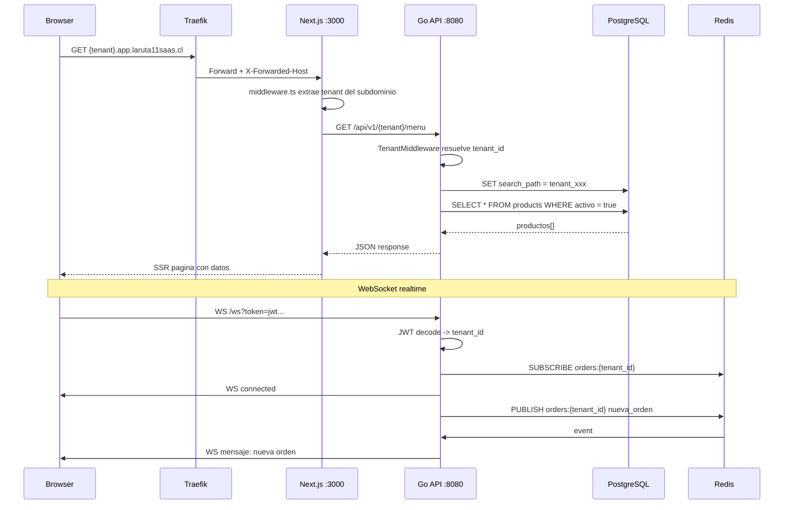

# Documento de Diseno — La Ruta 11 SaaS

## Resumen

Este diseno describe la arquitectura completa del SaaS multi-tenant para La Ruta 11. Se migra de un monolito PHP/MySQL con 4 apps separadas a un monorepo Go + Next.js + PostgreSQL con schema-per-tenant, WebSocket nativo para realtime, PWA para mobile, y deploy automatico via Coolify.

## Arquitectura General

```
┌─────────────────────────────────────────────────────────┐
│                    Traefik (SSL)                        │
│              api.laruta11saas.cl                        │
│              app.laruta11saas.cl                        │
│         *.app.laruta11saas.cl (wildcard)                │
└──────────┬──────────────────┬───────────────────────────┘
           │                  │
     ┌─────▼─────┐     ┌─────▼─────┐
     │ saas-api  │     │ saas-web  │
     │  Go/Gin   │     │ Next.js   │
     │  :8080    │     │  :3000    │
     └──┬───┬────┘     └───────────┘
        │   │
   ┌────▼┐ ┌▼────┐
   │ PG  │ │Redis│
   │ :5432│ │:6379│
   └──────┘ └─────┘
```

### Flujo de Request



## Estructura del Monorepo

```
laruta11-saas/
├── backend/
│   ├── cmd/server/main.go          # Entry point, inicia Gin + WS hub
│   ├── internal/
│   │   ├── api/                     # Handlers REST
│   │   │   ├── router.go           # Rutas versionadas /api/v1
│   │   │   ├── tenant_handler.go   # CRUD tenants
│   │   │   ├── product_handler.go  # Productos
│   │   │   ├── order_handler.go    # Ordenes
│   │   │   ├── auth_handler.go     # Login/register JWT
│   │   │   └── delivery_handler.go # Delivery tracking
│   │   ├── ws/                     # WebSocket Hub
│   │   │   ├── hub.go             # Hub central con broadcast
│   │   │   ├── client.go          # Conexion individual
│   │   │   └── events.go          # Tipos de eventos WS
│   │   ├── tenant/
│   │   │   ├── resolver.go        # Resolucion tenant_id
│   │   │   └── middleware.go      # Gin middleware
│   │   ├── models/                # Tipos de dominio
│   │   │   ├── tenant.go
│   │   │   ├── product.go
│   │   │   ├── order.go
│   │   │   ├── user.go
│   │   │   └── personal.go
│   │   ├── db/                    # Acceso a datos
│   │   │   ├── postgres.go        # Pool conexion pgx
│   │   │   ├── queries.go         # SQL queries tipadas
│   │   │   └── migrations.go      # Migraciones schema
│   │   ├── middleware/
│   │   │   ├── auth.go            # JWT validation
│   │   │   ├── ratelimit.go       # Rate limiting Redis
│   │   │   └── cors.go            # CORS por tenant
│   │   └── config/
│   │       └── config.go          # Carga de env vars
│   ├── go.mod
│   ├── go.sum
│   ├── Dockerfile                  # Multi-stage distroless
│   └── .air.toml                   # Hot reload dev
├── frontend/
│   ├── src/
│   │   ├── app/
│   │   │   ├── [tenant]/           # Rutas publicas tenant
│   │   │   │   ├── page.tsx        # Landing/menu
│   │   │   │   ├── menu/page.tsx   # Carta digital
│   │   │   │   ├── checkout/page.tsx
│   │   │   │   └── orders/[id]/page.tsx
│   │   │   ├── admin/[tenant]/    # Rutas admin POS
│   │   │   │   ├── page.tsx        # Dashboard
│   │   │   │   ├── pos/page.tsx    # Punto de venta
│   │   │   │   ├── kitchen/page.tsx
│   │   │   │   └── tv/page.tsx
│   │   │   ├── saas/               # Dashboard SaaS global
│   │   │   │   └── page.tsx
│   │   │   └── layout.tsx
│   │   ├── components/
│   │   │   ├── ui/                # Design system
│   │   │   ├── tenant/            # Tenant-specific
│   │   │   │   ├── MenuApp.tsx
│   │   │   │   ├── CheckoutApp.tsx
│   │   │   │   ├── AddressAutocomplete.tsx
│   │   │   │   ├── OrderTracking.tsx
│   │   │   │   └── POSApp.tsx
│   │   │   └── shared/
│   │   │       ├── ErrorBoundary.tsx
│   │   │       ├── LoadingScreen.tsx
│   │   │       └── useWebSocket.ts
│   │   ├── hooks/
│   │   │   ├── useTenant.ts
│   │   │   ├── useAuth.ts
│   │   │   ├── useMenu.ts
│   │   │   ├── useCart.ts
│   │   │   └── useOrders.ts
│   │   └── lib/
│   │       ├── api.ts             # Cliente HTTP tipado
│   │       ├── ws.ts              # WebSocket singleton
│   │       ├── utils.ts
│   │       └── constants.ts
│   ├── public/
│   │   ├── manifest.json
│   │   ├── sw.js                  # Service Worker PWA
│   │   └── icons/
│   ├── middleware.ts              # Tenant resolver
│   ├── next.config.js
│   ├── tailwind.config.ts
│   ├── tsconfig.json
│   ├── package.json
│   └── Dockerfile
├── public/                         # Cross-tenant static
├── docker-compose.yml
├── .gitignore
├── .github/workflows/ci.yml
└── README.md
```

## Diseno de Base de Datos

### Schema `public` (saas_control — metadata global)

```sql
CREATE TABLE tenants (
    id UUID PRIMARY KEY DEFAULT gen_random_uuid(),
    name VARCHAR(100) NOT NULL,
    slug VARCHAR(50) UNIQUE NOT NULL,       -- subdominio
    schema_name VARCHAR(50) UNIQUE NOT NULL, -- tenant_{slug}
    plan VARCHAR(20) DEFAULT 'starter',     -- starter, pro, enterprise
    activo BOOLEAN DEFAULT true,
    config JSONB DEFAULT '{}',              -- branding, horarios, etc.
    max_sucursales INT DEFAULT 1,
    storage_used_bytes BIGINT DEFAULT 0,
    created_at TIMESTAMPTZ DEFAULT NOW(),
    updated_at TIMESTAMPTZ DEFAULT NOW()
);

CREATE TABLE users (
    id UUID PRIMARY KEY DEFAULT gen_random_uuid(),
    email VARCHAR(255) UNIQUE NOT NULL,
    password_hash VARCHAR(255) NOT NULL,
    tenant_id UUID REFERENCES tenants(id),
    role VARCHAR(20) DEFAULT 'owner',
    created_at TIMESTAMPTZ DEFAULT NOW()
);

CREATE TABLE tenant_features (
    tenant_id UUID REFERENCES tenants(id),
    feature_key VARCHAR(50) NOT NULL,
    enabled BOOLEAN DEFAULT false,
    quota INT DEFAULT 0,
    usage INT DEFAULT 0,
    PRIMARY KEY (tenant_id, feature_key)
);

CREATE TABLE subscriptions (
    id UUID PRIMARY KEY DEFAULT gen_random_uuid(),
    tenant_id UUID REFERENCES tenants(id),
    stripe_subscription_id VARCHAR(100),
    stripe_customer_id VARCHAR(100),
    plan VARCHAR(20) NOT NULL,
    status VARCHAR(20) DEFAULT 'active',
    current_period_start TIMESTAMPTZ,
    current_period_end TIMESTAMPTZ,
    created_at TIMESTAMPTZ DEFAULT NOW()
);
```

### Schema `tenant_{slug}` (datos del restaurante)

```sql
-- Dentro de cada schema tenant
CREATE TABLE categories (
    id SERIAL PRIMARY KEY,
    name VARCHAR(100) NOT NULL,
    slug VARCHAR(100),
    image_url TEXT,
    orden INT DEFAULT 0,
    activo BOOLEAN DEFAULT true
);

CREATE TABLE products (
    id SERIAL PRIMARY KEY,
    category_id INT REFERENCES categories(id),
    name VARCHAR(200) NOT NULL,
    description TEXT,
    price INT NOT NULL,              -- CLP enteros
    image_url TEXT,
    sku VARCHAR(50),
    stock INT DEFAULT 0,
    track_stock BOOLEAN DEFAULT false,
    unit_type VARCHAR(20),           -- unidad, gramos, kg, litros
    activo BOOLEAN DEFAULT true,
    is_combo BOOLEAN DEFAULT false,
    available_delivery BOOLEAN DEFAULT true,
    available_pickup BOOLEAN DEFAULT true,
    created_at TIMESTAMPTZ DEFAULT NOW()
);

CREATE TABLE orders (
    id SERIAL PRIMARY KEY,
    order_number VARCHAR(30) UNIQUE NOT NULL,
    customer_id INT,
    type VARCHAR(20) NOT NULL,        -- dine_in, takeaway, delivery, web
    status VARCHAR(30) DEFAULT 'pending',
    subtotal INT NOT NULL,
    delivery_fee INT DEFAULT 0,
    discount_amount INT DEFAULT 0,
    discount_type VARCHAR(30),
    total INT NOT NULL,
    delivery_address TEXT,
    delivery_zone VARCHAR(50),
    estimated_time INT,               -- minutos
    rider_id INT,
    notes TEXT,
    payment_method VARCHAR(30),
    payment_status VARCHAR(20) DEFAULT 'pending',
    tuu_order_id VARCHAR(50),
    created_at TIMESTAMPTZ DEFAULT NOW(),
    updated_at TIMESTAMPTZ DEFAULT NOW()
);

CREATE TABLE order_items (
    id SERIAL PRIMARY KEY,
    order_id INT REFERENCES orders(id) ON DELETE CASCADE,
    product_id INT REFERENCES products(id),
    product_name VARCHAR(200),
    quantity INT NOT NULL DEFAULT 1,
    unit_price INT NOT NULL,
    subtotal INT NOT NULL,
    modifications JSONB DEFAULT '[]'
);

CREATE TABLE personal (
    id SERIAL PRIMARY KEY,
    user_id UUID,                     -- referencia a users global
    nombre VARCHAR(200) NOT NULL,
    rut VARCHAR(12),
    telefono VARCHAR(20),
    rol VARCHAR(50) NOT NULL,         -- administrador, cajero, planchero, delivery, rider
    activo BOOLEAN DEFAULT true,
    created_at TIMESTAMPTZ DEFAULT NOW()
);

CREATE TABLE turnos (
    id SERIAL PRIMARY KEY,
    personal_id INT REFERENCES personal(id),
    fecha DATE NOT NULL,
    hora_inicio TIME NOT NULL,
    hora_fin TIME NOT NULL,
    tipo VARCHAR(30),                 -- manana, tarde, noche, completo
    created_at TIMESTAMPTZ DEFAULT NOW()
);

-- Row-Level Security dentro de cada schema
ALTER TABLE products ENABLE ROW LEVEL SECURITY;
ALTER TABLE orders ENABLE ROW LEVEL SECURITY;
ALTER TABLE personal ENABLE ROW LEVEL SECURITY;

CREATE POLICY tenant_isolation ON products
    FOR ALL USING (current_setting('app.tenant_id') IS NOT NULL);

CREATE POLICY tenant_isolation ON orders
    FOR ALL USING (current_setting('app.tenant_id') IS NOT NULL);

CREATE POLICY tenant_isolation ON personal
    FOR ALL USING (current_setting('app.tenant_id') IS NOT NULL);
```

## Flujo Tenant Resolver (Go Middleware)

```go
// internal/tenant/middleware.go
func TenantMiddleware(resolver *Resolver) gin.HandlerFunc {
    return func(c *gin.Context) {
        var tenantID string

        // 1. Intentar header X-Tenant-ID
        tenantID = c.GetHeader("X-Tenant-ID")

        // 2. Intentar subdominio
        if tenantID == "" {
            host := c.Request.Host
            parts := strings.Split(host, ".")
            if len(parts) >= 3 {
                tenantID = parts[0]
            }
        }

        // 3. Intentar API key
        if tenantID == "" {
            apiKey := c.GetHeader("X-API-Key")
            if apiKey != "" {
                tenantID = resolver.ResolveByAPIKey(apiKey)
            }
        }

        if tenantID == "" {
            c.JSON(400, gin.H{"error": "tenant no identificado"})
            c.Abort()
            return
        }

        c.Set("tenant_id", tenantID)
        c.Next()
    }
}
```

## WebSocket Hub (Go)

```go
// internal/ws/hub.go
type Hub struct {
    clients    map[string]map[*Client]bool // tenantID -> clients
    broadcast  chan Event
    register   chan *Client
    unregister chan *Client
    redis      *redis.Client
}

type Event struct {
    TenantID string
    Channel  string
    Payload  json.RawMessage
}

func (h *Hub) Run() {
    go h.listenRedis() // Pub/Sub cross-instance

    for {
        select {
        case client := <-h.register:
            h.clients[client.tenantID][client] = true
        case client := <-h.unregister:
            delete(h.clients[client.tenantID], client)
        case event := <-h.broadcast:
            for client := range h.clients[event.TenantID] {
                select {
                case client.send <- event.Payload:
                default:
                    close(client.send)
                    delete(h.clients[event.TenantID], client)
                }
            }
            // Publicar a Redis para otras instancias
            h.redis.Publish(ctx, event.Channel, event.Payload)
        }
    }
}
```

## Modelo de Negocio — Tiers

| Feature | Starter | Pro | Enterprise |
|---------|---------|-----|------------|
| Menu digital | ✓ | ✓ | ✓ |
| Pedidos web | ✓ | ✓ | ✓ |
| POS / Caja | ✗ | ✓ | ✓ |
| Comandas cocina | ✗ | ✓ | ✓ |
| Delivery tracking | ✗ | ✓ | ✓ |
| Dashboard TV | ✗ | ✓ | ✓ |
| Reportes avanzados | ✗ | ✓ | ✓ |
| Inventario + CMV | ✗ | ✓ | ✓ |
| RRHH (turnos, nomina) | ✗ | ✓ | ✓ |
| Compras IA (Gemini) | ✗ | ✓ | ✓ |
| Sucursales | 1 | 3 | Ilimitado |
| Custom domain | ✗ | ✗ | ✓ |
| White-label | ✗ | ✗ | ✓ |
| API access | ✗ | ✗ | ✓ |
| Soporte | Email | Chat | Dedicado |
| Precio (CLP/mes) | $29.990 | $79.990 | $199.990 |
