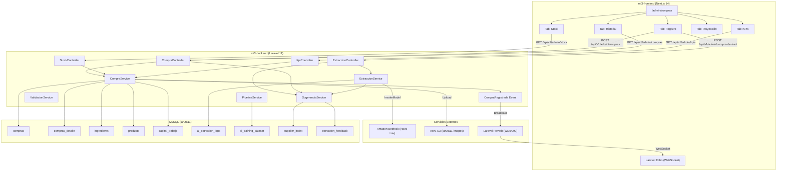
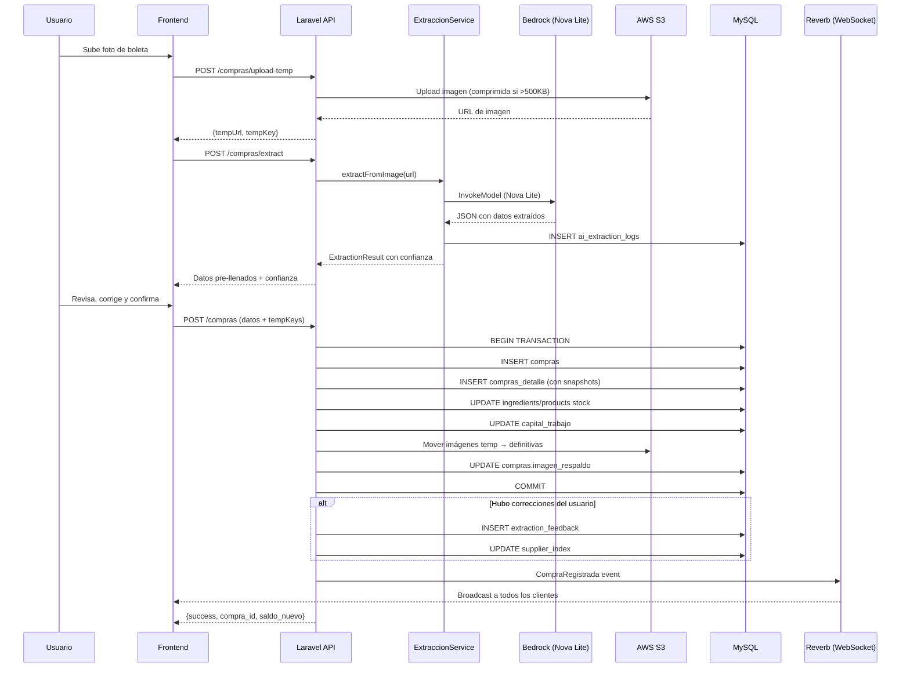

# Diseño Técnico — Compras Inteligentes mi3

## Visión General

Este módulo reemplaza la app de compras actual en caja3 (`ComprasApp.jsx` + APIs PHP) por una implementación moderna en mi3 (Next.js 14 + Laravel 11). El sistema permite registrar compras con transacciones atómicas, extraer datos de boletas/facturas chilenas usando Amazon Nova Lite (Bedrock), gestionar inventario con semáforo de criticidad, y sincronizar en tiempo real vía Laravel Reverb.

### Decisiones de Diseño Clave

1. **Replicar lógica existente de caja3 en Laravel**: La lógica de `registrar_compra.php` (transacción atómica: compras → compras_detalle → stock → capital_trabajo) se migra a un Service de Laravel con Eloquent y DB transactions.
2. **Tablas existentes se reutilizan**: `compras`, `compras_detalle`, `ingredients`, `products`, `capital_trabajo`, `inventory_transactions` ya existen y se comparten con caja3.
3. **Nuevas tablas para IA**: Se crean tablas para logs de extracción, dataset de entrenamiento, índice de sugerencias y feedback de correcciones.
4. **Amazon Nova Lite vía Bedrock**: Se usa el SDK de AWS para PHP (ya configurado en el proyecto) para enviar imágenes y recibir JSON estructurado.
5. **Laravel Reverb ya está corriendo**: Se reutiliza la infraestructura existente (puerto 9090, Traefik configurado) agregando un nuevo canal `compras`.
6. **Frontend con tabs modulares**: La página `/admin/compras` usa tabs para separar: Registro, Historial, Stock, Proyección, KPIs.

## Arquitectura

### Diagrama de Arquitectura General



### Flujo de Registro de Compra con Extracción IA



## Componentes e Interfaces

### Backend — Controllers (Laravel)

| Controller | Ruta Base | Responsabilidad |
|---|---|---|
| `CompraController` | `/api/v1/admin/compras` | CRUD compras, registro atómico, historial, eliminación con rollback |
| `StockController` | `/api/v1/admin/stock` | Inventario, semáforo, ajuste masivo markdown |
| `ExtraccionController` | `/api/v1/admin/compras/extract` | Extracción IA, upload temporal, pipeline entrenamiento |
| `KpiController` | `/api/v1/admin/kpis` | Métricas financieras, saldo disponible, historial capital |

### Backend — Services (Laravel)

| Service | Responsabilidad |
|---|---|
| `Compra/CompraService` | Lógica de negocio: registro atómico (compra + detalle + stock + capital), eliminación con rollback, búsqueda fuzzy de ítems |
| `Compra/ExtraccionService` | Comunicación con Bedrock, prompt engineering para boletas chilenas, parsing de respuesta, cálculo de confianza |
| `Compra/SugerenciaService` | Índice de proveedores frecuentes, match fuzzy de proveedores/ítems, precios históricos, feedback de correcciones |
| `Compra/ValidacionService` | Comparación extracción vs datos reales, métricas de precisión por campo, alertas de calidad |
| `Compra/PipelineService` | Procesamiento batch de imágenes históricas, construcción de dataset de referencia, reportes de precisión |
| `Compra/StockService` | Parseo de markdown para ajuste masivo, cálculo de semáforo, reportes de inventario |

### Backend — Endpoints API

```
POST   /api/v1/admin/compras                    → CompraController@store (registro atómico)
GET    /api/v1/admin/compras                     → CompraController@index (historial paginado)
GET    /api/v1/admin/compras/{id}                → CompraController@show (detalle)
DELETE /api/v1/admin/compras/{id}                → CompraController@destroy (eliminar + rollback stock)
GET    /api/v1/admin/compras/items               → CompraController@items (ingredientes + productos para búsqueda)
GET    /api/v1/admin/compras/proveedores         → CompraController@proveedores (autocompletado)
POST   /api/v1/admin/compras/ingrediente         → CompraController@crearIngrediente (crear ingrediente nuevo)
POST   /api/v1/admin/compras/{id}/imagen         → CompraController@uploadImagen (subir imagen a compra existente)

POST   /api/v1/admin/compras/upload-temp         → ExtraccionController@uploadTemp (imagen temporal pre-registro)
POST   /api/v1/admin/compras/extract             → ExtraccionController@extract (extracción IA)
GET    /api/v1/admin/compras/extraction-quality   → ExtraccionController@quality (métricas de calidad)
POST   /api/v1/admin/compras/pipeline/run        → ExtraccionController@runPipeline (ejecutar pipeline entrenamiento)
GET    /api/v1/admin/compras/pipeline/report      → ExtraccionController@pipelineReport (reporte de precisión)

GET    /api/v1/admin/stock                        → StockController@index (inventario con semáforo)
GET    /api/v1/admin/stock/bebidas                → StockController@bebidas (reporte bebidas)
POST   /api/v1/admin/stock/ajuste-masivo          → StockController@ajusteMasivo (ajuste markdown)
GET    /api/v1/admin/stock/preview-ajuste         → StockController@previewAjuste (previsualización)

GET    /api/v1/admin/kpis                         → KpiController@index (KPIs financieros)
GET    /api/v1/admin/kpis/historial-saldo         → KpiController@historialSaldo (historial capital)
GET    /api/v1/admin/kpis/proyeccion              → KpiController@proyeccion (proyección de compras)
GET    /api/v1/admin/kpis/precio-historico/{id}   → KpiController@precioHistorico (precio histórico por ítem)
```

### Backend — Events (WebSocket)

```php
// App\Events\CompraRegistrada implements ShouldBroadcast
// Canal: Channel("compras")
// Evento: "compra.registrada"
// Payload: { compra_id, proveedor, monto_total, items_count, timestamp }
```

### Frontend — Estructura de Páginas

```
app/admin/compras/
├── layout.tsx          → Layout con tabs (Registro, Historial, Stock, Proyección, KPIs)
├── page.tsx            → Redirect a /admin/compras/registro
├── registro/
│   └── page.tsx        → Formulario de registro + extracción IA
├── historial/
│   └── page.tsx        → Lista paginada + búsqueda + detalle
├── stock/
│   └── page.tsx        → Inventario con semáforo + ajuste masivo
├── proyeccion/
│   └── page.tsx        → Planificación de compras + presupuesto
└── kpis/
    └── page.tsx        → Métricas financieras + historial saldo
```

### Frontend — Componentes Principales

| Componente | Ubicación | Responsabilidad |
|---|---|---|
| `ComprasLayout` | `components/admin/compras/ComprasLayout.tsx` | Layout con tabs y WebSocket listener |
| `RegistroCompra` | `components/admin/compras/RegistroCompra.tsx` | Formulario completo de registro |
| `ItemSearch` | `components/admin/compras/ItemSearch.tsx` | Búsqueda fuzzy de ingredientes/productos |
| `ImageUploader` | `components/admin/compras/ImageUploader.tsx` | Drag & drop + preview + extracción IA |
| `ExtractionPreview` | `components/admin/compras/ExtractionPreview.tsx` | Datos extraídos con indicadores de confianza |
| `HistorialCompras` | `components/admin/compras/HistorialCompras.tsx` | Lista paginada con búsqueda |
| `DetalleCompra` | `components/admin/compras/DetalleCompra.tsx` | Modal/vista de detalle de compra |
| `StockDashboard` | `components/admin/compras/StockDashboard.tsx` | Inventario con semáforo (ingredientes/bebidas) |
| `AjusteMasivo` | `components/admin/compras/AjusteMasivo.tsx` | Textarea markdown + preview de ajuste |
| `ProyeccionCompras` | `components/admin/compras/ProyeccionCompras.tsx` | Lista de proyección + presupuesto |
| `KpisDashboard` | `components/admin/compras/KpisDashboard.tsx` | Cards de KPIs + historial saldo |
| `RendicionWhatsApp` | `components/admin/compras/RendicionWhatsApp.tsx` | Generador de texto para WhatsApp |


## Modelos de Datos

### Tablas Existentes (sin cambios de esquema)

Las siguientes tablas ya existen en la BD `laruta11` y se reutilizan tal cual:

- **`compras`**: Registro principal de compras (fecha, proveedor, tipo, monto, método pago, estado, notas, imagen_respaldo JSON, usuario)
- **`compras_detalle`**: Ítems de cada compra (ingrediente_id/product_id, item_type, nombre, cantidad, unidad, precio_unitario, subtotal, stock_antes, stock_despues)
- **`ingredients`**: Ingredientes del inventario (name, category, unit, cost_per_unit, current_stock, min_stock_level, supplier, barcode, internal_code)
- **`products`**: Productos/bebidas (name, price, cost_price, stock_quantity, min_stock_level, is_active)
- **`product_recipes`**: Recetas (product_id, ingredient_id, quantity, unit)
- **`capital_trabajo`**: Capital de trabajo diario (fecha, saldo_inicial, ingresos_ventas, egresos_compras, egresos_gastos, saldo_final)
- **`inventory_transactions`**: Transacciones de inventario (transaction_type, ingredient_id/product_id, quantity, previous_stock, new_stock)

### Nuevas Tablas

#### `ai_extraction_logs` — Logs de extracción IA

Almacena cada intento de extracción para auditoría y entrenamiento.

```sql
CREATE TABLE ai_extraction_logs (
    id BIGINT UNSIGNED AUTO_INCREMENT PRIMARY KEY,
    compra_id INT UNSIGNED NULL,
    image_url VARCHAR(500) NOT NULL,
    raw_response JSON NOT NULL COMMENT 'Respuesta cruda de Bedrock',
    extracted_data JSON NOT NULL COMMENT 'Datos parseados estructurados',
    confidence_scores JSON NOT NULL COMMENT 'Score por campo (0.0-1.0)',
    overall_confidence DECIMAL(3,2) NOT NULL DEFAULT 0.00,
    processing_time_ms INT UNSIGNED NOT NULL DEFAULT 0,
    model_id VARCHAR(100) NOT NULL DEFAULT 'amazon.nova-lite-v1:0',
    status ENUM('success', 'failed', 'partial') NOT NULL DEFAULT 'success',
    error_message TEXT NULL,
    created_at TIMESTAMP DEFAULT CURRENT_TIMESTAMP,
    INDEX idx_compra (compra_id),
    INDEX idx_status (status),
    INDEX idx_created (created_at)
) ENGINE=InnoDB DEFAULT CHARSET=utf8mb4;
```

#### `ai_training_dataset` — Dataset de referencia para entrenamiento

Asocia imágenes históricas con datos reales para medir precisión.

```sql
CREATE TABLE ai_training_dataset (
    id BIGINT UNSIGNED AUTO_INCREMENT PRIMARY KEY,
    compra_id INT UNSIGNED NOT NULL,
    image_url VARCHAR(500) NOT NULL,
    extraction_log_id BIGINT UNSIGNED NULL,
    real_data JSON NOT NULL COMMENT 'Datos reales de la compra (ground truth)',
    extracted_data JSON NULL COMMENT 'Datos extraídos por IA',
    precision_scores JSON NULL COMMENT 'Precisión por campo vs real',
    overall_precision DECIMAL(5,2) NULL COMMENT 'Precisión global 0-100%',
    processed_at TIMESTAMP NULL,
    batch_id VARCHAR(50) NULL COMMENT 'ID del batch de procesamiento',
    created_at TIMESTAMP DEFAULT CURRENT_TIMESTAMP,
    INDEX idx_compra (compra_id),
    INDEX idx_batch (batch_id),
    INDEX idx_processed (processed_at),
    FOREIGN KEY (compra_id) REFERENCES compras(id) ON DELETE CASCADE
) ENGINE=InnoDB DEFAULT CHARSET=utf8mb4;
```

#### `supplier_index` — Índice de proveedores frecuentes

Mantiene datos normalizados de proveedores para sugerencias.

```sql
CREATE TABLE supplier_index (
    id BIGINT UNSIGNED AUTO_INCREMENT PRIMARY KEY,
    nombre_normalizado VARCHAR(255) NOT NULL,
    nombre_original VARCHAR(255) NOT NULL COMMENT 'Nombre tal como aparece en compras',
    rut VARCHAR(15) NULL,
    frecuencia INT UNSIGNED NOT NULL DEFAULT 1,
    items_habituales JSON NULL COMMENT 'Array de {nombre, frecuencia, precio_promedio}',
    ultimo_precio_por_item JSON NULL COMMENT 'Map de item_name → ultimo_precio',
    primera_compra DATE NULL,
    ultima_compra DATE NULL,
    created_at TIMESTAMP DEFAULT CURRENT_TIMESTAMP,
    updated_at TIMESTAMP DEFAULT CURRENT_TIMESTAMP ON UPDATE CURRENT_TIMESTAMP,
    INDEX idx_nombre (nombre_normalizado),
    INDEX idx_rut (rut),
    INDEX idx_frecuencia (frecuencia DESC)
) ENGINE=InnoDB DEFAULT CHARSET=utf8mb4;
```

#### `extraction_feedback` — Feedback de correcciones del usuario

Almacena las correcciones que el usuario hace sobre datos pre-llenados por la IA.

```sql
CREATE TABLE extraction_feedback (
    id BIGINT UNSIGNED AUTO_INCREMENT PRIMARY KEY,
    extraction_log_id BIGINT UNSIGNED NOT NULL,
    compra_id INT UNSIGNED NOT NULL,
    field_name VARCHAR(50) NOT NULL COMMENT 'Campo corregido: proveedor, item_nombre, cantidad, precio, etc.',
    original_value TEXT NOT NULL COMMENT 'Valor extraído por IA',
    corrected_value TEXT NOT NULL COMMENT 'Valor corregido por usuario',
    created_at TIMESTAMP DEFAULT CURRENT_TIMESTAMP,
    INDEX idx_extraction (extraction_log_id),
    INDEX idx_compra (compra_id),
    INDEX idx_field (field_name),
    FOREIGN KEY (extraction_log_id) REFERENCES ai_extraction_logs(id) ON DELETE CASCADE
) ENGINE=InnoDB DEFAULT CHARSET=utf8mb4;
```

### Modelos Eloquent (Laravel)

#### Modelos Nuevos

```php
// App\Models\Compra
class Compra extends Model {
    protected $table = 'compras';
    protected $casts = ['imagen_respaldo' => 'array', 'fecha_compra' => 'datetime'];
    public function detalles() { return $this->hasMany(CompraDetalle::class); }
    public function extractionLogs() { return $this->hasMany(AiExtractionLog::class); }
}

// App\Models\CompraDetalle
class CompraDetalle extends Model {
    protected $table = 'compras_detalle';
    public function compra() { return $this->belongsTo(Compra::class); }
    public function ingrediente() { return $this->belongsTo(Ingredient::class, 'ingrediente_id'); }
    public function producto() { return $this->belongsTo(Product::class, 'product_id'); }
}

// App\Models\Ingredient
class Ingredient extends Model {
    protected $table = 'ingredients';
}

// App\Models\Product (ya existe TuuOrder, se agrega Product)
class Product extends Model {
    protected $table = 'products';
}

// App\Models\CapitalTrabajo
class CapitalTrabajo extends Model {
    protected $table = 'capital_trabajo';
}

// App\Models\AiExtractionLog
class AiExtractionLog extends Model {
    protected $table = 'ai_extraction_logs';
    protected $casts = ['raw_response' => 'array', 'extracted_data' => 'array', 'confidence_scores' => 'array'];
}

// App\Models\AiTrainingDataset
class AiTrainingDataset extends Model {
    protected $table = 'ai_training_dataset';
    protected $casts = ['real_data' => 'array', 'extracted_data' => 'array', 'precision_scores' => 'array'];
}

// App\Models\SupplierIndex
class SupplierIndex extends Model {
    protected $table = 'supplier_index';
    protected $casts = ['items_habituales' => 'array', 'ultimo_precio_por_item' => 'array'];
}

// App\Models\ExtractionFeedback
class ExtractionFeedback extends Model {
    protected $table = 'extraction_feedback';
}
```

### Estructura JSON de Extracción IA (Req. 11)

```typescript
// Tipo TypeScript para el frontend
interface ExtractionResult {
  proveedor: string;
  rut_proveedor: string;
  items: ExtractionItem[];
  monto_neto: number;      // Entero, pesos chilenos
  iva: number;             // Entero, pesos chilenos
  monto_total: number;     // Entero, pesos chilenos
  confianza: {
    proveedor: number;     // 0.0 - 1.0
    rut: number;
    items: number;
    monto_neto: number;
    iva: number;
    monto_total: number;
  };
}

interface ExtractionItem {
  nombre: string;
  cantidad: number;
  unidad: string;
  precio_unitario: number; // Entero, pesos chilenos
  subtotal: number;        // Entero, pesos chilenos
}
```

### Formato Markdown de Ajuste Masivo de Stock (Req. 12)

```markdown
# Ajuste Stock 2026-04-15

- Tomate: 5 kg
- Lechuga: 3 unidad
- Pan de completo: 200 unidad
- Coca-Cola 350ml: 48 unidad
```

Cada línea sigue el patrón: `- {nombre_item}: {cantidad} {unidad}`

El parser debe:
1. Ignorar líneas que empiecen con `#` (títulos)
2. Parsear líneas con formato `- nombre: cantidad unidad`
3. Hacer match fuzzy del nombre con ingredientes/productos existentes
4. Marcar como error las líneas que no matcheen el formato


## Propiedades de Correctitud

*Una propiedad es una característica o comportamiento que debe mantenerse verdadero en todas las ejecuciones válidas de un sistema — esencialmente, una declaración formal sobre lo que el sistema debe hacer. Las propiedades sirven como puente entre especificaciones legibles por humanos y garantías de correctitud verificables por máquinas.*

### Propiedad 1: Cálculo de IVA es inversible

*Para cualquier* precio total ingresado (entero positivo en pesos chilenos) y cualquier cantidad positiva, calcular el precio neto como `Math.round(precio_total / 1.19 / cantidad)` y luego recalcular `precio_neto * cantidad * 1.19` debe producir un valor dentro de ±1 peso del precio total original (tolerancia por redondeo entero).

**Valida: Requisito 1.5**

### Propiedad 2: Invariante de snapshot de stock

*Para cualquier* registro en `compras_detalle` con un `ingrediente_id` o `product_id` válido, el campo `stock_despues` debe ser exactamente igual a `stock_antes + cantidad`.

**Valida: Requisito 1.7**

### Propiedad 3: Búsqueda fuzzy retorna resultados relevantes

*Para cualquier* término de búsqueda no vacío y cualquier conjunto de ingredientes/productos activos, todos los resultados retornados por la búsqueda fuzzy deben tener una similitud de texto mayor a 0 con el término de búsqueda, y cada resultado debe incluir los campos: nombre, stock actual, unidad y último precio de compra.

**Valida: Requisitos 1.2, 1.4**

### Propiedad 4: Match fuzzy de proveedores e ítems extraídos

*Para cualquier* nombre de proveedor extraído y cualquier lista de proveedores conocidos, la función de match debe retornar el proveedor con mayor similitud de texto. *Para cualquier* nombre de ítem extraído con confianza de match superior al 80%, el ítem pre-seleccionado debe tener similitud de texto ≥ 0.80 con el nombre extraído.

**Valida: Requisitos 3.3, 3.4**

### Propiedad 5: Índice de proveedores se actualiza consistentemente

*Para cualquier* secuencia de compras registradas con el mismo proveedor, el `supplier_index` debe reflejar: frecuencia igual al número de compras, `ultima_compra` igual a la fecha más reciente, y `items_habituales` conteniendo todos los ítems comprados a ese proveedor.

**Valida: Requisitos 4.5, 4.6**

### Propiedad 6: Cálculo de precisión aplica umbrales correctos por campo

*Para cualquier* par de datos (extraídos vs reales): un proveedor se considera correcto si la similitud de texto es ≥ 85%; un monto total se considera correcto si la diferencia absoluta es ≤ 2% del monto real; un ítem se considera correcto si nombre tiene similitud ≥ 80% AND diferencia en cantidad < 10% AND diferencia en precio < 5%. La precisión global debe ser el promedio ponderado de las precisiones por campo.

**Valida: Requisitos 5.1, 5.2, 5.3, 5.4**

### Propiedad 7: Paginación retorna slices correctos

*Para cualquier* lista de compras y cualquier número de página válido, la paginación debe retornar exactamente min(50, registros_restantes) registros, ordenados por fecha descendente, y el primer registro de la página N+1 debe tener fecha menor o igual al último registro de la página N.

**Valida: Requisito 6.1**

### Propiedad 8: Búsqueda en historial filtra correctamente

*Para cualquier* término de búsqueda y cualquier conjunto de compras, todos los resultados retornados deben contener el término de búsqueda (case-insensitive) en el campo `proveedor` o en el campo `notas`.

**Valida: Requisito 6.2**

### Propiedad 9: Clasificación de semáforo de stock

*Para cualquier* ítem con stock_actual y min_stock_level positivos: si stock_actual < min_stock_level * 0.25 entonces el color es rojo; si stock_actual >= min_stock_level * 0.25 AND stock_actual <= min_stock_level entonces el color es amarillo; si stock_actual > min_stock_level entonces el color es verde.

**Valida: Requisito 7.2**

### Propiedad 10: Cálculo de saldo disponible

*Para cualesquiera* valores de ventas_mes_anterior, ventas_mes_actual, sueldos y compras_mes_actual (todos números no negativos), el saldo disponible debe ser exactamente: ventas_mes_anterior + ventas_mes_actual - sueldos - compras_mes_actual.

**Valida: Requisito 9.2**

### Propiedad 11: Round-trip de serialización de datos de extracción

*Para cualquier* objeto ExtractionResult válido (con proveedor string, rut string, items array, montos enteros, y scores de confianza entre 0.0 y 1.0), serializar a JSON y luego deserializar debe producir un objeto equivalente al original. Además, todos los campos monetarios en el JSON serializado deben ser números enteros.

**Valida: Requisitos 11.1, 11.2, 11.3, 11.4**

### Propiedad 12: Round-trip de parseo de ajuste masivo de stock

*Para cualquier* lista válida de ajustes de stock (cada uno con nombre de ítem no vacío, cantidad numérica positiva y unidad), formatear a markdown y luego parsear debe producir una lista equivalente de ajustes.

**Valida: Requisitos 12.1, 12.3**

### Propiedad 13: Parser de markdown maneja líneas inválidas sin perder las válidas

*Para cualquier* texto de ajuste que contenga una mezcla de líneas válidas e inválidas, el parser debe: marcar las líneas inválidas como error, parsear correctamente todas las líneas válidas, y el número de resultados exitosos + errores debe ser igual al número total de líneas procesables (excluyendo títulos y líneas vacías).

**Valida: Requisito 12.4**

### Propiedad 14: Formateo WhatsApp contiene todos los datos requeridos

*Para cualquier* conjunto de compras seleccionadas (cada una con proveedor, monto y fecha), el texto formateado para WhatsApp debe contener: el nombre de cada proveedor, el monto de cada compra, el total sumado correctamente, y la fecha de cada compra.

**Valida: Requisitos 6.6, 8.3**


## Manejo de Errores

### Backend (Laravel)

| Escenario | Estrategia | Código HTTP | Respuesta |
|---|---|---|---|
| Transacción de registro falla | `DB::rollBack()` automático, log del error | 500 | `{success: false, error: "Error al registrar compra: {detalle}"}` |
| Imagen no se puede subir a S3 | Retry 1 vez, luego error | 500 | `{success: false, error: "Error al subir imagen"}` |
| Bedrock no responde en 10s | Timeout con fallback a ingreso manual | 408 | `{success: false, error: "Extracción agotó tiempo de espera", fallback: "manual"}` |
| Bedrock retorna respuesta no parseable | Log del raw response, retornar error | 422 | `{success: false, error: "No se pudo interpretar la boleta"}` |
| Ítem no encontrado en búsqueda | Retornar array vacío | 200 | `[]` |
| Compra no encontrada para eliminar | 404 | 404 | `{success: false, error: "Compra no encontrada"}` |
| Markdown de ajuste masivo con líneas inválidas | Parsear las válidas, reportar errores | 200 | `{valid: [...], errors: [{line: 3, text: "...", error: "Formato inválido"}]}` |
| Eliminación de compra falla en rollback de stock | `DB::rollBack()`, log | 500 | `{success: false, error: "Error al revertir inventario"}` |
| Pipeline de entrenamiento: imagen no accesible en S3 | Skip imagen, continuar batch, log warning | N/A | Incluir en reporte como "no procesada" |
| Precisión global < 70% | Emitir alerta (log + notificación) | N/A | Alerta en reporte de validación |

### Frontend (Next.js)

| Escenario | Estrategia |
|---|---|
| Error de red en API call | Toast de error con mensaje, retry button |
| WebSocket desconectado | Indicador visual (badge rojo), reconexión automática con backoff exponencial (1s, 2s, 4s, 8s, max 30s) |
| Extracción IA falla | Mostrar mensaje informativo, habilitar ingreso manual completo |
| Campos con confianza < 0.7 | Borde amarillo/naranja en el campo, tooltip "Revisar este campo" |
| Upload de imagen falla | Toast de error, permitir reintentar |
| Formulario con datos incompletos | Validación client-side con mensajes inline |

### Prompt de Extracción IA (Amazon Nova Lite)

El prompt para Bedrock debe ser específico para boletas/facturas chilenas:

```
Analiza esta imagen de una boleta o factura chilena y extrae los siguientes datos en formato JSON:
- proveedor: nombre del establecimiento o empresa
- rut_proveedor: RUT en formato XX.XXX.XXX-Y
- items: array de objetos con {nombre, cantidad, unidad, precio_unitario, subtotal}
- monto_neto: monto sin IVA (número entero)
- iva: monto del IVA 19% (número entero)
- monto_total: monto total con IVA (número entero)

Reglas:
- Los montos deben ser números enteros en pesos chilenos (sin decimales, sin puntos de miles)
- Si no puedes leer un campo, usa null
- Si no hay desglose de IVA, calcula: monto_neto = round(monto_total / 1.19), iva = monto_total - monto_neto
- Las cantidades deben ser números
- Responde SOLO con el JSON, sin texto adicional
```

## Estrategia de Testing

### Enfoque Dual: Unit Tests + Property-Based Tests

Este feature combina lógica de negocio pura (cálculos, parseo, serialización) con integraciones externas (S3, Bedrock, MySQL). La estrategia usa:

- **Property-based tests (PBT)**: Para las 14 propiedades de correctitud identificadas, validando comportamiento universal con inputs generados aleatoriamente.
- **Unit tests**: Para ejemplos específicos, edge cases y escenarios de error.
- **Integration tests**: Para flujos que involucran BD, S3 y Bedrock.

### Librería de Property-Based Testing

- **Backend (PHP/Laravel)**: [PhpQuickCheck](https://github.com/steffenfriedrich/phpquickcheck) o [Eris](https://github.com/giorgiosironi/eris) para PHPUnit
- **Frontend (TypeScript)**: [fast-check](https://github.com/dubzzz/fast-check) para Jest/Vitest

### Configuración PBT

- Mínimo **100 iteraciones** por property test
- Cada test debe referenciar su propiedad del documento de diseño
- Formato de tag: `Feature: mi3-compras-inteligentes, Property {N}: {título}`

### Distribución de Tests

| Área | Unit Tests | Property Tests | Integration Tests |
|---|---|---|---|
| Cálculo IVA | 2-3 ejemplos con valores conocidos | Propiedad 1: round-trip IVA | — |
| Snapshot stock | — | Propiedad 2: invariante stock | 1 test registro completo |
| Búsqueda fuzzy | 2 ejemplos (match/no match) | Propiedad 3: resultados relevantes | — |
| Match IA | 2 ejemplos (alta/baja confianza) | Propiedad 4: match fuzzy | — |
| Índice proveedores | 1 ejemplo actualización | Propiedad 5: consistencia índice | — |
| Precisión IA | 2 ejemplos (correcto/incorrecto) | Propiedad 6: umbrales por campo | — |
| Paginación | 2 ejemplos (primera/última página) | Propiedad 7: slices correctos | — |
| Búsqueda historial | 2 ejemplos | Propiedad 8: filtrado correcto | — |
| Semáforo stock | 3 ejemplos (rojo/amarillo/verde) | Propiedad 9: clasificación | — |
| Saldo disponible | 2 ejemplos | Propiedad 10: cálculo | — |
| Serialización extracción | 1 ejemplo JSON completo | Propiedad 11: round-trip | — |
| Parseo markdown | 2 ejemplos (válido/inválido) | Propiedades 12, 13: round-trip + errores | — |
| Formateo WhatsApp | 1 ejemplo | Propiedad 14: datos completos | — |
| Registro atómico | — | — | 2-3 escenarios (ingrediente, producto, mixto) |
| Upload S3 | — | — | 1 test upload + compresión |
| Extracción Bedrock | — | — | 2 tests con imágenes reales |
| WebSocket | — | — | 1 test broadcast evento |
| Eliminación + rollback | — | — | 1 test eliminar y verificar stock |

### Edge Cases a Cubrir en Unit Tests

- Compra con 0 ítems (debe rechazar)
- Ítem con cantidad 0 o negativa (debe rechazar)
- Precio unitario 0 (válido para donaciones/muestras)
- Proveedor con caracteres especiales (tildes, ñ)
- RUT con formato inválido
- Imagen de 0 bytes
- Markdown con solo líneas inválidas
- Markdown vacío
- Búsqueda con string vacío (debe retornar todos)
- Paginación con página fuera de rango
- Eliminación de compra que ya fue eliminada
- Monto total que no coincide con suma de subtotales (advertencia)

