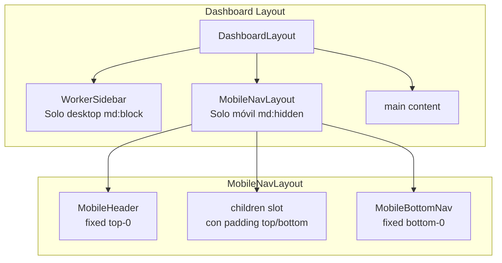
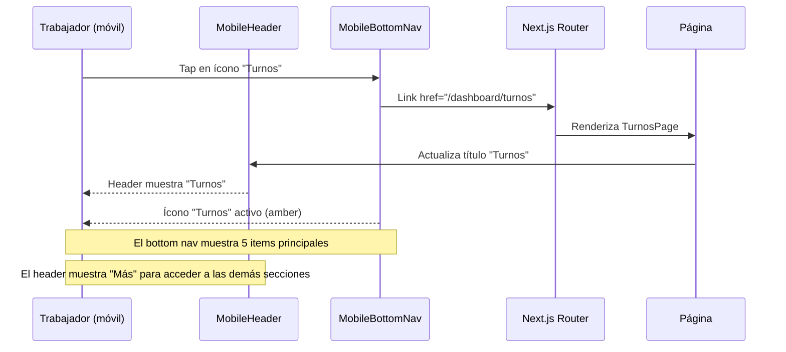
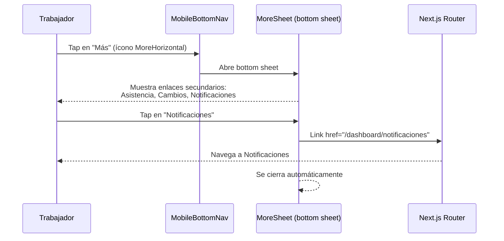

# Documento de Diseño: mi3 Mobile Navbar

## Resumen

Los trabajadores de La Ruta 11 acceden a mi3 principalmente desde sus celulares. Actualmente, la navegación móvil consiste en un sidebar de escritorio (`WorkerSidebar.tsx`) que se desliza desde la izquierda al presionar un botón hamburguesa — una experiencia poco nativa para móvil.

Este feature reemplaza esa navegación en móvil con un patrón tipo app nativa: un header fijo superior con título de página y acciones contextuales, y un bottom navbar fijo con los enlaces principales. En desktop (≥768px), el sidebar actual se mantiene sin cambios.

La estrategia es crear 3 componentes nuevos (`MobileHeader`, `MobileBottomNav`, `MobileNavLayout`) que se renderizan solo en móvil via `md:hidden`, y ajustar el layout de dashboard para integrarlos sin romper la experiencia desktop existente.

## Arquitectura



### Flujo de Navegación Móvil



### Flujo del Menú "Más"



## Componentes e Interfaces

### Componente 1: MobileBottomNav

**Ubicación**: `mi3/frontend/components/mobile/MobileBottomNav.tsx`

**Propósito**: Barra de navegación fija en la parte inferior de la pantalla, visible solo en móvil. Muestra 5 items: los 4 más usados + botón "Más" que abre un sheet con el resto.

**Interface**:
```typescript
// No recibe props — lee la ruta activa via usePathname()
export default function MobileBottomNav(): JSX.Element
```

**Responsabilidades**:
- Renderizar 5 íconos de navegación en barra fija inferior
- Resaltar el ícono activo según la ruta actual (usePathname)
- Abrir un bottom sheet con enlaces secundarios al presionar "Más"
- Mostrar badge de notificaciones no leídas en el ícono de Notificaciones (dentro del sheet "Más")
- Oculto en desktop via `md:hidden`

**Items principales del bottom nav** (los más frecuentes para un trabajador):

| Posición | Label | Ícono | Ruta |
|----------|-------|-------|------|
| 1 | Inicio | Home | /dashboard |
| 2 | Turnos | Calendar | /dashboard/turnos |
| 3 | Sueldo | Receipt | /dashboard/liquidacion |
| 4 | Crédito | CreditCard | /dashboard/credito |
| 5 | Más | MoreHorizontal | (abre sheet) |

**Items secundarios** (dentro del sheet "Más"):

| Label | Ícono | Ruta |
|-------|-------|------|
| Perfil | User | /dashboard/perfil |
| Asistencia | ClipboardCheck | /dashboard/asistencia |
| Cambios | ArrowLeftRight | /dashboard/cambios |
| Notificaciones | Bell | /dashboard/notificaciones |

### Componente 2: MobileHeader

**Ubicación**: `mi3/frontend/components/mobile/MobileHeader.tsx`

**Propósito**: Header fijo superior que muestra el logo/nombre de la app y el título de la página actual. Oculto en desktop.

**Interface**:
```typescript
// No recibe props — deriva el título de la ruta actual
export default function MobileHeader(): JSX.Element
```

**Responsabilidades**:
- Mostrar "mi3" como branding a la izquierda
- Mostrar el título de la página actual derivado de la ruta
- Mostrar badge de notificaciones no leídas (ícono Bell a la derecha)
- Oculto en desktop via `md:hidden`
- `fixed top-0` con `z-40` y fondo blanco con borde inferior

**Mapeo ruta → título**:

| Ruta | Título |
|------|--------|
| /dashboard | Inicio |
| /dashboard/perfil | Perfil |
| /dashboard/turnos | Turnos |
| /dashboard/liquidacion | Liquidación |
| /dashboard/credito | Crédito R11 |
| /dashboard/asistencia | Asistencia |
| /dashboard/cambios | Cambios |
| /dashboard/notificaciones | Notificaciones |

### Componente 3: MobileNavLayout

**Ubicación**: `mi3/frontend/components/mobile/MobileNavLayout.tsx`

**Propósito**: Wrapper que combina MobileHeader + MobileBottomNav y aplica el padding correcto al contenido para evitar que quede oculto detrás del header/navbar fijos.

**Interface**:
```typescript
interface MobileNavLayoutProps {
  children: React.ReactNode;
}

export default function MobileNavLayout({ children }: MobileNavLayoutProps): JSX.Element
```

**Responsabilidades**:
- Renderizar MobileHeader y MobileBottomNav
- Aplicar `pt-14` (padding-top para el header) y `pb-20` (padding-bottom para el bottom nav)
- Solo visible en móvil via `md:hidden`
- Envolver el contenido de las páginas del dashboard

### Componente 4: WorkerSidebar (modificación)

**Ubicación**: `mi3/frontend/components/layouts/WorkerSidebar.tsx` (existente)

**Cambios**:
- Agregar `hidden md:block` al componente raíz para ocultarlo completamente en móvil
- Eliminar el botón hamburguesa móvil y el overlay (ya no se necesitan)
- Mantener toda la funcionalidad desktop intacta

## Modelos de Datos

### Configuración de Navegación

```typescript
// mi3/frontend/lib/navigation.ts

import {
  Home, User, Calendar, Receipt, CreditCard,
  ClipboardCheck, ArrowLeftRight, Bell, MoreHorizontal,
  type LucideIcon,
} from 'lucide-react';

export interface NavItem {
  href: string;
  label: string;
  icon: LucideIcon;
}

/** Items que aparecen en el bottom nav (máximo 4 + "Más") */
export const primaryNavItems: NavItem[] = [
  { href: '/dashboard', label: 'Inicio', icon: Home },
  { href: '/dashboard/turnos', label: 'Turnos', icon: Calendar },
  { href: '/dashboard/liquidacion', label: 'Sueldo', icon: Receipt },
  { href: '/dashboard/credito', label: 'Crédito', icon: CreditCard },
];

/** Items que aparecen en el sheet "Más" */
export const secondaryNavItems: NavItem[] = [
  { href: '/dashboard/perfil', label: 'Perfil', icon: User },
  { href: '/dashboard/asistencia', label: 'Asistencia', icon: ClipboardCheck },
  { href: '/dashboard/cambios', label: 'Cambios', icon: ArrowLeftRight },
  { href: '/dashboard/notificaciones', label: 'Notificaciones', icon: Bell },
];

/** Todos los items (para el sidebar desktop y mapeo de títulos) */
export const allNavItems: NavItem[] = [...primaryNavItems, ...secondaryNavItems];

/** Mapeo ruta → título para el header */
export function getPageTitle(pathname: string): string {
  const item = allNavItems.find(i => i.href === pathname);
  return item?.label ?? 'mi3';
}
```

**Reglas de validación**:
- `primaryNavItems` debe tener exactamente 4 items (+ el botón "Más" se agrega en el componente)
- Cada `href` debe ser único en la unión de primary + secondary
- Cada `href` debe comenzar con `/dashboard`

## Pseudocódigo Algorítmico

### Algoritmo: Determinación de Item Activo

```typescript
/**
 * Determina si un item de navegación está activo.
 * Coincidencia exacta para /dashboard, prefijo para sub-rutas.
 *
 * Precondiciones:
 *   - pathname es un string no vacío que comienza con "/"
 *   - itemHref es un string no vacío que comienza con "/dashboard"
 *
 * Postcondiciones:
 *   - Retorna true si y solo si:
 *     - itemHref === '/dashboard' AND pathname === '/dashboard'
 *     - O itemHref !== '/dashboard' AND pathname comienza con itemHref
 *   - Sin efectos secundarios
 */
function isNavItemActive(pathname: string, itemHref: string): boolean {
  if (itemHref === '/dashboard') {
    return pathname === '/dashboard';
  }
  return pathname.startsWith(itemHref);
}
```

### Algoritmo: Renderizado del Bottom Nav

```pascal
ALGORITMO renderBottomNav(pathname)
ENTRADA: pathname de tipo string (ruta actual)
SALIDA: JSX con 5 botones de navegación

INICIO
  // Paso 1: Determinar si algún item secundario está activo
  moreActive ← FALSO
  PARA CADA item EN secondaryNavItems HACER
    SI isNavItemActive(pathname, item.href) ENTONCES
      moreActive ← VERDADERO
    FIN SI
  FIN PARA

  // Paso 2: Renderizar 4 items principales como Links
  PARA CADA item EN primaryNavItems HACER
    active ← isNavItemActive(pathname, item.href)
    RENDERIZAR Link(href=item.href) CON
      ícono: item.icon (color amber-600 si active, gray-400 si no)
      label: item.label (texto xs, color amber-600 si active, gray-500 si no)
  FIN PARA

  // Paso 3: Renderizar botón "Más"
  RENDERIZAR Botón("Más") CON
    ícono: MoreHorizontal (color amber-600 si moreActive, gray-400 si no)
    label: "Más" (texto xs)
    onClick: abrir bottom sheet con secondaryNavItems
FIN
```

### Algoritmo: Layout Responsivo

```pascal
ALGORITMO dashboardLayout(children)
ENTRADA: children de tipo ReactNode
SALIDA: Layout con navegación responsiva

INICIO
  RENDERIZAR div.flex.min-h-screen CON

    // Desktop: sidebar clásico
    RENDERIZAR WorkerSidebar CON clase "hidden md:flex"

    // Contenido principal
    RENDERIZAR main CON
      clase desktop: "md:p-6 md:pt-6"
      clase móvil: "p-4"

    // Móvil: header + bottom nav
    RENDERIZAR MobileNavLayout(children) CON clase "md:hidden"
      → MobileHeader (fixed top-0, h-14)
      → children (con pt-14 pb-20)
      → MobileBottomNav (fixed bottom-0, h-16)
FIN
```

## Funciones Clave con Especificaciones Formales

### Función 1: MobileBottomNav (render)

```typescript
function MobileBottomNav(): JSX.Element
```

**Precondiciones:**
- El componente se renderiza dentro de un contexto Next.js App Router (usePathname disponible)
- `primaryNavItems` tiene exactamente 4 elementos
- `secondaryNavItems` tiene al menos 1 elemento

**Postcondiciones:**
- Renderiza exactamente 5 elementos en la barra: 4 links + 1 botón "Más"
- Exactamente 1 item tiene estado activo (highlight amber) en cualquier momento
- Si la ruta actual coincide con un item secundario, el botón "Más" se muestra activo
- La barra tiene `position: fixed`, `bottom: 0`, `z-index: 50`
- Oculto cuando viewport ≥ 768px (md breakpoint)

**Invariantes:**
- La cantidad de items visibles es siempre 5
- El orden de los items nunca cambia

### Función 2: MobileHeader (render)

```typescript
function MobileHeader(): JSX.Element
```

**Precondiciones:**
- El componente se renderiza dentro de un contexto Next.js App Router
- `getPageTitle` retorna un string no vacío para cualquier ruta válida del dashboard

**Postcondiciones:**
- Muestra "mi3" como branding a la izquierda
- Muestra el título correcto según la ruta actual
- Tiene `position: fixed`, `top: 0`, `z-index: 40`
- Oculto cuando viewport ≥ 768px

### Función 3: getPageTitle

```typescript
function getPageTitle(pathname: string): string
```

**Precondiciones:**
- `pathname` es un string no vacío

**Postcondiciones:**
- Si `pathname` coincide con algún `href` en `allNavItems`, retorna el `label` correspondiente
- Si no coincide, retorna `'mi3'` como fallback
- Sin efectos secundarios
- Tiempo O(n) donde n = cantidad de items de navegación

## Ejemplo de Uso

```typescript
// mi3/frontend/app/dashboard/layout.tsx (modificado)
import WorkerSidebar from '@/components/layouts/WorkerSidebar';
import MobileNavLayout from '@/components/mobile/MobileNavLayout';

export default function DashboardLayout({
  children,
}: {
  children: React.ReactNode;
}) {
  return (
    <div className="flex min-h-screen">
      {/* Desktop: sidebar clásico */}
      <WorkerSidebar />

      {/* Contenido principal */}
      <main className="flex-1 p-4 md:p-6 md:pt-6">
        {children}
      </main>

      {/* Móvil: header + bottom nav */}
      <MobileNavLayout>
        {/* children ya está en main, MobileNavLayout solo agrega header/nav */}
      </MobileNavLayout>
    </div>
  );
}
```

```typescript
// Uso del bottom nav — el trabajador ve:
// ┌─────────────────────────────────┐
// │ mi3          Inicio        🔔  │  ← MobileHeader
// ├─────────────────────────────────┤
// │                                 │
// │     (contenido de la página)    │
// │                                 │
// ├─────────────────────────────────┤
// │ 🏠    📅    💰    💳    •••   │  ← MobileBottomNav
// │Inicio Turnos Sueldo Crédito Más│
// └─────────────────────────────────┘
```

```typescript
// Cuando el trabajador presiona "Más":
// ┌─────────────────────────────────┐
// │         ── handle ──            │  ← Bottom sheet
// │                                 │
// │  👤 Perfil                      │
// │  📋 Asistencia                  │
// │  🔄 Cambios                     │
// │  🔔 Notificaciones        (3)  │  ← Badge no leídas
// │                                 │
// └─────────────────────────────────┘
```

## Propiedades de Correctitud

*Una propiedad es una característica o comportamiento que debe cumplirse en todas las ejecuciones válidas de un sistema — esencialmente, una declaración formal sobre lo que el sistema debe hacer. Las propiedades sirven como puente entre especificaciones legibles por humanos y garantías de correctitud verificables por máquina.*

### Propiedad 1: Consistencia de getPageTitle

*Para cualquier* item en `allNavItems`, `getPageTitle(item.href)` retorna exactamente `item.label`. *Para cualquier* string que no coincida con ningún `href` en `allNavItems`, `getPageTitle` retorna `'mi3'`.

**Valida: Requisitos 2.1, 2.2, 11.1**

### Propiedad 2: Determinación correcta de item activo

*Para cualquier* ruta del dashboard y cualquier item de navegación, `isNavItemActive` cumple: (a) para `/dashboard` usa coincidencia exacta, (b) para items primarios distintos de `/dashboard` usa coincidencia por prefijo, (c) cuando la ruta coincide con un item secundario el botón "Más" se marca activo, y (d) cuando la ruta no coincide con ningún item, ningún item se marca activo.

**Valida: Requisitos 4.1, 4.2, 4.3, 4.4**

### Propiedad 3: Invariantes del bottom nav

*Para cualquier* ruta válida del dashboard, el MobileBottomNav renderiza exactamente 5 elementos en orden fijo: Inicio, Turnos, Sueldo, Crédito, Más. La cantidad y el orden nunca cambian independientemente de la ruta activa.

**Valida: Requisitos 3.1, 3.5**

### Propiedad 4: Cobertura completa de rutas de navegación

*Para cualquier* ruta presente en el array `links` del WorkerSidebar original, existe un item equivalente en `allNavItems` (unión de `primaryNavItems` y `secondaryNavItems`). No se pierde ninguna ruta de navegación en la transición desktop → móvil.

**Valida: Requisitos 9.1, 9.2**

## Manejo de Errores

### Escenario 1: Ruta no reconocida

**Condición**: El usuario navega a una ruta bajo `/dashboard/` que no está en `allNavItems`
**Respuesta**: `getPageTitle` retorna `'mi3'` como fallback. Ningún item del bottom nav se muestra activo.
**Recuperación**: El usuario puede navegar a cualquier sección válida desde el bottom nav.

### Escenario 2: Notificaciones no disponibles

**Condición**: La API de notificaciones falla o no responde
**Respuesta**: El badge de notificaciones no se muestra (graceful degradation). La navegación sigue funcionando normalmente.
**Recuperación**: El badge se actualiza en la próxima carga de página.

## Estrategia de Testing

### Testing Unitario

- Verificar que `getPageTitle` retorna el título correcto para cada ruta del dashboard (Requisitos 2.1, 2.2)
- Verificar que `isNavItemActive` retorna true/false correctamente para coincidencia exacta y por prefijo (Requisitos 4.1, 4.2)
- Verificar que `primaryNavItems` tiene exactamente 4 elementos (Requisito 1.1)
- Verificar que no hay `href` duplicados entre primary y secondary items (Requisito 1.4)
- Verificar que el Bottom_Sheet se abre al presionar "Más" y se cierra al seleccionar un item (Requisitos 5.1, 5.2)
- Verificar badge de notificaciones con y sin notificaciones no leídas (Requisitos 10.1, 10.2)

### Testing de Propiedades (Property-Based)

**Librería**: fast-check

- Propiedad 1: Consistencia de getPageTitle — para cualquier item en allNavItems, getPageTitle retorna el label correcto; para strings aleatorios no reconocidos, retorna 'mi3' (Requisitos 2.1, 2.2, 11.1)
- Propiedad 2: Determinación de item activo — para cualquier ruta generada, isNavItemActive determina correctamente el item activo según las reglas de coincidencia exacta/prefijo (Requisitos 4.1, 4.2, 4.3, 4.4)
- Propiedad 3: Invariantes del bottom nav — para cualquier ruta, siempre se renderizan 5 items en orden fijo (Requisitos 3.1, 3.5)
- Propiedad 4: Cobertura de rutas — allNavItems contiene todos los hrefs del WorkerSidebar original (Requisitos 9.1, 9.2)

### Testing Visual/Manual

- Verificar en viewport < 768px: bottom nav visible, sidebar oculto (Requisitos 3.3, 8.1)
- Verificar en viewport ≥ 768px: sidebar visible, bottom nav oculto (Requisitos 3.4, 8.2)
- Verificar que el contenido no queda oculto detrás del header/navbar (Requisitos 7.1, 7.2)
- Verificar transiciones de navegación fluidas
- Verificar que el sheet "Más" se abre y cierra correctamente (Requisitos 5.1, 5.2)

## Consideraciones de Rendimiento

- Los componentes móviles usan `'use client'` pero son ligeros (solo estado local para el sheet)
- No se hacen llamadas API adicionales para la navegación (solo para el badge de notificaciones)
- El badge de notificaciones puede usar el dato ya cargado en el dashboard (evitar fetch duplicado)
- Los íconos de lucide-react se importan individualmente (tree-shaking)

## Consideraciones de Seguridad

- No aplican consideraciones de seguridad adicionales — la navegación es puramente UI
- Las rutas siguen protegidas por el middleware de autenticación existente
- No se expone información sensible en los componentes de navegación

## Dependencias

- `next` (existente) — App Router, Link, usePathname
- `react` (existente) — useState
- `lucide-react` (existente) — íconos de navegación
- `tailwindcss` (existente) — estilos responsivos
- No se requieren dependencias nuevas
