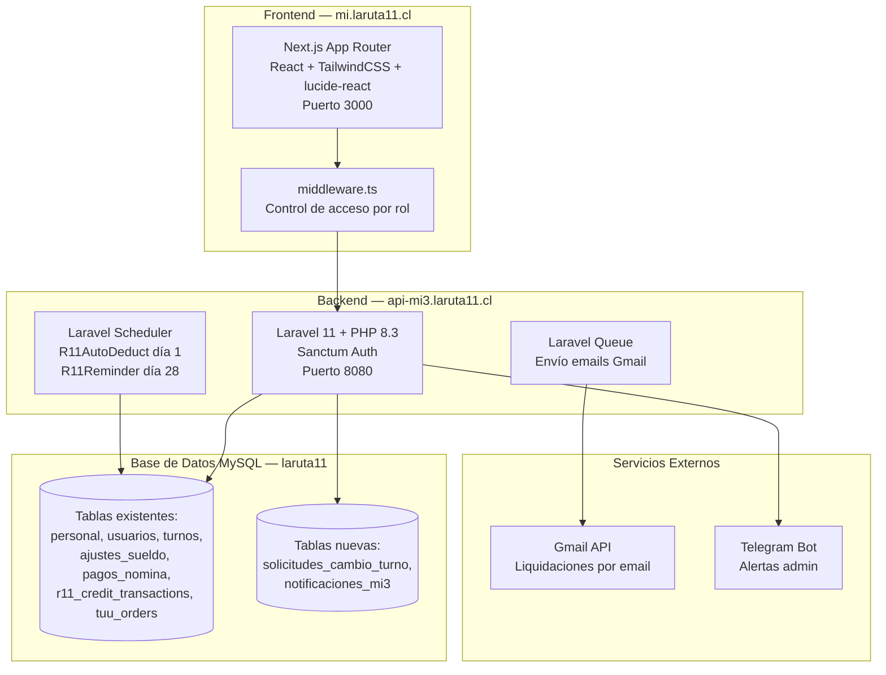
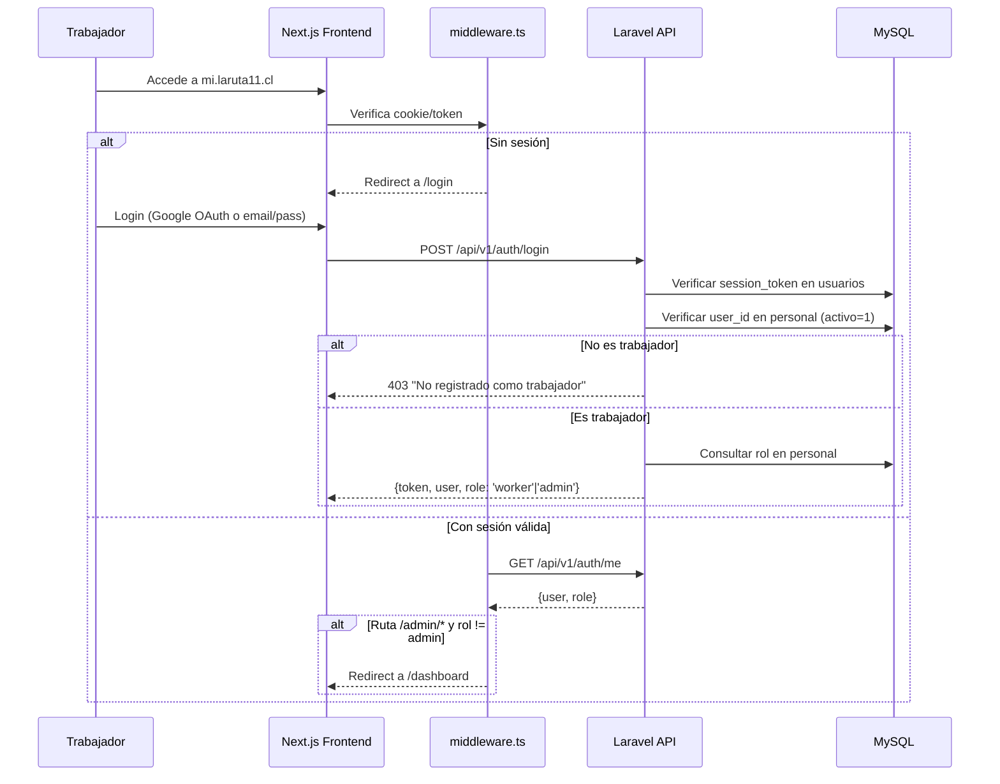

# Diseño — mi3 RRHH

## Resumen

mi3 es una aplicación de autoservicio de Recursos Humanos para los ~10 trabajadores de La Ruta 11. Se compone de dos aplicaciones: un frontend Next.js (App Router) en `mi3/frontend` y un backend Laravel 11 en `mi3/backend`, ambos conectados a la misma base de datos MySQL compartida con app3/caja3.

El sistema reemplaza el módulo PersonalApp.jsx de caja3 con una aplicación dedicada que ofrece:
- **Dashboard trabajador**: perfil, turnos, liquidación, crédito R11, asistencia, solicitudes de cambio, notificaciones
- **Panel admin**: gestión de personal, turnos, nómina, ajustes, créditos R11, aprobación de cambios
- **Automatización**: descuento automático de crédito R11 en nómina (cron día 1)

Las decisiones clave son:
1. **Backend Laravel exclusivo** en vez de reutilizar las APIs PHP de caja3 — permite autenticación Sanctum, Eloquent ORM, Queue para emails, Scheduler para crons, y organización por dominio
2. **Misma base de datos MySQL** — los modelos Eloquent mapean las tablas existentes (`personal`, `usuarios`, `turnos`, `ajustes_sueldo`, etc.) sin modificar su estructura
3. **Lógica de liquidación replicada en PHP** — la función `getLiquidacion()` de PersonalApp.jsx se porta a `LiquidacionService.php` manteniendo exactamente la misma fórmula
4. **Generación dinámica de turnos 4x4 en el backend** — la lógica de `get_turnos.php` se porta a `ShiftService.php`

## Arquitectura



### Flujo de Autenticación



### Decisiones de Diseño

| Decisión | Justificación |
|----------|---------------|
| Laravel 11 exclusivo para mi3 | Permite Sanctum, Eloquent, Queue, Scheduler sin afectar las APIs PHP existentes de caja3 |
| Misma BD MySQL compartida | Los datos de personal, turnos, ajustes ya existen y son usados por caja3. No duplicar |
| Modelos Eloquent sin migraciones destructivas | Se crean modelos que mapean tablas existentes. Solo se migran las 2 tablas nuevas |
| LiquidacionService replica getLiquidacion() | Garantiza que los cálculos sean idénticos al sistema actual. Se testea con property-based testing |
| ShiftService replica get_turnos.php | La generación 4x4 es crítica y debe producir los mismos resultados |
| Next.js middleware para control de acceso | Protección de rutas en el edge sin round-trip al backend |
| Gmail API vía Laravel Queue | Los envíos de email no bloquean la UI. Se procesan en background |
| Mobile-first | Los trabajadores acceden desde celular. El diseño prioriza pantallas pequeñas |

## Componentes e Interfaces

### API REST — Autenticación (`/api/v1/auth/`)

#### `POST /api/v1/auth/login`

**Request:**
```json
{
  "email": "camila@example.com",
  "password": "secret"
}
```
*O con Google OAuth:*
```json
{
  "google_token": "eyJhbGciOiJSUzI1NiIs..."
}
```

**Response 200:**
```json
{
  "success": true,
  "token": "1|abc123...",
  "user": {
    "id": 1,
    "personal_id": 1,
    "nombre": "Camila",
    "email": "camila@example.com",
    "rol": "cajero",
    "is_admin": false
  }
}
```

**Response 403 (no es trabajador):**
```json
{
  "success": false,
  "error": "No estás registrado como trabajador activo de La Ruta 11"
}
```

#### `GET /api/v1/auth/me`

**Headers:** `Authorization: Bearer {token}`

**Response 200:**
```json
{
  "success": true,
  "user": {
    "id": 1,
    "personal_id": 1,
    "nombre": "Camila",
    "email": "camila@example.com",
    "rol": "cajero",
    "is_admin": false,
    "foto_perfil": "https://..."
  }
}
```

#### `POST /api/v1/auth/logout`

**Response 200:** `{ "success": true }`

---

### API REST — Worker (`/api/v1/worker/`)

Todos los endpoints requieren `Authorization: Bearer {token}` + middleware `EnsureIsWorker`.

#### `GET /api/v1/worker/profile`

**Response 200:**
```json
{
  "success": true,
  "data": {
    "nombre": "Camila",
    "email": "camila@example.com",
    "telefono": "+56912345678",
    "rut": "17638433-6",
    "rol": ["cajero"],
    "foto_perfil": "https://...",
    "fecha_registro": "2025-01-15",
    "sueldos_base": {
      "cajero": 450000,
      "planchero": 0,
      "seguridad": 0,
      "admin": 0
    },
    "credito_r11": {
      "activo": true,
      "aprobado": true,
      "bloqueado": false,
      "limite": 50000,
      "usado": 15000,
      "disponible": 35000
    }
  }
}
```

#### `GET /api/v1/worker/shifts?mes=2026-04`

**Response 200:**
```json
{
  "success": true,
  "data": {
    "mes": "2026-04",
    "turnos": [
      {
        "id": "dyn_2026-04-01_1",
        "fecha": "2026-04-01",
        "tipo": "normal",
        "is_dynamic": true,
        "reemplazado_por": null,
        "reemplazante_nombre": null,
        "monto_reemplazo": null
      },
      {
        "id": 45,
        "fecha": "2026-04-05",
        "tipo": "reemplazo",
        "is_dynamic": false,
        "reemplazado_por": 2,
        "reemplazante_nombre": "Neit",
        "monto_reemplazo": 20000
      }
    ]
  }
}
```

#### `GET /api/v1/worker/payroll?mes=2026-04`

**Response 200:**
```json
{
  "success": true,
  "data": {
    "mes": "2026-04",
    "secciones": [
      {
        "centro_costo": "ruta11",
        "sueldo_base": 450000,
        "dias_trabajados": 15,
        "reemplazos_realizados": {
          "2": { "nombre": "Neit", "dias": [5, 12], "monto": 40000 }
        },
        "reemplazos_recibidos": {},
        "ajustes": [
          { "id": 10, "concepto": "Adelanto", "categoria": "adelanto", "monto": -50000, "notas": "" },
          { "id": 15, "concepto": "Descuento Crédito R11 - Abril", "categoria": "descuento_credito_r11", "monto": -15000, "notas": "Auto" }
        ],
        "total": 425000
      }
    ],
    "gran_total": 425000
  }
}
```

#### `GET /api/v1/worker/credit`

**Response 200:**
```json
{
  "success": true,
  "data": {
    "activo": true,
    "aprobado": true,
    "bloqueado": false,
    "limite": 50000,
    "usado": 15000,
    "disponible": 35000,
    "relacion_r11": "trabajador",
    "fecha_aprobacion": "2025-04-01"
  }
}
```

#### `GET /api/v1/worker/credit/transactions`

**Response 200:**
```json
{
  "success": true,
  "data": [
    {
      "id": 1,
      "amount": 5000,
      "type": "debit",
      "description": "Compra orden #ORD-1234",
      "order_id": "ORD-1234",
      "created_at": "2026-04-05 12:30:00"
    }
  ]
}
```

#### `GET /api/v1/worker/attendance?mes=2026-04`

**Response 200:**
```json
{
  "success": true,
  "data": {
    "mes": "2026-04",
    "resumen": {
      "ruta11": {
        "dias_normales": 13,
        "reemplazos_realizados": 2,
        "dias_trabajados": 15,
        "dias_reemplazado": 0
      },
      "seguridad": null
    },
    "dias_mes": 30
  }
}
```

#### `GET /api/v1/worker/shift-swaps`

**Response 200:**
```json
{
  "success": true,
  "data": [
    {
      "id": 1,
      "fecha_turno": "2026-04-10",
      "compañero": { "id": 2, "nombre": "Neit" },
      "motivo": "Cita médica",
      "estado": "pendiente",
      "created_at": "2026-04-05 10:00:00"
    }
  ]
}
```

#### `POST /api/v1/worker/shift-swaps`

**Request:**
```json
{
  "fecha_turno": "2026-04-10",
  "compañero_id": 2,
  "motivo": "Cita médica"
}
```

**Response 201:**
```json
{
  "success": true,
  "data": { "id": 1, "estado": "pendiente" }
}
```

#### `GET /api/v1/worker/notifications`

**Response 200:**
```json
{
  "success": true,
  "data": [
    {
      "id": 1,
      "tipo": "turno",
      "titulo": "Solicitud de cambio aprobada",
      "mensaje": "Tu cambio del 10 de abril fue aprobado",
      "leida": false,
      "created_at": "2026-04-06 09:00:00"
    }
  ],
  "no_leidas": 3
}
```

#### `PATCH /api/v1/worker/notifications/{id}/read`

**Response 200:** `{ "success": true }`

---

### API REST — Admin (`/api/v1/admin/`)

Todos los endpoints requieren `Authorization: Bearer {token}` + middleware `EnsureIsAdmin`.

#### Personal

| Método | Endpoint | Descripción |
|--------|----------|-------------|
| GET | `/admin/personal` | Listar todo el personal |
| POST | `/admin/personal` | Crear trabajador |
| PUT | `/admin/personal/{id}` | Editar trabajador |
| PATCH | `/admin/personal/{id}/toggle` | Activar/desactivar |

**POST /admin/personal — Request:**
```json
{
  "nombre": "Juan Pérez",
  "rol": ["cajero"],
  "sueldo_base_cajero": 450000,
  "sueldo_base_planchero": 0,
  "sueldo_base_admin": 0,
  "sueldo_base_seguridad": 0,
  "activo": 1
}
```

#### Turnos

| Método | Endpoint | Descripción |
|--------|----------|-------------|
| GET | `/admin/shifts?mes=YYYY-MM` | Calendario completo |
| POST | `/admin/shifts` | Crear turno/reemplazo |
| DELETE | `/admin/shifts/{id}` | Eliminar turno |

**POST /admin/shifts — Request:**
```json
{
  "personal_id": 1,
  "fecha": "2026-04-10",
  "fecha_fin": "2026-04-12",
  "tipo": "reemplazo",
  "reemplazado_por": 2,
  "monto_reemplazo": 20000,
  "pago_por": "empresa"
}
```

#### Nómina

| Método | Endpoint | Descripción |
|--------|----------|-------------|
| GET | `/admin/payroll?mes=YYYY-MM` | Resumen nómina |
| POST | `/admin/payroll/payments` | Registrar pago |
| PUT | `/admin/payroll/budget` | Actualizar presupuesto |
| POST | `/admin/payroll/send-liquidacion` | Enviar liquidación email |
| POST | `/admin/payroll/send-all` | Enviar todas las liquidaciones |

**POST /admin/payroll/send-liquidacion — Request:**
```json
{
  "personal_id": 1,
  "mes": "2026-04"
}
```

#### Ajustes

| Método | Endpoint | Descripción |
|--------|----------|-------------|
| GET | `/admin/adjustments?mes=YYYY-MM` | Listar ajustes del mes |
| GET | `/admin/adjustments/categories` | Categorías disponibles |
| POST | `/admin/adjustments` | Crear ajuste |
| DELETE | `/admin/adjustments/{id}` | Eliminar ajuste |

**POST /admin/adjustments — Request:**
```json
{
  "personal_id": 1,
  "mes": "2026-04",
  "monto": -50000,
  "concepto": "Adelanto quincenal",
  "categoria_id": 1,
  "notas": ""
}
```

#### Créditos R11

| Método | Endpoint | Descripción |
|--------|----------|-------------|
| GET | `/admin/credits` | Listar trabajadores con crédito R11 |
| POST | `/admin/credits/{id}/approve` | Aprobar crédito |
| POST | `/admin/credits/{id}/reject` | Rechazar crédito |
| POST | `/admin/credits/{id}/manual-payment` | Pago manual |

#### Solicitudes de Cambio

| Método | Endpoint | Descripción |
|--------|----------|-------------|
| GET | `/admin/shift-swaps` | Listar solicitudes |
| POST | `/admin/shift-swaps/{id}/approve` | Aprobar solicitud |
| POST | `/admin/shift-swaps/{id}/reject` | Rechazar solicitud |

---

### Services (Backend Laravel)

#### `LiquidacionService`

Replica exactamente la lógica de `getLiquidacion()` de PersonalApp.jsx:

```
LiquidacionService::calcular(Personal $persona, string $mes, string $modoContexto = 'all')
├── Obtener turnos del mes (dinámicos + BD)
├── Filtrar por contexto (seguridad / ruta11 / all)
├── Calcular:
│   ├── diasNormales: turnos tipo 'normal'|'seguridad' del trabajador
│   ├── gruposReemplazados: turnos reemplazo donde es titular
│   ├── gruposReemplazando: turnos reemplazo donde es reemplazante
│   ├── diasTrabajados:
│   │   ├── seguridad: 30 - diasReemplazados
│   │   └── ruta11: diasNormales + reemplazosHechos
│   ├── sueldoBase: según rol y contexto
│   │   ├── seguridad → sueldo_base_seguridad
│   │   ├── dueño → cashflow.liquidez
│   │   ├── administrador → sueldo_base_admin
│   │   ├── cajero → sueldo_base_cajero
│   │   └── planchero → sueldo_base_planchero
│   ├── ajustes: solo si includeAjustes (evitar doble conteo)
│   ├── totalReemplazando: suma montos donde pago_por='empresa'
│   ├── totalReemplazados: suma montos donde pago_por='empresa'|'empresa_adelanto'
│   └── total: round(sueldoBase + totalReemplazando - totalReemplazados + totalAjustes)
└── Retornar LiquidacionResult
```

#### `ShiftService`

Replica la generación dinámica 4x4 de `get_turnos.php`:

```
ShiftService::getShiftsForMonth(string $mes)
├── Obtener turnos de BD (Tabla_Turnos WHERE fecha BETWEEN inicio AND fin)
├── Filtrar turnos normales manuales de IDs 1-4 (misma lógica que get_turnos.php)
├── Generar turnos seguridad 4x4:
│   ├── Base: 2026-02-11
│   ├── Ricardo (pos 0-3) / Claudio (pos 4-7)
│   └── Ciclo: (days % 8 + 8) % 8
├── Generar turnos La Ruta 11 4x4:
│   ├── Ciclo 1: base 2026-02-01, Camila (pos 0-3) / Neit (pos 4-7)
│   ├── Ciclo 2: base 2026-02-03, Gabriel (pos 0-3) / Andrés (pos 4-7)
│   └── Ciclo: (days % 8 + 8) % 8
├── Evitar duplicados con turnos manuales existentes
└── Ordenar por fecha, personal_id
```

#### `R11CreditService`

Maneja el descuento automático de crédito R11:

```
R11CreditService::autoDeduct()
├── Consultar trabajadores con es_credito_r11=1 AND credito_r11_usado > 0
├── Para cada trabajador:
│   ├── Buscar personal_id vía user_id en Tabla_Personal
│   ├── Si no tiene personal vinculado → registrar advertencia, skip
│   ├── BEGIN TRANSACTION
│   │   ├── INSERT ajustes_sueldo (categoria: descuento_credito_r11, monto: -credito_r11_usado)
│   │   ├── INSERT r11_credit_transactions (type: refund)
│   │   ├── UPDATE usuarios SET credito_r11_usado=0, fecha_ultimo_pago_r11=NOW()
│   │   └── Si credito_r11_bloqueado=1 → UPDATE credito_r11_bloqueado=0
│   └── COMMIT
├── Enviar resumen por email al admin
└── Retornar lista de procesados + advertencias
```

#### `GmailService`

Envía emails usando la misma integración Gmail API que caja3:

```
GmailService::sendLiquidacionEmail(Personal $persona, string $mes, array $liquidacionData)
├── Generar HTML con template (mismo diseño que email_template.php)
├── Obtener token Gmail (tabla gmail_tokens, refresh si expirado)
├── Construir mensaje MIME con headers UTF-8
├── POST https://gmail.googleapis.com/gmail/v1/users/me/messages/send
└── Registrar en email_logs
```


## Modelos de Datos

### Modelos Eloquent — Tablas Existentes

Estos modelos mapean tablas que ya existen en la BD compartida. No se crean migraciones para ellas.

#### `Personal` (tabla `personal`)

```php
class Personal extends Model {
    protected $table = 'personal';
    public $timestamps = false;

    protected $fillable = [
        'nombre', 'rol', 'user_id', 'rut', 'telefono', 'email',
        'sueldo_base_cajero', 'sueldo_base_planchero',
        'sueldo_base_admin', 'sueldo_base_seguridad', 'activo'
    ];

    protected $casts = [
        'activo' => 'boolean',
        'sueldo_base_cajero' => 'float',
        'sueldo_base_planchero' => 'float',
        'sueldo_base_admin' => 'float',
        'sueldo_base_seguridad' => 'float',
    ];

    // Relaciones
    public function usuario() { return $this->belongsTo(Usuario::class, 'user_id'); }
    public function turnos() { return $this->hasMany(Turno::class, 'personal_id'); }
    public function ajustes() { return $this->hasMany(AjusteSueldo::class, 'personal_id'); }
    public function notificaciones() { return $this->hasMany(NotificacionMi3::class, 'personal_id'); }

    // Helpers
    public function getRolesArray(): array {
        return array_map('trim', explode(',', $this->rol ?? ''));
    }
    public function isAdmin(): bool {
        $roles = $this->getRolesArray();
        return in_array('administrador', $roles) || in_array('dueño', $roles);
    }
    public function hasRole(string $role): bool {
        return in_array($role, $this->getRolesArray());
    }
}
```

#### `Usuario` (tabla `usuarios`)

```php
class Usuario extends Model {
    protected $table = 'usuarios';
    public $timestamps = false;

    protected $fillable = [
        'nombre', 'email', 'telefono', 'session_token',
        'es_credito_r11', 'credito_r11_aprobado', 'limite_credito_r11',
        'credito_r11_usado', 'credito_r11_bloqueado',
        'fecha_aprobacion_r11', 'fecha_ultimo_pago_r11', 'relacion_r11'
    ];

    protected $casts = [
        'es_credito_r11' => 'boolean',
        'credito_r11_aprobado' => 'boolean',
        'credito_r11_bloqueado' => 'boolean',
        'limite_credito_r11' => 'float',
        'credito_r11_usado' => 'float',
    ];

    public function personal() { return $this->hasOne(Personal::class, 'user_id'); }
    public function r11Transactions() { return $this->hasMany(R11CreditTransaction::class, 'user_id'); }
}
```

#### `Turno` (tabla `turnos`)

```php
class Turno extends Model {
    protected $table = 'turnos';
    public $timestamps = false;

    protected $fillable = [
        'personal_id', 'fecha', 'tipo', 'reemplazado_por',
        'monto_reemplazo', 'pago_por'
    ];

    protected $casts = [
        'fecha' => 'date',
        'monto_reemplazo' => 'float',
    ];

    public function titular() { return $this->belongsTo(Personal::class, 'personal_id'); }
    public function reemplazante() { return $this->belongsTo(Personal::class, 'reemplazado_por'); }
}
```

#### `AjusteSueldo` (tabla `ajustes_sueldo`)

```php
class AjusteSueldo extends Model {
    protected $table = 'ajustes_sueldo';
    public $timestamps = false;

    protected $fillable = [
        'personal_id', 'mes', 'monto', 'concepto',
        'categoria_id', 'notas'
    ];

    protected $casts = ['monto' => 'float'];

    public function personal() { return $this->belongsTo(Personal::class, 'personal_id'); }
    public function categoria() { return $this->belongsTo(AjusteCategoria::class, 'categoria_id'); }
}
```

#### `R11CreditTransaction` (tabla `r11_credit_transactions`)

```php
class R11CreditTransaction extends Model {
    protected $table = 'r11_credit_transactions';
    const UPDATED_AT = null;

    protected $fillable = ['user_id', 'amount', 'type', 'description', 'order_id'];
    protected $casts = ['amount' => 'float'];

    public function usuario() { return $this->belongsTo(Usuario::class, 'user_id'); }
}
```

#### Otros modelos existentes

| Modelo | Tabla | Uso |
|--------|-------|-----|
| `PagoNomina` | `pagos_nomina` | Registros de pagos de nómina |
| `PresupuestoNomina` | `presupuesto_nomina` | Presupuesto mensual por centro de costo |
| `AjusteCategoria` | `ajustes_categorias` | Categorías de ajustes (adelanto, multa, etc.) |
| `TuuOrder` | `tuu_orders` | Órdenes de pago (para cashflow del dueño) |
| `EmailLog` | `email_logs` | Registro de emails enviados |

---

### Tablas Nuevas (Migraciones Laravel)

#### `solicitudes_cambio_turno`

```sql
CREATE TABLE solicitudes_cambio_turno (
    id INT AUTO_INCREMENT PRIMARY KEY,
    solicitante_id INT NOT NULL,
    compañero_id INT NOT NULL,
    fecha_turno DATE NOT NULL,
    motivo VARCHAR(255),
    estado ENUM('pendiente', 'aprobada', 'rechazada') DEFAULT 'pendiente',
    aprobado_por INT NULL,
    created_at TIMESTAMP DEFAULT CURRENT_TIMESTAMP,
    updated_at TIMESTAMP NULL ON UPDATE CURRENT_TIMESTAMP,
    INDEX idx_solicitante (solicitante_id),
    INDEX idx_compañero (compañero_id),
    INDEX idx_estado (estado),
    FOREIGN KEY (solicitante_id) REFERENCES personal(id),
    FOREIGN KEY (compañero_id) REFERENCES personal(id),
    FOREIGN KEY (aprobado_por) REFERENCES personal(id)
) ENGINE=InnoDB DEFAULT CHARSET=utf8mb4;
```

#### `notificaciones_mi3`

```sql
CREATE TABLE notificaciones_mi3 (
    id INT AUTO_INCREMENT PRIMARY KEY,
    personal_id INT NOT NULL,
    tipo ENUM('turno', 'liquidacion', 'credito', 'ajuste', 'sistema') NOT NULL,
    titulo VARCHAR(255) NOT NULL,
    mensaje TEXT,
    leida TINYINT(1) DEFAULT 0,
    referencia_id INT NULL,
    referencia_tipo VARCHAR(50) NULL,
    created_at TIMESTAMP DEFAULT CURRENT_TIMESTAMP,
    INDEX idx_personal (personal_id),
    INDEX idx_leida (personal_id, leida),
    FOREIGN KEY (personal_id) REFERENCES personal(id)
) ENGINE=InnoDB DEFAULT CHARSET=utf8mb4;
```

#### Migración: categoría `descuento_credito_r11`

```sql
INSERT INTO ajustes_categorias (nombre, slug, icono)
VALUES ('Descuento Crédito R11', 'descuento_credito_r11', '💳')
ON DUPLICATE KEY UPDATE nombre = VALUES(nombre);
```

### Diagrama Entidad-Relación

```mermaid
erDiagram
    personal ||--o| usuarios : "user_id"
    personal ||--o{ turnos : "personal_id"
    personal ||--o{ ajustes_sueldo : "personal_id"
    personal ||--o{ pagos_nomina : "personal_id"
    personal ||--o{ solicitudes_cambio_turno : "solicitante_id"
    personal ||--o{ solicitudes_cambio_turno : "compañero_id"
    personal ||--o{ notificaciones_mi3 : "personal_id"
    usuarios ||--o{ r11_credit_transactions : "user_id"
    ajustes_sueldo }o--|| ajustes_categorias : "categoria_id"
    turnos }o--o| personal : "reemplazado_por"

    personal {
        int id PK
        varchar nombre
        set rol
        int user_id FK
        varchar rut
        varchar telefono
        varchar email
        decimal sueldo_base_cajero
        decimal sueldo_base_planchero
        decimal sueldo_base_admin
        decimal sueldo_base_seguridad
        tinyint activo
    }

    usuarios {
        int id PK
        varchar nombre
        varchar email
        varchar session_token
        tinyint es_credito_r11
        tinyint credito_r11_aprobado
        decimal limite_credito_r11
        decimal credito_r11_usado
        tinyint credito_r11_bloqueado
        date fecha_ultimo_pago_r11
        varchar relacion_r11
    }

    turnos {
        int id PK
        int personal_id FK
        date fecha
        varchar tipo
        int reemplazado_por FK
        decimal monto_reemplazo
        varchar pago_por
    }

    ajustes_sueldo {
        int id PK
        int personal_id FK
        date mes
        decimal monto
        varchar concepto
        int categoria_id FK
        text notas
    }

    solicitudes_cambio_turno {
        int id PK
        int solicitante_id FK
        int compañero_id FK
        date fecha_turno
        varchar motivo
        enum estado
        int aprobado_por FK
        timestamp created_at
    }

    notificaciones_mi3 {
        int id PK
        int personal_id FK
        enum tipo
        varchar titulo
        text mensaje
        tinyint leida
        int referencia_id
        varchar referencia_tipo
        timestamp created_at
    }

    r11_credit_transactions {
        int id PK
        int user_id FK
        decimal amount
        enum type
        varchar description
        varchar order_id
        timestamp created_at
    }
}
```

### Algoritmos Clave

#### Algoritmo 1: Generación de Turnos 4x4

```
función generarTurnos4x4(fechaBase, personaA, personaB, fechaInicio, fechaFin):
    turnos = []
    para cada día desde fechaInicio hasta fechaFin:
        diff = día - fechaBase (en días, puede ser negativo)
        pos = ((diff % 8) + 8) % 8    // módulo positivo
        persona = personaA si pos < 4, sino personaB
        turnos.agregar({ persona, fecha: día })
    retornar turnos

// Ciclos configurados:
// Seguridad:  base=2026-02-11, A=Ricardo, B=Claudio
// Cajeros:    base=2026-02-01, A=Camila,  B=Neit
// Plancheros: base=2026-02-03, A=Gabriel, B=Andrés
```

#### Algoritmo 2: Cálculo de Liquidación

```
función calcularLiquidacion(persona, turnos, ajustes, contexto):
    // 1. Filtrar turnos por contexto
    turnosFiltrados = filtrarPorContexto(turnos, contexto)

    // 2. Contar días
    diasNormales = contar(turnosFiltrados donde tipo='normal'|'seguridad' Y personal_id=persona.id)
    reemplazosRecibidos = turnosFiltrados donde tipo='reemplazo' Y personal_id=persona.id
    reemplazosRealizados = turnosFiltrados donde tipo='reemplazo' Y reemplazado_por=persona.id

    // 3. Días trabajados
    si contexto == 'seguridad':
        diasTrabajados = 30 - count(reemplazosRecibidos)
    sino:
        diasTrabajados = diasNormales + count(reemplazosRealizados)

    // 4. Sueldo base según rol y contexto
    sueldoBase = determinarSueldoBase(persona, contexto)

    // 5. Ajustes (solo una vez, evitar doble conteo)
    incluirAjustes = contexto=='all' OR contexto=='ruta11' OR (contexto=='seguridad' Y persona no tiene rol ruta11)
    totalAjustes = si incluirAjustes: suma(ajustes.monto) sino: 0

    // 6. Reemplazos (solo pagados por empresa)
    totalReemplazando = suma(reemplazosRealizados donde pago_por='empresa' → monto)
    totalReemplazados = suma(reemplazosRecibidos donde pago_por='empresa'|'empresa_adelanto' → monto)

    // 7. Total
    total = round(sueldoBase + totalReemplazando - totalReemplazados + totalAjustes)
    retornar { diasTrabajados, sueldoBase, totalAjustes, total, ... }
```

#### Algoritmo 3: Descuento Automático R11

```
función autoDeductR11(mes):
    deudores = SELECT u.*, p.id as personal_id
               FROM usuarios u
               JOIN personal p ON p.user_id = u.id
               WHERE u.es_credito_r11 = 1
               AND u.credito_r11_usado > 0
               AND p.activo = 1

    resultados = []
    advertencias = []

    para cada deudor en deudores:
        si deudor.personal_id es NULL:
            advertencias.agregar("Usuario {deudor.id} sin personal vinculado")
            continuar

        BEGIN TRANSACTION
            monto = deudor.credito_r11_usado

            // 1. Crear ajuste de sueldo
            INSERT ajustes_sueldo (
                personal_id: deudor.personal_id,
                mes: primerDiaDelMes,
                monto: -monto,
                concepto: "Descuento Crédito R11 - {nombreMes}",
                categoria_id: ID_DESCUENTO_CREDITO_R11
            )

            // 2. Registrar transacción R11
            INSERT r11_credit_transactions (
                user_id: deudor.id,
                amount: monto,
                type: 'refund',
                description: "Descuento nómina {nombreMes}"
            )

            // 3. Resetear crédito
            UPDATE usuarios SET
                credito_r11_usado = 0,
                fecha_ultimo_pago_r11 = NOW(),
                credito_r11_bloqueado = 0
            WHERE id = deudor.id
        COMMIT

        resultados.agregar({ nombre: deudor.nombre, monto })

    enviarResumenEmail(resultados, advertencias)
    retornar { resultados, advertencias }
```

## Propiedades de Correctitud

*Una propiedad es una característica o comportamiento que debe mantenerse verdadero en todas las ejecuciones válidas de un sistema — esencialmente, una declaración formal sobre lo que el sistema debe hacer. Las propiedades sirven como puente entre especificaciones legibles por humanos y garantías de correctitud verificables por máquinas.*

### Propiedad 1: Control de acceso basado en personal y rol

*Para cualquier* usuario con `session_token` válido en `usuarios`, el sistema SHALL conceder acceso a mi3 si y solo si existe un registro en `personal` con `user_id = usuario.id` y `activo = 1`. Además, el flag `is_admin` SHALL ser `true` si y solo si el campo `rol` del registro en `personal` contiene 'administrador' o 'dueño'.

**Valida: Requerimientos 1.3, 1.4**

### Propiedad 2: Aislamiento de perfil entre trabajadores

*Para cualquier* par de trabajadores (A, B) donde A.id ≠ B.id, una solicitud de A al perfil de B SHALL ser rechazada con error de autorización. Solo el propio trabajador puede acceder a su perfil.

**Valida: Requerimiento 2.4**

### Propiedad 3: Correctitud de la generación de turnos 4x4

*Para cualquier* fecha dentro de un mes dado y cualquier ciclo 4x4 configurado con (fechaBase, personaA, personaB), el trabajador asignado SHALL ser `personaA` si `((diffDias % 8) + 8) % 8 < 4`, y `personaB` en caso contrario, donde `diffDias` es la diferencia en días entre la fecha y la fechaBase. Esto debe producir exactamente el mismo resultado que la implementación de referencia en `get_turnos.php`.

**Valida: Requerimientos 3.1, 3.3, 9.1**

### Propiedad 4: Correctitud de la fórmula de liquidación

*Para cualquier* trabajador con cualquier combinación de turnos (normales, reemplazos realizados, reemplazos recibidos), ajustes (adelantos, multas, bonos, descuentos) y sueldo base, el total de la liquidación SHALL ser exactamente `round(sueldoBase + totalReemplazando - totalReemplazados + totalAjustes)`, donde `totalReemplazando` solo incluye reemplazos con `pago_por = 'empresa'`, `totalReemplazados` incluye `pago_por = 'empresa'` o `'empresa_adelanto'`, y `totalAjustes` es la suma de todos los montos de ajustes del trabajador para el mes.

**Valida: Requerimientos 4.1, 4.4, 10.2, 13.1, 13.2**

### Propiedad 5: Gran total es suma de centros de costo

*Para cualquier* trabajador con roles en múltiples centros de costo, el `gran_total` de la liquidación SHALL ser igual a `total_ruta11 + total_seguridad`, donde cada total se calcula independientemente con su contexto. Los ajustes SHALL contarse una sola vez (en 'ruta11' si el trabajador tiene rol ruta11, o en 'seguridad' si solo tiene rol seguridad).

**Valida: Requerimiento 4.6**

### Propiedad 6: Cálculo de crédito R11 disponible

*Para cualquier* usuario con `es_credito_r11 = 1` y valores `limite_credito_r11` y `credito_r11_usado` donde `usado <= limite`, el crédito disponible retornado por la API SHALL ser exactamente `limite_credito_r11 - credito_r11_usado`.

**Valida: Requerimiento 5.1**

### Propiedad 7: Filtrado de compañeros para cambio de turno

*Para cualquier* trabajador solicitante y cualquier conjunto de trabajadores en el sistema, la lista de compañeros disponibles para cambio de turno SHALL incluir únicamente trabajadores con `activo = 1` que pertenezcan al mismo centro de costo que el solicitante, excluyendo al propio solicitante.

**Valida: Requerimiento 6.1**

### Propiedad 8: Invariante de conteo de notificaciones no leídas

*Para cualquier* conjunto de notificaciones de un trabajador, el campo `no_leidas` retornado por la API SHALL ser exactamente igual al conteo de registros en `notificaciones_mi3` donde `personal_id = trabajador.personal_id` y `leida = 0`.

**Valida: Requerimiento 7.5**

### Propiedad 9: Creación de turnos por rango de fechas

*Para cualquier* rango de fechas (fecha_inicio, fecha_fin) donde fecha_inicio ≤ fecha_fin, al crear un turno con rango, el sistema SHALL crear exactamente `(fecha_fin - fecha_inicio + 1)` registros en `turnos`, uno por cada día del rango, todos con los mismos atributos (personal_id, tipo, reemplazado_por, monto_reemplazo, pago_por).

**Valida: Requerimiento 9.4**

### Propiedad 10: Selección de deudores para descuento automático R11

*Para cualquier* conjunto de usuarios en el sistema, el proceso de descuento automático R11 SHALL procesar únicamente los usuarios que cumplan TODAS estas condiciones: `es_credito_r11 = 1` AND `credito_r11_usado > 0` AND existe un registro en `personal` con `user_id = usuario.id` y `activo = 1`. Usuarios sin registro en `personal` vinculado SHALL ser omitidos y registrados como advertencia.

**Valida: Requerimientos 12.1, 12.5**

### Propiedad 11: Round-trip del descuento automático R11

*Para cualquier* trabajador con deuda de crédito R11 (`credito_r11_usado > 0`), después de ejecutar el descuento automático, SHALL existir un ajuste en `ajustes_sueldo` con `monto = -credito_r11_usado_original` y `categoria = 'descuento_credito_r11'`, SHALL existir una transacción en `r11_credit_transactions` con `type = 'refund'` y `amount = credito_r11_usado_original`, y el `credito_r11_usado` del usuario SHALL ser exactamente 0.

**Valida: Requerimientos 12.2, 12.3**

## Manejo de Errores

### Autenticación y Autorización

| Escenario | HTTP | Respuesta |
|-----------|------|-----------|
| Sin token o token inválido | 401 | `{ "success": false, "error": "No autenticado" }` |
| Token válido pero usuario no en `personal` | 403 | `{ "success": false, "error": "No estás registrado como trabajador activo" }` |
| Trabajador accede a ruta `/admin/*` sin rol admin | 403 | `{ "success": false, "error": "Acceso denegado" }` |
| Trabajador intenta acceder a perfil de otro | 403 | `{ "success": false, "error": "No autorizado" }` |

### Middleware Laravel

```php
// EnsureIsWorker.php
class EnsureIsWorker {
    public function handle(Request $request, Closure $next) {
        $user = $request->user(); // Sanctum
        if (!$user) return response()->json(['success' => false, 'error' => 'No autenticado'], 401);

        $personal = Personal::where('user_id', $user->id)->where('activo', 1)->first();
        if (!$personal) return response()->json(['success' => false, 'error' => 'No registrado como trabajador activo'], 403);

        $request->merge(['personal' => $personal]);
        return $next($request);
    }
}

// EnsureIsAdmin.php
class EnsureIsAdmin {
    public function handle(Request $request, Closure $next) {
        $personal = $request->get('personal');
        if (!$personal || !$personal->isAdmin()) {
            return response()->json(['success' => false, 'error' => 'Acceso denegado'], 403);
        }
        return $next($request);
    }
}
```

### CORS Restringido

```php
// config/cors.php
'allowed_origins' => [
    'https://mi.laruta11.cl',
    'https://app.laruta11.cl',
    'https://caja.laruta11.cl',
],
'supports_credentials' => true,
```

### Validación de Datos (Form Requests)

```php
// StoreAdjustmentRequest.php
class StoreAdjustmentRequest extends FormRequest {
    public function rules(): array {
        return [
            'personal_id' => 'required|integer|exists:personal,id',
            'mes' => 'required|date_format:Y-m',
            'monto' => 'required|numeric',
            'concepto' => 'required|string|max:255',
            'categoria_id' => 'required|integer|exists:ajustes_categorias,id',
            'notas' => 'nullable|string|max:500',
        ];
    }
}

// StoreShiftRequest.php
class StoreShiftRequest extends FormRequest {
    public function rules(): array {
        return [
            'personal_id' => 'required|integer|exists:personal,id',
            'fecha' => 'required|date',
            'fecha_fin' => 'nullable|date|after_or_equal:fecha',
            'tipo' => 'required|in:normal,reemplazo,seguridad,reemplazo_seguridad',
            'reemplazado_por' => 'nullable|integer|exists:personal,id',
            'monto_reemplazo' => 'nullable|numeric|min:0',
            'pago_por' => 'nullable|in:empresa,empresa_adelanto,personal',
        ];
    }
}

// ShiftSwapRequest.php
class ShiftSwapRequest extends FormRequest {
    public function rules(): array {
        return [
            'fecha_turno' => 'required|date|after:today',
            'compañero_id' => 'required|integer|exists:personal,id',
            'motivo' => 'nullable|string|max:255',
        ];
    }
}
```

### Errores de Servicios Externos

| Servicio | Manejo |
|----------|--------|
| Gmail API — token expirado | Refresh automático vía `gmail_tokens`. Si falla, log error + notificación Telegram al admin |
| Gmail API — envío falla | Log en `email_logs` con status='failed'. No bloquear flujo principal. Reintentar vía Queue (3 intentos) |
| MySQL — conexión perdida | Laravel retry automático. Si persiste, HTTP 500 con mensaje genérico |
| MySQL — deadlock en transacción | Retry automático (hasta 3 veces) con backoff exponencial |

### Transaccionalidad

Todas las operaciones que modifican múltiples tablas usan transacciones de base de datos:

```php
// Ejemplo: Auto-deducción R11
DB::transaction(function () use ($usuario, $personalId, $monto, $mes) {
    AjusteSueldo::create([
        'personal_id' => $personalId,
        'mes' => $mes,
        'monto' => -$monto,
        'concepto' => "Descuento Crédito R11 - {$mesNombre}",
        'categoria_id' => $categoriaR11Id,
    ]);

    R11CreditTransaction::create([
        'user_id' => $usuario->id,
        'amount' => $monto,
        'type' => 'refund',
        'description' => "Descuento nómina {$mesNombre}",
    ]);

    $usuario->update([
        'credito_r11_usado' => 0,
        'fecha_ultimo_pago_r11' => now(),
        'credito_r11_bloqueado' => 0,
    ]);
});
```

### Consistencia de Datos

- `credito_r11_usado` nunca debe ser negativo — se usa `max(0, credito_r11_usado - monto)` en pagos manuales
- Los ajustes de sueldo con categoría `descuento_credito_r11` solo se crean por el proceso automático, nunca manualmente
- Las solicitudes de cambio de turno solo pueden pasar de 'pendiente' a 'aprobada' o 'rechazada', nunca al revés

## Estrategia de Testing

### Enfoque Dual

El sistema requiere tanto tests unitarios como tests basados en propiedades:

- **Tests unitarios (PHPUnit)**: Para ejemplos específicos, edge cases, integraciones con servicios externos, y verificación de endpoints API
- **Tests de propiedades (PHPUnit + custom generators)**: Para validar las propiedades universales de la lógica de negocio

### Property-Based Testing

**Librería**: PHPUnit con generadores custom (PHP no tiene un fast-check equivalente maduro, pero se implementan generators simples con `random_int`, `array_rand`, y loops de 100+ iteraciones)

Alternativa recomendada: [Eris](https://github.com/giorgiosironi/eris) (PBT para PHP) si se desea una librería dedicada.

**Configuración:**
- Mínimo 100 iteraciones por test de propiedad
- Cada test debe referenciar su propiedad del documento de diseño
- Formato de tag: `Feature: mi3-rrhh, Property {número}: {texto}`

### Tests de Propiedades (PHPUnit)

| Propiedad | Clase de Test | Generadores |
|-----------|---------------|-------------|
| P1: Control de acceso | `AccessControlPropertyTest` | Usuarios random con/sin personal, roles variados |
| P2: Aislamiento de perfil | `ProfileIsolationPropertyTest` | Pares de trabajadores random |
| P3: Turnos 4x4 | `ShiftGenerationPropertyTest` | Fechas random en rango amplio, ciclos configurados |
| P4: Fórmula liquidación | `LiquidacionPropertyTest` | Trabajadores con turnos, ajustes y sueldos random |
| P5: Gran total | `GranTotalPropertyTest` | Trabajadores con roles duales y datos random |
| P6: Crédito disponible | `CreditCalculationPropertyTest` | Pares (limite, usado) random donde usado ≤ limite |
| P7: Filtrado compañeros | `ShiftSwapFilterPropertyTest` | Conjuntos de trabajadores con roles y estados random |
| P8: Conteo notificaciones | `NotificationCountPropertyTest` | Sets de notificaciones con leida random |
| P9: Rango de turnos | `ShiftRangePropertyTest` | Rangos de fechas random |
| P10: Selección deudores R11 | `R11DebtorSelectionPropertyTest` | Usuarios con estados de crédito variados |
| P11: Round-trip R11 | `R11AutoDeductPropertyTest` | Trabajadores con deudas random |

### Tests Unitarios (PHPUnit)

| Área | Tests |
|------|-------|
| Auth | Login con Google OAuth, login con email/pass, logout, token inválido, usuario no trabajador |
| Perfil | Ver perfil propio, intentar ver perfil ajeno, perfil con crédito R11, perfil sin crédito |
| Turnos | Obtener turnos del mes, turnos dinámicos generados, reemplazos visibles |
| Liquidación | Liquidación mes actual, mes anterior, con ajustes, con reemplazos, con descuento R11 |
| Crédito R11 | Ver crédito activo, crédito bloqueado, sin crédito, historial transacciones |
| Cambio turno | Crear solicitud, aprobar, rechazar, solicitud duplicada |
| Notificaciones | Listar, marcar como leída, conteo no leídas |
| Admin Personal | CRUD completo, activar/desactivar, vincular usuario |
| Admin Turnos | Crear turno, crear reemplazo, eliminar, rango de fechas |
| Admin Nómina | Resumen, registrar pago, actualizar presupuesto |
| Admin Ajustes | Crear, eliminar, listar por mes, categorías |
| Cron R11 | Auto-deducción con deudores, sin deudores, usuario sin personal |
| Email | Envío liquidación (mock Gmail), template HTML correcto |

### Tests de Integración

| Área | Tests |
|------|-------|
| Gmail API | Envío real en staging con token válido |
| Middleware | Cadena completa auth → worker → admin |
| Scheduler | Verificar que comandos están registrados correctamente |
| Queue | Verificar que jobs de email se encolan y procesan |

### Cobertura Objetivo

- Services (LiquidacionService, ShiftService, R11CreditService): ≥ 90%
- Controllers: ≥ 80%
- Models: ≥ 70%
- Middleware: 100%
