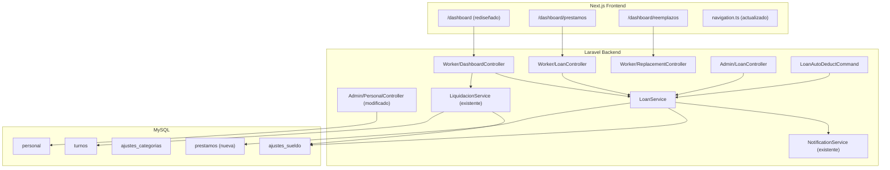
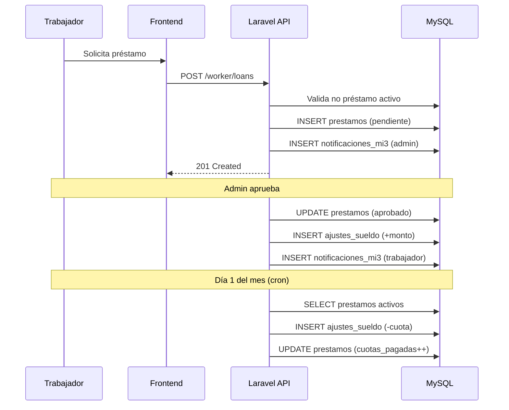
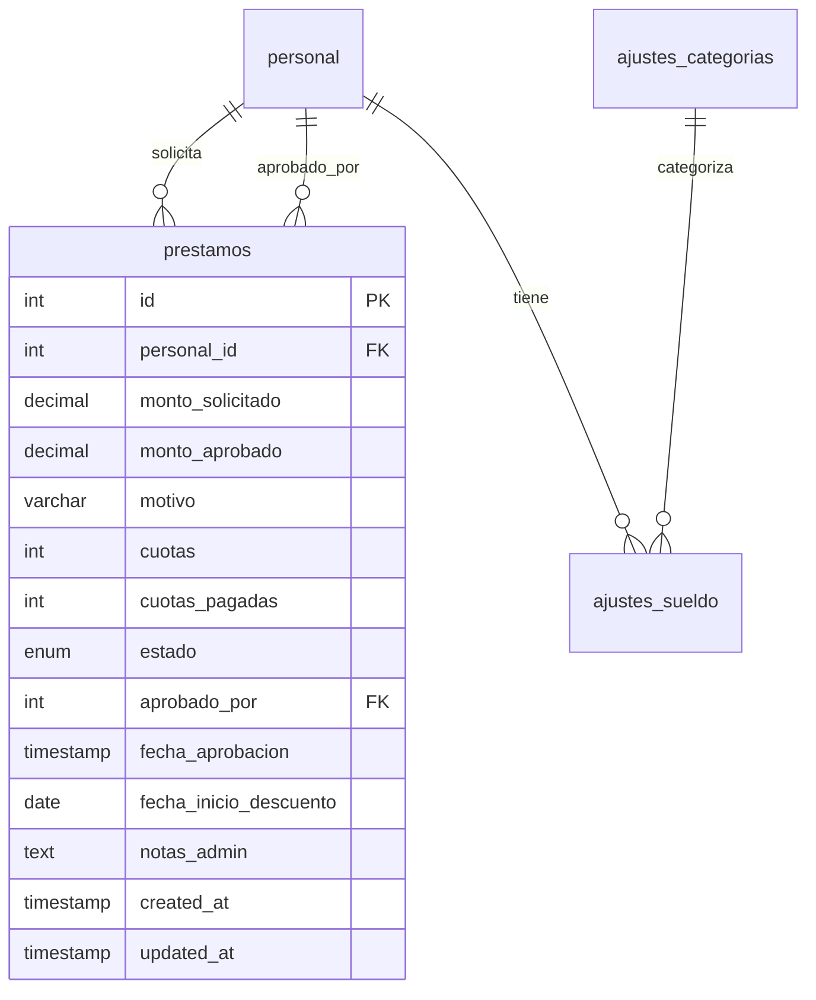
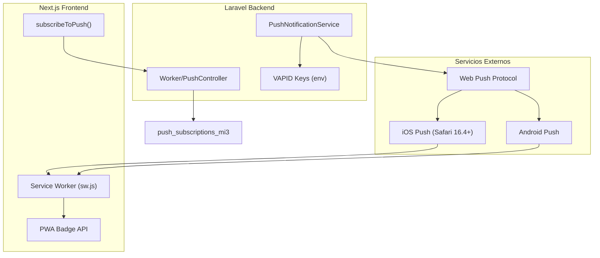
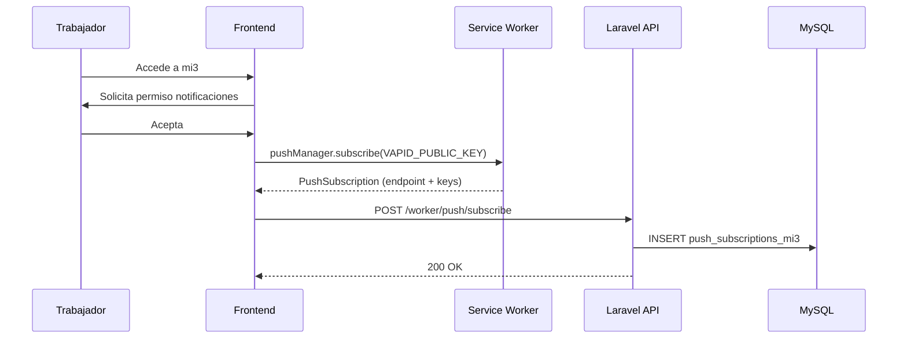
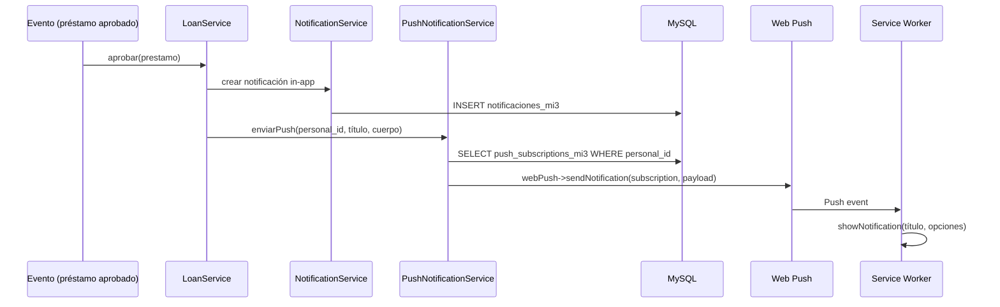

# Diseño — mi3 Worker Dashboard v2

## Resumen

Este diseño cubre las mejoras al dashboard del trabajador en mi3: sueldo base por defecto ($300.000), sistema de préstamos con auto-descuento, dashboard rediseñado con 4 tarjetas de resumen, sección dedicada de préstamos, gestión de reemplazos y navegación actualizada.

La arquitectura existente se mantiene: Next.js 14 (frontend) + Laravel 11 (backend) + MySQL compartida. Se agregan nuevos endpoints REST, un modelo `Prestamo`, un servicio `LoanService`, un comando Artisan para auto-descuento de cuotas, y nuevas páginas en el frontend.

## Arquitectura

### Diagrama de Componentes



### Flujo de Préstamos



## Componentes e Interfaces

### Backend — Nuevos Componentes

#### 1. Modelo `Prestamo`

Ubicación: `mi3/backend/app/Models/Prestamo.php`

```php
class Prestamo extends Model
{
    protected $table = 'prestamos';
    protected $fillable = [
        'personal_id', 'monto_solicitado', 'monto_aprobado',
        'motivo', 'cuotas', 'cuotas_pagadas', 'estado',
        'aprobado_por', 'fecha_aprobacion', 'fecha_inicio_descuento',
        'notas_admin',
    ];
    protected $casts = [
        'monto_solicitado' => 'float',
        'monto_aprobado' => 'float',
        'fecha_aprobacion' => 'datetime',
        'fecha_inicio_descuento' => 'date',
    ];
}
```

#### 2. `LoanService`

Ubicación: `mi3/backend/app/Services/Loan/LoanService.php`

Métodos principales:
- `solicitarPrestamo(int $personalId, float $monto, int $cuotas, ?string $motivo): Prestamo` — Valida y crea solicitud
- `aprobar(Prestamo $prestamo, int $aprobadoPorId, float $montoAprobado, ?string $fechaInicio, ?string $notas): void` — Aprueba y crea ajuste positivo
- `rechazar(Prestamo $prestamo, int $aprobadoPorId, ?string $notas): void` — Rechaza solicitud
- `getPrestamoActivo(int $personalId): ?Prestamo` — Retorna préstamo activo (aprobado con cuotas pendientes)
- `getPrestamosPorPersonal(int $personalId): Collection` — Lista préstamos del trabajador
- `getTodosPrestamos(): Collection` — Lista todos los préstamos (admin)
- `procesarDescuentosMensuales(): array` — Cron: crea ajustes negativos para cuotas pendientes
- `getSueldoBase(Personal $personal): float` — Calcula sueldo base para validación de monto máximo

#### 3. `Worker/LoanController`

Ubicación: `mi3/backend/app/Http/Controllers/Worker/LoanController.php`

Endpoints:
- `GET /api/v1/worker/loans` → `index()` — Lista préstamos del trabajador
- `POST /api/v1/worker/loans` → `store()` — Crea solicitud de préstamo

#### 4. `Worker/DashboardController`

Ubicación: `mi3/backend/app/Http/Controllers/Worker/DashboardController.php`

Endpoints:
- `GET /api/v1/worker/dashboard-summary` → `index()` — Retorna resumen: sueldo, préstamo activo, descuentos, reemplazos

#### 5. `Worker/ReplacementController`

Ubicación: `mi3/backend/app/Http/Controllers/Worker/ReplacementController.php`

Endpoints:
- `GET /api/v1/worker/replacements?mes=YYYY-MM` → `index()` — Retorna reemplazos del mes

#### 6. `Admin/LoanController`

Ubicación: `mi3/backend/app/Http/Controllers/Admin/LoanController.php`

Endpoints:
- `GET /api/v1/admin/loans` → `index()` — Lista todos los préstamos
- `POST /api/v1/admin/loans/{id}/approve` → `approve()` — Aprueba préstamo
- `POST /api/v1/admin/loans/{id}/reject` → `reject()` — Rechaza préstamo

#### 7. `LoanAutoDeductCommand`

Ubicación: `mi3/backend/app/Console/Commands/LoanAutoDeductCommand.php`

Signature: `mi3:loan-auto-deduct`

Se ejecuta el día 1 de cada mes. Consulta préstamos aprobados con cuotas pendientes, crea ajustes negativos en `ajustes_sueldo` y actualiza `cuotas_pagadas`. Usa transacción DB.

#### 8. Modificación a `PersonalController::store()`

Se modifica para aplicar sueldo base por defecto de $300.000 cuando los campos de sueldo son null o 0, según los roles seleccionados.

### Frontend — Nuevos Componentes

#### 1. Dashboard Rediseñado (`/dashboard/page.tsx`)

Reemplaza el dashboard actual. Muestra 4 tarjetas de resumen (sueldo, préstamos, descuentos, reemplazos) + secciones existentes de turnos del día y notificaciones debajo.

Consume: `GET /api/v1/worker/dashboard-summary`

#### 2. Página de Préstamos (`/dashboard/prestamos/page.tsx`)

Lista de préstamos con estado, barra de progreso para préstamos activos, botón de solicitar, formulario modal.

Consume: `GET /api/v1/worker/loans`, `POST /api/v1/worker/loans`

#### 3. Página de Reemplazos (`/dashboard/reemplazos/page.tsx`)

Dos secciones: "Reemplazos que hice" y "Me reemplazaron". Resumen mensual con balance. Navegación entre meses.

Consume: `GET /api/v1/worker/replacements?mes=YYYY-MM`

#### 4. Navegación Actualizada (`lib/navigation.ts`)

- Primary nav: Inicio, Turnos, Sueldo, Préstamos
- Secondary nav: Perfil, Crédito, Reemplazos, Asistencia, Cambios, Notificaciones
- Badge en Préstamos cuando hay solicitud pendiente

### Interfaces de API

#### `GET /api/v1/worker/dashboard-summary`

```json
{
  "success": true,
  "data": {
    "sueldo": {
      "total": 320000,
      "mes": "2025-01"
    },
    "prestamo": {
      "tiene_activo": true,
      "monto_pendiente": 200000,
      "cuotas_restantes": 2,
      "monto_cuota": 100000
    },
    "descuentos": {
      "total": -45000,
      "por_categoria": {
        "prestamo": -30000,
        "descuento_credito_r11": -15000
      }
    },
    "reemplazos": {
      "realizados": { "cantidad": 3, "monto": 60000 },
      "recibidos": { "cantidad": 1, "monto": 20000 }
    }
  }
}
```

#### `GET /api/v1/worker/loans`

```json
{
  "success": true,
  "data": [
    {
      "id": 1,
      "monto_solicitado": 300000,
      "monto_aprobado": 300000,
      "motivo": "Emergencia",
      "cuotas": 3,
      "cuotas_pagadas": 1,
      "estado": "aprobado",
      "fecha_aprobacion": "2025-01-15T...",
      "fecha_inicio_descuento": "2025-02-01",
      "notas_admin": null,
      "created_at": "2025-01-10T..."
    }
  ]
}
```

#### `POST /api/v1/worker/loans`

Request:
```json
{
  "monto": 200000,
  "cuotas": 2,
  "motivo": "Gastos médicos"
}
```

Response (201):
```json
{
  "success": true,
  "data": { "id": 5, "estado": "pendiente", "..." : "..." }
}
```

Validaciones:
- `monto` > 0 y <= sueldo base del trabajador
- `cuotas` entre 1 y 3
- No debe existir préstamo activo (estado 'aprobado' con cuotas_pagadas < cuotas)

#### `POST /api/v1/admin/loans/{id}/approve`

Request:
```json
{
  "monto_aprobado": 200000,
  "fecha_inicio_descuento": "2025-02-01",
  "notas": "Aprobado sin cambios"
}
```

#### `GET /api/v1/worker/replacements?mes=YYYY-MM`

```json
{
  "success": true,
  "data": {
    "realizados": [
      { "fecha": "2025-01-05", "titular": "Juan Pérez", "monto": 20000, "pago_por": "empresa" }
    ],
    "recibidos": [
      { "fecha": "2025-01-12", "reemplazante": "María López", "monto": 20000, "pago_por": "empresa" }
    ],
    "resumen": {
      "total_ganado": 60000,
      "total_descontado": 20000,
      "balance": 40000
    }
  }
}
```

## Modelo de Datos

### Nueva Tabla: `prestamos`

```sql
CREATE TABLE prestamos (
    id INT AUTO_INCREMENT PRIMARY KEY,
    personal_id INT NOT NULL,
    monto_solicitado DECIMAL(10,2) NOT NULL,
    monto_aprobado DECIMAL(10,2) NULL,
    motivo VARCHAR(255) NULL,
    cuotas INT NOT NULL DEFAULT 1,
    cuotas_pagadas INT NOT NULL DEFAULT 0,
    estado ENUM('pendiente','aprobado','rechazado','pagado','cancelado') DEFAULT 'pendiente',
    aprobado_por INT NULL,
    fecha_aprobacion TIMESTAMP NULL,
    fecha_inicio_descuento DATE NULL,
    notas_admin TEXT NULL,
    created_at TIMESTAMP DEFAULT CURRENT_TIMESTAMP,
    updated_at TIMESTAMP NULL ON UPDATE CURRENT_TIMESTAMP,
    INDEX idx_personal_id (personal_id),
    INDEX idx_estado (estado),
    INDEX idx_created_at (created_at),
    FOREIGN KEY (personal_id) REFERENCES personal(id),
    FOREIGN KEY (aprobado_por) REFERENCES personal(id)
) ENGINE=InnoDB DEFAULT CHARSET=utf8mb4;
```

### Nueva Categoría en `ajustes_categorias`

```sql
INSERT INTO ajustes_categorias (nombre, slug, icono)
VALUES ('Cuota Préstamo', 'prestamo', '💰')
ON DUPLICATE KEY UPDATE nombre = VALUES(nombre);
```

### Modificación a `personal` (lógica, no esquema)

No se modifica el esquema de la tabla `personal`. El valor por defecto de $300.000 se aplica en la lógica del backend (`PersonalController::store()` y `StorePersonalRequest`) cuando los campos de sueldo son null o 0.

### Diagrama ER (cambios)




## Propiedades de Correctitud

*Una propiedad es una característica o comportamiento que debe cumplirse en todas las ejecuciones válidas de un sistema — esencialmente, una declaración formal sobre lo que el sistema debe hacer. Las propiedades sirven como puente entre especificaciones legibles por humanos y garantías de correctitud verificables por máquina.*

### Propiedad 1: Asignación de sueldo base por defecto

*Para cualquier* solicitud de creación de trabajador con roles válidos, si los campos de sueldo base son null o 0, el campo correspondiente al rol principal debe ser $300.000. Si se proporciona un valor explícito > 0, ese valor debe preservarse sin modificación.

**Valida: Requerimientos 1.1, 1.2, 1.4**

### Propiedad 2: Validación de monto de préstamo

*Para cualquier* solicitud de préstamo con un monto dado y un trabajador con sueldo base conocido, la solicitud debe ser aceptada si y solo si el monto es > 0 y <= sueldo base del trabajador. Montos fuera de ese rango deben ser rechazados.

**Valida: Requerimientos 3.4, 10.2**

### Propiedad 3: Préstamo activo impide nueva solicitud

*Para cualquier* trabajador que tenga un préstamo con estado 'aprobado' y cuotas_pagadas < cuotas, intentar crear una nueva solicitud de préstamo debe ser rechazado.

**Valida: Requerimientos 3.5, 10.2**

### Propiedad 4: Aprobación de préstamo crea registros correctos

*Para cualquier* préstamo en estado 'pendiente' que es aprobado con un monto_aprobado dado, el sistema debe: (a) actualizar el estado a 'aprobado', (b) registrar fecha_aprobacion y aprobado_por, y (c) crear un ajuste positivo en ajustes_sueldo con categoría 'prestamo' y monto igual al monto_aprobado.

**Valida: Requerimientos 4.2, 4.3, 10.4**

### Propiedad 5: Auto-descuento mensual procesa préstamos correctamente

*Para cualquier* conjunto de préstamos con estado 'aprobado' y cuotas pendientes (cuotas_pagadas < cuotas) cuya fecha_inicio_descuento <= mes actual, el proceso de descuento debe: (a) crear un ajuste negativo con monto = round(monto_aprobado / cuotas), (b) incrementar cuotas_pagadas en 1, y (c) cambiar estado a 'pagado' si cuotas_pagadas alcanza cuotas.

**Valida: Requerimientos 5.1, 5.2, 5.3, 5.4**

### Propiedad 6: Cálculo de resumen de préstamo activo

*Para cualquier* préstamo activo (aprobado con cuotas pendientes), el monto pendiente debe ser igual a monto_aprobado - (cuotas_pagadas × round(monto_aprobado / cuotas)), las cuotas restantes deben ser cuotas - cuotas_pagadas, y el monto de la próxima cuota debe ser round(monto_aprobado / cuotas).

**Valida: Requerimientos 6.2, 7.3**

### Propiedad 7: Agregación de descuentos por categoría

*Para cualquier* conjunto de ajustes negativos de un trabajador en un mes dado, el total de descuentos debe ser igual a la suma de todos los montos negativos, y el desglose por categoría debe sumar exactamente el total.

**Valida: Requerimiento 6.3**

### Propiedad 8: Cálculo de resumen de reemplazos

*Para cualquier* conjunto de turnos de reemplazo de un trabajador en un mes dado, el balance neto debe ser igual a la suma de montos de reemplazos realizados menos la suma de montos de reemplazos recibidos.

**Valida: Requerimientos 6.4, 8.2**

### Propiedad 9: Filtrado de reemplazos por mes

*Para cualquier* mes consultado, todos los turnos de reemplazo retornados deben tener fecha dentro de ese mes. Ningún turno de otro mes debe aparecer en los resultados.

**Valida: Requerimiento 8.4**

### Propiedad 10: Préstamos ordenados por fecha descendente

*Para cualquier* lista de préstamos retornada por la API, cada préstamo debe tener un created_at mayor o igual al del siguiente en la lista (orden descendente).

**Valida: Requerimiento 7.4**

## Manejo de Errores

### Backend

| Escenario | Código HTTP | Respuesta |
|---|---|---|
| Solicitud de préstamo con monto inválido (≤0 o > sueldo base) | 422 | `{ "success": false, "error": "El monto debe ser entre $1 y $X" }` |
| Solicitud de préstamo con préstamo activo existente | 409 | `{ "success": false, "error": "Ya tienes un préstamo activo" }` |
| Aprobar préstamo que no está en estado 'pendiente' | 422 | `{ "success": false, "error": "Solo se pueden aprobar préstamos pendientes" }` |
| Rechazar préstamo que no está en estado 'pendiente' | 422 | `{ "success": false, "error": "Solo se pueden rechazar préstamos pendientes" }` |
| Préstamo no encontrado | 404 | `{ "success": false, "error": "Préstamo no encontrado" }` |
| Cuotas fuera de rango (no 1-3) | 422 | `{ "success": false, "error": "Las cuotas deben ser entre 1 y 3" }` |
| Error en transacción de auto-descuento | Log error + continúa con siguiente préstamo | El comando registra el error y no detiene el proceso completo |
| Trabajador no autenticado | 401 | Redirect a login (existente) |

### Frontend

| Escenario | Comportamiento |
|---|---|
| Error de red al cargar dashboard | Muestra mensaje de error con opción de reintentar |
| Error al enviar solicitud de préstamo | Muestra toast/alerta con el mensaje del backend |
| Dashboard-summary retorna datos parciales | Muestra tarjetas con datos disponibles, "$0" para datos faltantes |
| Carga lenta | Skeleton/spinner en cada tarjeta independiente |

### Cron (LoanAutoDeductCommand)

- Si falla la transacción para un préstamo individual, se registra el error y se continúa con el siguiente
- Al finalizar, envía email de resumen al admin (similar al patrón de `R11AutoDeductCommand`)
- Si no hay préstamos elegibles, el comando termina sin error

## Estrategia de Testing

### Tests Unitarios (PHPUnit)

Tests de ejemplo y edge cases:

- `LoanServiceTest::test_crear_solicitud_con_datos_validos` — Verifica creación exitosa
- `LoanServiceTest::test_rechazar_solicitud` — Verifica cambio de estado
- `LoanServiceTest::test_notificacion_al_crear_solicitud` — Verifica que se crea notificación para admin
- `LoanServiceTest::test_notificacion_al_aprobar` — Verifica notificación al trabajador
- `LoanServiceTest::test_sueldo_base_defecto_en_formulario` — Verifica pre-llenado de $300.000
- `DashboardSummaryTest::test_estructura_respuesta` — Verifica que el endpoint retorna las 4 secciones
- `DashboardSummaryTest::test_sin_prestamo_activo` — Verifica que prestamo.tiene_activo = false
- `NavigationTest::test_nav_items_correctos` — Verifica items en primary y secondary nav

### Tests de Propiedad (PBT) — Pest + `pestphp/pest-plugin-faker`

Se usará Pest con datasets generados aleatoriamente para implementar las propiedades de correctitud. Cada test ejecutará mínimo 100 iteraciones.

Formato de tag: `Feature: mi3-worker-dashboard-v2, Property {N}: {título}`

Tests de propiedad a implementar:
1. **Propiedad 1**: Asignación de sueldo base por defecto — genera roles y sueldos aleatorios
2. **Propiedad 2**: Validación de monto de préstamo — genera montos aleatorios vs sueldo base
3. **Propiedad 3**: Préstamo activo impide nueva solicitud — genera estados de préstamo aleatorios
4. **Propiedad 4**: Aprobación crea registros correctos — genera préstamos pendientes con montos aleatorios
5. **Propiedad 5**: Auto-descuento mensual — genera conjuntos de préstamos con diferentes cuotas/montos
6. **Propiedad 6**: Cálculo de resumen de préstamo — genera préstamos con diferentes cuotas pagadas
7. **Propiedad 7**: Agregación de descuentos — genera ajustes negativos con categorías aleatorias
8. **Propiedad 8**: Cálculo de resumen de reemplazos — genera turnos de reemplazo aleatorios
9. **Propiedad 9**: Filtrado por mes — genera turnos en múltiples meses
10. **Propiedad 10**: Orden descendente de préstamos — genera préstamos con fechas aleatorias

### Tests de Integración

- `LoanWorkflowTest` — Flujo completo: solicitar → aprobar → auto-descuento → pagado
- `DashboardSummaryIntegrationTest` — Verifica que el endpoint agrega datos reales correctamente
- `LoanAutoDeductCommandTest` — Verifica que el comando Artisan procesa préstamos correctamente

### Cobertura

- Backend: LoanService (lógica de negocio), Controllers (validación HTTP), Command (cron)
- Frontend: Páginas nuevas (dashboard, préstamos, reemplazos), navegación actualizada

## Push Notifications

### Arquitectura



### Flujo de Suscripción



### Flujo de Envío



### Componentes Push

#### 1. `PushNotificationService`

Ubicación: `mi3/backend/app/Services/Notification/PushNotificationService.php`

```php
class PushNotificationService
{
    public function enviar(int $personalId, string $titulo, string $cuerpo, string $url = '/dashboard', string $prioridad = 'normal'): int
    public function suscribir(int $personalId, array $subscription): void
    public function desactivarExpiradas(): int
}
```

Usa `minishlink/web-push` con VAPID keys de env vars.

#### 2. `Worker/PushController`

Ubicación: `mi3/backend/app/Http/Controllers/Worker/PushController.php`

Endpoints:
- `POST /api/v1/worker/push/subscribe` → guarda suscripción

#### 3. Service Worker (`public/sw.js`)

Ubicación: `mi3/frontend/public/sw.js`

Escucha eventos `push`, muestra notificación nativa, maneja clicks para abrir URL.

#### 4. `usePushNotifications` hook

Ubicación: `mi3/frontend/hooks/usePushNotifications.ts`

Hook React que solicita permiso, suscribe al push manager, y envía subscription al backend. Se ejecuta una vez al montar el layout.

### Tabla: `push_subscriptions_mi3`

```sql
CREATE TABLE push_subscriptions_mi3 (
    id INT AUTO_INCREMENT PRIMARY KEY,
    personal_id INT NOT NULL,
    subscription JSON NOT NULL,
    is_active TINYINT(1) DEFAULT 1,
    created_at TIMESTAMP DEFAULT CURRENT_TIMESTAMP,
    updated_at TIMESTAMP NULL ON UPDATE CURRENT_TIMESTAMP,
    INDEX idx_personal (personal_id),
    INDEX idx_active (is_active),
    FOREIGN KEY (personal_id) REFERENCES personal(id)
) ENGINE=InnoDB DEFAULT CHARSET=utf8mb4;
```

### Eventos que disparan Push

| Evento | Destinatario | Título | Prioridad |
|--------|-------------|--------|-----------|
| Préstamo solicitado | Admin | "💰 Nueva solicitud de préstamo" | normal |
| Préstamo aprobado | Trabajador | "✅ Préstamo aprobado" | high |
| Préstamo rechazado | Trabajador | "❌ Préstamo rechazado" | normal |
| Cambio de turno aprobado | Trabajador | "📅 Cambio de turno aprobado" | normal |
| Reemplazo asignado | Trabajador | "🔄 Reemplazo asignado" | normal |
| Liquidación generada | Trabajador | "💵 Tu liquidación está lista" | normal |
| Cuota descontada | Trabajador | "📋 Cuota de préstamo descontada" | normal |

### Dependencias Nuevas

- `minishlink/web-push` — librería PHP para enviar push notifications via VAPID
- Variables de entorno: `VAPID_PUBLIC_KEY`, `VAPID_PRIVATE_KEY`
