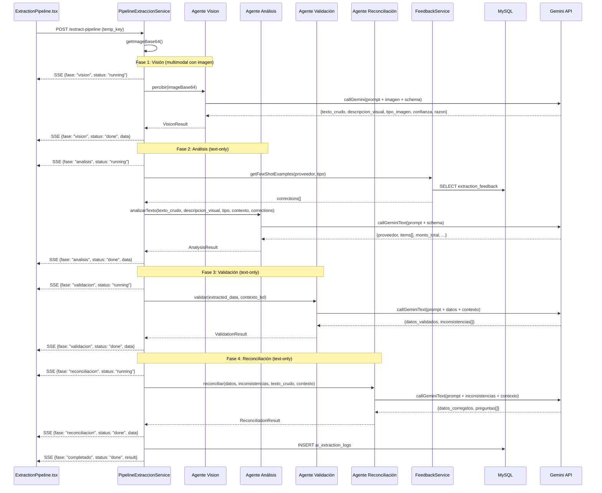
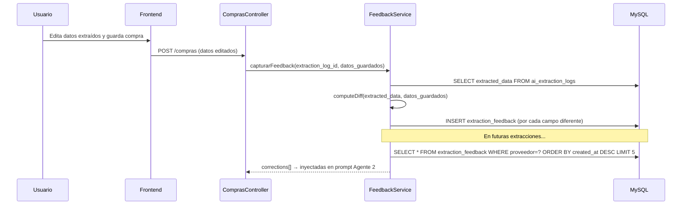

# Diseño: Pipeline Multi-Agente para Extracción de Compras

## Resumen

Este diseño describe la refactorización del pipeline de extracción IA de compras desde una arquitectura de 2 fases (clasificar + analizar, ambas con imagen) hacia una arquitectura de 4 agentes especializados donde la imagen se procesa una sola vez. Los agentes subsiguientes operan exclusivamente con texto, reduciendo el costo de tokens de imagen a la mitad. Además, se incorpora un motor de auto-aprendizaje que captura correcciones del usuario como few-shot examples para futuras extracciones.

### Decisiones de Diseño Clave

1. **Una sola llamada multimodal**: El Agente 1 (Visión) es el único que recibe la imagen. Retorna texto crudo + descripción visual + clasificación. Esto reduce tokens de imagen de ~520 a ~260.
2. **Agentes text-only**: Los agentes 2-4 usan `callGeminiText()` (nuevo método sin payload de imagen), significativamente más barato.
3. **Validación inteligente vs reglas hardcodeadas**: El Agente 3 reemplaza `postProcess()` con razonamiento IA, capaz de detectar errores que las reglas fijas no capturan.
4. **Reconciliación interactiva**: El Agente 4 genera preguntas para el usuario cuando no puede resolver inconsistencias automáticamente.
5. **Self-learning**: Las correcciones del usuario se almacenan y se inyectan como few-shot examples en el prompt del Agente 2.
6. **Backward compatibility**: Se mantienen `clasificar()` y `analizar()` existentes. El nuevo pipeline se expone como `ejecutarMultiAgente()`.

## Arquitectura




### Flujo de Auto-Aprendizaje



## Componentes e Interfaces

### Backend (Laravel)

#### GeminiService — Nuevos métodos

```php
class GeminiService
{
    // Existentes (se mantienen para backward compatibility)
    public function clasificar(string $imageBase64): ?array;
    public function analizar(string $imageBase64, string $tipo, array $contexto): ?array;
    
    // NUEVOS
    public function percibir(string $imageBase64): ?array;
    public function analizarTexto(string $textoCrudo, string $descripcionVisual, string $tipo, array $contexto, array $fewShotExamples = []): ?array;
    public function validar(array $datosExtraidos, array $contextoBd): ?array;
    public function reconciliar(array $datos, array $inconsistencias, string $textoCrudo, array $contextoBd): ?array;
    
    // Nuevo método interno
    private function callGeminiText(string $prompt, array $schema, int $timeout, int $maxOutputTokens): ?array;
}
```

#### PipelineExtraccionService — Nuevo método

```php
class PipelineExtraccionService
{
    // Existente (se mantiene)
    public function ejecutar(string $imageUrl, ?callable $onEvent = null): array;
    
    // NUEVO — pipeline de 4 agentes
    public function ejecutarMultiAgente(string $imageUrl, ?callable $onEvent = null): array;
}
```

#### FeedbackService — NUEVO

```php
class FeedbackService
{
    /**
     * Calcula diff entre datos extraídos y datos guardados, almacena en extraction_feedback.
     */
    public function capturarFeedback(int $extractionLogId, ?int $compraId, array $datosGuardados): void;
    
    /**
     * Obtiene las últimas N correcciones para un proveedor/tipo como few-shot examples.
     */
    public function getFewShotExamples(?string $proveedor, ?string $tipoImagen, int $limit = 5): array;
    
    /**
     * Formatea correcciones como texto para inyectar en prompt.
     */
    public function formatearEjemplos(array $corrections): string;
    
    /**
     * Calcula diff campo a campo entre dos arrays de datos.
     */
    public function computeDiff(array $original, array $final): array;
}
```

#### Interfaces de datos entre agentes

```php
// Resultado del Agente 1 (Visión)
// VisionResult: texto_crudo, descripcion_visual, tipo_imagen, confianza, razon, tokens

// Resultado del Agente 2 (Análisis)  
// AnalysisResult: data (ExtractedData), tokens

// Resultado del Agente 3 (Validación)
// ValidationResult: datos_validados, inconsistencias[], tokens

// Resultado del Agente 4 (Reconciliación)
// ReconciliationResult: datos_finales, correcciones_aplicadas[], preguntas[], tokens
```

**Tipos de datos compartidos:**

```php
// Inconsistencia
[
    'campo' => string,           // ej: "items.0.subtotal"
    'valor_actual' => mixed,     // ej: 5000
    'valor_esperado' => mixed,   // ej: 4500
    'severidad' => 'error'|'advertencia',
    'descripcion' => string,     // ej: "subtotal no coincide con precio × cantidad"
]

// PreguntaReconciliacion
[
    'campo' => string,           // ej: "proveedor"
    'descripcion' => string,     // ej: "El proveedor detectado podría ser el comprador"
    'opciones' => [
        ['valor' => string, 'etiqueta' => string],
        // ...
    ],
]
```

### Frontend (Next.js)

#### ExtractionPipeline.tsx — Actualización

El componente se actualiza para soportar 4 fases + UI de reconciliación:

```typescript
type PhaseId = 'vision' | 'analisis' | 'validacion' | 'reconciliacion';

interface ReconciliationQuestion {
  campo: string;
  descripcion: string;
  opciones: { valor: string | number; etiqueta: string }[];
}

interface ExtractionPipelineProps {
  tempKey: string;
  onResult: (data: ExtractionResult, sugerencias: ExtractionResult['sugerencias']) => void;
  onError: () => void;
  onReconciliationNeeded?: (questions: ReconciliationQuestion[]) => void;
  autoStart?: boolean;
}
```

**Fases del pipeline en UI:**

| Fase | Icono | Label |
|------|-------|-------|
| vision | 👁️ Eye | Percibiendo imagen |
| analisis | 🧠 Brain | Estructurando datos |
| validacion | ✅ ShieldCheck | Validando coherencia |
| reconciliacion | ⚖️ Scale | Reconciliando |

## Modelos de Datos

### Tabla `extraction_feedback` (NUEVA)

```sql
CREATE TABLE extraction_feedback (
    id BIGINT UNSIGNED AUTO_INCREMENT PRIMARY KEY,
    extraction_log_id BIGINT UNSIGNED NOT NULL,
    compra_id INT UNSIGNED NULL,
    proveedor VARCHAR(255) NULL,
    tipo_imagen VARCHAR(50) NULL,
    field_name VARCHAR(100) NOT NULL,
    original_value TEXT NULL,
    corrected_value TEXT NULL,
    created_at TIMESTAMP DEFAULT CURRENT_TIMESTAMP,
    INDEX idx_proveedor (proveedor),
    INDEX idx_tipo_imagen (tipo_imagen),
    INDEX idx_extraction_log (extraction_log_id),
    INDEX idx_created_at (created_at)
);
```

### Modelo Eloquent `ExtractionFeedback`

```php
class ExtractionFeedback extends Model
{
    protected $table = 'extraction_feedback';
    public $timestamps = false;

    protected $fillable = [
        'extraction_log_id', 'compra_id', 'proveedor',
        'tipo_imagen', 'field_name', 'original_value', 'corrected_value',
    ];

    public function extractionLog()
    {
        return $this->belongsTo(AiExtractionLog::class, 'extraction_log_id');
    }
}
```

### Estructura de `raw_response` en `ai_extraction_logs` (nuevo formato)

```json
{
  "pipeline_phases": {
    "vision": { "elapsed_ms": 2100, "tipo": "boleta", "confianza": 0.95, "engine": "gemini" },
    "analisis": { "elapsed_ms": 1500, "success": true, "engine": "gemini" },
    "validacion": { "elapsed_ms": 800, "inconsistencias_count": 2 },
    "reconciliacion": { "elapsed_ms": 600, "correcciones_auto": 1, "preguntas": 1 }
  },
  "tokens": {
    "vision": { "prompt": 280, "candidates": 150, "total": 430 },
    "analisis": { "prompt": 400, "candidates": 300, "total": 700 },
    "validacion": { "prompt": 350, "candidates": 100, "total": 450 },
    "reconciliacion": { "prompt": 300, "candidates": 80, "total": 380 },
    "total": { "prompt": 1330, "candidates": 630, "total": 1960 }
  },
  "estimated_cost_usd": 0.000385,
  "engine": "gemini",
  "pipeline_version": "multi-agent-v1"
}
```

### Schemas de Gemini por Agente

#### Schema Agente 1 (Visión)

```json
{
  "type": "object",
  "properties": {
    "texto_crudo": { "type": "string" },
    "descripcion_visual": { "type": "string" },
    "tipo_imagen": {
      "type": "string",
      "enum": ["boleta", "factura", "producto", "bascula", "transferencia", "desconocido"]
    },
    "confianza": { "type": "number" },
    "razon": { "type": "string" }
  },
  "required": ["texto_crudo", "descripcion_visual", "tipo_imagen", "confianza", "razon"]
}
```

#### Schema Agente 3 (Validación)

```json
{
  "type": "object",
  "properties": {
    "datos_validados": { "type": "object" },
    "inconsistencias": {
      "type": "array",
      "items": {
        "type": "object",
        "properties": {
          "campo": { "type": "string" },
          "valor_actual": { "type": "string" },
          "valor_esperado": { "type": "string" },
          "severidad": { "type": "string", "enum": ["error", "advertencia"] },
          "descripcion": { "type": "string" }
        },
        "required": ["campo", "valor_actual", "valor_esperado", "severidad", "descripcion"]
      }
    }
  },
  "required": ["datos_validados", "inconsistencias"]
}
```

#### Schema Agente 4 (Reconciliación)

```json
{
  "type": "object",
  "properties": {
    "datos_finales": { "type": "object" },
    "correcciones_aplicadas": {
      "type": "array",
      "items": { "type": "string" }
    },
    "preguntas": {
      "type": "array",
      "items": {
        "type": "object",
        "properties": {
          "campo": { "type": "string" },
          "descripcion": { "type": "string" },
          "opciones": {
            "type": "array",
            "items": {
              "type": "object",
              "properties": {
                "valor": { "type": "string" },
                "etiqueta": { "type": "string" }
              },
              "required": ["valor", "etiqueta"]
            }
          }
        },
        "required": ["campo", "descripcion", "opciones"]
      }
    }
  },
  "required": ["datos_finales", "correcciones_aplicadas", "preguntas"]
}
```

## Propiedades de Correctitud

*Una propiedad es una característica o comportamiento que debe mantenerse verdadero en todas las ejecuciones válidas de un sistema — esencialmente, una declaración formal sobre lo que el sistema debe hacer. Las propiedades sirven como puente entre especificaciones legibles por humanos y garantías de correctitud verificables por máquinas.*

### Propiedad 1: Imagen procesada exactamente una vez

*Para cualquier* imagen válida enviada al pipeline multi-agente, exactamente UNA llamada a la API de Gemini debe incluir datos de imagen (base64). Las llamadas de los agentes 2, 3 y 4 deben contener exclusivamente texto en su payload.

**Valida: Requisitos 1.1, 1.5, 2.1, 3.7, 4.6, 8.1, 8.2**

### Propiedad 2: Estructura de salida del Agente Visión

*Para cualquier* respuesta válida de Gemini al Agente Visión, el resultado parseado debe contener: `texto_crudo` (string no vacío), `descripcion_visual` (string no vacío), `tipo_imagen` (uno de los 6 valores enum válidos), `confianza` (float entre 0.0 y 1.0), y `razon` (string).

**Valida: Requisitos 1.2, 1.7**

### Propiedad 3: Fallo de agente produce resultado de error consistente

*Para cualquier* fallo en cualquiera de los 4 agentes (respuesta null, timeout, JSON malformado), el pipeline debe: registrar un entry en `ai_extraction_logs` con status "failed" y error_message no vacío, y retornar `{success: false, fallback: "manual"}`.

**Valida: Requisitos 1.6, 2.5**

### Propiedad 4: Estructura de salida del Agente Análisis

*Para cualquier* texto crudo y tipo de documento válidos, el resultado del Agente Análisis debe conformar al schema de extracción: contener `tipo_imagen`, `items` (array), y `monto_total` (integer). Cada item debe tener `nombre`, `cantidad`, `unidad`, `precio_unitario`, y `subtotal`.

**Valida: Requisitos 2.3**

### Propiedad 5: Inyección correcta de few-shot examples

*Para cualquier* proveedor/tipo con N registros en `extraction_feedback`: si N > 0, el prompt del Agente Análisis debe contener min(N, 5) ejemplos formateados como correcciones; si N = 0, el prompt no debe contener sección de correcciones.

**Valida: Requisitos 2.4, 6.3, 6.5**

### Propiedad 6: Validación aritmética detecta inconsistencias correctamente

*Para cualquier* conjunto de datos extraídos donde `subtotal != precio_unitario × cantidad` (con diferencia > 2%), el Agente Validación debe retornar una inconsistencia con severidad "error" para ese item. Inversamente, cuando la diferencia es ≤ 2%, no debe reportar inconsistencia aritmética.

**Valida: Requisitos 3.1, 3.5**

### Propiedad 7: Validación fiscal detecta IVA incorrecto

*Para cualquier* combinación de `monto_neto` e `iva` donde `|iva - monto_neto × 0.19| > monto_neto × 0.02`, el Agente Validación debe retornar una inconsistencia fiscal. Cuando la diferencia es ≤ 2%, no debe reportar inconsistencia.

**Valida: Requisitos 3.2**

### Propiedad 8: Validación lógica detecta proveedor = comprador

*Para cualquier* string de proveedor que contenga "La Ruta 11", "Ricardo Huiscaleo", o variantes normalizadas, el Agente Validación debe retornar una inconsistencia indicando que el proveedor es el comprador.

**Valida: Requisitos 3.3**

### Propiedad 9: Estructura de inconsistencias

*Para cualquier* resultado de validación con inconsistencias, cada entrada debe contener: `campo` (string no vacío), `valor_actual`, `valor_esperado`, `severidad` ("error" o "advertencia"), y `descripcion` (string no vacío).

**Valida: Requisitos 3.4**

### Propiedad 10: Reconciliación sin inconsistencias es pass-through

*Para cualquier* entrada al Agente Reconciliación con lista de inconsistencias vacía, los datos de salida deben ser idénticos a los datos de entrada, y la lista de preguntas debe estar vacía.

**Valida: Requisitos 4.5**

### Propiedad 11: Estructura de preguntas de reconciliación

*Para cualquier* pregunta generada por el Agente Reconciliación, debe contener: `campo` (string no vacío), `descripcion` (string no vacío), y `opciones` (array con al menos 2 elementos, cada uno con `valor` y `etiqueta`).

**Valida: Requisitos 4.4**

### Propiedad 12: Eventos SSE emitidos en orden correcto

*Para cualquier* ejecución del pipeline, los eventos SSE deben emitirse en orden estricto: vision(running) → vision(done) → analisis(running) → analisis(done) → validacion(running) → validacion(done) → reconciliacion(running) → reconciliacion(done) → completado(done). Cada evento debe incluir `fase`, `status`, y `elapsed_ms`.

**Valida: Requisitos 5.1, 5.2**

### Propiedad 13: Log de extracción contiene metadata completa

*Para cualquier* ejecución exitosa del pipeline, el registro en `ai_extraction_logs` debe contener: `model_id` = "pipeline:multi-agent-gemini", `raw_response` con `tokens` desglosados por agente (vision, analisis, validacion, reconciliacion) cada uno con `prompt` y `candidates`, y `estimated_cost_usd` calculado correctamente.

**Valida: Requisitos 5.3, 5.4, 8.3**

### Propiedad 14: Formato de resultado compatible con pipeline actual

*Para cualquier* ejecución exitosa del pipeline, el resultado debe contener: `success` (true), `extraction_log_id` (int), `data` (ExtractedData), `confianza` (scores), `overall_confidence` (float), `processing_time_ms` (int), `pipeline_phases` (object), `sugerencias` (object).

**Valida: Requisitos 5.5**

### Propiedad 15: Diff de feedback captura todas las diferencias

*Para cualquier* par de (extracted_data, datos_guardados) con N campos diferentes, el sistema debe crear exactamente N registros en `extraction_feedback`, cada uno con `field_name`, `original_value`, y `corrected_value` correctos.

**Valida: Requisitos 6.1, 6.2**

### Propiedad 16: Cálculo de costo sigue fórmula correcta

*Para cualquier* conjunto de tokens (prompt_total, candidates_total) de los 4 agentes, el costo estimado debe ser: `(prompt_total × tarifa_prompt + candidates_total × tarifa_candidates) / 1_000_000` USD.

**Valida: Requisitos 5.4**

## Manejo de Errores

### Estrategia por Agente

| Agente | Error | Acción |
|--------|-------|--------|
| Visión | Gemini timeout/error | Log error, retornar `{success: false, fallback: "manual"}` |
| Visión | Respuesta null/malformada | Log error, retornar fallo |
| Análisis | Gemini timeout/error | Log error, retornar fallo |
| Análisis | Schema inválido en respuesta | Log warning, intentar parseo flexible |
| Validación | Gemini timeout/error | Skip validación, pasar datos sin validar |
| Validación | Respuesta malformada | Asumir 0 inconsistencias, continuar |
| Reconciliación | Gemini timeout/error | Skip reconciliación, retornar datos del Agente 2 |
| Reconciliación | Respuesta malformada | Retornar datos sin reconciliar |

### Degradación Graceful

- Si Agente 3 falla → se omite validación, datos pasan directo a resultado final
- Si Agente 4 falla → se omiten correcciones automáticas, datos del Agente 2 son el resultado final
- Si Agente 1 falla → pipeline completo falla (no hay datos para procesar)
- Si Agente 2 falla → pipeline completo falla (no hay datos estructurados)

### Timeouts por Agente

| Agente | Timeout | Justificación |
|--------|---------|---------------|
| Visión | 15s | Procesamiento de imagen es más lento |
| Análisis | 12s | Texto largo + schema complejo |
| Validación | 8s | Datos ya estructurados, verificación simple |
| Reconciliación | 8s | Razonamiento sobre inconsistencias puntuales |

### Logging

Todos los errores se registran con:
- `Log::error()` para fallos críticos (agentes 1-2)
- `Log::warning()` para fallos no-críticos (agentes 3-4)
- Entry en `ai_extraction_logs` con `status: "failed"` y `error_message`

## Estrategia de Testing

### Testing Dual: Unit Tests + Property Tests

Se utilizará **PHPUnit** con generadores custom para property-based tests en backend.

Cada property test debe ejecutar mínimo **100 iteraciones** y estar taggeado con:
```
Feature: multi-agent-compras-pipeline, Property {N}: {descripción}
```

**Properties a implementar como PBT:**

1. **Propiedad 1** (imagen una vez): Mock de GeminiService, verificar conteo de llamadas con imagen vs text-only
2. **Propiedad 2** (estructura visión): Generar respuestas Gemini aleatorias válidas, verificar parsing
3. **Propiedad 5** (few-shot injection): Generar N feedback records aleatorios, verificar inclusión en prompt
4. **Propiedad 6** (validación aritmética): Generar items con precios/cantidades/subtotales aleatorios, verificar detección
5. **Propiedad 7** (validación fiscal): Generar combinaciones monto_neto/iva aleatorias, verificar detección
6. **Propiedad 8** (proveedor = comprador): Generar strings de proveedor con variantes del comprador, verificar detección
7. **Propiedad 9** (estructura inconsistencias): Generar resultados de validación aleatorios, verificar estructura
8. **Propiedad 10** (pass-through sin inconsistencias): Generar datos consistentes, verificar identidad
9. **Propiedad 11** (estructura preguntas): Generar preguntas aleatorias, verificar campos requeridos
10. **Propiedad 15** (diff feedback): Generar pares de datos con diferencias aleatorias, verificar registros creados
11. **Propiedad 16** (cálculo costo): Generar tokens aleatorios, verificar fórmula

### Unit Tests (ejemplo-based)

- Verificar que `callGeminiText()` no incluye `inline_data` en el payload
- Verificar que el prompt del Agente Visión incluye instrucciones para descripción visual
- Verificar rendering de 4 fases en ExtractionPipeline.tsx
- Verificar UI de preguntas de reconciliación
- Verificar responsive a 320px
- Verificar que `cargarContexto()` se invoca con el tipo correcto

### Integration Tests

- Pipeline completo con mock de Gemini API (4 llamadas mockeadas)
- Comparar resultados del nuevo pipeline vs `postProcess()` para inputs representativos
- Flujo SSE end-to-end con EventSource mock
- Flujo de feedback: guardar compra → capturar diff → verificar records en BD

### Estructura de Tests

```
mi3/backend/tests/
├── Unit/
│   ├── Services/Compra/
│   │   ├── GeminiServiceTextOnlyTest.php
│   │   ├── FeedbackServiceTest.php
│   │   └── PipelineMultiAgenteTest.php
│   └── Properties/
│       ├── ValidationArithmeticPropertyTest.php
│       ├── FeedbackDiffPropertyTest.php
│       └── CostCalculationPropertyTest.php
```
