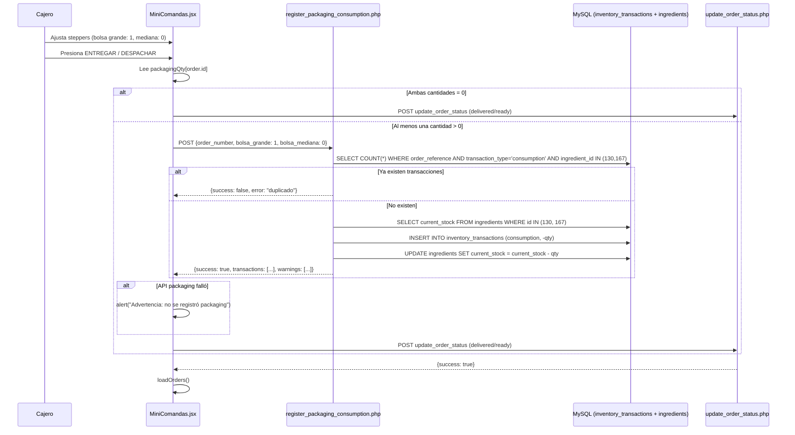

# Design Document: Packaging Consumo Comandas

## Overview

Agregar registro manual de consumo de bolsas (packaging) en MiniComandas. Cuando el cajero entrega un pedido local o despacha un pedido delivery, indica cuántas bolsas grandes y medianas usó mediante steppers inline. Las cantidades se envían a un nuevo endpoint PHP que crea transacciones de consumo en `inventory_transactions`.

El cambio es mínimo: estado nuevo en el componente existente, JSX inline en el render, y un archivo PHP nuevo en `caja3/api/`.

### Decisiones de diseño clave

- **Sin componente nuevo**: Los steppers se renderizan inline dentro de `renderOrderCard()` para evitar prop drilling y mantener acceso directo al estado del componente.
- **Estado por orden**: Se usa un objeto `packagingQty` keyed por `order.id` para que cada tarjeta tenga sus propios valores independientes.
- **Fire-and-forget con warning**: La llamada a la API de packaging es best-effort. Si falla, se muestra un `alert()` de advertencia y el flujo de entrega/despacho continúa sin bloqueo.
- **Idempotencia en el backend**: El endpoint PHP verifica si ya existen transacciones de packaging para el `order_number` antes de insertar, siguiendo el mismo patrón de `processSaleInventory()`.

## Architecture



### Flujo por tipo de pedido

| Tipo | Estado | Steppers visibles | Acción | API packaging → luego |
|------|--------|-------------------|--------|-----------------------|
| pickup | sent_to_kitchen/pending | ✅ Sí | ENTREGAR | → `delivered` |
| delivery | sent_to_kitchen/pending (Fase 1) | ✅ Sí | DESPACHAR | → `ready` |
| delivery | ready (Fase 2) | ❌ No | ENTREGAR | → `delivered` |

## Components and Interfaces

### 1. Estado nuevo en MiniComandas.jsx

Agregar un `useState` junto a los existentes (`photoSlots`, `checkedItems`, etc.), alrededor de la línea 22:

```javascript
const [packagingQty, setPackagingQty] = useState({});
// Estructura: { [orderId]: { bolsa_grande: number, bolsa_mediana: number } }
```

**Función helper para obtener valores con defaults:**

```javascript
const getPackaging = (orderId, deliveryType) => {
  if (packagingQty[orderId]) return packagingQty[orderId];
  return {
    bolsa_grande: deliveryType === 'delivery' ? 1 : 0,
    bolsa_mediana: 0
  };
};

const setPackagingValue = (orderId, bagType, delta, deliveryType) => {
  setPackagingQty(prev => {
    const current = prev[orderId] || getPackaging(orderId, deliveryType);
    const newVal = Math.max(0, Math.min(10, current[bagType] + delta));
    return { ...prev, [orderId]: { ...current, [bagType]: newVal } };
  });
};
```

### 2. Función registerPackaging

Agregar junto a `deliverOrder` y `dispatchToDelivery` (~línea 370):

```javascript
const registerPackaging = async (orderNumber, orderId, deliveryType) => {
  const qty = getPackaging(orderId, deliveryType);
  if (qty.bolsa_grande === 0 && qty.bolsa_mediana === 0) return true;

  try {
    const response = await fetch('/api/register_packaging_consumption.php', {
      method: 'POST',
      headers: { 'Content-Type': 'application/json' },
      body: JSON.stringify({
        order_number: orderNumber,
        bolsa_grande: qty.bolsa_grande,
        bolsa_mediana: qty.bolsa_mediana
      })
    });
    const result = await response.json();
    if (!result.success) {
      console.warn('Packaging registration failed:', result.error);
    }
    if (result.warnings && result.warnings.length > 0) {
      console.warn('Packaging warnings:', result.warnings);
    }
    return true;
  } catch (error) {
    console.error('Error registrando packaging:', error);
    alert('⚠️ No se pudo registrar el consumo de bolsas. El pedido se procesará de todas formas.');
    return false;
  }
};
```

### 3. Modificación de deliverOrder y dispatchToDelivery

**En `deliverOrder`** (línea ~322) — agregar llamada a `registerPackaging` antes del fetch de status. Solo para pedidos que NO son delivery (pickup), ya que delivery registra packaging en fase 1 (despacho):

```javascript
const deliverOrder = async (orderId, orderNumber) => {
  if (!confirm(`¿Marcar pedido ${orderNumber} como entregado?`)) return;
  setProcessing(orderId);
  try {
    // Registrar packaging solo para pickup (delivery ya lo hizo en despacho)
    const order = orders.find(o => o.id === orderId);
    if (order && order.delivery_type !== 'delivery') {
      await registerPackaging(orderNumber, orderId, order.delivery_type);
    }
    // ... resto del fetch a update_order_status.php sin cambios
```

**En `dispatchToDelivery`** (línea ~349) — agregar llamada antes del fetch:

```javascript
const dispatchToDelivery = async (orderId, orderNumber) => {
  if (!confirm(`¿Despachar pedido ${orderNumber} al rider?`)) return;
  setProcessing(orderId);
  try {
    await registerPackaging(orderNumber, orderId, 'delivery');
    // ... resto del fetch a update_order_status.php sin cambios
```

### 4. JSX del Packaging Stepper Area

Insertar **justo antes** del `<div className="flex flex-col gap-2">` que contiene los botones de acción (línea ~1237), y **después** del bloque de fotos delivery (línea ~1235):

```jsx
{/* Packaging Stepper Area */}
{(() => {
  const isDelivery = order.delivery_type === 'delivery';
  const isReadyPhase = order.order_status === 'ready';
  if (isDelivery && isReadyPhase) return null;

  const pkg = getPackaging(order.id, order.delivery_type);
  const bags = [
    { key: 'bolsa_grande', label: 'Grande', img: '/bolsa_deliverys/BOLSA PAPEL CAFE CON MANILLA 36x20x39 CM..jpg' },
    { key: 'bolsa_mediana', label: 'Mediana', img: '/bolsa_deliverys/BOLSA PAPEL CAPE CON MANILLA 30x12x32.jpg' }
  ];

  return (
    <div className="flex items-center gap-3 px-2 py-1 bg-amber-50 border border-amber-200 rounded mb-1"
         style={{ maxHeight: 60 }}>
      {bags.map(bag => (
        <div key={bag.key} className="flex items-center gap-1">
          
          <span className="text-[10px] font-medium text-gray-700">{bag.label}</span>
          <button
            onClick={() => setPackagingValue(order.id, bag.key, -1, order.delivery_type)}
            className="w-5 h-5 flex items-center justify-center rounded bg-gray-200 hover:bg-gray-300 text-xs font-bold"
          >−</button>
          <span className={`w-5 text-center text-xs font-bold ${pkg[bag.key] > 0 ? 'bg-amber-200 rounded' : ''}`}>
            {pkg[bag.key]}
          </span>
          <button
            onClick={() => setPackagingValue(order.id, bag.key, +1, order.delivery_type)}
            className="w-5 h-5 flex items-center justify-center rounded bg-gray-200 hover:bg-gray-300 text-xs font-bold"
          >+</button>
        </div>
      ))}
    </div>
  );
})()}
```

### 5. PHP API: `caja3/api/register_packaging_consumption.php`

**Endpoint:**

```
POST /api/register_packaging_consumption.php
Content-Type: application/json
```

**Request:**
```json
{
  "order_number": "RL6-1234",
  "bolsa_grande": 1,
  "bolsa_mediana": 0
}
```

**Response (éxito):**
```json
{
  "success": true,
  "transactions": [
    {
      "ingredient_id": 130,
      "ingredient_name": "BOLSA PAPEL CAFE CON MANILLA 36×20×39 CM",
      "quantity": -1,
      "previous_stock": 50,
      "new_stock": 49
    }
  ],
  "warnings": []
}
```

**Response (duplicado):**
```json
{
  "success": false,
  "error": "Ya existen transacciones de packaging para el pedido RL6-1234"
}
```

**Response (stock insuficiente):**
```json
{
  "success": true,
  "transactions": [...],
  "warnings": ["Stock insuficiente para BOLSA PAPEL CAFE CON MANILLA 36×20×39 CM: stock actual 0, consumo 1"]
}
```

**Estructura interna del PHP** — sigue el patrón de `ajuste_inventario.php` y `process_sale_inventory_fn.php`:

1. Cargar config y crear PDO
2. Leer JSON input, validar campos
3. Guard de idempotencia: `SELECT COUNT(*) FROM inventory_transactions WHERE order_reference = ? AND transaction_type = 'consumption' AND ingredient_id IN (130, 167)`
4. Para cada bolsa con cantidad > 0:
   - `SELECT current_stock FROM ingredients WHERE id = ?`
   - Calcular `new_stock = current_stock - cantidad`
   - `INSERT INTO inventory_transactions` con todos los campos
   - `UPDATE ingredients SET current_stock = ?, updated_at = NOW() WHERE id = ?`
   - Si `current_stock < cantidad`, agregar warning
5. Retornar JSON con transacciones y warnings

## Data Models

### inventory_transactions (filas nuevas)

| Campo | Valor |
|-------|-------|
| `transaction_type` | `'consumption'` |
| `ingredient_id` | `130` (grande) o `167` (mediana) |
| `product_id` | `NULL` |
| `quantity` | Negativo (ej: `-1`, `-2`) |
| `unit` | `'unidad'` |
| `previous_stock` | Stock antes de la transacción |
| `new_stock` | `previous_stock - cantidad` |
| `order_reference` | `order_number` del pedido (ej: `'RL6-1234'`) |
| `order_item_id` | `NULL` |
| `notes` | `'Consumo packaging: BOLSA PAPEL CAFE CON MANILLA 36×20×39 CM x1 - Pedido RL6-1234'` |
| `created_at` | `NOW()` |

### Estado React (en memoria)

```javascript
// packagingQty state shape
{
  42: { bolsa_grande: 1, bolsa_mediana: 0 },
  55: { bolsa_grande: 0, bolsa_mediana: 2 }
}
```

No se persiste — se resetea al recargar. Los valores default se calculan on-the-fly por `getPackaging()`.

### Mapeo de ingredientes (constantes en PHP)

```php
$PACKAGING_BAGS = [
    'bolsa_grande'  => ['id' => 130, 'name' => 'BOLSA PAPEL CAFE CON MANILLA 36×20×39 CM'],
    'bolsa_mediana' => ['id' => 167, 'name' => 'BOLSA PAPEL CAFE CON MANILLA 30×12×32 CM'],
];
```

## Correctness Properties

*A property is a characteristic or behavior that should hold true across all valid executions of a system — essentially, a formal statement about what the system should do. Properties serve as the bridge between human-readable specifications and machine-verifiable correctness guarantees.*

### Property 1: Stepper initialization depends on order type

*For any* order, the initial packaging stepper values SHALL be determined by `delivery_type`: pickup orders initialize both steppers to 0, delivery orders initialize `bolsa_grande` to 1 and `bolsa_mediana` to 0.

**Validates: Requirements 1.3, 1.4**

### Property 2: Stepper value bounds invariant

*For any* sequence of increment and decrement operations on a stepper, the resulting value SHALL always remain within the range [0, 10] inclusive.

**Validates: Requirements 1.5, 1.6, 1.7**

### Property 3: Transaction creation correctness

*For any* valid API request with `order_number` and bag quantities (0-10 each), the Packaging API SHALL create exactly one `inventory_transaction` per bag type with quantity > 0, each with `transaction_type = 'consumption'`, the correct `ingredient_id` (130 or 167), a negative `quantity`, `unit = 'unidad'`, and a `notes` field containing the bag name, quantity, and order number.

**Validates: Requirements 4.1, 4.2, 4.4**

### Property 4: Stock update consistency

*For any* consumption transaction created by the Packaging API, the `new_stock` value SHALL equal `previous_stock` minus the consumed quantity, and the ingredient's `current_stock` SHALL be updated to match `new_stock`.

**Validates: Requirements 4.3**

### Property 5: Idempotency guard

*For any* `order_number` that already has packaging consumption transactions, a subsequent call to the Packaging API with the same `order_number` SHALL be rejected with an error, regardless of the bag quantities provided.

**Validates: Requirements 4.5**

### Property 6: Negative stock with warning

*For any* consumption request where the ingredient's `current_stock` is less than the requested quantity, the Packaging API SHALL still create the transaction (allowing negative stock) AND include a warning in the response indicating insufficient stock.

**Validates: Requirements 4.6**

### Property 7: Stepper visibility rules

*For any* order, the Packaging Stepper Area visibility SHALL be determined by `delivery_type` and `order_status`: visible for pickup orders in any active state, visible for delivery orders in phase 1 (`sent_to_kitchen` or `pending`), and hidden for delivery orders in phase 2 (`ready`).

**Validates: Requirements 6.1, 6.2, 6.3**

## Error Handling

| Escenario | Comportamiento |
|-----------|---------------|
| API packaging retorna error HTTP (500, timeout) | `alert()` con advertencia, flujo de entrega/despacho continúa |
| API packaging retorna `success: false` (duplicado) | Log en consola, flujo continúa (ya se registró antes) |
| API packaging retorna warning de stock insuficiente | Log en consola, flujo continúa (stock negativo permitido) |
| Red no disponible (fetch falla) | `alert()` con advertencia, flujo continúa |
| Cajero no selecciona bolsas (ambas en 0) | No se llama a la API, flujo continúa normalmente |
| Input inválido al PHP (campos faltantes) | Retorna `{success: false, error: "..."}`, flujo continúa |

**Principio**: El registro de packaging nunca bloquea la operación del negocio. Es un registro auxiliar de inventario.

## Testing Strategy

### Property-Based Tests (fast-check)

Se usará `fast-check` como librería de property-based testing para los tests JavaScript. Cada test ejecutará mínimo 100 iteraciones.

**Tests de lógica pura (JavaScript):**

1. **Stepper initialization** — Generar orders aleatorios con delivery_type random, verificar valores iniciales.
   - Tag: `Feature: packaging-consumo-comandas, Property 1: Stepper initialization depends on order type`

2. **Stepper bounds invariant** — Generar secuencias aleatorias de operaciones (+1, -1), verificar que el valor siempre está en [0, 10].
   - Tag: `Feature: packaging-consumo-comandas, Property 2: Stepper value bounds invariant`

3. **Stepper visibility** — Generar combinaciones de delivery_type × order_status, verificar visibilidad.
   - Tag: `Feature: packaging-consumo-comandas, Property 7: Stepper visibility rules`

**Tests de lógica PHP (backend):**

4. **Transaction creation** — Generar combinaciones aleatorias de cantidades (0-10), verificar transacciones creadas.
   - Tag: `Feature: packaging-consumo-comandas, Property 3: Transaction creation correctness`

5. **Stock consistency** — Generar stocks iniciales y cantidades aleatorias, verificar previous_stock/new_stock.
   - Tag: `Feature: packaging-consumo-comandas, Property 4: Stock update consistency`

6. **Idempotency** — Generar order_numbers aleatorios, llamar dos veces, verificar rechazo.
   - Tag: `Feature: packaging-consumo-comandas, Property 5: Idempotency guard`

7. **Negative stock** — Generar escenarios donde stock < cantidad, verificar transacción + warning.
   - Tag: `Feature: packaging-consumo-comandas, Property 6: Negative stock with warning`

### Unit Tests (ejemplo)

- Render del stepper area con orden pickup → ambos steppers en 0
- Render del stepper area con orden delivery → bolsa_grande en 1
- Click en "−" cuando valor es 0 → valor sigue en 0
- Click en "+" cuando valor es 10 → valor sigue en 10
- `deliverOrder` con bolsas en 0 → no llama a packaging API
- `deliverOrder` con bolsas > 0 → llama a packaging API antes de status update
- API packaging falla → alert mostrado, entrega continúa
- Stepper oculto en delivery fase 2 (ready)
- Highlight visual cuando valor > 0

### Integration Tests

- Flujo completo: crear orden → ajustar steppers → entregar → verificar transacciones en DB
- Duplicado: entregar mismo pedido dos veces → segunda vez rechazada por idempotencia
- Stock insuficiente: consumir más de lo disponible → transacción creada + warning retornado
