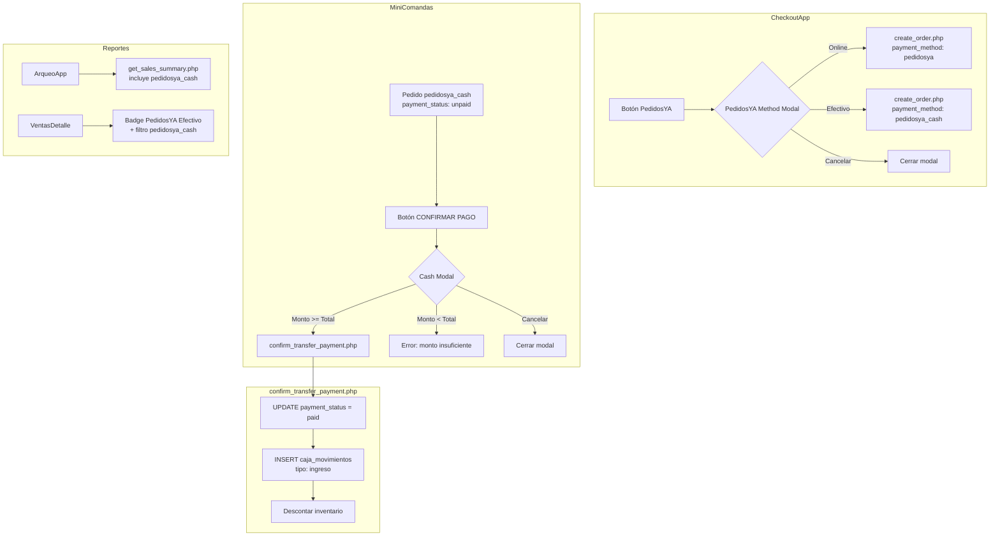
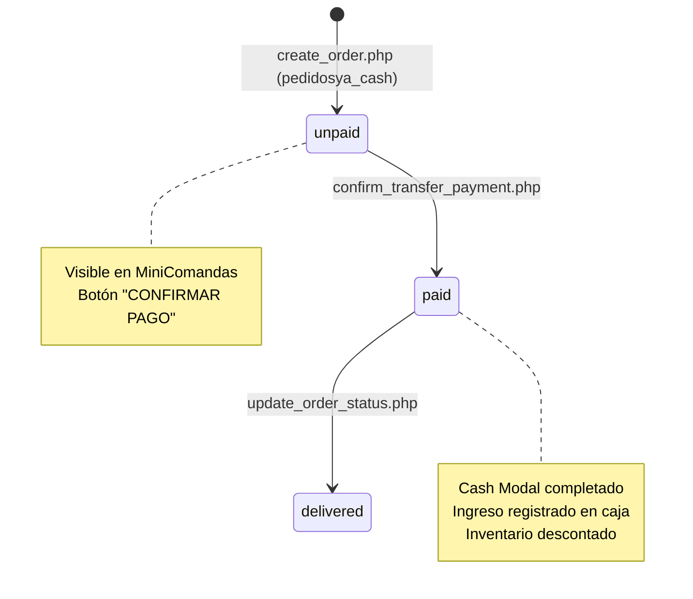

# Design Document: PedidosYA Cash Flow

## Overview

Este diseño implementa un flujo de pago "PedidosYA con Efectivo" en caja3. Actualmente, los pedidos PedidosYA se registran como `pedidosya` (pago online). El nuevo flujo agrega un sub-método `pedidosya_cash` que permite al cajero cobrar en efectivo, calcular vuelto, y registrar automáticamente el ingreso en caja.

El cambio afecta 3 capas:
1. **Frontend**: CheckoutApp (modal de selección), MiniComandas (cash modal al confirmar), ArqueoApp y VentasDetalle (reportes)
2. **API**: `create_order.php` (aceptar nuevo payment_method), `confirm_transfer_payment.php` (registrar ingreso en caja para pedidosya_cash)
3. **Base de datos**: ALTER TABLE para agregar `pedidosya_cash` al ENUM de `payment_method`, y agregar la categoría en `get_sales_summary.php`

### Decisiones de diseño clave

- **Reutilizar la lógica del cash modal existente** en CheckoutApp como base para el cash modal en MiniComandas, extrayendo las funciones compartidas (`formatCurrency`, `handleCashInput`, validación de montos).
- **No crear un nuevo endpoint API**: `confirm_transfer_payment.php` ya maneja la confirmación de pagos y registra en caja para `cash`. Se extiende la condición para incluir `pedidosya_cash`.
- **`create_order.php` no requiere cambios funcionales**: ya acepta cualquier string como `payment_method` y lo almacena directamente. Solo se necesita el ALTER TABLE en la BD.
- **El modal de selección PedidosYA** es un componente inline dentro de CheckoutApp (no un componente separado) para mantener consistencia con el patrón existente de modales en el archivo.

## Architecture



### Flujo de datos

1. **Creación de orden**: CheckoutApp → `create_order.php` → INSERT en `tuu_orders` con `payment_method='pedidosya_cash'`, `payment_status='unpaid'`, `order_status='sent_to_kitchen'`
2. **Visualización**: MiniComandas carga pedidos via `get_comandas_v2.php` → muestra etiqueta "PedidosYA Efectivo" y botón "CONFIRMAR PAGO"
3. **Confirmación**: Cash Modal → `confirm_transfer_payment.php` → UPDATE `payment_status='paid'` + INSERT `caja_movimientos` + descontar inventario (todo en transacción)
4. **Reportes**: `get_sales_summary.php` agrupa por `payment_method` incluyendo `pedidosya_cash` → ArqueoApp muestra desglose

## Components and Interfaces

### Componentes modificados

#### 1. CheckoutApp.jsx
- **Cambio**: Reemplazar `handlePedidosYAPayment()` directo por apertura de modal de selección
- **Nuevo estado**: `showPedidosYAModal` (boolean)
- **Nuevo modal inline**: PedidosYA Method Modal con opciones "Online" y "Efectivo"
- **Lógica**: "Online" llama al `handlePedidosYAPayment()` existente, "Efectivo" llama a nuevo `handlePedidosYACashPayment()` que envía `payment_method: 'pedidosya_cash'`

```jsx
// Nuevo estado
const [showPedidosYAModal, setShowPedidosYAModal] = useState(false);

// Botón PedidosYA ahora abre modal en vez de crear orden directamente
const handlePedidosYAClick = () => {
  if (!validateForm()) return;
  setShowPedidosYAModal(true);
};

// Nueva función para PedidosYA Efectivo
const handlePedidosYACashPayment = async () => {
  // Igual que handlePedidosYAPayment pero con payment_method: 'pedidosya_cash'
  // Redirige a /pedidosya-pending?order=...
};
```

#### 2. MiniComandas.jsx
- **Cambio en `getPaymentIcon`**: Agregar case `pedidosya_cash` → `<Banknote />` (efectivo con ícono de billete)
- **Cambio en `getPaymentText`**: Agregar case `pedidosya_cash` → `'PedidosYA Efectivo'`
- **Cambio en `confirmPayment`**: Si `paymentMethod === 'pedidosya_cash'`, abrir Cash Modal en vez de `confirm()` dialog
- **Nuevo estado**: `cashModalOrder` (objeto con id, orderNumber, total del pedido), `cashAmount`, `cashStep`
- **Nuevo modal inline**: Cash Modal idéntico al de CheckoutApp, pero que al confirmar llama a `confirm_transfer_payment.php`

```jsx
// Nuevos estados
const [cashModalOrder, setCashModalOrder] = useState(null);
const [cashAmount, setCashAmount] = useState('');
const [cashStep, setCashStep] = useState('input');

// Modificar confirmPayment para pedidosya_cash
const confirmPayment = async (orderId, orderNumber, paymentMethod) => {
  if (paymentMethod === 'pedidosya_cash') {
    const order = orders.find(o => o.id === orderId);
    setCashModalOrder({
      id: orderId,
      orderNumber,
      total: parseInt(order.installment_amount || 0)
    });
    setCashAmount('');
    setCashStep('input');
    return; // No hacer confirm() dialog
  }
  // ... flujo existente para otros métodos
};
```

#### 3. ArqueoApp.jsx
- **Cambio**: Agregar tarjeta para `pedidosya_cash` o desglosar la tarjeta PedidosYA existente en "Online" y "Efectivo"
- **Decisión**: Agregar una tarjeta separada "PedidosYA Efectivo" con ícono `Banknote` para claridad

#### 4. VentasDetalle.jsx
- **Cambio en `getMethodBadge`**: Agregar entrada para `pedidosya_cash` con label "PYA Efectivo" y color diferenciado (ej: `bg-yellow-100 text-yellow-800`)
- **Cambio en filtros**: Agregar `{ key: 'pedidosya_cash', icon: Banknote, label: 'PYA Efvo' }` al array de filtros

#### 5. get_sales_summary.php
- **Cambio**: Agregar `'pedidosya_cash' => ['count' => 0, 'total' => 0]` al array `$result` para que la API retorne datos de este método

#### 6. confirm_transfer_payment.php
- **Cambio**: Extender la condición de registro en caja de `if ($order['payment_method'] === 'cash')` a `if (in_array($order['payment_method'], ['cash', 'pedidosya_cash']))`
- **Cambio en motivo**: Para `pedidosya_cash`, usar motivo "Venta PedidosYA Efectivo - Pedido #[order_number]"
- **Cambio en `$payment_type`**: Agregar mapping para `pedidosya_cash` → `'PedidosYA Efectivo'`

### Componentes nuevos

No se crean componentes nuevos. Todo se implementa como modales inline y extensiones de componentes existentes, siguiendo el patrón arquitectónico actual del proyecto.

## Data Models

### Cambio en base de datos

```sql
-- Agregar pedidosya_cash al ENUM de payment_method en tuu_orders
ALTER TABLE tuu_orders 
MODIFY COLUMN payment_method ENUM(
  'webpay', 'transfer', 'card', 'cash', 
  'pedidosya', 'pedidosya_cash', 
  'rl6_credit', 'r11_credit'
) DEFAULT 'webpay';
```

### Modelo de datos: Orden PedidosYA Cash

```
tuu_orders:
  payment_method: 'pedidosya_cash'
  payment_status: 'unpaid' → 'paid' (al confirmar)
  order_status: 'sent_to_kitchen' → 'delivered' (al entregar)
```

### Modelo de datos: Movimiento de caja

```
caja_movimientos:
  tipo: 'ingreso'
  monto: [installment_amount del pedido]
  motivo: 'Venta PedidosYA Efectivo - Pedido #T11-XXXX-XXXX'
  saldo_anterior: [último saldo_nuevo]
  saldo_nuevo: saldo_anterior + monto
  usuario: 'Sistema'
  order_reference: [order_number]
```

### Flujo de estados



## Correctness Properties

*A property is a characteristic or behavior that should hold true across all valid executions of a system — essentially, a formal statement about what the system should do. Properties serve as the bridge between human-readable specifications and machine-verifiable correctness guarantees.*

### Property 1: Validation blocks modal opening

*For any* form state where the customer name is empty/too short OR the phone number has fewer than 9 digits OR (delivery type is 'delivery' AND address is not validated), attempting to open the PedidosYA Method Modal should fail, the modal should remain closed, and the form should display validation errors.

**Validates: Requirements 1.5**

### Property 2: Order creation preserves payment method and status

*For any* valid order payload with `payment_method` set to `pedidosya_cash`, the created order in `tuu_orders` should have `payment_status = 'unpaid'` and `order_status = 'sent_to_kitchen'`, and the `payment_method` field should be stored as `'pedidosya_cash'`.

**Validates: Requirements 2.2**

### Property 3: Payment method display mapping completeness

*For any* payment method value in the set `{cash, card, transfer, pedidosya, pedidosya_cash, rl6_credit, r11_credit}`, the `getPaymentText` function should return a non-empty human-readable label, and the `getPaymentIcon` function should return a valid React icon component.

**Validates: Requirements 3.1**

### Property 4: Cash modal change calculation

*For any* order total `T > 0` and any amount paid `A > 0`:
- If `A > T`, the change displayed should equal `A - T`
- If `A < T`, the error should indicate a shortfall of `T - A`
- If `A === T`, the payment should proceed directly without showing a change screen

**Validates: Requirements 4.3, 4.5, 4.4**

### Property 5: Caja movimientos entry correctness

*For any* confirmed `pedidosya_cash` payment with order amount `M` and order number `N`, the resulting `caja_movimientos` entry should have: `tipo = 'ingreso'`, `monto = M`, `motivo = 'Venta PedidosYA Efectivo - Pedido #N'`, `order_reference = N`, and `saldo_nuevo = saldo_anterior + M`.

**Validates: Requirements 5.2, 5.4**

### Property 6: Chilean currency formatting

*For any* positive integer amount, the `formatCurrency` function should produce a string where digits are grouped in thousands separated by dots (e.g., 15990 → "15.990"), and when displayed with the `$` prefix, it matches the Chilean peso format used throughout the application.

**Validates: Requirements 7.1, 7.2**

## Error Handling

| Escenario | Componente | Comportamiento |
|-----------|-----------|----------------|
| Formulario inválido al presionar PedidosYA | CheckoutApp | Modal no se abre, se muestran errores de validación con shake animation |
| Monto vacío o cero en Cash Modal | MiniComandas | Alert: "Debe ingresar un monto o seleccionar Monto Exacto" |
| Monto insuficiente en Cash Modal | MiniComandas | Alert: "Monto insuficiente. Faltan $X.XXX" |
| Error de red al crear orden | CheckoutApp | Alert con mensaje de error, `isProcessing` se resetea a false |
| Error de BD al confirmar pago | confirm_transfer_payment.php | Rollback de transacción completa, respuesta JSON con `success: false` y mensaje descriptivo |
| Orden ya pagada | confirm_transfer_payment.php | Exception: "Esta orden ya está pagada" (protección existente) |
| Orden no encontrada | confirm_transfer_payment.php | Exception: "Orden no encontrada" (protección existente) |

## Testing Strategy

### Property-Based Tests (PBT)

Se usará **fast-check** como librería de PBT para JavaScript/React.

Cada propiedad del documento se implementará como un test con mínimo 100 iteraciones:

1. **Property 1**: Generar estados de formulario inválidos aleatorios, verificar que `validateForm()` retorna false
2. **Property 2**: Generar payloads de orden aleatorios con `payment_method: 'pedidosya_cash'`, verificar campos de status
3. **Property 3**: Iterar sobre todos los payment methods válidos, verificar que `getPaymentText` y `getPaymentIcon` retornan valores correctos
4. **Property 4**: Generar pares aleatorios (total, amountPaid), verificar cálculo de vuelto/faltante
5. **Property 5**: Generar montos y order_numbers aleatorios, verificar formato de motivo y cálculo de saldo
6. **Property 6**: Generar enteros positivos aleatorios, verificar formato de moneda chilena

Tag format: `Feature: pedidosya-cash-flow, Property N: [description]`

### Unit Tests (Example-Based)

- Modal de selección PedidosYA se abre al presionar botón
- Selección "Online" crea orden con `pedidosya`
- Selección "Efectivo" crea orden con `pedidosya_cash`
- Botón "Cancelar" cierra modal sin efectos
- Cash Modal se abre al confirmar pago de pedidosya_cash en MiniComandas
- Botones de monto rápido ($5.000, $10.000, $20.000) funcionan
- Tecla Enter avanza al paso de confirmación
- Lista de pedidos se recarga tras confirmación exitosa
- ArqueoApp muestra desglose PedidosYA Online vs Efectivo
- VentasDetalle muestra badge "PedidosYA Efectivo" y filtro funcional

### Integration Tests

- Flujo completo: crear orden pedidosya_cash → confirmar pago → verificar caja_movimientos e inventario
- ALTER TABLE ejecutado correctamente (ENUM incluye pedidosya_cash)
- Backward compatibility: órdenes con payment_methods existentes siguen funcionando
