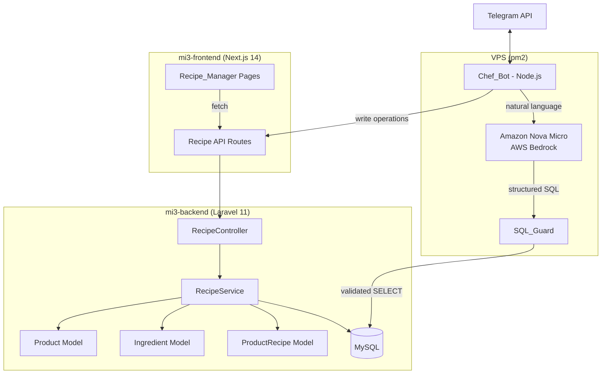

# Design Document: Recipe Management AI

## Overview

This feature adds a Recipe & Ingredient Management system with AI capabilities to La Ruta 11's ecosystem. It consists of three interconnected components:

1. **Recipe_Manager** — A new admin section in mi3-frontend (Next.js 14) at `mi.laruta11.cl/admin/recetas` providing full CRUD for recipes, cost analysis, bulk adjustments, price recommendations, and stock audits.
2. **Recipe_API** — New Laravel 11 API endpoints in mi3-backend under `/api/v1/admin/recetas/` handling recipe operations, cost calculations, and bulk adjustments. Follows the existing service-layer pattern (controller → service → model).
3. **Chef_Bot** — A standalone Node.js Telegram bot (`@ChefR11_bot`) running on the VPS via pm2, using Amazon Nova Micro (AWS Bedrock) to translate natural language into safe SQL queries and recipe modifications.

All three components share the existing MySQL database with tables `products`, `ingredients`, and `product_recipes`.

### Key Design Decisions

- **Reuse existing tables**: No schema migrations needed. The `product_recipes` table already links products to ingredients with quantity/unit.
- **Service layer pattern**: New `RecipeService` in Laravel follows the same pattern as `StockService`, `CompraService`, etc.
- **Separate bot process**: The Telegram bot runs as an independent Node.js process (not inside Laravel) because it needs long-polling and real-time AI interaction. It connects directly to MySQL for reads and calls the Recipe_API for writes to maintain a single source of truth for business logic.
- **AI safety via SQL_Guard**: A dedicated validation layer parses and restricts AI-generated SQL before execution, preventing destructive operations.
- **Unit conversion centralized**: A shared unit conversion map (g↔kg, ml↔L) is used consistently across Recipe_API and Chef_Bot.

## Architecture



### Request Flow

**Admin Panel (Recipe_Manager → Recipe_API):**
1. Frontend makes authenticated requests to `/api/v1/admin/recetas/*`
2. Sanctum middleware validates the admin session
3. `RecipeController` delegates to `RecipeService`
4. Service performs DB operations and returns JSON

**Telegram Bot (Chef_Bot → AI_Engine → DB/API):**
1. User sends message to `@ChefR11_bot`
2. Bot sends message + schema context to Amazon Nova Micro via Bedrock
3. AI returns structured JSON with intent (query/modify) and SQL/parameters
4. For queries: SQL_Guard validates → bot executes SELECT directly on MySQL
5. For modifications: Bot calls Recipe_API endpoints (reusing Laravel validation)
6. Bot formats response and sends back via Telegram

## Components and Interfaces

### 1. Recipe_API (Laravel Backend)

#### New Routes (`routes/api.php` — under admin middleware group)

```
GET    /api/v1/admin/recetas                    → RecipeController@index
GET    /api/v1/admin/recetas/{productId}        → RecipeController@show
POST   /api/v1/admin/recetas/{productId}        → RecipeController@store
PUT    /api/v1/admin/recetas/{productId}        → RecipeController@update
DELETE /api/v1/admin/recetas/{productId}/{ingredientId} → RecipeController@destroyIngredient

POST   /api/v1/admin/recetas/bulk-adjustment/preview → RecipeController@bulkPreview
POST   /api/v1/admin/recetas/bulk-adjustment         → RecipeController@bulkApply

GET    /api/v1/admin/recetas/recommendations         → RecipeController@recommendations
GET    /api/v1/admin/recetas/audit                   → RecipeController@audit
GET    /api/v1/admin/recetas/audit/export             → RecipeController@auditExport
```

#### RecipeController

Thin controller delegating to `RecipeService`. Follows the same pattern as `StockController`.

#### RecipeService

Core business logic class with methods:

| Method | Description |
|--------|-------------|
| `getRecipesWithCosts(?categoryId, ?search, ?sortBy)` | Returns all active products with recipe details, calculated cost, and margin |
| `getRecipeDetail(productId)` | Returns full recipe for a product with per-ingredient costs |
| `createRecipe(productId, ingredients[])` | Inserts `product_recipes` rows, validates no duplicates, recalculates `cost_price` |
| `updateRecipe(productId, ingredients[])` | Replaces recipe ingredients, recalculates `cost_price` |
| `removeIngredient(productId, ingredientId)` | Removes one ingredient from recipe, recalculates `cost_price` |
| `calculateRecipeCost(productId)` | Sums (cost_per_unit × quantity × conversion_factor) for all recipe ingredients |
| `bulkAdjustmentPreview(scope, type, value)` | Returns preview of affected ingredients and impacted recipes |
| `bulkAdjustmentApply(scope, type, value)` | Applies cost changes in a transaction, recalculates all affected product costs |
| `getRecommendations(targetMargin)` | Calculates recommended prices based on recipe cost and target margin |
| `getStockAudit()` | Calculates max producible units per product based on ingredient stock |
| `exportAudit(format)` | Returns audit data as CSV |

#### Unit Conversion

A centralized conversion map used by `calculateRecipeCost`:

```php
// Conversion factors to normalize to base unit
const UNIT_CONVERSIONS = [
    'kg' => ['base' => 'g', 'factor' => 1000],
    'g'  => ['base' => 'g', 'factor' => 1],
    'L'  => ['base' => 'ml', 'factor' => 1000],
    'ml' => ['base' => 'ml', 'factor' => 1],
    'unidad' => ['base' => 'unidad', 'factor' => 1],
];
```

Cost calculation: normalize both ingredient's `cost_per_unit` unit and recipe's `quantity` unit to the same base, then multiply.

### 2. Recipe_Manager (Next.js Frontend)

#### New Pages

| Route | Component | Description |
|-------|-----------|-------------|
| `/admin/recetas` | `RecetasPage` | Main recipe listing with search, sort, category filter |
| `/admin/recetas/[productId]` | `RecetaDetailPage` | View/edit recipe for a specific product |
| `/admin/recetas/ajuste-masivo` | `AjusteMasivoPage` | Bulk ingredient cost adjustment with preview |
| `/admin/recetas/recomendaciones` | `RecomendacionesPage` | Price recommendations table |
| `/admin/recetas/auditoria` | `AuditoriaPage` | Stock audit with export |

#### Shared Components

- `RecipeTable` — Sortable, searchable table for recipe listing
- `RecipeForm` — Add/edit ingredients in a recipe with autocomplete
- `IngredientAutocomplete` — Search active ingredients by name
- `CostBadge` — Displays cost with color coding based on margin
- `BulkAdjustmentForm` — Form for scope, type, value selection with preview

### 3. Chef_Bot (Node.js Telegram Bot)

#### Module Structure

```
chef-bot/
├── index.js              # Entry point, Telegram polling setup
├── config.js             # Environment variables, authorized chat_ids
├── handlers/
│   ├── messageHandler.js # Routes messages to query or modify flow
│   └── callbackHandler.js# Handles confirmation button callbacks
├── ai/
│   ├── bedrockClient.js  # AWS Bedrock SDK client for Nova Micro
│   ├── promptBuilder.js  # Builds prompts with schema context
│   └── responseParser.js # Parses AI JSON response into intent + SQL
├── guards/
│   └── sqlGuard.js       # Validates and parameterizes generated SQL
├── db/
│   └── mysql.js          # MySQL connection pool (mysql2)
├── api/
│   └── recipeApi.js      # HTTP client for mi3-backend Recipe_API
├── formatters/
│   └── telegramFormatter.js # Formats query results for Telegram
└── logger.js             # Audit logging for modifications
```

#### AI Prompt Structure

Each message to Nova Micro includes:
1. System prompt with role definition and output format instructions
2. Database schema for `products`, `ingredients`, `product_recipes` (column names, types, relationships)
3. Examples of natural language → SQL mappings
4. The user's message

Expected AI response format:
```json
{
  "intent": "query" | "modify",
  "sql": "SELECT ...",
  "params": [],
  "explanation": "Human-readable explanation in Spanish"
}
```

#### SQL_Guard Validation Pipeline

1. Parse SQL string to identify statement type (SELECT, INSERT, UPDATE, DELETE, DDL)
2. Check statement type against allowed operations (SELECT for queries; INSERT/UPDATE on `product_recipes` for modifications)
3. Extract table references and validate against allowlist: `products`, `ingredients`, `product_recipes`
4. Reject subqueries containing INSERT/UPDATE/DELETE
5. Parameterize user-provided values to prevent SQL injection
6. Log rejected queries with chat_id and timestamp

#### Authentication

- `config.js` maintains an `AUTHORIZED_CHAT_IDS` array from environment variable
- All users can execute read queries (SELECT)
- Only authorized chat_ids can execute modifications (INSERT/UPDATE)
- If `AUTHORIZED_CHAT_IDS` is empty, all modifications are rejected with a logged warning

## Data Models

### Existing Tables (No Changes)

#### `products`
Key fields used: `id`, `name`, `price`, `cost_price`, `category_id`, `is_active`

#### `ingredients`
Key fields used: `id`, `name`, `cost_per_unit`, `unit`, `current_stock`, `min_stock_level`, `category`, `supplier`, `is_active`

#### `product_recipes`
Key fields used: `id`, `product_id` (FK → products), `ingredient_id` (FK → ingredients), `quantity`, `unit`

### New Laravel Model: `ProductRecipe`

```php
class ProductRecipe extends Model
{
    protected $table = 'product_recipes';
    protected $fillable = ['product_id', 'ingredient_id', 'quantity', 'unit'];
    protected $casts = ['quantity' => 'float'];

    public function product() { return $this->belongsTo(Product::class); }
    public function ingredient() { return $this->belongsTo(Ingredient::class); }
}
```

### New Eloquent Relationships

Add to `Product` model:
```php
public function recipes() { return $this->hasMany(ProductRecipe::class); }
public function ingredients() { return $this->belongsToMany(Ingredient::class, 'product_recipes')->withPivot('quantity', 'unit'); }
```

The `Ingredient` model already has `recetas()` → `hasMany(ProductRecipe::class)`.

### Data Flow Diagrams

#### Recipe Cost Calculation
```
Product.price = $5,990
├── Ingredient: Pan (150g × $2/g = $300)
├── Ingredient: Carne (200g × $8/g = $1,600)
├── Ingredient: Lechuga (50g × $3/g = $150)
└── Total Recipe_Cost = $2,050
    Margin = ((5990 - 2050) / 5990) × 100 = 65.8%
```

#### Bulk Adjustment Flow
```
Admin selects: scope=supplier:"Proveedor X", type=percentage, value=+10%
  → Preview: [Ingredient A: $100→$110 (5 recipes), Ingredient B: $200→$220 (3 recipes)]
  → Confirm: UPDATE ingredients SET cost_per_unit = cost_per_unit * 1.10 WHERE supplier = 'Proveedor X'
  → Recalculate: UPDATE products SET cost_price = (new sum) WHERE id IN (affected product ids)
```

#### Stock Audit Calculation
```
Product: Hamburguesa Clásica
├── Carne: stock=5000g, recipe needs 200g → 25 units
├── Pan: stock=100 units, recipe needs 1 unit → 100 units
├── Lechuga: stock=300g, recipe needs 50g → 6 units
└── Max producible = 6 (limited by Lechuga)
    Status: CRITICAL (Lechuga below min_stock_level)
```


## Correctness Properties

*A property is a characteristic or behavior that should hold true across all valid executions of a system — essentially, a formal statement about what the system should do. Properties serve as the bridge between human-readable specifications and machine-verifiable correctness guarantees.*

### Property 1: Recipe cost and margin calculation

*For any* product with a recipe containing ingredients with arbitrary costs, quantities, and units (g, kg, ml, L, unidad), the calculated Recipe_Cost SHALL equal the sum of (ingredient.cost_per_unit × recipe.quantity × unit_conversion_factor) for all ingredients, and the Margin SHALL equal ((price - Recipe_Cost) / price) × 100 rounded to one decimal place.

**Validates: Requirements 1.2, 1.3**

### Property 2: Cost_price invariant after recipe mutations

*For any* sequence of recipe operations (create, add ingredient, modify quantity, remove ingredient) on a product, the product's `cost_price` field SHALL always equal the independently calculated Recipe_Cost of its current recipe ingredients. If the recipe has zero ingredients, `cost_price` SHALL be 0.

**Validates: Requirements 2.6, 3.2, 3.3, 3.4, 3.5**

### Property 3: Recipe validation rejects invalid input

*For any* recipe submission containing either (a) duplicate ingredient IDs or (b) any quantity ≤ 0, the Recipe_API SHALL reject the request and the database state SHALL remain unchanged.

**Validates: Requirements 2.4, 2.5**

### Property 4: Category filter returns only matching products

*For any* set of products across multiple categories and any selected category_id, the filtered result SHALL contain only products with that category_id, and SHALL contain all active products with that category_id.

**Validates: Requirements 1.6**

### Property 5: Bulk adjustment correctness with cascade

*For any* bulk adjustment (scope, type=percentage|fixed, value), after applying the adjustment: (a) every matching ingredient's `cost_per_unit` SHALL equal the expected adjusted value, and (b) every product whose recipe contains an adjusted ingredient SHALL have its `cost_price` recalculated to match the new ingredient costs.

**Validates: Requirements 4.3, 4.4**

### Property 6: Bulk adjustment rejects negative costs

*For any* bulk adjustment that would cause at least one ingredient's `cost_per_unit` to become negative, the entire adjustment SHALL be rejected and no ingredient costs SHALL be modified.

**Validates: Requirements 4.5**

### Property 7: Price recommendation formula

*For any* product with a recipe and any target margin percentage (0 < margin < 100), the recommended price SHALL equal Recipe_Cost / (1 - target_margin / 100) rounded to the nearest 100 CLP.

**Validates: Requirements 5.2**

### Property 8: Recommendations exclude products without recipes

*For any* set of products where some have recipes and some do not, the price recommendations result SHALL contain only products that have at least one recipe ingredient.

**Validates: Requirements 5.4**

### Property 9: Stock audit producibility and limiting ingredient

*For any* product with a recipe and any set of ingredient stock levels, the max producible units SHALL equal the minimum of floor(ingredient.current_stock / recipe.quantity × unit_conversion) across all recipe ingredients, and the limiting ingredient SHALL be the one that yields this minimum.

**Validates: Requirements 6.1, 6.2**

### Property 10: Critical stock classification

*For any* ingredient, it SHALL be classified as "critical" if and only if its `current_stock` is below its `min_stock_level`.

**Validates: Requirements 6.4**

### Property 11: SQL_Guard safety validation

*For any* SQL string, the SQL_Guard SHALL: (a) accept SELECT statements referencing only tables in the allowlist {products, ingredients, product_recipes}, (b) accept INSERT/UPDATE statements only on `product_recipes` and only when in modification mode, (c) reject any DELETE, DROP, ALTER, TRUNCATE, or CREATE statements, (d) reject any SQL referencing tables outside the allowlist, and (e) reject any SELECT containing data-modifying subqueries.

**Validates: Requirements 7.2, 8.2, 9.2, 9.3, 9.4**

### Property 12: SQL_Guard parameterization

*For any* AI-generated SQL containing literal string or numeric values, the SQL_Guard SHALL extract those values into a parameters array and replace them with placeholders, producing a parameterized query with no inline user values.

**Validates: Requirements 9.7**

### Property 13: Telegram formatter completeness

*For any* recipe query result, the formatted Telegram message SHALL contain the product name, every ingredient name with its quantity and unit, and the total Recipe_Cost. *For any* stock query result, the formatted message SHALL contain the ingredient name, current stock, unit, cost per unit, and stock status relative to min_stock_level.

**Validates: Requirements 7.5, 7.6**

### Property 14: Fuzzy name matching returns closest matches

*For any* input string and a set of known product/ingredient names, when no exact match exists, the fuzzy matcher SHALL return suggestions sorted by edit distance (closest first), and the top suggestion SHALL have the minimum edit distance among all candidates.

**Validates: Requirements 8.5**

### Property 15: Modification audit logging

*For any* recipe modification executed through the Chef_Bot, the system SHALL create a log entry containing the user's Telegram chat_id, a timestamp, and the executed SQL statement.

**Validates: Requirements 8.6**

### Property 16: Bot authorization enforcement

*For any* Telegram message, the Chef_Bot SHALL: (a) allow read-only queries (SELECT) regardless of the sender's chat_id, (b) allow modification commands only from chat_ids in the authorized list, and (c) respond with "No tienes permisos para modificar recetas" for unauthorized modification attempts.

**Validates: Requirements 10.2, 10.3, 10.4**

## Error Handling

### Recipe_API (Laravel)

| Scenario | HTTP Code | Response |
|----------|-----------|----------|
| Product not found | 404 | `{ "error": "Producto no encontrado" }` |
| Ingredient not found | 404 | `{ "error": "Ingrediente no encontrado" }` |
| Duplicate ingredient in recipe | 422 | `{ "error": "Ingrediente duplicado en la receta", "ingredient_id": X }` |
| Quantity ≤ 0 | 422 | `{ "error": "La cantidad debe ser mayor a 0" }` |
| Bulk adjustment would cause negative cost | 422 | `{ "error": "El ajuste resultaría en costos negativos", "affected": [...] }` |
| Database transaction failure | 500 | `{ "error": "Error interno al procesar la operación" }` |
| Unauthorized (Sanctum) | 401 | Standard Laravel 401 |

All write operations use database transactions. On failure, the transaction rolls back and no partial state is persisted.

### Chef_Bot (Node.js)

| Scenario | Bot Response |
|----------|-------------|
| AI cannot interpret message | Help message with example queries |
| SQL_Guard rejects query | "⚠️ Operación no permitida" + logged |
| Unauthorized modification | "🔒 No tienes permisos para modificar recetas" |
| Product/Ingredient not found | "❌ No encontré '{name}'. ¿Quisiste decir: {suggestions}?" |
| Database connection error | "⚠️ Error de conexión. Intenta de nuevo en unos minutos." |
| AWS Bedrock timeout/error | "⚠️ El servicio de IA no está disponible. Intenta de nuevo." |
| Empty authorized list | All modifications rejected + warning logged to console |

### Retry Strategy

- AWS Bedrock calls: 2 retries with exponential backoff (1s, 3s)
- MySQL connection: Auto-reconnect via mysql2 pool
- Telegram API: 1 retry on 429 (rate limit) with delay from `retry_after` header

## Testing Strategy

### Property-Based Testing

This feature is well-suited for property-based testing because it contains:
- Pure calculation functions (cost, margin, recommendations, audit)
- Validation logic (SQL_Guard, input validation, authorization)
- Data transformation (formatters, fuzzy matching)

**Libraries:**
- Backend (PHP/Laravel): `giorgiosironi/eris` (already in composer.json dev dependencies)
- Frontend (TypeScript): `fast-check` (already in package.json dev dependencies)
- Bot (Node.js): `fast-check` (to be added)

**Configuration:**
- Minimum 100 iterations per property test
- Each test tagged with: `Feature: recipe-management-ai, Property {N}: {title}`

**Property test mapping:**

| Property | Layer | Library | Key Generators |
|----------|-------|---------|----------------|
| 1 (Cost/Margin) | Backend | Eris | Random ingredients with costs (0.01–1000), quantities (0.1–10000), units from {g,kg,ml,L,unidad}, prices (100–50000) |
| 2 (Cost invariant) | Backend | Eris | Random recipe mutation sequences (create, add, modify, remove) |
| 3 (Validation) | Backend | Eris | Random ingredient lists with injected duplicates or non-positive quantities |
| 4 (Category filter) | Backend | Eris | Random products across 5+ categories |
| 5 (Bulk adjustment) | Backend | Eris | Random scopes, percentage (-50 to +200) or fixed (-500 to +500) adjustments |
| 6 (Negative cost rejection) | Backend | Eris | Adjustments guaranteed to cause negatives |
| 7 (Price recommendation) | Frontend | fast-check | Random costs (100–50000) and margins (10–90) |
| 8 (No-recipe exclusion) | Backend | Eris | Random product sets with/without recipes |
| 9 (Stock audit) | Backend | Eris | Random recipes with random stock levels (0–100000) |
| 10 (Critical classification) | Backend | Eris | Random stock and min_stock_level pairs |
| 11 (SQL_Guard safety) | Bot | fast-check | Random SQL strings with various statement types and table references |
| 12 (Parameterization) | Bot | fast-check | Random SQL with embedded string/numeric literals |
| 13 (Formatter) | Bot | fast-check | Random recipe/ingredient data objects |
| 14 (Fuzzy matching) | Bot | fast-check | Random strings and name sets |
| 15 (Audit logging) | Bot | fast-check | Random modification operations |
| 16 (Authorization) | Bot | fast-check | Random chat_ids and command types |

### Unit Tests (Example-Based)

Focus on specific scenarios and edge cases not covered by property tests:

- Product with no recipe shows "Sin receta" and $0 cost (1.4)
- Autocomplete returns only active ingredients (2.2)
- Default target margin is 65% (5.1)
- Help message on uninterpretable input (7.4)
- Confirmation flow before modifications (8.3)
- Empty authorized list rejects all modifications (10.5)
- Export generates valid CSV (6.5)

### Integration Tests

- Full Telegram bot flow: message → AI → SQL_Guard → DB → formatted response
- Recipe_API CRUD flow with real database
- Bulk adjustment with cascade recalculation on real data
- AWS Bedrock connectivity and response parsing

### Frontend Component Tests

- RecipeTable renders all columns with correct data
- RecipeForm handles add/remove ingredient interactions
- BulkAdjustmentForm preview flow
- Warning highlighting for low-margin products
