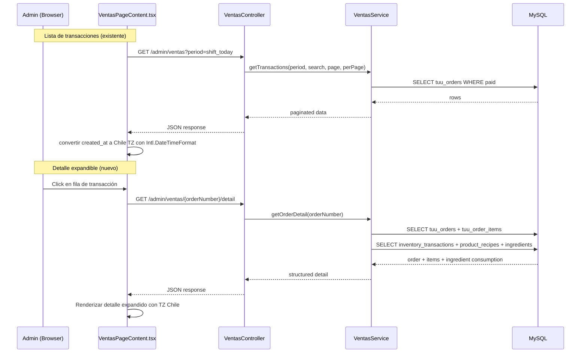

# Design Document: Ventas Detail Improvements

## Overview

Este diseño cubre las mejoras a la sección Ventas del panel de administración de La Ruta 11 (mi3). Los cambios principales son:

1. **Conversión de zona horaria en frontend**: Todas las fechas/horas se convierten a `America/Santiago` usando `Intl.DateTimeFormat`, independientemente de la zona del navegador.
2. **Reestructuración de columnas**: Se reemplaza la columna "Fuente" y "Hora" por una sola columna "Fecha" que muestra `dd/MM HH:mm` en hora de Chile.
3. **Nuevo endpoint de detalle**: `GET /api/v1/admin/ventas/{orderNumber}/detail` retorna ítems, costos, utilidad y consumo de ingredientes.
4. **Filas expandibles**: Al hacer clic en una transacción, se expande mostrando el detalle completo con ítems, ingredientes consumidos e indicadores de stock.

### Decisiones de diseño clave

- **Timezone en frontend, no backend**: El backend ya retorna `created_at` en UTC. Convertir en frontend con `Intl.DateTimeFormat` es más simple, no requiere cambios al backend existente, y maneja DST automáticamente via el motor de internacionalización del navegador.
- **Lazy loading del detalle**: El detalle se carga bajo demanda al expandir una fila (no precargado), para no impactar el rendimiento de la lista paginada.
- **Consumo teórico como fallback**: Si no hay `inventory_transactions` para una orden, se calcula el consumo teórico desde `product_recipes`.

## Architecture

### Diagrama de flujo



### Componentes afectados

| Capa | Archivo | Cambio |
|------|---------|--------|
| Backend Route | `routes/api.php` | Agregar `GET ventas/{orderNumber}/detail` |
| Backend Controller | `VentasController.php` | Agregar método `detail()` |
| Backend Service | `VentasService.php` | Agregar método `getOrderDetail()` |
| Frontend | `VentasPageContent.tsx` | Helper TZ, columna Fecha, filas expandibles |

## Components and Interfaces

### Backend: Nuevo endpoint de detalle

#### Ruta

```
GET /api/v1/admin/ventas/{orderNumber}/detail
```

Se registra en `routes/api.php` **antes** de la ruta `GET ventas` para evitar conflictos:

```php
Route::get('ventas/kpis', [VentasController::class, 'kpis']);
Route::get('ventas/{orderNumber}/detail', [VentasController::class, 'detail']);
Route::get('ventas', [VentasController::class, 'index']);
```

#### VentasController::detail()

```php
public function detail(string $orderNumber): JsonResponse
```

- Valida que `$orderNumber` sea un string no vacío (implícito por route binding).
- Delega a `VentasService::getOrderDetail($orderNumber)`.
- Retorna 404 si la orden no existe.

#### VentasService::getOrderDetail()

```php
public function getOrderDetail(string $orderNumber): ?array
```

Lógica:
1. Buscar la orden en `tuu_orders` por `order_number` con `payment_status = 'paid'`.
2. Obtener los ítems de `tuu_order_items` por `order_reference = order_number`.
3. Para cada ítem con `product_id`:
   a. Buscar `inventory_transactions` con `order_reference = order_number` y `product_id = item.product_id` (type `sale`).
   b. Si existen, usar `previous_stock` y `new_stock` de esas transacciones, agrupando por `ingredient_id`.
   c. Si no existen, calcular consumo teórico desde `product_recipes` (cantidad_receta × cantidad_vendida).
4. Para cada ingrediente consumido, comparar `new_stock` con `min_stock_level` para determinar el `Indicador_Stock`.
5. Calcular totales: subtotal, costo total, utilidad total.

### Frontend: Helper de timezone

#### `formatChileDateTime(dateStr: string): string`

Convierte un string UTC a formato `dd/MM HH:mm` en zona Chile:

```typescript
function formatChileDateTime(dateStr: string): string {
  const d = new Date(dateStr);
  return new Intl.DateTimeFormat('es-CL', {
    day: '2-digit',
    month: '2-digit',
    hour: '2-digit',
    minute: '2-digit',
    hour12: false,
    timeZone: 'America/Santiago',
  }).format(d);
}
```

Reemplaza la función `formatTime()` existente. Se usa en tabla desktop y cards mobile.

### Frontend: Tabla reestructurada

**Desktop — Columnas nuevas:**

| #Orden | Cliente | Monto | Delivery | Pago | Fecha |
|--------|---------|-------|----------|------|-------|

- Se elimina "Fuente" y "Hora".
- Se agrega "Fecha" con formato `dd/MM HH:mm` en TZ Chile.
- `colSpan` de la fila vacía pasa de 7 a 6.

**Mobile — Cards:**
- Se reemplaza el badge de fuente por la fecha/hora en formato `dd/MM HH:mm`.

### Frontend: Detalle expandible

#### Estado local

```typescript
const [expandedOrder, setExpandedOrder] = useState<string | null>(null);
const [orderDetail, setOrderDetail] = useState<OrderDetail | null>(null);
const [detailLoading, setDetailLoading] = useState(false);
const [detailError, setDetailError] = useState<string | null>(null);
```

Solo una orden expandida a la vez. Al hacer clic en otra fila, se colapsa la anterior.

#### Flujo de interacción

1. Click en fila → si ya expandida, colapsar. Si otra, colapsar anterior y expandir nueva.
2. Al expandir, hacer `GET /admin/ventas/{orderNumber}/detail`.
3. Mientras carga, mostrar spinner dentro del área expandida.
4. Si error, mostrar mensaje de error.
5. Si éxito, renderizar detalle.

#### Componente `OrderDetailPanel`

Renderiza dentro de un `<tr>` con `<td colSpan={6}>` (desktop) o un `<div>` adicional (mobile):

- Header: fecha/hora (TZ Chile), número de orden, método de pago.
- Tabla de ítems: nombre × cantidad, precio unitario, costo, utilidad.
- Por cada ítem con ingredientes: sub-tabla con nombre ingrediente, cantidad usada (con unidad), stock antes → después, indicador (✓/⚠).
- Footer: subtotal, costo total, utilidad total.

### API Response Interface

```typescript
interface OrderDetail {
  order_number: string;
  created_at: string;
  customer_name: string | null;
  payment_method: string | null;
  items: OrderDetailItem[];
  totals: {
    subtotal: number;
    total_cost: number;
    total_profit: number;
  };
}

interface OrderDetailItem {
  product_name: string;
  quantity: number;
  unit_price: number;
  item_cost: number;
  profit: number;
  ingredients: IngredientConsumption[];
}

interface IngredientConsumption {
  ingredient_name: string;
  quantity_used: number;
  unit: string;
  stock_before: number | null;
  stock_after: number | null;
  stock_status: 'ok' | 'warning';
}
```

## Data Models

### Tablas consultadas (existentes, sin modificaciones)

#### `tuu_orders`
Campos usados: `order_number`, `customer_name`, `payment_method`, `installment_amount`, `delivery_fee`, `payment_status`, `created_at`.

#### `tuu_order_items`
Campos usados: `order_reference`, `product_id`, `product_name`, `product_price`, `item_cost`, `quantity`.

#### `inventory_transactions`
Campos usados: `order_reference`, `product_id`, `ingredient_id`, `quantity`, `previous_stock`, `new_stock`, `transaction_type` (filtro: `sale`).

#### `product_recipes`
Campos usados: `product_id`, `ingredient_id`, `quantity`, `unit`.

#### `ingredients`
Campos usados: `id`, `name`, `unit`, `min_stock_level`.

### Queries principales del nuevo endpoint

**Query 1 — Orden:**
```sql
SELECT order_number, customer_name, payment_method, installment_amount, delivery_fee, created_at
FROM tuu_orders
WHERE order_number = ? AND payment_status = 'paid'
LIMIT 1
```

**Query 2 — Ítems:**
```sql
SELECT product_id, product_name, product_price, item_cost, quantity
FROM tuu_order_items
WHERE order_reference = ?
```

**Query 3 — Consumo real de ingredientes (por orden):**
```sql
SELECT it.product_id, it.ingredient_id, i.name as ingredient_name, i.unit,
       it.quantity as quantity_used, it.previous_stock, it.new_stock,
       i.min_stock_level
FROM inventory_transactions it
JOIN ingredients i ON it.ingredient_id = i.id
WHERE it.order_reference = ? AND it.transaction_type = 'sale'
```

**Query 4 — Consumo teórico (fallback, por producto sin transacciones):**
```sql
SELECT pr.ingredient_id, i.name as ingredient_name, pr.quantity, pr.unit, i.min_stock_level
FROM product_recipes pr
JOIN ingredients i ON pr.ingredient_id = i.id
WHERE pr.product_id = ?
```

No se crean tablas nuevas ni se modifican las existentes.


## Correctness Properties

*A property is a characteristic or behavior that should hold true across all valid executions of a system — essentially, a formal statement about what the system should do. Properties serve as the bridge between human-readable specifications and machine-verifiable correctness guarantees.*

### Property 1: Timezone formatting produces Chile time in correct format

*For any* valid UTC datetime string, `formatChileDateTime()` should produce a string matching the pattern `dd/MM HH:mm` where the date and time values correspond to the `America/Santiago` timezone (UTC-3 during CLST, UTC-4 during CLT), and the result should be independent of the runtime environment's local timezone.

**Validates: Requirements 1.1, 1.2, 1.3, 1.4, 2.2**

### Property 2: Item profit equals unit price minus item cost

*For any* order detail response, each item's `profit` field should equal `unit_price - item_cost`. This must hold for all items regardless of quantity, price magnitude, or cost values (including zero-cost items).

**Validates: Requirements 3.2**

### Property 3: Stock indicator reflects min_stock_level threshold

*For any* ingredient in an order detail response that has `stock_after` data, `stock_status` should be `'warning'` if and only if `stock_after < min_stock_level`, and `'ok'` otherwise. This must hold for all ingredient/stock combinations.

**Validates: Requirements 3.4, 3.5**

### Property 4: Order totals are consistent with item-level data

*For any* order detail response, `totals.subtotal` should equal the sum of `(unit_price × quantity)` across all items, `totals.total_cost` should equal the sum of `(item_cost × quantity)` across all items, and `totals.total_profit` should equal `totals.subtotal - totals.total_cost`.

**Validates: Requirements 3.6**

### Property 5: Non-existent orders return 404

*For any* order number that does not exist in `tuu_orders` with `payment_status = 'paid'`, the detail endpoint should return HTTP 404 with a descriptive error message.

**Validates: Requirements 3.8**

### Property 6: Theoretical consumption equals recipe quantity times items sold

*For any* order item without `inventory_transactions` records, the theoretical ingredient consumption for each ingredient should equal `recipe_quantity × item_quantity`, where `recipe_quantity` comes from `product_recipes` and `item_quantity` is the number of units sold. The `stock_before` and `stock_after` fields should be `null` in this case.

**Validates: Requirements 5.2, 5.4**

## Error Handling

### Backend

| Escenario | Respuesta |
|-----------|-----------|
| `order_number` no existe o no está pagada | HTTP 404 `{ success: false, message: "Orden no encontrada" }` |
| `order_number` vacío (no debería llegar por route binding) | HTTP 404 de Laravel por defecto |
| Error de base de datos inesperado | HTTP 500 con error genérico (manejado por exception handler de Laravel) |

### Frontend

| Escenario | Comportamiento |
|-----------|---------------|
| API retorna 404 | Mostrar "Orden no encontrada" dentro del panel expandido |
| API retorna 500 o error de red | Mostrar "Error al cargar el detalle" dentro del panel expandido |
| Timeout de red | Mismo manejo que error de red |
| Orden sin ítems | Mostrar panel expandido con mensaje "Sin ítems" |
| Ítem sin ingredientes | Mostrar ítem sin sección de ingredientes |

## Testing Strategy

### Unit Tests (ejemplo-based)

- **Frontend — Estructura de tabla**: Verificar que la tabla desktop tiene columnas `#Orden, Cliente, Monto, Delivery, Pago, Fecha` y no tiene `Fuente` ni `Hora`.
- **Frontend — Cards mobile**: Verificar que las cards muestran fecha/hora en lugar del badge de fuente.
- **Frontend — Expand/collapse**: Verificar que click en fila expande, segundo click colapsa, click en otra fila cambia la expandida.
- **Frontend — Loading state**: Verificar que se muestra spinner mientras carga el detalle.
- **Frontend — Error state**: Verificar que se muestra mensaje de error cuando la API falla.
- **Backend — Route registration**: Verificar que `GET ventas/{orderNumber}/detail` está registrada y llega al controller.

### Property-Based Tests

Se usará **fast-check** (TypeScript) para las propiedades del frontend y **PHPUnit con data providers** para las propiedades del backend.

Configuración:
- Mínimo 100 iteraciones por propiedad.
- Cada test referencia su propiedad del diseño.
- Tag format: `Feature: ventas-detail-improvements, Property {N}: {title}`

| Propiedad | Capa | Librería | Qué genera |
|-----------|------|----------|------------|
| P1: Timezone formatting | Frontend | fast-check | UTC date strings aleatorios (incluyendo fechas en DST y estándar) |
| P2: Item profit | Backend | PHPUnit + data providers | Precios y costos aleatorios (enteros, decimales, cero) |
| P3: Stock indicator | Backend | PHPUnit + data providers | Combinaciones de new_stock y min_stock_level |
| P4: Order totals | Backend | PHPUnit + data providers | Listas de ítems con precios, costos y cantidades aleatorios |
| P5: 404 for invalid orders | Backend | PHPUnit | Order numbers aleatorios no existentes |
| P6: Theoretical consumption | Backend | PHPUnit + data providers | Cantidades de receta y cantidades vendidas aleatorias |

### Integration Tests

- **Endpoint completo**: Crear una orden con ítems e inventory_transactions en test DB, llamar al endpoint, verificar respuesta completa.
- **Fallback teórico**: Crear una orden con ítems pero sin inventory_transactions, verificar que se retorna consumo teórico desde product_recipes.
- **Orden sin ítems**: Crear una orden pagada sin registros en tuu_order_items, verificar respuesta con items vacío.
